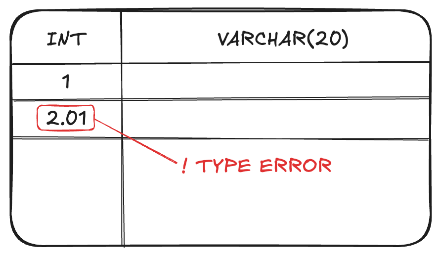

# RDBMS vs NoSQL

# RDBMS
관계형 데이터베이스 관리 시스템(RDBMS)은 데이터를 테이블 형식으로 저장하고, SQL(Structured Query Language)을 사용하여 데이터를 관리하는 시스템입니다.  
일반적으로 고정된 스키마를 가지고 있으며, 외래 키를 사용하여 테이블 간의 관계를 정의합니다.

## RDBMS의 문제점
- **확장성**: 수직적 확장(Scale-Up)에 의존하기 때문에, 하드웨어 성능에 한계가 있음
- **유연성 부족**: 고정된 스키마로 인해 데이터 구조 변경이 어려움
- **성능 감소**: 데이터의 정합성을 유지하기위해 복잡한 조인 연산이 필요하여 성능이 저하될 수 있음

# NoSQL
NoSQL은 non SQL, non relational, Not Only SQL의 약자로, 전통적인 관계형 데이터베이스(RDBMS)와는 다른 방식으로 데이터를 저장하고 관리하는 데이터베이스 시스템입니다. 
NoSQL 데이터베이스는 대규모 데이터 처리, 높은 확장성, 유연한 스키마 등을 제공하여 다양한 유형의 데이터를 효과적으로 처리할 수 있습니다.

## NoSQL의 필요성
- **데이터의 양**: 대량의 데이터를 처리할 수 있는 능력이 필요
- **데이터의 다양성**: 비정형 또는 반정형 데이터 처리 능력이 필요
- **수평적 확장성**: 데이터베이스의 용량이 증가함에 따라 서버를 추가하여 확장할 수 있어야 함
- **고가용성**: 시스템 장애 시에도 데이터에 대한 접근이 가능해야 함
- **잦은 스키마 변경**: 데이터 구조가 자주 변경될 수 있어 유연한 스키마가 필요

# 차이점
## 고정된 스키마 vs 유연한 스키마
### 고정된 스키마
RDBMS는 데이터 구조와 제약조건을 미리 정의해야 하는 정적 스키마를 사용합니다.
예를들어 특정 컬럼을 INT타입으로 정했다면, 해당 컬럼에는 소수점 값을 저장할 수 없습니다.

### 유연한 스키마
Mongo DB를 예시로 들면, 데이터 구조를 사전에 정의하지 않고도 데이터를 저장할 수 있습니다. 
또한 자료형 또한 Integer, Float 등 세분화 되어있지 않고 JavaScript처럼 Number로 통일되어 있습니다.

## 수직 확장(Scale-Up) vs 수평 확장(Scale-Out)
### 수직 확장(Scale-Up)
단일 서버의 하드웨어(CPU, RAM, 디스크 등)를 업그레이드해 성능을 향상시키는 방식입니다. 
단, 업그레이드의 한계가 있어, 서버의 성능이 일정 수준 이상으로 향상되기 어려우며 금액적 부담이 큽니다. 

### 수평 확장(Scale-Out)
서버를 추가하여 데이터베이스의 용량을 확장하는 방식입니다. 
NoSQL은 데이터 분산 처리와 클러스터링을 통해 수평 확장을 지원합니다. 
설계부터 데이터 분산 저장을 염두에 두기 때문에 수평 확장이 용이합니다.

## ACID vs BASE
### RDBMS(ACID)
원자성, 일관성, 격리성, 내구성 속성을 엄격히 준수해 데이터 **무결성**과 **일관성**을 보장합니다.

### NoSQL(BASE)
NoSQL은 BASE 모델을 따르며, 데이터의 **일관성**보다 **고가용성**과 **파티셔닝**에 중점을 둡니다.

#### 기본적 가용성(Basically Available)
분산된 시스템의 특정 노드에 장애가 발생하더라도,  
시스템 전체가 멈추지 않고 항상 요청에 응답할 수 있는 상태여야합니다.

단, 일부 노드가 장애가 발생하면 데이터의 일관성이 깨질 수 있습니다.

#### 유연한 상태(Soft state)
외부의 새로운 입력이 없더라도 시간이 지나면 스스로 변할 수 있습니다.

(최종적 일관성을 맞추기 위해 내부적으로 계속 데이터를 동기화하기 때문)

#### 최종적 일관성(Eventually consistent)
시스템에 더 이상 새로운 데이터 수정이 없다면, 
결국 언젠가는 모든 노드의 데이터가 같은 값으로 일관성을 유지하게 됩니다.

### ACID vs BASE 참고사항
최근에는 RDBMS도 클러스터링이나 샤딩(Sharding)을 통해 수평 확장을 지원하는 경우가 많습니다. 
NoSQL도 제한된 범위 안에서 ACID 트랜잭션을 지원하기 때문에 ACID와 BASE는 RDBMS와 NoSQL의 **기초 설계 철학** 이라고 이해해야합니다.

## NoSQL의 트레이드 오프(Trade-off)
### 일관성 문제
NoSQL은 BASE 모델을 따르기 때문에, 데이터의 일관성을 보장하지 않습니다.

### 불명확한 데이터 구조
유연한 스키마는 장점이자 단점이 될 수 있습니다. 데이터 구조가 명확하게 정해져 있지 않아 개발 초기에는 빠르지만,  
시스템이 복잡해질수록 데이터의 일관성이나 명확한 구조를 애플리케이션 단에서 책임져야 하는 부담이 생깁니다.

### 앱 레벨에서 스키마/중복 관리 필요
위에서 제기된 문제점이 있기 때문에 개발자가 애플리케이션 레벨에서 스키마를 정의하고 데이터의 중복을 관리해야 합니다.

# NoSQL 유형
## 키-값 저장소(Key-Value Store)
JSON처럼 **Key와 Value 쌍**으로 데이터를 저장하는 방식입니다.
- 예시 : Redis, Amazon DynamoDB

## 문서 저장소(Document Store)
Key-Value 저장소의 확장으로 **Value부분에 JSON, XML 등의 구조화된 문서를 통째로 저장**하는 방식입니다.
- 예시 : MongoDB, CouchDB

## 컬럼 패밀리 저장소(Column Family Store) = Wide Column Store
데이터를 컬럼 단위로 저장하는 방식으로, RDBMS와 달리 데이터를 **ROW, COLUMN 그리고 이 둘을 묶는COLUMN 패밀리**로 관리합니다.
- 예시 : Apache Cassandra, HBase

## 그래프 데이터 베이스(Graph Database)
**데이터를 노드로 보고, 노드들을 잇는 엣지(Edge)로 표현** 하여 복잡한 관계를 표현하는데 중점을 둔 방식입니다.
- 예시 : Neo4j, Amazon Neptune, JanusGraph

## References
- [RDBMS와 NoSQL의 차이](https://whatap.io/bbs/board.php?bo_table=blog&wr_id=216&page=3)
