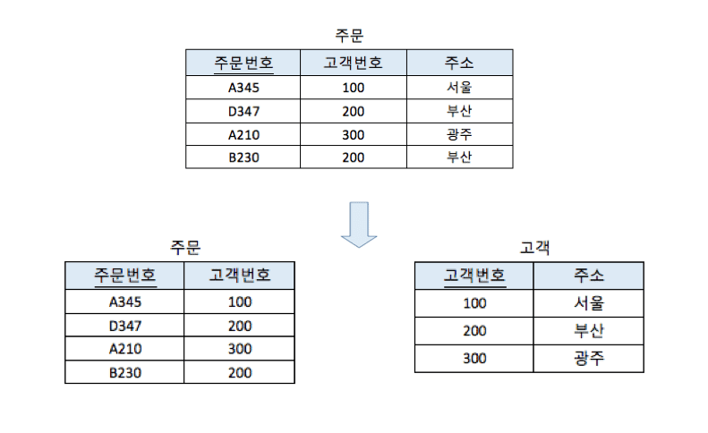
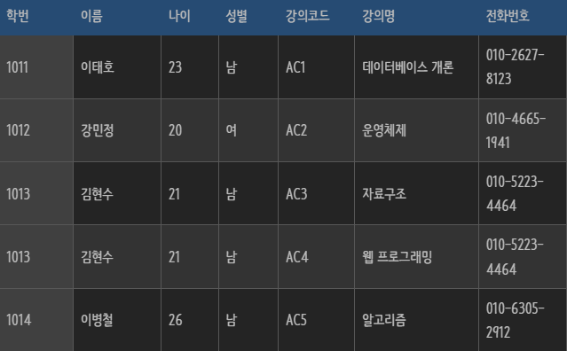

# 정규화란?

 

## 목차
- [정규화란?](#정규화란)
  - [목차](#목차)
  - [정규화란?](#정규화란-1)

 

## 정규화란?

RDB에서 데이터를 정규형에 맞게 구조화하는 프로세스

왜 구조화 하는지?

- 데이터 중복을 줄이기 위해
- 데이터 무결성을 개선하기 위해

 

데이터를 구조화 하지 않고 하나의 테이블에 여러 속성을 몰아 넣는다면?

- 데이터 중복 저장
    - 데이터 무결성, 일관성 등 문제
- 저장 공간 낭비
- 데이터베이스 이상 현상 발생
    - **삽입 이상**
        - 원치 않는 정보까지 반드시 입력해야 하는 현상
        - 일부 정보를 알 수 없어 아예 데이터를 삽입하지 못하는 현상
    - **삭제 이상**
        - 하나의 자료만 삭제하고 싶지만, 그 자료가 포함된 튜플 전체가 삭제됨으로 원하지 않는 정보 손실 발생하는 현상
        - 삭제를 원하지 않는 값까지 함께 삭제되어 중요한 데이터까지 소실되는 현상
    - **갱신 이상**
        - 중복된 데이터가 여러 곳에 저장되어 있을 때, 한곳만 갱신하면 나머지와 불일치 발생하는 현상

 

- 이상 예시
    
    
    
    출처 : [https://dev-coco.tistory.com/63](https://dev-coco.tistory.com/63)
    
     

    - `삽입 이상`
        - 막 입학한 새로운 학생 (= 강의 듣는 것이 아직 없음) DB에 추가하려고 할 때
        - 학번, 이름, 나이, 성별, 전화번호 값은 넣을 수 있지만 강의 코드, 강의명에는 null을 넣어야 함
    - `삭제 이상`
        - ‘이태호’ 학생이 ‘데이터베이스 개론’ 수업 drop하는 경우
        - DB에서 해당 데이터 지우면 ‘이태호’ 학생에 대한 정보도 모두 지워져버림
        - ‘이태호’ 학생은 졸지에 퇴학되어버린 신세
    - `갱신 이상`
        - ‘자료구조’ 과목에서 ‘김현수’ 학생이 ‘전화번호’ 바꿨다고 하여 수정
        - 같은 ‘김현수’ 학생인데 ‘웹 프로그래밍’ 과목에서 ‘전화번호’와 다름
        - ‘웹 프로그래밍’ 과목 교수님은 ‘전화번호’가 바뀐지 모르는 상태
    

 

문제가 되는 테이블을 나눠서 작은 테이블로 분해하는 작업

문제가 되는 테이블은 아래와 같은 문제점들을 가지고 있음

- **다치 속성**
    - 하나의 컬럼에 여러 값이 존재
- **부분 함수 종속**
    - 기본키 (복합키인 경우) 일부만으로 결정되는 속성이 존재
- **이행적 함수 종속**
    - 기본키 아닌 컬럼들 사이에 종속성이 존재
- **후보키가 아닌 속성에 의한 함수적 종속**
    - 후보키가 아닌 속성이 다른 컬럼을 결정하는 문제 존재
- **다치 종속**
    - 한 후보키가 여러 속성을 독립적으로 다수의 값과 연결하는 문제 존재
- **조인 종속**
    - 테이블을 분리하고 다시 join으로 합쳤을 때 데이터 복구 안되는 문제 발생

 

작은 테이블로 분해하는 정규화를 진행하면 정규형에 맞게 테이블이 구조화 됨

정규형 = 특정 조건을 만족하는 테이블 형태 (제1정규형, 제2정규형, …)

각 정규형이 되기 위해 만족시켜야 할 제약 조건들이 있음

그러면 어떤 문제 있는 테이블에서 어떤 제약 조건들을 만족해서 어떤 정규형이 되는지 정규화 과정을 보자.