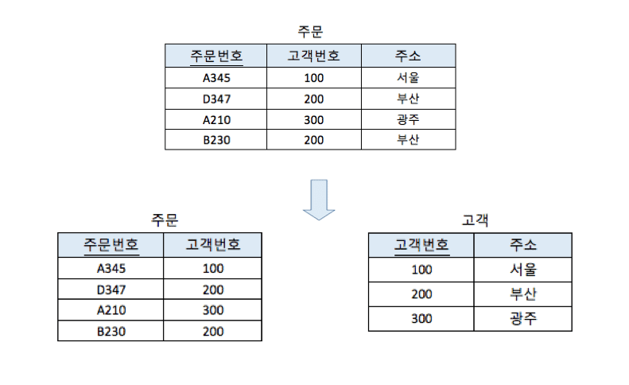

# 정규화 과정

 

## 목차
- [정규화 과정](#정규화-과정)
  - [목차](#목차)
  - [정규화 과정](#정규화-과정-1)
    - [제1정규형 (1NF) : 원자값의 원칙](#제1정규형-1nf--원자값의-원칙)
    - [제2정규형 (2NF) : 부분 함수 종속 제거](#제2정규형-2nf--부분-함수-종속-제거)
    - [제3정규형 (3NF) : 이행적 함수 종속 제거](#제3정규형-3nf--이행적-함수-종속-제거)
    - [BNCF (Boyce-Codd Normal Form)](#bncf-boyce-codd-normal-form)
    - [제4정규형 (4NF) : 다치 종속 제거](#제4정규형-4nf--다치-종속-제거)
    - [제5정규형 (5NF) : 조인 종속 제거](#제5정규형-5nf--조인-종속-제거)

 

## 정규화 과정

### 제1정규형 (1NF) : 원자값의 원칙

- 문제가 되는 것
    - 다치 속성 = 하나의 컬럼에 여러 값이 존재
- 제1정규형의 제약 조건
    - 모든 컬럼이 반드시 원자값 (더 이상 쪼갤 수 없는 하나의 값)만을 가져야 함
    - 컬럼에 여러 값이나 중첩된 구조(리스트, 테이블 등) X
    - 모든 행이 유일하게 식별될 수 있도록 기본키를 가져야 함
- 정규화 방법
    - 다치 속성 있는 테이블에서 다치 속성을 제거하면 제1정규형을 만족하는 테이블이 됨

 

모든 컬럼이 반드시 원자값만을 가지도록 설계하는 정규화의 첫 단계

모든 관계형 데이터베이스 시스템은 최소한 제1정규형 요구 (다치 속성 가지는 테이블 작성 불가능하기 때문)

 

예시

아래와 같은 테이블은 1NF 위반:

| **이름** | **수강과목** |
| -------- | ------------ |
| 홍길동   | C, C++       |
| 이순신   | Java         |
| 이 산    | DB, 운영체제 |

 

1NF로 변환:

| **이름** | **수강과목** |
| -------- | ------------ |
| 홍길동   | C            |
| 홍길동   | C++          |
| 이순신   | Java         |
| 이 산    | DB           |
| 이 산    | 운영체제     |

 

### 제2정규형 (2NF) : 부분 함수 종속 제거

- 문제가 되는 것
    - 부분 함수 종속
        - 기본키 (복합키인 경우) 일부만으로 결정되는 속성이 존재
- 제2정규형의 제약 조건
    - 제1정규형을 만족 = 테이블의 모든 컬럼이 원자 값
    - 테이블의 속성들이 복합키 전체에만 의해 결정되어야 함
        - 복합키의 일부 속성만으로 다른 속성들을 결정 (구분) 할 수 있으면 안됨
        - 즉 부분 함수 종속 제거해야 함
- 정규화 방법
    - 부분 함수 종속성을 분리하여 별도의 테이블로 나눔
    - 그리고 관련된 속성들은 해당하는 기본키에만 종속되게 구조화
    - 이렇게 하면 제2정규형을 만족하는 테이블이 됨

 

테이블의 기본키를 굳이 복합키로 하지 않아도 되는데 복합키로 해서 생기는 문제 같음

하나의 속성으로 결정이 되는데 굳이 복합키로 해서 문제가 되는 것 같음

 

기본키를 학번으로만 하면 되는데 굳이 (학번, 과목코드)로 한 상태인 것

| **(학번** | **과목코드)** | **학생 이름** |
| --------- | ------------- | ------------- |
|           |               |               |

 

어떤 문제 발생?

- 데이터 중복
    - 학생이 여러 과목을 수강하면 학생 이름이 불필요하게 여러 번 저장됨
- 삽입 이상
    - 과목을 수강하지 않는 학생이 있는데 과목 코드에 null을 넣어야 함
- 삭제 이상
    - 과목을 drop해 과목 코드 지우는데 학번, 학생 이름까지 같이 삭제됨
- 갱신 이상
    - 학생이 여러 과목을 수강하면 학생 이름이 불필요하게 여러 번 저장됨
    - 하나의 행만 학생 이름 수정하면 데이터가 불일치하게

 

예시

아래와 같은 테이블은 2NF 위반:

| **학번** | **과목코드** | **학생이름** | **성적** |
| -------- | ------------ | ------------ | -------- |
| 1001     | CS101        | 홍길동       | A        |
| 1001     | CS102        | 홍길동       | B+       |
| 1002     | CS101        | 이순신       | B        |
- 학생이름은 학번에만 종속되고, 과목코드와는 무관
- 성적은 (학번, 과목코드) 전체에 종속

 

2NF로 변환:

- 학생 테이블
    
    
    | **학번** | **학생이름** |
    | -------- | ------------ |
    | 1001     | 홍길동       |
    | 1002     | 이순신       |
    - 기본키: 학번
    - 학생이름은 학번에만 종속

 

- 성적 테이블
    
    
    | **학번** | **과목코드** | **성적** |
    | -------- | ------------ | -------- |
    | 1001     | CS101        | A        |
    | 1001     | CS102        | B+       |
    | 1002     | CS101        | B        |
    - 기본키: (학번, 과목코드)
    - 성적은 기본키 전체에 종속

 

### 제3정규형 (3NF) : 이행적 함수 종속 제거

- 문제가 되는 것
    - 이행적 함수 종속
        - 기본키가 아닌 속성에 의해 다른 속성이 결정
        - 기본키 → A 속성 → B 속성이라 기본키 → B 속성 관계가 성립
        - A 속성이 B 속성을 결정할 수 있음
- 제3정규형의 제약 조건
    - 제2정규형 만족
    - 기본키 아닌 속성들이 다른 비기본키 속성을 결정해서는 안됨
        - 모든 비기본키 속성은 기본키에만 직접 종속되어야 함
        - 즉 이행적 함수 종속을 제거해야 함
- 정규화 방법
    - 이행적 종속을 만드는 속성 그룹을 별도의 테이블로 분리
    - 종속 만드는 한 속성을 분리한 테이블의 기본키로 만들어 버리는 것
        - → 모든 비기본키 속성은 기본키에만 직접 종속됨

 

2NF를 만족하지만 3NF를 위반하는 테이블

| **학번** | **학과코드** | **학과명** | **학생 이름** |
| -------- | ------------ | ---------- | ------------- |
| 1001     | CS           | 컴퓨터과학 | 홍길동        |
| 1002     | CS           | 컴퓨터과학 | 이순신        |
| 1003     | EE           | 전기공학   | 강감찬        |
- 기본키: 학번
- 학과명이 학과코드에 종속, 학과코드가 학번에 종속
    - → 이행적 함수 종속 문제 발생
    - 학과명은 기본키가 아닌 학과코드에 의해 결정됨
- 역시 마찬가지로 삽입, 삭제, 갱신 이상 발생 가능

 

3NF로 정규화 후 결과

- **학생 테이블**
    
    
    | **학번** | **학과코드** | **학생 이름** |
    | -------- | ------------ | ------------- |
    | 1001     | CS           | 홍길동        |
    | 1002     | CS           | 이순신        |
    | 1003     | EE           | 강감찬        |
    - 기본키: 학번
    - 학과코드는 학번에 종속

 

- **학과 테이블**
    
    
    | **학과코드** | **학과명** |
    | ------------ | ---------- |
    | CS           | 컴퓨터과학 |
    | EE           | 전기공학   |
    - 기본키: 학과코드
    - 학과명은 학과코드에 종속
    

 

### BNCF (Boyce-Codd Normal Form)

- 문제가 되는 것
    - 후보키가 아닌 속성이 다른 속성을 결정하는 함수 종속
    - 제3정규형에서 기본키 아닌 속성에 의한 이행적 함수 종속은 제거
    - but 후보키 아닌 속성이 다른 속성 결정하는 문제는 해결 안된 것
- BNCF 제약 조건
    - 모든 함수 종속 X → Y에 대해 X는 반드시 후보키
    - 후보키가 아닌 속성이 다른 속성을 결정해서는 안됨
- 정규화 방법
    - 후보키 아닌 속성 중 다른 속성 결정하는 속성 포함된 테이블 분리
    - 분리된 테이블에서 모든 결정하는 속성이 후보키가 되도록 구성
    - 제3정규형과 마찬가지로 종속 만드는 한 속성을 분리한 테이블의 기본키로 만들어 버리는 것

 

**BCNF를 만족하지 않는 예시**

| **수업ID** | **교수ID** | **학생ID** |
| ---------- | ---------- | ---------- |
| A          | P1         | 1          |
| A          | P1         | 2          |
| B          | P2         | 3          |
- 기본키: (수업ID, 학생ID) (복합키)
- 함수 종속: 수업ID → 교수ID
- 수업ID가 후보키가 아니면서 교수ID를 결정하므로 BCNF 위반
    - 수업ID는 A가 테이블에서 중복되니 후보키 될 수 없음

 

**BCNF로 분해후**

- 교수별 수업 테이블
    
    
    | **수업ID** | **교수ID** |
    | ---------- | ---------- |
    | A          | P1         |
    | B          | P2         |
    - 기본키: 수업ID

 

- 학생별 수업 테이블
    
    
    | **학생ID** | **수업ID** |
    | ---------- | ---------- |
    | 1          | A          |
    | 2          | A          |
    | 3          | B          |
    - 기본키: (학생ID, 수업ID)

 

### 제4정규형 (4NF) : 다치 종속 제거

- 문제가 되는 것
    - 다치 종속
        - 한 속성이 다른 2개 이상의 독립적인 속성에 대해 동시에 여러 값 가질 때 발생
- 제4정규형의 제약 조건
    - 제3정규형과 BNCF 만족해야 함
    - 모든 다치 종속이 후보키에만 존재해야 함
- 정규화 방법
    - 다치 종속을 유발하는 속성 집합들을 별도의 테이블로 분리
    - 각 테이블은 한가지 다치 종속만 가지도록 구성

 

**4NF를 만족하지 않는 예시**

| **학생ID** | **취미** | **수강과목** |
| ---------- | -------- | ------------ |
| 1001       | 축구     | 수학         |
| 1001       | 독서     | 수학         |
| 1001       | 축구     | 영어         |
| 1001       | 독서     | 영어         |
- 기본키: (학생ID, 취미, 수강과목)
- 학생ID → 취미, 학생ID → 수강과목 (다치 종속)
- 취미와 수강과목은 서로 독립적임에도 불필요하게 곱집합 형태로 저장되어 중복 발생

 

예시 이해

- 학생 ID 하나가 여러 취미 가질 수 있음
- 학생 ID가 여러 수강 과목 가질 수 있음
- 두 속성 취미, 수강과목은 서로 독립적
- 하지만 각각 학생 ID에 대해 다중 값 갖는 속성
- 다치 종속 유발하는 속성 집합 = {취미, 수강과목}
- 이 속성 집합을 별도의 테이블로 분리해야 함

 

**4NF로 분해 후 테이블**

- 학생ID와 취미 테이블
    
    
    | **학생ID** | **취미** |
    | ---------- | -------- |
    | 1001       | 축구     |
    | 1001       | 독서     |
    - 기본키: (학생ID, 취미)

 

- 학생ID와 수강과목 테이블
    
    
    | **학생ID** | **수강과목** |
    | ---------- | ------------ |
    | 1001       | 수학         |
    | 1001       | 영어         |
    - 기본키: (학생ID, 수강과목)

 

### 제5정규형 (5NF) : 조인 종속 제거

- 문제가 되는 것
    - 조인 종속
        - 한 테이블을 여러 개의 테이블로 분해 후 join 시 원래 테이블 완전하게 복원할 수 없는 경우
- 제5정규형의 제약 조건
    - 제4정규형 만족해야 함
    - 모든 조인 종속이 후보키에 의해 결정되어야 함
    - 분해된 테이블들을 조인할 때 원본 테이블을 완벽히 복원할 수 있어야 함

 

