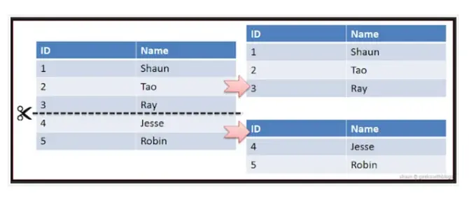

# 반정규화

 

## 목차
- [반정규화](#반정규화)
  - [목차](#목차)
  - [반정규화](#반정규화-1)
    - [개념](#개념)
    - [도입 타이밍](#도입-타이밍)
    - [기법](#기법)
    - [**반정규화 시 고려사항**](#반정규화-시-고려사항)

 

## 반정규화

### 개념

정규화된 데이터베이스에서 성능 향상을 목적으로 의도적으로 중복 허용하거나 테이블 다시 통합하는 과정

정규화된 엔티티, 속성, 관계를 시스템의 성능 향상 및 개발과 운영의 단순화를 위해 중복 통합, 분리 등을 수행하는 데이터 모델링 기법 중 하나

 

 

### 도입 타이밍

- 복잡한 join이 많이 일어나 응답 속도 저하되는 경우
- 읽기 작업이 쓰기 작업보다 압도적으로 많은 경우
- 집계 연산이 빈번하게 발생하는 경우
- 자주 함께 조회되는 데이터가 여러 테이블에 분산된 경우
- 대용량 데이터 처리에서 특정 범위의 조회 빈도가 높은 경우
- 저장 공간 증가와 무결성 관리 비용을 수용할 수 있고, 조회 성능 개선이 더 중요한 경우

 

### 기법

1. 테이블 반정규화

- **테이블 병합**
    - 1:1 관계 또는 1:N 관계 테이블 통합
    - 슈퍼타입/서브타입 테이블 통합
    - JOIN 연산을 줄여 성능 향상 목적
- **테이블 분할**
    - 수직 분할: 하나의 테이블에서 컬럼(속성)을 기준으로 분할
    - 수평 분할: 테이블의 행을 기준으로 분할(파티셔닝)
    - 부분 데이터만 자주 사용하거나 갱신 빈도 차이 있을 때 적용
- **중복 테이블 추가**
    - 동일 데이터의 복제 테이블을 두어 조회 성능 향상
    - 집계용 통계 테이블, 특정 부분만 포함하는 테이블 등이 있음

2. 컬럼(속성) 반정규화

- **중복 컬럼 추가**
    - 조인으로 가져와야 하는 컬럼을 별도로 두어 JOIN 감소
- **파생 컬럼 추가**
    - 계산 결과 등 자주 사용하는 값을 미리 저장하여 성능 향상
- **이력 테이블 컬럼 추가**
    - 최근 값 여부, 시작/종료 일자 등 기능성 컬럼 추가

3. 관계 반정규화

- **중복 관계 추가**
    - 동일한 데이터에 대해 여러 경로를 제공해 조인 최적화

 

테이블 분할 - 수직 분할

 

테이블 분할 - 수평 분할

 

관련 참고자료

- https://leekoby.github.io/posts/de-normalization/
- https://velog.io/@dddooo9/%EB%8D%B0%EC%9D%B4%ED%84%B0%EB%B2%A0%EC%9D%B4%EC%8A%A4-%EB%B0%98%EC%A0%95%EA%B7%9C%ED%99%94
- https://haburu23.tistory.com/15

 

### **반정규화 시 고려사항**

**비용-효과 분석**:

- 저장 공간 증가 비용 vs 성능 향상 효과
- 개발 복잡도 증가 vs 운영 편의성
- 데이터 무결성 리스크 vs 성능 개선 효과

 

반정규화는 **성능과 무결성 사이의 트레이드오프**를 다루는 고급 기법

단순히 테이블을 합치는 것이 아님

**비즈니스 요구사항과 시스템 특성을 종합적으로 고려한 전략적 결정**이 필요

특히 현대의 MSA나 클라우드 환경에서는 다양한 대안 기술들과 함께 고려해야 할 중요한 설계 요소