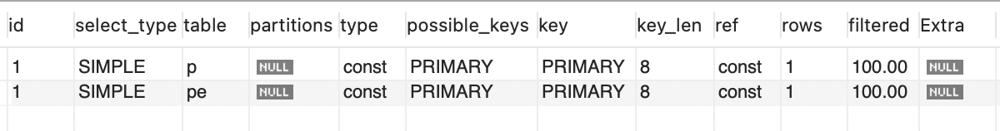
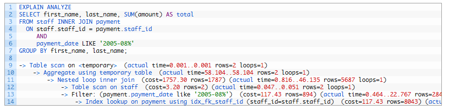

# 실행 계획과 Index

<br>

## 목차
- [실행 계획과 Index](#실행-계획과-index)
  - [목차](#목차)
    - [실행 계획이란?](#실행-계획이란)
    - [실행 계획 확인 방법](#실행-계획-확인-방법)
    - [실행 계획에서 index 관련 확인해야 할 것](#실행-계획에서-index-관련-확인해야-할-것)

<br>

### 실행 계획이란?

데이터베이스의 옵티마이저가 SQL 쿼리 어떤 방식으로 실행할지 계획한 '설계도'

실행 계획 통해 SQL 쿼리가 데이터에 어떻게 접근하고 처리되는지 파악 가능 

이를 분석하여 비효율적인 부분을 찾아내고 성능을 최적화할 수 있음 

<br>

실행 계획 보면 쿼리가 실제로 어떻게 수행되는지, 성능이 왜 느린지 알 수 있음.

또 인덱스 활용 여부와 병목 지점을 파악해 튜닝 방향을 결정 가능

인덱스 설계, 쿼리 rewrite 같은 튜닝 액션의 우선순위 정하는 근거가 됨.

<br>

**옵티마이저란?**

- DBMS의 쿼리 최적화 엔진.
- 사용자가 작성한 SQL 보고 가장 효율적인 실행 계획을 선택하는 역할
- 각 단위 작업의 비용 정보와 통계 정보를 이용해 실행 계획별 비용을 산출
- 가장 최소의 비용이 드는 실행 계획을 선택

<br>

SQL은 절차적 언어가 아니라 선언적 언어

- 개발자는 “무엇을 조회할지”만 작성.
- “어떻게 조회할지”는 DBMS가 알아서 결정.

DBMS는 같은 SQL이라도 여러 가지 방법으로 실행 가능.

여러 전략들을 최적화해서 실행 계획으로 결정함.

가장 비용(cost)이 적은 방법을 찾는 것이 옵티마이저의 역할.

옵티마이저가 똑똑해야 DB 성능이 잘 나옴.

<br>

### 실행 계획 확인 방법

- MySQL: **`EXPLAIN`** 또는 **`EXPLAIN ANALYZE`**
- PostgreSQL: **`EXPLAIN`** 또는 **`EXPLAIN ANALYZE`**
- SQL Server: **`SET SHOWPLAN_ALL ON`**
- Oracle: **`EXPLAIN PLAN`**

<br>

1. `EXPLAIN`

- 가장 기본적인 실행 계획 확인 방법
- 쿼리 앞에 `EXPLAIN`을 붙이면 됨
- 실행할 쿼리를 DB가 어떻게 처리할지 설명해달라고 요청하는 명령어
- 이 명령어 실행 시 쿼리 결과 대신 실행 계획 담은 표 출력

```sql
EXPLAIN
SELECT *
FROM users
WHERE email = 'test@example.com';
```

<br>

결과 예시

| id  | select_type | table | type | key             | rows | Extra       |
| --- | ----------- | ----- | ---- | --------------- | ---- | ----------- |
| 1   | SIMPLE      | users | ref  | idx_users_email | 1    | Using index |

<br>



<br>

결과가 어떤 의미인지는 아래에서 보자.

<br>

2. `EXPLAIN ANALYZE` (MySQL 8.0+)

- MySQL 8.0부터 지원되는 기능
- 단순히 계획만 보여주는 게 아님
- 실제 실행 후 실제 비용과 소요 시간까지 같이 보여줌
- 더 정밀한 성능 분석 가능

```sql
EXPLAIN ANALYZE
SELECT *
FROM users
WHERE email = 'test@example.com';
```

<br>

결과 예시



<br>

차이점:

- `EXPLAIN` → "예상 계획"
- `EXPLAIN ANALYZE` → "실제 실행 결과 포함된 계획"

<br>

### 실행 계획에서 index 관련 확인해야 할 것

실행 계획의 컬럼

- **type**
    - 데이터 읽는 방법, 접근 방식을 나타냄
    - 인덱스 활용 정도를 보여줌
    - 검색 성능이 좋은 순서대로 나열하면 아래와 같음

<br>

| type 값    | 의미                                                                                                                         | 성능        |
| ---------- | ---------------------------------------------------------------------------------------------------------------------------- | ----------- |
| **system** | 테이블에 1행만 있음                                                                                                          | ✅ 최상      |
| **const**  | PK/Unique 인덱스로 한 행만 찾음                                                                                              | ✅ 매우 좋음 |
| **eq_ref** | 조인 시 PK/Unique로 매칭                                                                                                     | ✅ 좋음      |
| **ref**    | Non-Unique 인덱스로 특정 값 검색                                                                                             | 👍 괜찮음    |
| **range**  | 인덱스 이용한 범위 조건(>, <, BETWEEN, LIKE 'abc%') 검색                                                                     | 👍 괜찮음    |
| **index**  | 인덱스 전체 스캔 (데이터는 안 읽고 인덱스만 읽음)                                                                            | ⚠️ 주의      |
| **ALL**    | Full Table Scan (테이블 전체 읽음, 거의 항상 튜닝 대상) <br> 인덱스 없거나 인덱스 사용해도 전체 데이터 25% 이상 읽어야 할 때 | ❌ 느림      |

<br>

- 최소한 range 이상의 접근 방식 사용해야 인덱스가 효과적으로 사용되었다고 볼 수 있음
- index나 ALL이 나타난다면 튜닝이 필요할 가능성이 높음

<br>

- **possible_keys**
    - 옵티마이저가 쿼리 실행 시 사용을 고려했던 인덱스들의 목록

<br>

- **key**
    - 실제로 선택된 인덱스 이름 표시
    - `possible_keys` 중에서 옵티마이저가 최종적으로 선택하여 사용한 인덱스를 의미
    - NULL이면 인덱스 사용 안 했다는 의미

<br>

- **rows**
    - 옵티마이저가 예상하는 읽을 행(Row) 수
    - 이 숫자가 실제 테이블의 전체 행 수와 비슷하다면 Full Table Scan 의심
    - 이 값은 작을수록 좋음
    - 이 값이 크면 성능 저하 가능성이 높음
    - 실제 실행 건수와 다를 수 있으므로 EXPLAIN ANALYZE로 검증 필요

<br>

- **Extra**
    - 쿼리의 실행 계획에서 성능에 관련된 중요한 추가 정보를 표시
    - Using where:
        - WHERE 절의 조건이 데이터를 필터링하는데 사용되었음을 의미
        - 인덱스를 사용해 데이터 찾고 + 추가 필터링 필요하다는 의미
    - Using index:
        - 커버링 인덱스가 적용되어 테이블 접근 없이 인덱스만으로 쿼리가 처리되었음을 의미
        - 커버링 인덱스가 사용된 최상의 상태
    - Using temporary:
        - 임시 테이블 생성해 추가적인 메모리를 사용했음을 의미
        - GROUP BY/ORDER BY 시 자주 발생
    - Using filesort:
        - 별도의 정렬 작업이 발생했음을 의미
        - 인덱스 정렬 못 썼다는 의미
        - 메모리나 디스크를 사용해 별도의 정렬 작업을 수행했음을 의미
        - 이는 성능 저하의 주요 원인 중 하나로, 튜닝이 필요한 대표적인 신호

<br>

**Index Scan 종류**

Index Scan 종류는 type에 표시됨

1. **Index Seek** 
    - **정확히 필요한 키**만 찾아가는 방식
    - `=` 조건이나 범위 조건 (`BETWEEN`, `>`, `<`, `LIKE 'abc%'`)에서 발생
    - MySQL 실행 계획의 `type`이 `ref`, `eq_ref`, `range`, `const` 등으로 표시
2. **Index Range Scan** 
    - Index Seek의 한 종류지만, **특정 범위**만 인덱스에서 탐색
    - 범위 검색,  ex : >, <, BETWEEN, LIKE 'abc%'
    - MySQL `type = range`로 표시됨
    - 조건절 범위가 넓으면 효율이 떨어질 수도 있음
3. **Index Full Scan** 
    - 인덱스 전체를 처음부터 끝까지 탐색
    - 조건이 없거나, 인덱스를 정렬 목적으로만 사용할 때 발생
    - MySQL `type = index` 로 표시됨
    - 테이블 Full Scan(`ALL`)보다는 낫지만, 필요 없는 많은 데이터를 읽을 수 있음
4. **Full Table Scan** 
    - 인덱스 자체를 사용하지 않고 테이블 전체를 탐색
    - MySQL `type = ALL` 로 표시됨
    - 대규모 테이블에서 나오면 **심각한 성능 이슈** 후보
5. **Index Skip Scan** 
    - Oracle, MySQL 8.0 일부 기능에서 지원
    - 복합 인덱스의 선두 컬럼 조건이 없더라도 뒷 컬럼을 활용할 수 있는 스캔 기법
    - 성능은 Range Scan보다 떨어지지만, Full Scan보다는 나음

<br>

**인덱스가 실제 사용되고 있는지**

1. **Explain에 Key 확인**
    1. key에 인덱스 이름 표시되면 인덱스 사용되고 있는 것
    2. NULL이면 인덱스 사용하지 않는 것
    3. possible_key도 함께 사용하면 좋음
        1. 여기에 후보 목록이 있는데 key가 NULL인 경우
        2. 옵티마이저가 Full Table Scan이 효율적이라고 판단한 것
        3. 왜 그런 판단 했는지 분석해야 함
2. **Explain에 type 확인**
    1. 인덱스가 어떻게 쓰였는지 확인 가능
        1. `const` / `eq_ref` / `ref` → 인덱스 제대로 활용됨 
        2. `range` → 범위 검색으로 인덱스 사용됨 
        3. `index` → 인덱스 전체 스캔 (테이블은 안 읽지만 인덱스를 전부 읽음) 
        4. `ALL` → 인덱스 미사용, Full Table Scan
3. **Explain에 Extra 확인** 
    1. `Using index` → **커버링 인덱스** (테이블 접근 없이 인덱스만으로 결과 반환)
    2. `Using index condition` → **Index Condition Pushdown(ICP)** 사용
    3. `Using where` → 인덱스 탐색 후에도 추가 필터링 필요 (정상 동작)
    4. `Using filesort` / `Using temporary` → 인덱스 못 써서 별도 연산 발생 (성능 주의)

<br>

**정렬, 그룹핑 비용 확인**

**Using filesort와 Using temporary**

- 정렬(ORDER BY)이나 그룹핑(GROUP BY)이 포함된 쿼리의 성능 진단 시 확인해야 할 핵심 경고 신호
- 보통 정렬(ORDER BY)이나 그룹핑(GROUP BY) 작업에서 인덱스를 제대로 활용하지 못하고 있다는 뜻

<br>

**Using filesort**

- ORDER BY에 명시된 순서대로 데이터를 가져오기 위해, 인덱스를 활용하지 못했을 때 발생
- 인덱스를 사용하지 못하고 데이터베이스가 별도의 정렬 알고리즘으로 정렬 작업을 수행했음을 의미
- **동작 과정**
    1. WHERE 조건에 맞는 데이터를 먼저 찾음
    2. 찾아온 결과 데이터를 ORDER BY 절의 컬럼 기준으로 정렬
    3. 이때 정렬할 데이터 메모리에 담기지 못할 정도로 크면, 디스크에 임시 파일을 만들어서 정렬
    4. 이는 **디스크 I/O를 유발하여 성능을 크게 저하**
    5. 이름이 'filesort'인 이유
- **왜 문제인가?**
    - 쿼리가 데이터를 찾는 작업 외에, 결과를 다시 정렬하는 추가적인 부담을 안게 되므로 느려짐
    - 인덱스 사용했다면 정렬된 순서 그대로 데이터를 읽어오기만 하면 되는데, 불필요한 일을 하기 때문

<br>

**Using temporary**

- GROUP BY나 UNION 등의 작업 처리하기 위해, 데이터베이스가 내부적으로 임시 테이블 만들었단 의미
- **동작 과정**
    1. 쿼리 중간 결과를 담을 임시 테이블을 메모리 또는 디스크에 생성
    2. 데이터를 임시 테이블에 넣고, 그룹핑이나 집계 작업을 수행
    3. 작업이 끝나면 임시 테이블에서 최종 결과를 반환
- **왜 문제인가?**
    - 임시 테이블을 만들고 데이터를 쓰고 읽는 과정은 그 자체로 매우 비싼 작업
    - 특히 GROUP BY가 ORDER BY와 함께 사용될 때, 이 임시 테이블에 대해 filesort까지 함께 발생하는 최악의 상황이 생길 수 있음
    - Using temporary가 보이면 Using filesort보다 더 심각한 성능 문제일 가능성이 높음.

<br>

**해결책: ORDER BY / GROUP BY를 위한 인덱스 설계**

- 두 문제를 해결하는 가장 확실한 방법은 정렬과 그룹핑에 사용되는 컬럼을 활용해 인덱스를 만드는 것
- 데이터베이스가 인덱스를 통해 이미 정렬된 데이터를 순서대로 읽어오게 함
- 따라서 비싼 filesort나 temporary table 생성 작업을 건너뛰게 만드는 것

<br>

**설계 원칙**

- WHERE 조건절에 사용된 컬럼을 앞에 둠
- ORDER BY 또는 GROUP BY에 사용된 컬럼을 그 뒤에 둠
- 복합 인덱스를 생성