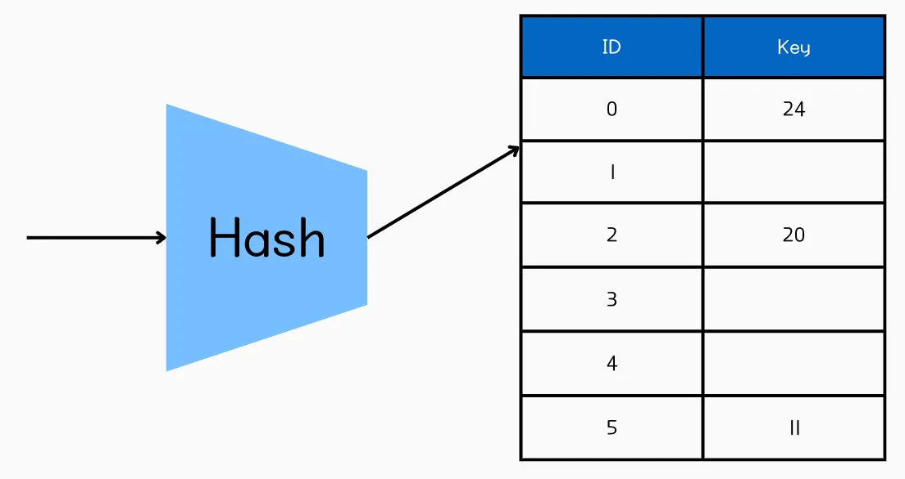

# Hash기반 Index

## 💡 핵심 요약

- **한 줄 정의:** 키(Key)를 해시 함수(Hash Function)로 계산한 결과값을 주소로 사용하여, **평균 O(1)에 가까운 매우 빠른 속도로 데이터에 직접 접근**하는 인덱스.
- **핵심 키워드:** `해시테이블`, `O(1)`, `동등비교(=)`, `비정렬(Unsorted)`, `MemoryEngine`
- **왜 중요한가?:** 특정 값과 정확히 일치하는 데이터를 찾는 **'동등 비교' 검색** 에 있어서는 B-Tree보다 월등히 빠른 성능을 제공하기 때문입니다.

# 1. 개념

- 해시 인덱스는 이름 그대로 **해시 테이블(Hash Table)** 자료구조를 이용해 구현하는 인덱스입니다. 인덱싱할 컬럼의 값을 해시 함수에 넣어 얻은 해시 값(Hash Value)을 버킷(Bucket)의 주소로 사용하고, 이 버킷에는 실제 데이터 행을 가리키는 포인터가 저장됩니다.

---

# 2. 왜 필요한가? / 등장 배경

- **문제**
    - B+Tree 인덱스는 O(log n) 복잡도로 검색, 범위 검색에 적합하지만 정확한 일치 검색에서는 더 빠른 방법이 필요할 수 있습니다.
        - 디스크 기반 시스템에서 빈번한 키 조회 시 I/O 효율성을 높일 필요.
    - 메모리 기반 테이블에서 초고속 조회 요구.
- **해결**
    - 위의 문제를 해시 함수를 통해 키를 즉시 버킷에 매핑하여, 평균 O(1)의 검색 시간을 제공합니다.

---

# 3. 동작 원리 및 주요 특징

### 알아야할 용어

- **해시 함수** : 입력 키를 고정된 해시값(버킷 인덱스)으로 변환.
- **버킷** : 키-값 쌍(또는 데이터 포인터)을 저장하는 슬롯. 충돌 시 **체이닝(linked list)** 또는 **오픈 어드레싱(open addressing)** 으로 해결.
- **데이터** : 보통 데이터 포인터(예: 행 위치) 또는 PK 값(예: InnoDB 보조 인덱스)을 저장.

### 특징

- **오직 동등 비교(`=`, `IN`)만 지원**
    - 해시 함수는 키 값을 순서와 상관없이 고유한 숫자로 변환합니다. `hash('A')`와 `hash('B')` 사이에는 아무런 연관성이 없으므로, `>`나 `<` 같은 범위 비교나 `ORDER BY`를 통한 정렬에는 인덱스를 사용할 수 없습니다.
- **해시 충돌 (Hash Collision) 발생 가능성**
    - 서로 다른 키 값이 우연히 동일한 해시 값을 가질 수 있습니다. 이를 '해시 충돌'이라 하며, 이 경우 해당 버킷은 연결 리스트(Linked List)로 여러 개의 데이터 포인터를 관리하게 됩니다. 충돌이 잦아지면 성능이 저하될 수 있습니다.
- **MySQL의 제약사항 (매우 중요)**
    - MySQL에서 **사용자가 직접 생성할 수 있는 `HASH` 인덱스는 `MEMORY` 스토리지 엔진에서만 지원** 됩니다.
    - `InnoDB` 스토리지 엔진은 사용자가 `HASH` 인덱스를 생성할 수 없으며, 대신 **'어댑티브 해시 인덱스(Adaptive Hash Index)'** 라는 기능을 통해 자주 사용되는 데이터에 대해 내부적으로 해시 인덱스를 자동 생성하여 성능을 향상시킵니다.

---

# 4. 장점과 단점

## **👍 장점 (Advantages)**

- **매우 빠른 동등 검색 속도:** 해시 충돌이 적다면, 시간 복잡도 O(1)로 매우 빠르게 데이터를 찾을 수 있습니다.
- **구조가 단순함:** B-Tree처럼 복잡한 균형 조정 로직이 필요 없습니다.
- **효율적 메모리 사용**: 메모리 기반 테이블(예: MySQL MEMORY 엔진)에서 소형 데이터셋에 효과적입니다.

## **👎 단점 (Disadvantages)**

- **범위 검색 및 정렬 불가:** `>` , `<`, `BETWEEN`, `LIKE 'prefix%'`, `ORDER BY` 등 동등 비교가 아닌 작업에는 인덱스를 전혀 활용할 수 없습니다.
- **해시 충돌 시 성능 저하** : 충돌이 많아지면 해당 버킷의 연결 리스트를 탐색해야 하므로 성능이 O(N)까지 저하될 수 있습니다.
- **재해싱 오버헤드** : 해시 테이블 크기 조정 시 모든 키를 재해싱, 쓰기/메모리 비용이 증가합니다.
- **복합 인덱스 활용 제약** : 복합 인덱스의 경우, `WHERE col1='a' AND col2='b'` 처럼 **모든 컬럼을 동등 비교 조건으로 사용** 해야만 인덱스가 동작합니다. B-Tree처럼 일부 컬럼만 사용하는 것은 불가능합니다.
- InnoDB는 쿼리 패턴을 관찰해 B-Tree 키의 프리픽스(prefix)에 해시를 빌드하며, 버퍼 풀 내 데이터만 대상으로 합니다.

---

# 5. 언제 사용해야 할까?

- **✅ 사용하면 좋은 경우**
    - MySQL의 `MEMORY` 엔진 테이블에서 **반드시 동등 비교로만 조회** 할 때.
    - URL이나 고유 코드처럼, 범위 없이 항상 전체 값이 일치하는 조건으로만 검색되는 데이터.
- **❌ 사용을 고려해야 할 경우**
    - **대부분의 `InnoDB` 테이블**: InnoDB는 사용자가 `HASH` 인덱스를 직접 생성하는 것을 지원하지 않으므로 고려 대상이 아닙니다.
    - **범위 검색이 필요한 경우** : 가격, 날짜, 나이 등 범위 검색(`>`, `<`)이 필요한 컬럼.
    - **정렬이 필요한 경우** : `ORDER BY`를 통한 정렬이 필요한 쿼리.
    - **부분 일치 검색이 필요한 경우** : `LIKE '검색어%'` 와 같이 부분 일치 검색이 필요한 경우.

---

# 🤔 Q&A 및 심화 질문 (Deeper Questions)

- **해시 인덱스의 충돌은 어떻게 해결되는가?**
    
    체이닝(버킷 내 리스트) 또는 오픈 어드레싱(다른 슬롯 탐색)으로 해결. 체이닝은 메모리 사용량이 늘어나고, 오픈 어드레싱은 탐색 시간이 증가할 수 있음.
    
- **왜 데이터베이스에서 B+Tree가 해시 인덱스보다 더 많이 사용되는가?**
    
    B+Tree는 범위 검색, 정렬, 다양한 쿼리 패턴을 지원하며, 해시 인덱스는 정확한 일치 검색에만 특화되어 범용성이 낮음.
    
- **재해싱은 언제 발생하며 성능에 어떤 영향을 미치는가?**
    
    해시 테이블이 가득 차거나 충돌이 많아지면 크기를 조정(보통 2배)하고 모든 키를 재해싱. 이는 CPU와 메모리 비용을 유발.
    
- **해시 인덱스는 클러스터형 인덱스로 사용될 수 있는가?**
    
    아니요, 순서 정보가 없어 클러스터형 인덱스(데이터 정렬 필요)로는 부적합. 보조 인덱스로 주로 사용.
    

### 심화질문

- InnoDB의 '어댑티브 해시 인덱스'는 어떤 원리로 동작하며, 개발자가 제어할 수 있는가?
- 해시 충돌을 줄이기 위한 좋은 해시 함수는 어떤 특징을 가져야 하는가?

---

# **🔗 연관 개념 (Related Concepts)**

- `[[자료구조 - 해시 테이블]]`: 해시 인덱스의 기반 자료구조.
- `[[자료구조 - B+Tree]]`: 데이터베이스에서 범위 검색에 사용되는 대안 인덱스.
- `[[충돌 해결 기법]]`: 체이닝, 오픈 어드레싱 등.
