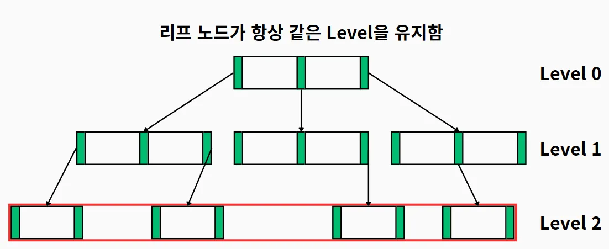
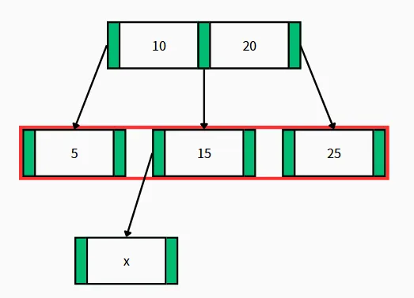
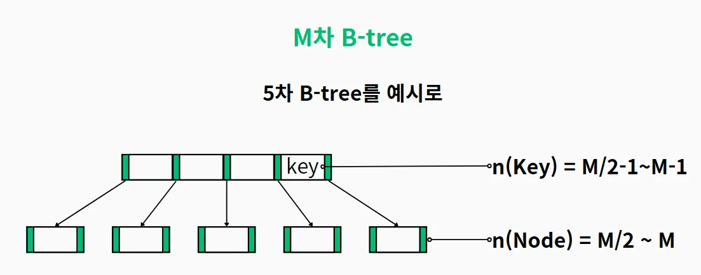
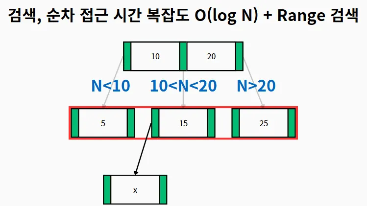
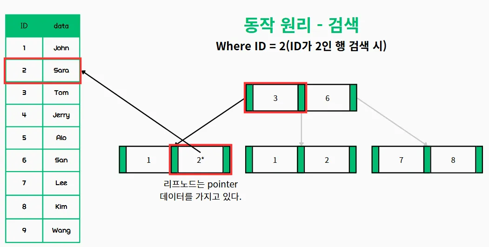
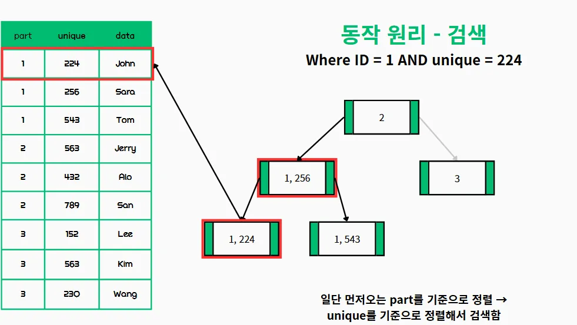
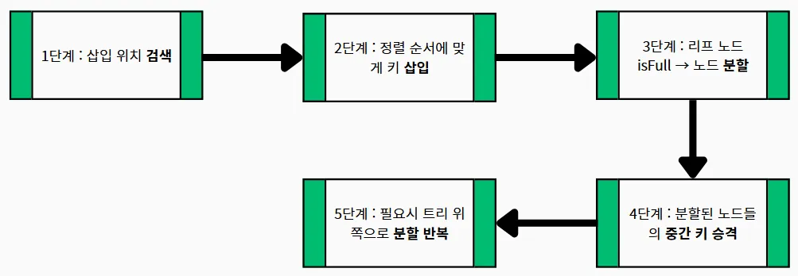

# B-Tree

## 💡 핵심 요약
- **한 줄 정의: 대용량 데이터의 효율적인 저장 및 검색을 위해 고안된 균형 탐색 트리**
- **핵심 키워드:** `B-Tree`, `균형 탐색 트리`, `다중 경로 검색 트리`, `디스크 I/O 최적화`, `데이터베이스 인덱스`, `로그 시간 복잡도`
- **왜 중요한가?: 대규모 데이터를 처리하는 데이터베이스에서 디스크 접근 횟수를 줄여 성능을 극대화할 수 있기 때문입니다.**

# 1. 개념

- **균형 잡힌 다중 경로 검색 트리(multi-way balanced search tree)** 로, 데이터를 여러 개의 키와 포인터를 가진 노드에 계층적으로 저장하여 빠른 검색을 지원합니다.

---

# 2. 왜 필요한가? / 등장 배경

1. 데이터베이스는 디스크에서 데이터를 읽을 때 **'페이지'** 또는 **'블록'** 이라는 큰 단위로 한 번에 가져옵니다.
2. B-Tree는 이 '페이지' 하나에 최대한 많은 데이터(키)를 담을 수 있도록 노드를 설계합니다. 즉, **노드 하나가 디스크의 페이지 하나에 대응** 됩니다.
3. 하나의 노드에 자식 노드를 가리키는 포인터가 많기 때문에(즉, 다수의 자식 노드를 가질 수 있어), 트리의 **전체 높이가 매우 낮아집니다.** ( 예를 들어, 차수 300인 B-Tree는 1600만 개의 키를 저장해도 높이가 약 4에 불과합니다. )
4. 트리의 높이가 낮다는 것은 루트 노드에서 원하는 데이터가 있는 리프 노드까지 도달하는 데 **디스크를 읽는 횟수(I/O)가 매우 적다** 는 의미입니다.

 

---

# 3. 주요 특징

### 균형잡힌 구조

B-Tree는 균형 탐색(검색)트리로, 모든 리프 노드가 **동일한 레벨에 위치** 해 데이터에 접근할 때 **일정한 성능을 보장** 합니다.

### 디스크 접근 최소화(디스크 I/O 최적화)

보조 기억 장치는 주 기억 장치에 비해 접근 시간이 많이 느립니다. 때문에 접근 횟수를 최소화해야 하는데 이때, B-Tree는 높이가 가능한 작게 유지되기 때문에 디스크 접근에서 이점이 있습니다.

B-Tree는 노드의 크기를 디스크 블록 크기와 일치하도록 설계하여, 한 번의 I/O로 최대한 많은 데이터를 읽을 수 있습니다.

### 디스크 접근이 줄어들면 성능이 증가하는 이유

데이터 베이스는 기본적으로 보조 기억 장치(HDD, SSD 등)에 정보를 저장합니다.

보조 기억 장치는 주 기억 장치에 비해 속도가 매우 느리기 때문에 접근이 줄어들수록 성능이 증가합니다.

|  | RAM | SSD | HDD |
| --- | --- | --- | --- |
| 예시모델 | G.SKILL DDR5 7200 | SK P31 2TB | 바라쿠다 2TB | 
| 읽기 | 62,000MB/s | 3,500MB/s | 135MB/s |
| 쓰기 | 75,500MB/s | 3,200MB/s | 135MB/s |
| 레이턴시 | 72.5ns | 90µs | 4.16ms | 

### 다중 경로 검색 트리

**다중 경로 검색 트리** : B-트리는 이진 검색 트리의 일반화된 형태로, **단일 노드에서 두 개 이상의 경로가 분기될 수 있습니다** . 

특정 차수(order) `m`을 가지는 B-트리는 다음과 같은 속성을 가집니다

- 모든 리프 노드는 동일한 레벨에 위치합니다. 이는 트리의 균형을 유지하는 핵심 특성입니다.
- 루트를 제외한 모든 내부 노드는 최소 `⌈m/2⌉`개에서 최대 `m`개의 비어있지 않은 자식 노드를 가집니다.
- 각 내부 노드의 키 수는 해당 노드의 비어있지 않은 자식 수보다 하나 적으며, 이 키들은 검색 트리 방식으로 자식들의 키를 분할합니다.
- 루트 노드는 리프 노드가 아닐 경우 최소 2개, 최대 `m`개의 자식 노드를 가질 수 있습니다.

### 데이터 정렬

B-Tree는 데이터를 정렬된 상태로 유지해서, 검색, 순차 접근, 삽입 및 삭제를 **시간 복잡도가** `O(log N)` 또는 `O(logB n)` 로 유지되도록 합니다.

---

# 4. 동작원리

## 단일 인덱스에 대한 검색

## multi column index에 대한 검색 시

## 삽입, 삭제, 수정이 느린 이유

B-Tree는 항상 정렬된 상태를 유지하고, 리프 노드의 레벨이 같게 유지되기 때문에 **유지 보수에 비용이 많이** 들어갑니다.

# 5. 장점과 단점

## 👍 장점

- 디스크 기반 시스템에서 효율적인 데이터 접근.
- 대량의 데이터 처리에 적합.
- 균형 유지로 일관된 성능 보장.(균등한 조회 비용)
    - 어떤 데이터를 조회하더라도 조회 과정의 길이와 비용이 균등합니다.
- **로그 시간 복잡도** : 검색, 삽입, 삭제와 같은 기본 연산의 시간 복잡도는 `O(log n)`으로 유지됩니다.
    - 예를 들어, 차수 300인 B-Tree는 1600만 개의 키를 저장해도 높이가 약 4에 불과해, 최악의 경우에도 4번의 디스크 I/O로 데이터에 접근할 수 있습니다.
- 노드 크기를 디스크 블록 크기와 일치하도록 설계하면(보편적으로 노드 크기는 디스크 블록 크기와 일치하도록 되어 있다.) 한 번의 I/O 작업으로 더 많은 정보를 가져올 수 있게 합니다

## 👎 단점

- 구현이 복잡하며, 메모리 기반의 소규모 데이터에서는 이진 탐색 트리(BST)보다 오버헤드가 클 수 있음.
- 작은 데이터셋에서는 B-트리의 장점이 덜 두드러짐.
- B+트리에 비해 리프 노드를 통한 순차 접근 효율이 떨어질 수 있습니다.
    - B+Tree는 모든 데이터가 리프 노드에 저장되고, 리프 노드들이 링크드 리스트처럼 연결되어 있어 범위 검색에서 더 효율적입니다.

---

# 6. 언제 사용해야 할까?

- **✅ 사용하면 좋은 경우**
    - 범위 검색을 사용하는 경우
    - 동등 검색을 사용하는 경우
    - 카디널리티(Cardinality)가 높은 (고유한 값의 비율이 높은, 예: 주민등록번호) 컬럼
- **❌ 사용을 고려해야 할 경우**
    - 쓰기(INSERT/UPDATE/DELETE) 작업이 매우 빈번한 테이블
    - 데이터의 중복도가 높아 카디널리티가 낮은 컬럼 (예: 성별, 0 또는 1로만 구성된 플래그)
    - 테이블의 전체 데이터 규모가 작아 Full Scan이 더 빠른 경우

---

# 🤔 Q&A 및 심화 질문

- B-Tree와 B+Tree의 저장 구조 차이가 쿼리 성능에 미치는 영향은 무엇인가?
- B-Tree의 차수(order)가 성능에 미치는 영향은 어떻게 분석할 수 있을까?

---

# **🔗 연관 개념**

- [https://www.cs.usfca.edu/~galles/visualization/BTree.html](https://www.cs.usfca.edu/~galles/visualization/BTree.html)
- [https://www.cs.usfca.edu/~galles/visualization/BPlusTree.html](https://www.cs.usfca.edu/~galles/visualization/BPlusTree.html)
- `[[쿼리 실행 계획 (Query Execution Plan)]]`
- `[[자료구조 - B+Tree]]`
