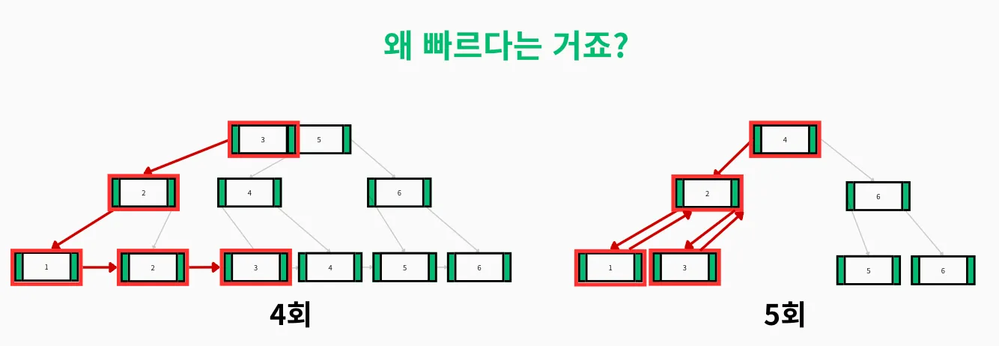
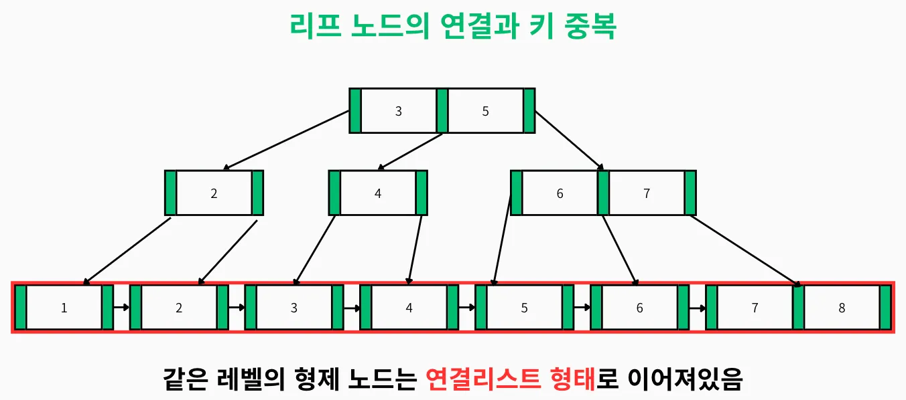

# B+Tree

## 💡 핵심 요약

- **한 줄 정의:** B-Tree를 **'범위 검색(Range Scan)'에 더욱 최적화** 시킨, 현대 데이터베이스 인덱스의 표준 자료구조.
- **핵심 키워드:** `B-Tree`, `범위검색`, `연결리스트`, `리프노드`, `InnoDB`, `검색 효율성`
- **왜 중요한가?:** MySQL(InnoDB), PostgreSQL 등 대부분의 현대 관계형 데이터베이스가 **표준 인덱스 자료구조로 채택** 하고 있기 때문입니다.

# 1. 개념 (What is this?)

B-Tree의 기본 구조를 유지하면서, 두 가지 중요한 변경점을 적용한 변형 자료구조입니다.

1. 모든 데이터 포인터(실제 데이터의 주소)는 **오직 리프 노드(Leaf Node)에만 존재** 합니다.
    1. 즉 내부노드(리프노드를 제외한 노드)에는 Key값만을 저장합니다.
2. 모든 **리프 노드들은 서로를 가리키는 연결 리스트(Linked List) 구조** 로 연결되어 있습니다.

---

# 2. 왜 필요한가? / 등장 배경 (Why is it needed?)

왜 모든 리프 노드들을 연결 리스트로 만들었을까요? 그 이유는 B-Tree의 범위 검색을 보면 알 수 있습니다.

B-Tree는 특정 키 하나를 찾는 데는 매우 효율적이지만, **'A부터 B까지'와 같은 범위 검색에는 비효율적인 면**이 있었습니다. 

특정 범위의 데이터를 모두 찾으려면 트리의 여러 레벨을 반복적으로 오르내려야 했기 때문입니다. 

(좌측이 B+Tree, 우측이 B-Tree)

B+Tree는 이 문제를 해결하고 **디스크의 순차 접근(Sequential Access) 성능을 극대화** 하기 위해 등장했습니다.

---

# 3. 동작 원리 및 주요 특징 (How does it work?)

- **구조**
    - *중간 노드(리프노드를 제외한 노드들) : Key만 저장*
    - *리프 노드 : Key와 데이터(Pointer)*
        - *리프 노드끼리 연결리스트의 형태로 연결되어있음*
- **특징 1: 데이터는 리프 노드에만 저장**
    - 루트와 중간 노드는 데이터를 찾기 위한 '이정표' 역할만 수행합니다. 오직 키 값만 저장하여, 특정 키가 어느 자식 노드에 속하는지만 안내합니다.
    - 따라서 **어떤 키를 검색하든,** **항상** 트리의 **가장 마지막 레벨인 리프 노드까지 탐색** 해야 합니다.
    - 인덱스에서는 데이터 포인터대신 Primary 키가 저장됩니다.
        - (이것도 클러스터형 인덱스냐 보조 인덱스냐에 따라 달라집니다.)
- **특징 2: 리프 노드의 연결 리스트 구조**
    - 이것이 B+Tree의 **가장 중요한 특징** 입니다. 모든 리프 노드들이 포인터를 통해 **오름차순으로 서로 연결** 되어 있습니다.
    - 범위 검색 시, 시작 지점의 리프 노드만 찾으면 그 이후로는 트리를 다시 탐색할 필요 없이 **연결 리스트를 따라 순차적으로 스캔** 하기만 하면 됩니다. 이는 디스크 I/O 패턴을 순차적으로 만들어 성능을 크게 향상시킵니다.

### B-Tree vs B+Tree 비교

| 특성 | B-Tree | B+Tree |
| --- | --- | --- |
| **데이터 저장 위치** | 모든 노드 | 리프 노드만 |
| **범위 검색** | O(log n) + 상위노드 순회 | O(log n) + 리프 노드 순차 접근 |
| **메모리 효율성(노드 활용도)** | 낮음 | 높음 (내부 노드 크기 작음) |
| **삽입/삭제 복잡도** | 복잡 | 상대적으로 단순 |

---

# 4. 장점과 단점

## 👍 장점 (Advantages)

- **상승된 범위 검색 성능:** 리프 노드의 연결 리스트 구조 덕분에 B-Tree에 비해 **범위 검색이 매우 빠르고 효율적** 입니다.
- **균일한 트리 높이 및 예측 가능한 성능:** 모든 데이터가 리프 노드에만 존재하므로, 어떤 키를 검색하더라도 **항상 동일한 높이(레벨 수)를 탐색** 하게 되어 성능이 예측 가능합니다.
- **높은 노드 활용도:** 중간 노드에는 데이터 포인터 없이 키만 저장되므로, **하나의 노드에 더 많은 키를** 담을 수 있습니다. 이는 트리의 높이를 더 낮게 유지하여 디스크 I/O를 줄이는 효과를 가져옵니다.

## 👎 단점 (Disadvantages)

- **특정 키 조회 시 추가 탐색:** B-Tree는 운이 좋으면 중간 노드에서 데이터를 찾을 수도 있지만, B+Tree는 어떤 경우든 반드시 리프 노드까지 내려가야 하므로 탐색 단계가 한 단계 더 많을 수 있습니다.( 하지만 트리의 높이가 낮기 때문에 실제 성능 차이는 크지 않습니다.

---

# 5. 언제 사용해야 할까?

✅ 사용하면 좋은 경우(B-Tree와 동일)

- **범위 검색이 빈번한 경우** : 예: WHERE created_at BETWEEN '2023-01-01' AND '2023-12-31'.
- 사실상 **대부분의 현대 관계형 데이터베이스** 에서 범용 인덱스로 사용되며, 특별한 경우가 아니라면 B+Tree가 표준적인 선택지입니다.
- **읽기 중심 테이블** : 예: 사용자 프로필 조회, 주문 내역 검색.
- **카디널리티가 높은 컬럼** : 예: 이메일, 주문 ID (고유한 값 많음).
- **대규모 데이터** : MySQL, PostgreSQL의 인덱스로 사용.

❌ 사용을 고려해야 할 경우(B-Tree와 동일)

- **쓰기 작업이 빈번한 테이블** : 예: 실시간 로그 테이블 (INSERT/UPDATE/DELETE 다수).
- **카디널리티가 낮은 컬럼** : 예: 성별, 상태 플래그 (중복 많음).
- **소규모 데이터** : Full Table Scan이 더 빠른 경우 (예: 1000행 이하).

---

# 🤔 Q&A 및 심화 질문

- InnoDB의 Secondary Index는 왜 PK 값을 가지고 있을까? 이 구조가 B+Tree 탐색에 어떤 영향을 미치는가?
- B+Tree에서 페이지 분할(Page Split)은 어떻게 일어나며, 성능에 어떤 영향을 미치는가?
- 왜 모든 데이터가 리프 노드에만 있는가?
    - 범위 검색 최적화와 캐시 효율성을 위해서입니다.
- 차수는 어떻게 결정하는 가?
    - 디스크 페이지 크기와 키 크기를 고려해 결정합니다.
- 리프 노드가 가득 찼을 때는 어떻게 하는가?
    - 노드 분할(Split) 과정을 통해 새로운 노드를 생성합니다.

---

# 🔗 연관 개념 (Related Concepts)

- `[[클러스터형 인덱스와 비클러스터형 인덱스]]`
- `[[자료구조 - B*Tree]]`
- `[[자료구조 - B-Tree]]`
