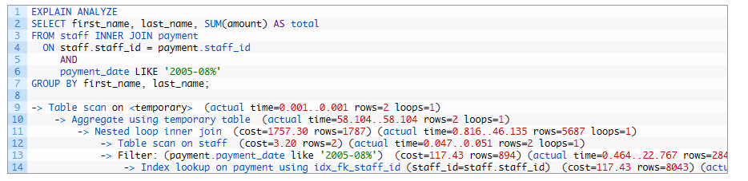

# Index

<br>

## 목차
1. [Index란?](#index란)
2. [Index 생성 방법](#index-생성-방법)
3. [Index 설계](#index-설계)
4. [실행 계획과 Index](#실행-계획과-index)

<br>

## Index란?

### 정의

Index는 데이터베이스 테이블의 검색 속도를 높이기 위한 자료구조

추가적인 쓰기 작업과 저장 공간을 활용하여 데이터 검색 속도를 향상시키는 기술

DB 테이블에 저장된 row를 식별 가능하도록 저장한 DB 오브젝트 

데이터의 위치를 빠르게 찾아주는 역할

<br>

특정 컬럼에 Index를 생성하면?

- 해당 컬럼의 데이터들이 정렬됨
- 별도의 메모리 공간에 데이터의 물리적 주소와 함께 저장

<br>

Index가 없다면?

- DB는 원하는 데이터를 찾기 위해 테이블 전체를 처음부터 끝까지 스캔
- = Full Table Scan을 수행해야 하는데 이는 매우 비효율적

비유

- Index : 책의 목차 or 색인
- DB table의 데이터 : 책의 내용
- 데이터의 물리적 주소 : 페이지 번호

<br>

책에서 원하는 내용 찾을 때: 

- 목차를 보고 빠르게 페이지 번호를 찾음
- 해당 페이지로 가서 빠르게 원하는 내용을 찾음

DB table에서 원하는 데이터를 찾을 때:  

- index를 보고 빠르게 데이터 물리적 주소를 얻음
- 데이터 물리적 주소로 빠르게 원하는 데이터를 찾음

<br>

### 장점

**Select 쿼리 (검색 및 조회) 성능 향상**

- Index의 가장 핵심적인 장점
- WHERE 절을 사용해 특정 조건에 맞는 데이터를 찾을 때 유용
    - Full Table Scan X
    - 대신 정렬된 Index를 통해 데이터의 위치를 바로 찾아감
    - 검색 속도 대폭 향상

<br>

**정렬(ORDER BY) 및 그룹화(GROUP BY) 처리 시간 단축**

- Index는 데이터가 이미 정렬된 상태로 저장
- 아래 연산 시 별도의 정렬 과정을 생략하거나 최소화
    - ORDER BY, GROUP BY
    - DISTINCT
        - 정렬되어 중복 값들이 모여 있음
        - 이전 값과 다를 때만 값 가져오면 됨
    - MIN / MAX 함수
        - MIN, MAX 찾으려면 2중 for문 같은 로직 필요
        - but 정렬 되어 있으니 가장 앞, 뒤 값만 가져오면 됨
- 처리 속도가 향상

<br>

**조인(JOIN) 성능 향상**

- Join에 사용되는 컬럼에 index 있다면 Join 작업 성능 크게 개선
- Join 조건에 맞는 Join할 행 빠르게 찾을 수 있기 때문
- 특히 Nested Loop Join에서 효과적

<br>

**데이터 무결성 강화**

- Unique index 사용 시 해당 컬럼에 중복된 값 입력 방지 가능
    - 중복 데이터 검증을 빠르게 수행
- Primary Key나 Unique 제약 조건이 Unique index를 통해 구현
    - INSERT or UPDATE할 때, Full Table Scan 대신 Unique index만 빠르게 확인.
    - 만약 입력하려는 값이 index에 이미 존재한다면?
    - "Unique 제약 조건 위반" 오류를 발생시키며 작업을 거부.
    - 이를 통해 무결성 강화
- 데이터의 정합성과 신뢰성을 보장
- 빠른 유일성 검증을 제공

<br>

**최소 I/O로 데이터 접근 (커버링 인덱스 활용)**

- Index를 통해 데이터 페이지에 직접 접근
    - 테이블 전체를 읽지 않고 필요한 블록만 접근
    - 데이터가 저장된 정확한 물리적 위치를 찾아 한 번에 감
    - 디스크 I/O 횟수를 감소시켜 시스템 전체 성능을 향상
    - Index 없다면 모든 데이터 페이지 하나씩 전부 디스크에서 읽어와야 함
- Covering Index 사용 & SELECT 절에 필요한 모든 컬럼이 Index에 포함되어 있을 경우
    - 테이블 자체에 접근하지 않고 Index만으로 쿼리를 처리 가능
    - 쿼리에 필요한 모든 정보가 Index 안에 다 들어있음
    - 굳이 원본 데이터 있는 테이블까지 찾아갈 필요 없이 인덱스만 읽고 작업을 끝낼 수 있다는 의미

<br>

**옵티마이저 최적화 도움**

- Index는 컬럼의 카디널리티 정보 제공
- 데이터베이스 옵티마이저가 더 나은 실행 계획 세울 수 있도록 도움

<br>

**시스템 부하 감소**

- 전반적인 DB 부하 줄여 시스템 성능 향상
- 불필요한 디스크 I/O 최소화하여 데이터베이스 서버의 CPU 사용률을 낮춤
- 네트워크 트래픽 및 서버 자원 사용량 절약

<br>

### 단점

**쓰기 작업(INSERT, UPDATE, DELETE) 성능 저하**

- 인덱스의 가장 큰 단점이자 주의해야 할 부분
- 새로운 데이터 추가, 수정, 삭제될 때마다 테이블뿐만 아니라 인덱스 테이블에도 추가적인 연산 발생
    - 정렬된 위치를 찾아 데이터를 추가/변경/삭제하는 추가적인 연산 발생
- INSERT (추가) 성능 저하:
    - 새로운 데이터가 추가될 때, 인덱스 테이블에도 정렬된 위치를 찾아 데이터를 추가해야 함
    - 기존 블록에 여유 공간이 없어 새로운 블록을 할당받고 키를 옮기는 Index Split 현상 발생 가능
    - 이 과정은 복잡하고 많은 Redo를 유발하며, DML을 블로킹할 수 있어 성능에 매우 불리
- DELETE (삭제) 성능 저하:
    - 데이터를 삭제할 때, 테이블에서는 데이터가 지워지고 그 공간을 다른 데이터가 사용할 수 있음
    - 하지만 인덱스에서는 데이터가 실제로 지워지지 않고 '사용 안 됨' 표시만 해두는 경우 많음
    - 이로 인해 테이블의 데이터 수와 인덱스의 데이터 수가 달라질 수 있음
    - 인덱스 크기가 불필요하게 커져 성능 저하로 이어질 수 있음
- UPDATE (수정) 성능 저하:
    - 인덱스에는 Update 개념이 없음
    - 테이블에서 업데이트가 발생할 경우 인덱스에서는 기존 데이터를 삭제
    - 그리고 새로운 데이터를 추가하는 것과 같은 작업이 발생
    - 이는 delete와 insert 두 개의 작업이 동시에 일어나 다른 DML보다 더 큰 부하를 주게 됨

<br>

**추가 저장 공간 필요**

- 인덱스는 원본 테이블과는 별도의 디스크 저장 공간을 차지하는 객체
- 보통 원본 테이블 크기의 약 10% 정도의 저장 공간이 필요
- Update 작업이 많은 경우 실제 데이터보다 인덱스가 과도하게 커질 수 있음

<br>

**인덱스 관리 비용 및 복잡성**

- 인덱스 생성에 시간이 많이 소요될 수 있음
- 한 번 만들고 끝나는 것이 아니라 지속적인 관리 필요
- 데이터 변경이 빈번하게 일어나면 인덱스의 조각화(Fragmentation) 발생하여 효율 떨어짐
    - 이 경우 인덱스를 재구성하거나 재정렬하는 등의 추가적인 관리 작업이 필요
- 불필요한 인덱스를 만들면 성능 저하와 관리 비용만 증가.
- 너무 많은 인덱스는 오히려 성능 저하 유발
- 주기적인 인덱스 최적화 및 재구성 작업 필요

<br>

**옵티마이저의 잘못된 인덱스 선택 가능성**

- 아래의 경우에 오히려 Full Table Scan보다 느려져 성능이 저하될 수 있습니다.
    - 옵티마이저가 통계 정보를 잘못 판단해 잘못된 인텍스 선택
    - 인덱스가 쿼리 조건에 맞지 않음
    - 낮은 카디널리티 컬럼 or 소규모 테이블에 인덱스 만듬
    - 인덱스가 처리하는 데이터가 전체 데이터의 10-15% 이상 처리하는 경우
- 인덱스가 너무 많으면 옵티마이저가 잘못된 인덱스를 선택할 위험이 증가
- 인덱스를 잘못 사용할 경우 오히려 성능이 저하되는 역효과가 발생

<br>

**복잡한 쿼리에서는 제한적**

- 복합 조건, 다중 조인, 함수가 적용된 조건 등에서는 인덱스가 무시될 수 있음
- 모든 쿼리 패턴을 커버하는 인덱스를 만들 수 없으므로 설계 시 trade-off 고려할 필요 있음

<br>

### 사용하면 좋은 경우

**WHERE절에서 자주 사용하는 컬럼**

- 가장 대표적이고 효과적인 경우
- WHERE 절은 특정 조건을 만족하는 데이터를 필터링하는 역할
- 여기에 사용되는 컬럼에 인덱스가 있으면 Full Table Scan 하지 않고 필요한 데이터에 바로 접근

<br>

**카디널리티가 높은 컬럼** 

- 카디널리티는 특정 컬럼의 데이터 중복 정도를 나타내는 말
- 중복이 적고 값이 넓게 퍼진 컬럼에 인덱스를 사용해야 효율적
- 인덱스는 검색 범위를 좁히는 것이 목적인데, 고유한 값이 많을수록 더 효과적으로 범위 좁힐 수 있기 때문
- 카디널리티 낮으면 많은 데이터 좁히지 못해 추가적인 작업 해야 함
    - 주민 번호에 index → 전체 사람 데이터에서 한명의 사람 데이터 찾아냄
    - 성별에 index → 전체 사람 데이터에서 절반의 데이터 찾아

<br>

**JOIN 조건으로 자주 사용하는 컬럼**

- JOIN의 ON 절에 사용되는 컬럼에 인덱스 설정하면 조인 성능이 크게 향상
- 대부분의 DB 시스템은 외래 키를 설정하면 자동으로 인덱스를 생성

<br>

**ORDER BY, GROUP BY, DISTINCT에 자주 사용하는 컬럼**

- 데이터베이스가 결과 반환하기 위해 별도의 정렬 작업 수행할 필요가 없어 **처리 속도가 향상**
- 인덱스 자체가 이미 정렬된 상태이기 때문에, 인덱스 순서대로 데이터를 읽어오기만 하면 됨

<br>

**Range Query이 잦을 때**

- BETWEEN, >, <, 날짜 구간, 접두사 LIKE('abc%') 등 범위, prefix 검색은 인덱스로 빠르게 처리 가능

<br>

**Covering Index가 가능한 경우**

- 쿼리에 필요한 컬럼이 인덱스에 모두 포함되어 있는 경우
- 테이블에 가지 않고 인덱스만으로 결과를 반환하여 지연시간과 I/O를 크게 줄일 수 있음

<br>

**규모가 작은 편이 아닌 테이블**

- 데이터 양이 적은 테이블에서는 인덱스 사용이 오히려 비효율적
- 규모가 어느 정도 있는 테이블에 사용하는 것이 효과 극대화

<br>

**읽기 위주인  = INSERT, UPDATE, DELETE가 자주 발생하지 않는 테이블, 컬럼**

- SELECT 비중이 높은 테이블일수록 인덱스의 이점이 커짐
- 잦은 DML 없는 컬럼일수록 유지 비용이 낮아 효과적

<br>

**PRIMARY KEY / UNIQUE 제약 조건**

- PRIMARY KEY나 UNIQUE 제약은 내부적으로 인덱스를 사용
- 이를 통해 빠른 유일성 검증과 조회 성능을 동시에 제공

<br>

**LIMIT / TOP-N Query**

- 인덱스를 활용하면 정렬된 결과에서 필요한 일부 데이터만 빠르게 가져올 수 있기 때문

<br>

### 사용하면 안 좋은 경우

**데이터 변경(INSERT, UPDATE, DELETE) 작업이 매우 빈번한 경우**

- **인덱스를 피해야 하는 가장 대표적인 경우**
- 추가, 수정, 삭제될 때마다 테이블뿐만 아니라 인덱스도 함께 정렬하고 수정하는 작업이 발생
    - 시스템에 큰 부하를 주고 인덱스 유지 비용이 커서 성능 병목이 되기 쉬움.
    - 인덱스 유지 비용이 조회 성능 이득을 상쇄
    - 예: 실시간 로그 데이터, 임시 데이터

<br>

**카디널리티가 매우 낮은 컬럼 (데이터 중복도가 높은 컬럼)**

- 값의 종류가 적고 중복이 많은 컬럼에 인덱스를 만드는 것은 비효율적
    - 필터링 효과가 거의 없기 때문
    - 예: 성별, Boolean 값, 회원 등급이 몇 개 없는 경우, Y/N 처리 상태
- 인덱스를 통해 찾아도 결국 전체 데이터의 절반 가량(또는 그 이상)을 읽어야 함
- Full Table Scan과 성능 차이가 거의 없거나 오히려 인덱스를 읽는 비용 때문에 더 느릴 수 있음

<br>

**데이터 양 자체가 매우 적은 테이블 (소규모 테이블)**

- 데이터가 매우 적다면, 인덱스를 사용하는 것보다 그냥 Full Table Scan하는 것이 더 빠름
- 인덱스 사용하는 과정(인덱스 탐색 → 데이터 주소 확인 → 실제 데이터 접근)은 여러 단계 거치기 때문

<br>

**WHERE 절에서 컬럼 가공이 필요한 경우**

- WHERE 절에서 컬럼에 함수 적용하거나 계산을 통해 원래의 값이 바뀌는 컬럼은 인덱스 활용 불가능.
- 인덱스는 **가공되지 않은 순수한 값**으로 검색할 때만 동작

<br>

**검색 결과가 데이터의 상당 부분을 차지하는 경우**:

- WHERE절의 조건으로 검색했을 때, 테이블 전체 데이터의 20~25% 이상을 반환해야 하는 경우
- 일반적으로 전체 데이터의 5-10% 이하 조회 시 Index Scan이 효율적
- 옵티마이저는 인덱스를 사용하는 것보다 Full Table Scan이 더 효율적이라고 판단 가능
- 인덱스를 통해 데이터에 개별적으로 접근하는 랜덤 I/O 비용이, 테이블 전체를 순차적으로 읽는 시퀀셜 I/O 비용보다 더 커지기 때문

<br>

**와일드카드(%)가 앞에 오는 LIKE 검색**

- B-Tree 인덱스는 앞부분이 맞아야 동작
- `%keyword`와 같은 검색은 인덱스를 타지 못하고 Full Table Scan을 발생

<br>

**인덱스가 너무 많은 경우**

- 하나의 테이블에 과도하게 인덱스를 만들면 모든 인덱스 갱신 필요
- **따라서 쓰기 성능 저하**가 심해지고, **저장 공간 낭비**로 이어집니다.
- 또한, 옵티마이저가 **잘못된 인덱스 선택**을 할 위험이 증가하여 오히려 성능을 악화시킬 수 있음.

<br>

**불필요한 중복 인덱스**

- 같은 컬럼에 비슷한 인덱스를 여러 개 두는 경우, 관리 비용만 증가하고 성능에는 이득이 없음

<br>

## Index 생성 방법

### 1. 기본 문법

```sql
CREATE [UNIQUE|FULLTEXT|SPATIAL] INDEX index_name
ON table_name (column1 [(length)] [ASC|DESC], column2, ...);
```

<br>

테이블 생성 후에도 `ALTER TABLE`로 인덱스 추가 가능.

```sql
ALTER TABLE table_name 
ADD INDEX index_name (column);
```

<br>

- `index_name` : 인덱스 이름 (직접 지정, 생략 시 DBMS가 자동 생성)
- `table_name` : 인덱스를 생성할 테이블
- `column` : 인덱스를 걸 컬럼
- `length` : 문자열 컬럼 인덱스 생성 시 접두사 길이 지정
- `ASC | DESC` : MySQL 8.0 이상부터 지원 (오름차순/내림차순)

<br>

### 2. 인덱스 종류별 생성

(1) 일반 인덱스 (Non-Unique Index)

- 가장 기본적인 인덱스
- 중복 허용
- 하나의 컬럼에만 인덱스를 생성

```sql
CREATE INDEX idx_users_email
ON users (email);
```

<br>

(2) 유니크 인덱스 (Unique Index)

- 컬럼 값 중복 불가.
- 해당 컬럼의 모든 값이 중복되지 않도록 보장하는 인덱스
- UNIQUE 제약 조건을 만족시키며 인덱스도 함께 생성됨
- PRIMARY KEY는 자동으로 UNIQUE 인덱스로 생성

```sql
CREATE UNIQUE INDEX idx_users_username
ON users (username);
```

<br>

(3) 복합 인덱스 (Composite Index)

- 여러 컬럼을 묶어서 하나의 인덱스로 생성.
- **Left-most Rule(접두사 규칙)** 적용됨.
- WHERE 절에서 인덱스의 첫 번째 컬럼을 포함하는 조건으로 검색할 때 매우 효율적
- 컬럼의 순서가 매우 중요

```sql
CREATE INDEX idx_orders_userid_date
ON orders (user_id, created_at);
```

<br>

(4) 부분 인덱스 (Prefix Index)

- VARCHAR나 TEXT 같이 긴 문자열 컬럼의 경우
- 컬럼값 전체가 아닌 앞부분의 일부 글자만을 지정하여 인덱스로 만들 수 있음
- 인덱스의 크기를 줄여 저장 공간을 절약하고, 검색 속도 향상 가능
- 컬럼 뒤에 길이 지정 (아래는 20자만 잘라 인덱스 생성하는 것)

```sql
CREATE INDEX idx_users_email_prefix
ON users (email(20));
```

<br>

(5) 전문 검색 인덱스 (Full-Text Index)

- 자연어 검색용 (문자열 전체 검색 최적화)
- `CHAR`, `VARCHAR`, `TEXT` 같은 텍스트 데이터에서 **내용 전체**를 대상으로 검색하기 위한 인덱스
- `LIKE '%검색어%'` 보다 훨씬 빠르고 정확하게 자연어 검색을 할 수 있음
- 보통 `MATCH() ... AGAINST()` 구문과 함께 사용
- MySQL에서 `CHAR`, `VARCHAR`, `TEXT` 컬럼에 사용 가능

```sql
CREATE FULLTEXT INDEX idx_articles_content
ON articles (content);
```

<br>

(6) 공간 인덱스 (Spatial Index)

- GIS 데이터 타입(`GEOMETRY`, `POINT`, `LINESTRING`, `POLYGON`)에 사용.
- 지도나 좌표와 같은 위치 기반 데이터를 매우 빠르게 검색하기 위해 사용

```sql
CREATE SPATIAL INDEX idx_locations_point
ON locations (location);
```

<br>

### 3. 인덱스 확인 & 삭제

- 인덱스 목록 확인

```sql
SHOW INDEX FROM table_name;
```

- 인덱스 삭제

```sql
DROP INDEX index_name ON table_name;
```

<br>

## Index 설계

### Index 생성 시점 및 방법

- 초기 설계 단계
    - 테이블 설계 시 PRIMARY KEY, UNIQUE 제약과 함께 생성
    - PK/FK 인덱스는 반드시 고려.
    - 예상되는 주요 쿼리 패턴 기반으로 생성
- 운영 중
    - 실제 쿼리 패턴 분석 후 필요한 인덱스 추가
    - 성능 이슈 발생 후 실행 계획 분석 및 성능 모니터링 결과 바탕으로 추가 인덱스 설계.
    - 트래픽이 적은 시간대에 생성 권장
        - CREATE INDEX 명령어는 작업이 끝날 때까지 해당 테이블에 Write Lock 검.
        - 즉, 인덱스가 생성되는 동안 해당 테이블에 `INSERT`, `UPDATE`, `DELETE` 작업이 불가능
        - 대용량 테이블은 작업 시간이 매우 길기 때문에 이는 곧 **서비스 장애**로 이어짐.
- 대용량 데이터 처리 시
    - 인덱스 생성은 테이블의 모든 데이터 읽고, 정렬하고, 인덱스 구조 디스크에 쓰는 매우 무거운 작업
    - 이 과정에서 **CPU, 메모리, 디스크 I/O** 자원 엄청나게 소모하여 데이터베이스 서버 전체의 성능 저하
    - 대량 INSERT 작업 전 인덱스 삭제 후 작업 완료 후 재생성
        - 인덱스가 있는 상태에서 데이터 INSERT 시 업데이트 작업을 수백만 번 반복하는 것과 같음
        - 따라서 인덱스 먼저 삭제 후 데이터 그냥 INSERT
        - INSERT 후 한번에 인덱스 만드는 것이 더 효율적

<br>

### 어떤 컬럼에 Index?

인덱스는 한 테이블당 보통 3~5개 정도가 적당 

테이블의 목적에 따라 개수는 달라질 수 있음

<br>

인덱스를 설정할 컬럼을 선정할 때는 다음 기준을 활용

<br>

**카디널리티가 높은 컬럼**

- 한 컬럼이 갖고 있는 값의 중복 정도가 낮을수록 좋음
    - 카디널리티 높다고 중복도 낮다면 어떤 값으로 검색하든 거의 일정한 성능으로 소수의 행 찾아냄
    - 카디널리티 낮고 중복도 높다면  인덱스를 사용해도 데이터를 충분히 좁히지 못함

<br>

**활용도가 높은 컬럼**

- 해당 컬럼이 실제 작업에서 얼마나 활용되는지에 대한 값
- 인덱스 생성, 유지, 저장 모두 비용이 발생
- 많이 안 쓰는 컬럼에 인덱스 걸면 이득은 거의 없고, 오히려 관리, 성능 비용만 커짐.
- 활용도 높은 컬럼은 아래와 같음
    - WHERE, JOIN (FK), ORDER BY, GROUP BY절에 사용되는 컬럼
    - 자주 조회, 검색되는 컬럼

<br>

**INSERT, UPDATE, DELETE 자주 발생하지 않는 컬럼**

- 인덱스는 데이터를 변경할 때마다 같이 갱신되어야 함.
- 변경이 많으면 인덱스 유지 비용이 커지고 성능 저하 발생.
- **변경이 자주 없는 컬럼**에 인덱스를 걸어야 인덱스 유지 부담이 줄고, 읽기 성능을 안정적으로 확보

<br>

**Primary key**

- PK는 자주 조회/조인/참조되므로 인덱스 효율이 높음.
- 또한 FK 관계에서 참조 무결성 검증 시 빠른 탐색이 필요하므로 PK 인덱스는 필수.

<br>

**되도록 작은 데이터 타입** 

- 인덱스는 실제 데이터를 키 값과 함께 저장하므로, 키 크기가 크면 인덱스 전체 크기도 커짐.
- 인덱스가 커질수록 디스크 I/O, 메모리 캐싱 효율이 떨어짐 → 성능 저하.
- 작은 데이터 타입일수록 인덱스 트리의 깊이가 얕아지고 검색 속도 향상.

<br>

### 복합 Index 컬럼 순서

- **정의**
    - 복합 인덱스는 2개 이상의 컬럼을 조합하여 생성한 인덱스
    - MySQL은 인덱스에 최대 15개 컬럼까지 구성 가능
- **컬럼 순서**
    - 복합 인덱스 설계에서 **인덱스를 구성하는 속성들의 순서가 매우 중요**
    - 복합 인덱스 (A, B)를 설정했다면 A가 1순위, B가 2순위 정렬 조건이 됨
    - 복합 인덱스 B-Tree 구조상 첫번째로 지정된 인덱스 컬럼이 WHERE절 조건에 포함되어야 정상 동작
    - ex : (A, B) 순서로 복합 인덱스가 생성됨
        - 인덱스는 `A` 컬럼을 기준으로 먼저 정렬됨
        - `A` 값이 같은 데이터 내에서 `B` 컬럼을 기준으로 다시 정렬
        - 따라서 `WHERE A =?` 또는 `WHERE A =? AND B =?`와 같은 쿼리는 인덱스 효율적으로 사용 가능
        - `WHERE B =?` 쿼리는 인덱스의 선행 컬럼(`A`) 조건이 없으므로 인덱스를 제대로 활용하지 못함

```sql
CREATE INDEX index_name
ON table_name (A, B);

SELECT * FROM table_name WHERE A=1;             (o)
SELECT * FROM table_name WHERE A=1 AND B=2;     (o)
SELECT * FROM table_name WHERE B=2;             (x)
```

<br>

- **컬럼 순서 배치 방법**
    - 선두 컬럼 우선 전략:
        - 복합 인덱스는 선두 컬럼부터 순서대로 조건에 포함되어야 효과적으로 작동
        - (A, B, C) 인덱스에서 A, AB, ABC 조합만 효율적 활용 가능
    - = 조건으로 자주 조회하는 컬럼을 앞쪽에 배치:
        - `WHERE`절에서 `=` 연산자에  자주사용되는 컬럼을 가장 앞 순서에 배치하는 것이 기본 원칙
        - 
        - 이를 통해 탐색 시작점을 명확히 특정하여 검색 범위를 크게 줄일 수 있음
        - 범위 조건 (>, <) 같은 것 말고 = 조건
    - 카디널리티가 높은 컬럼을 앞쪽에 배치:
        - 다중 인덱스 생성 시 카디널리티가 높은 순서로 컬럼을 배치하는 것이 좋음
        - 데이터를 점진적으로 더 효과적으로 필터링해 나가는 것이 좋음
    - 쿼리 패턴 고려
        - 자주 함께 사용되는 컬럼들을 하나의 복합 인덱스로 구성
        - WHERE 절에서 사용되는 순서와 일치시키는 것이 유리
    - 정렬 고려
        - ORDER BY나 GROUP BY에 사용되는 컬럼 순서 고려
        - 정렬 작업을 생략할 수 있도록 인덱스 순서 설계

<br>

## 실행 계획과 Index

### 실행 계획이란?

데이터베이스의 옵티마이저가 SQL 쿼리 어떤 방식으로 실행할지 계획한 '설계도'

실행 계획 통해 SQL 쿼리가 데이터에 어떻게 접근하고 처리되는지 파악 가능 

이를 분석하여 비효율적인 부분을 찾아내고 성능을 최적화할 수 있음 

<br>

실행 계획 보면 쿼리가 실제로 어떻게 수행되는지, 성능이 왜 느린지 알 수 있음.

또 인덱스 활용 여부와 병목 지점을 파악해 튜닝 방향을 결정 가능

인덱스 설계, 쿼리 rewrite 같은 튜닝 액션의 우선순위 정하는 근거가 됨.

<br>

**옵티마이저란?**

- DBMS의 쿼리 최적화 엔진.
- 사용자가 작성한 SQL 보고 가장 효율적인 실행 계획을 선택하는 역할
- 각 단위 작업의 비용 정보와 통계 정보를 이용해 실행 계획별 비용을 산출
- 가장 최소의 비용이 드는 실행 계획을 선택

<br>

SQL은 절차적 언어가 아니라 선언적 언어

- 개발자는 “무엇을 조회할지”만 작성.
- “어떻게 조회할지”는 DBMS가 알아서 결정.

DBMS는 같은 SQL이라도 여러 가지 방법으로 실행 가능.

여려 전략들을 최적화해서 실행 계획으로 결정함.

가장 비용(cost)이 적은 방법을 찾는 것이 옵티마이저의 역할.

옵티마이저가 똑똑해야 DB 성능이 잘 나옴.

<br>

### 실행 계획 확인 방법

- MySQL: **`EXPLAIN`** 또는 **`EXPLAIN ANALYZE`**
- PostgreSQL: **`EXPLAIN`** 또는 **`EXPLAIN ANALYZE`**
- SQL Server: **`SET SHOWPLAN_ALL ON`**
- Oracle: **`EXPLAIN PLAN`**

<br>

1. `EXPLAIN`

- 가장 기본적인 실행 계획 확인 방법
- 쿼리 앞에 `EXPLAIN`을 붙이면 됨
- 실행할 쿼리를 DB가 어떻게 처리할지 설명해달라고 요청하는 명령어
- 이 명령어 실행 시 쿼리 결과 대신 실행 계획 담은 표 출력

```sql
EXPLAIN
SELECT *
FROM users
WHERE email = 'test@example.com';
```

<br>

결과 예시

| id  | select_type | table | type | key             | rows | Extra       |
| --- | ----------- | ----- | ---- | --------------- | ---- | ----------- |
| 1   | SIMPLE      | users | ref  | idx_users_email | 1    | Using index |

<br>


<br>

결과가 어떤 의미인지는 아래에서 보자.

<br>

2. `EXPLAIN ANALYZE` (MySQL 8.0+)

- MySQL 8.0부터 지원되는 기능
- 단순히 계획만 보여주는 게 아님
- 실제 실행 후 실제 비용과 소요 시간까지 같이 보여줌
- 더 정밀한 성능 분석 가능

```sql
EXPLAIN ANALYZE
SELECT *
FROM users
WHERE email = 'test@example.com';
```

<br>

결과 예시



<br>

차이점:

- `EXPLAIN` → "예상 계획"
- `EXPLAIN ANALYZE` → "실제 실행 결과 포함된 계획"

<br>

### 실행 계획에서 index 관련 확인해야 할 것

실행 계획의 컬럼

- **type**
    - 데이터 읽는 방법, 접근 방식을 나타냄
    - 인덱스 활용 정도를 보여줌
    - 검색 성능이 좋은 순서대로 나열하면 아래와 같음

<br>

| type 값    | 의미                                                                                                                         | 성능        |
| ---------- | ---------------------------------------------------------------------------------------------------------------------------- | ----------- |
| **system** | 테이블에 1행만 있음                                                                                                          | ✅ 최상      |
| **const**  | PK/Unique 인덱스로 한 행만 찾음                                                                                              | ✅ 매우 좋음 |
| **eq_ref** | 조인 시 PK/Unique로 매칭                                                                                                     | ✅ 좋음      |
| **ref**    | Non-Unique 인덱스로 특정 값 검색                                                                                             | 👍 괜찮음    |
| **range**  | 인덱스 이용한 범위 조건(>, <, BETWEEN, LIKE 'abc%') 검색                                                                     | 👍 괜찮음    |
| **index**  | 인덱스 전체 스캔 (데이터는 안 읽고 인덱스만 읽음)                                                                            | ⚠️ 주의      |
| **ALL**    | Full Table Scan (테이블 전체 읽음, 거의 항상 튜닝 대상) <br> 인덱스 없거나 인덱스 사용해도 전체 데이터 25% 이상 읽어야 할 때 | ❌ 느림      |

<br>

- 최소한 range 이상의 접근 방식 사용해야 인덱스가 효과적으로 사용되었다고 볼 수 있음
- index나 ALL이 나타난다면 튜닝이 필요할 가능성이 높음

<br>

- **possible_keys**
    - 옵티마이저가 쿼리 실행 시 사용을 고려했던 인덱스들의 목록

<br>

- **key**
    - 실제로 선택된 인덱스 이름 표시
    - `possible_keys` 중에서 옵티마이저가 최종적으로 선택하여 사용한 인덱스를 의미
    - NULL이면 인덱스 사용 안 했다는 의미

<br>

- **rows**
    - 옵티마이저가 예상하는 읽을 행(Row) 수
    - 이 숫자가 실제 테이블의 전체 행 수와 비슷하다면 Full Table Scan 의심
    - 이 값은 작을수록 좋음
    - 이 값이 크면 성능 저하 가능성이 높음
    - 실제 실행 건수와 다를 수 있으므로 EXPLAIN ANALYZE로 검증 필요

<br>

- **Extra**
    - 쿼리의 실행 계획에서 성능에 관련된 중요한 추가 정보를 표시
    - Using where:
        - WHERE 절의 조건이 데이터를 필터링하는데 사용되었음을 의미
        - 인덱스를 사용해 데이터 찾고 + 추가 필터링 필요하다는 의미
    - Using index:
        - 커버링 인덱스가 적용되어 테이블 접근 없이 인덱스만으로 쿼리가 처리되었음을 의미
        - 커버링 인덱스가 사용된 최상의 상태
    - Using temporary:
        - 임시 테이블 생성해 추가적인 메모리를 사용했음을 의미
        - GROUP BY/ORDER BY 시 자주 발생
    - Using filesort:
        - 별도의 정렬 작업이 발생했음을 의미
        - 인덱스 정렬 못 썼다는 의미
        - 메모리나 디스크를 사용해 별도의 정렬 작업을 수행했음을 의미
        - 이는 성능 저하의 주요 원인 중 하나로, 튜닝이 필요한 대표적인 신호

<br>

**Index Scan 종류**

Index Scan 종류는 type에 표시됨

1. **Index Seek** 
    - **정확히 필요한 키**만 찾아가는 방식
    - `=` 조건이나 범위 조건 (`BETWEEN`, `>`, `<`, `LIKE 'abc%'`)에서 발생
    - MySQL 실행 계획의 `type`이 `ref`, `eq_ref`, `range`, `const` 등으로 표시
2. **Index Range Scan** 
    - Index Seek의 한 종류지만, **특정 범위**만 인덱스에서 탐색
    - 범위 검색,  ex : >, <, BETWEEN, LIKE 'abc%'
    - MySQL `type = range`로 표시됨
    - 조건절 범위가 넓으면 효율이 떨어질 수도 있음
3. **Index Full Scan** 
    - 인덱스 전체를 처음부터 끝까지 탐색
    - 조건이 없거나, 인덱스를 정렬 목적으로만 사용할 때 발생
    - MySQL `type = index` 로 표시됨
    - 테이블 Full Scan(`ALL`)보다는 낫지만, 필요 없는 많은 데이터를 읽을 수 있음
4. **Full Table Scan** 
    - 인덱스 자체를 사용하지 않고 테이블 전체를 탐색
    - MySQL `type = ALL` 로 표시됨
    - 대규모 테이블에서 나오면 **심각한 성능 이슈** 후보
5. **Index Skip Scan** 
    - Oracle, MySQL 8.0 일부 기능에서 지원
    - 복합 인덱스의 선두 컬럼 조건이 없더라도 뒷 컬럼을 활용할 수 있는 스캔 기법
    - 성능은 Range Scan보다 떨어지지만, Full Scan보다는 나음

<br>

**인덱스가 실제 사용되고 있는지**

1. **Explain에 Key 확인**
    1. key에 인덱스 이름 표시되면 인덱스 사용되고 있는 것
    2. NULL이면 인덱스 사용하지 않는 것
    3. possible_key도 함께 사용하면 좋음
        1. 여기에 후보 목록이 있는데 key가 NULL인 경우
        2. 옵티마이저가 Full Table Scan이 효율적이라고 판단한 것
        3. 왜 그런 판단 했는지 분석해야 함
2. **Explain에 type 확인**
    1. 인덱스가 어떻게 쓰였는지 확인 가능
        1. `const` / `eq_ref` / `ref` → 인덱스 제대로 활용됨 
        2. `range` → 범위 검색으로 인덱스 사용됨 
        3. `index` → 인덱스 전체 스캔 (테이블은 안 읽지만 인덱스를 전부 읽음) 
        4. `ALL` → 인덱스 미사용, Full Table Scan
3. **Explain에 Extra 확인** 
    1. `Using index` → **커버링 인덱스** (테이블 접근 없이 인덱스만으로 결과 반환)
    2. `Using index condition` → **Index Condition Pushdown(ICP)** 사용
    3. `Using where` → 인덱스 탐색 후에도 추가 필터링 필요 (정상 동작)
    4. `Using filesort` / `Using temporary` → 인덱스 못 써서 별도 연산 발생 (성능 주의)

<br>

**정렬, 그룹핑 비용 확인**

**Using filesort와 Using temporary**

- 정렬(ORDER BY)이나 그룹핑(GROUP BY)이 포함된 쿼리의 성능 진단 시 확인해야 할 핵심 경고 신호
- 보통 정렬(ORDER BY)이나 그룹핑(GROUP BY) 작업에서 인덱스를 제대로 활용하지 못하고 있다는 뜻

<br>

**Using filesort**

- ORDER BY에 명시된 순서대로 데이터를 가져오기 위해, 인덱스를 활용하지 못했을 때 발생
- 인덱스를 사용하지 못하고 데이터베이스가 별도의 정렬 알고리즘으로 정렬 작업을 수행했음을 의미
- **동작 과정**
    1. WHERE 조건에 맞는 데이터를 먼저 찾음
    2. 찾아온 결과 데이터를 ORDER BY 절의 컬럼 기준으로 정렬
    3. 이때 정렬할 데이터 메모리에 담기지 못할 정도로 크면, 디스크에 임시 파일을 만들어서 정렬
    4. 이는 **디스크 I/O를 유발하여 성능을 크게 저하**
    5. 이름이 'filesort'인 이유
- **왜 문제인가?**
    - 쿼리가 데이터를 찾는 작업 외에, 결과를 다시 정렬하는 추가적인 부담을 안게 되므로 느려짐
    - 인덱스 사용했다면 정렬된 순서 그대로 데이터를 읽어오기만 하면 되는데, 불필요한 일을 하기 때문

<br>

**Using temporary**

- GROUP BY나 UNION 등의 작업 처리하기 위해, 데이터베이스가 내부적으로 임시 테이블 만들었단 의미
- **동작 과정**
    1. 쿼리 중간 결과를 담을 임시 테이블을 메모리 또는 디스크에 생성
    2. 데이터를 임시 테이블에 넣고, 그룹핑이나 집계 작업을 수행
    3. 작업이 끝나면 임시 테이블에서 최종 결과를 반환
- **왜 문제인가?**
    - 임시 테이블을 만들고 데이터를 쓰고 읽는 과정은 그 자체로 매우 비싼 작업
    - 특히 GROUP BY가 ORDER BY와 함께 사용될 때, 이 임시 테이블에 대해 filesort까지 함께 발생하는 최악의 상황이 생길 수 있음
    - Using temporary가 보이면 Using filesort보다 더 심각한 성능 문제일 가능성이 높음.

<br>

**해결책: ORDER BY / GROUP BY를 위한 인덱스 설계**

- 두 문제를 해결하는 가장 확실한 방법은 정렬과 그룹핑에 사용되는 컬럼을 활용해 인덱스를 만드는 것
- 데이터베이스가 인덱스를 통해 이미 정렬된 데이터를 순서대로 읽어오게 함
- 따라서 비싼 filesort나 temporary table 생성 작업을 건너뛰게 만드는 것

<br>

**설계 원칙**

- WHERE 조건절에 사용된 컬럼을 앞에 둠
- ORDER BY 또는 GROUP BY에 사용된 컬럼을 그 뒤에 둠
- 복합 인덱스를 생성

<br>

### 옵티마이저의 index 선택 기준

1. **카디널리티, 선택도**
    1. 가장 중요한 기준
    2. 선택도 = 조건 만족하는 행 수 / 전체 행수
    3. 행을 많이 줄일 수 있는 인덱스일수록 우선적 사용
2. **조건절과 인덱스 컬럼 매칭 여부**
    1. WHERE 절, JOIN 조건, ORDER BY, GROUP BY 등에 사용된 컬럼 인덱스와 얼마나 잘 맞는지 확인
    2. 복합 인덱스 시 인덱스 컬럼의 **선두 컬럼 규칙** 충족 여부 중요
3. **비용 체크**
    1. 옵티마이저는 비용을 계산해서 인덱스 vs Full Scan 중 더 효율적인 쪽을 선택
    2. 비용 추정 요소
        - **rows** (예상 읽을 행 수)
        - **filtering ratio** (조건 후 걸러지는 비율)
        - **디스크 I/O 비용**
        - **정렬/그룹핑 필요 여부**
4. **커버링 인덱스 가능 여부**
    1. 인덱스만 읽고 결과 반환 가능한 경우라 선호됨
    2. 테이블 접근이 줄어들어 성능 크게 개선
5. **정렬, 그룹핑 최적화 여부**
    1. ORDER BY / GROUP BY 컬럼 순서가 인덱스 순서와 맞으면 인덱스 선택
    2. 맞지 않으면 filesort/temporary 발생 가능해져서 인덱스 선택 안 할 수도 있음
6. **통계 정보 체크**
    1. 옵티마이저는 테이블과 인덱스에 대한 통계(행 수, 카디널리티, 분포)를 참고해 선택
    2. 통계가 오래되면 잘못된 인덱스 선택 가능
7. **쿼리 형태와 연산자 체크**
    1. 인덱스 활용할 수 없는 쿼리 형태나 연산자 체크
    2. 이런 경우 옵티마이저는 인덱스 선택 X
    3. 어떤 경우들이 있는지 아래에서 확인

<br>

### Index 적용 안되는 경우

인덱스를 분명히 만들었는데도 적용되지 않는 경우가 종종 발생 

데이터베이스의 Optimizer가 인덱스를 사용하는 것이 Full Table Scan보다 비효율적이라고 판단하기 때문

<br>

**인덱스 조건 누락**

- 인덱스가 설정된 컬럼을 WHERE절 조건으로 걸지 않으면 Full Table Scan이 발생

<br>

**컬럼 가공 (연산 or 함수 사용)**

- 인덱스 컬럼에 함수를 적용하거나 연산이 들어가면 인덱스가 무시됨
- 인덱스는 원본 값을 기준으로 정렬되어 있기 때문
- 인덱스는 가공되지 않은 순수한 값으로 검색할 때만 동작
- ex
    - `❌` **나쁜 예**: `WHERE SUBSTRING(name, 1, 2) = '김씨'`
    - `❌` **나쁜 예**: `WHERE score * 10 > 900`
    - `✅` **좋은 예**: `WHERE name LIKE '김씨%'`
    - `✅` **좋은 예**: `WHERE score > 90`

<br>

**LIKE 연산자에서 %가 앞에 위치하는 경우**

- 와일드카드 %가 앞에 오면 인덱스가 적용 X
- 앞부분이 `%`이면 어디서부터 찾아야 할지 모르기 때문에 인덱스를 사용할 수 없음
    - **`‘%abc’`** 의미 = 앞은 아무거나 상관 없고 뒤의 마지막 3글자만 abc
- 앞부분의 글자가 주어진 경우에는 정렬된 위치를 바로 찾아갈 수 있음
    - 접두사 매칭만 인덱스 활용 가능: **`WHERE column LIKE 'abc%'`**
- ex
    - `❌` **나쁜 예**: `WHERE name LIKE '%철수'`
    - `❌` **나쁜 예**: `WHERE name LIKE '%영희%'`
    - `✅` **좋은 예**: `WHERE name LIKE '김%'`

<br>

**비교하는 데이터 타입 불일치 (묵시적 형변환)**

- 인덱스 컬럼의 데이터 타입과 다른 타입으로 비교할 경우 인덱스를 타지 않음
- 데이터베이스 내부적으로 묵시적 형변환 발생으로 인덱스 사용 불가
- 테이블의 모든 행을 읽어 형변환한 후 비교하는 작업을 수행
- 형변환하면 인덱스 컬럼이 함수 처리된 값이 되어 인덱스 사용 불가한 것
- ex
    - **컬럼 타입**: `user_id INT`
    - `❌` **나쁜 예**: `WHERE user_id = '123'`
    - `✅` **좋은 예**: `WHERE user_id = 123`

<br>

**부정형으로 쿼리하는 경우** 

- `!=`, `<>`, `NOT IN`, `IS NULL`과 같은 부정형 조건은 인덱스 효율성 크게 저하
- 왜냐하면 부정형 조건은  특정 데이터를 찾는 것이 아니라, 넓은 범위의 데이터를 제외하는 방식
- 일반적으로 검색해야 할 데이터의 범위가 넓고 불명확
- 대부분의 경우 테이블의 많은 데이터를 읽어야 함
- 따라서 옵티마이저는 Full Table Scan 선택할 가능성 높음
- ex
    - `❌` **나쁜 예**: `WHERE status != 'ACTIVE'`
    - `✅` **좋은 예**: `WHERE status IN ('INACTIVE', 'PENDING')` (대안)

<br>

**OR 조건 사용하는 경우** 

- OR 조건의 의미
    - `WHERE A = 1 OR B = 2`  이 쿼리 의미
    - `A = 1`에 해당하는 집합 + `B = 2`에 해당하는 집합 **합집합하**는 것과 동일
- 옵티마이저는 3가지 선택지 존재 :
    1. `A` 인덱스만 쓰고, 이후 `B = 2` 조건은 필터링으로 처리
    2. `B` 인덱스만 쓰고, 이후 `A = 1` 조건은 필터링
    3. `A` 인덱스 스캔 결과 + `B` 인덱스 스캔 결과 → **두 결과를 병합** (index merge)
- WHERE 절에서 OR로 여러 조건을 묶으면, 일부만 인덱스를 타고 나머지는 Full Scan 할 수 있음
- 각 조건에 별도 인덱스가 있어도 효율성 저하
    - 여러 인덱스 중 무엇을 사용해야 할지 판단하기 어렵기 때문에 Full Table Scan 선택하는 경우 많음
    - (index merge 비용 문제
        - 인덱스를 각각 탐색하고, 결과를 병합해야 하므로 **랜덤 I/O가 많아지고 성능 저하**가 발생
- `UNION`으로 분리하여 각각 인덱스 사용을 유도하는 것이 해결책이 될 수 있음
    - 옵티마이저가 각 조건에 대해 **최적 인덱스 선택** 가능.
- IN 조건으로 리팩토링 가능 여부 확인도 해보면 좋음
    - 단일 인덱스로 효율적으로 탐색 가능
    - but 같은 컬럼인 경우만 가능
    - ex : `WHERE A IN (1, 2, 3)`

<br>

**복합 인덱스 컬럼 순서 위배**

- 복합 인덱스에서 선두 컬럼이 `WHERE` 절에 포함되지 않으면 인덱스 효과를 볼 수 없음
- ex
    - **인덱스**: (`name, age)`
    - `❌` **나쁜 예**: `WHERE age = 30`
    - `✅` **좋은 예**: `WHERE name = '홍길동'`
    - `✅` **좋은 예**: `WHERE name = '홍길동' AND age = 30`

<br>

**범위 조건 이후 컬럼**

- 복합 인덱스에서 `<, >, BETWEEN` 같은 **범위 조건**이 사용되면 그 뒤 컬럼은 인덱스 활용 불가.
- 복합 인덱스는 앞쪽 컬럼이 확정되어야 뒤쪽 컬럼을 빠르게 찾을 수 있음.
- 범위 조건은 **결과 집합이 여러 개라** 뒤쪽 컬럼이 정렬된 상태를 보장하지 않음.
- ex
    - 인덱스 :`(user_id, created_at, status)`
    - `❌` **나쁜 예**: `WHERE user_id = 100 AND created_at > '2025-09-01' AND status = 'COMPLETE';`
    - created_at까지만 인덱스 사용, status는 사용 불가
    
<br>

**검색할 데이터가 전체 데이터의 20~25% 이상인 경우 (데이터 카디널리티 너무 낮은 경우)**

- 카디널리티가 낮다면 인덱스를 써도 거의 모든 행을 읽게 됨
- 결과 데이터가 많다면
    - 인덱스 통해 데이터 찾고 디스크의 여러 위치에 흩어져 있는 데이터에 접근하는 랜덤 I/O 반복해야 함
    - 옵티마이저가 차라리 테이블 전체를 순차적으로 한 번에 읽는 시퀀셜 I/O가 더 빠르다고 판단
    - 따라서 인덱스를 사용하지 않을 수 있음

<br>

## 더 공부할 것

- 트랜잭션 & 락 관련
- join 관련
- Range Query 관련
- 커버링 인덱스
- prefix index
- full text index
    - MATCH() ... AGAINST()
- Function-based index
- spatial index
- SARGable
- INSERT와 페이지 분할(Page Split)
- 인덱스 조각화 (Fragmentation)