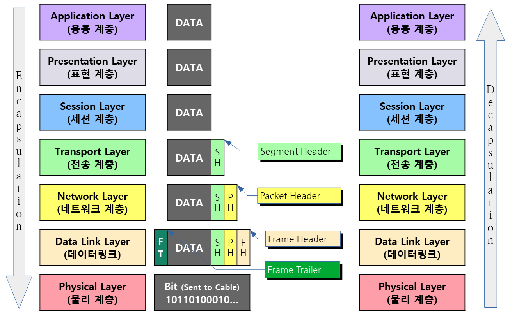

# OSI 7계층

## 목차

- [1. OSI 7계층 모델](#1-osi-7계층-모델)
- [2. 구성 요소](#2-구성-요소)
- [3. 데이터 전송 과정](#3-데이터-전송-과정)

## 1. OSI 7계층 모델

### 정의

국제표준화기구(ISO)에서 개발한 컴퓨터 네트워크 프로토콜 디자인과 통신을 계층으로 나누어 설명한 모델

### 계층을 나눈 이유

- 문제 해결 용이 : 네트워크에 문제가 발생했을 때, 어느 부분에서 문제가 발생했는지 파악하기 쉬움
  - 만약 인터넷이 안된다면? 케이블 IP 주소, 특정 웹 사이트 문제
- 표준화 : 데이터 통신에 대한 표준을 제시하여 여러 회사의 장비나 소프트웨어가 서로 호환될 수 있도록 함
  - 삼성 노트북과 아이폰간의 데이터 통신이 가능할까?
- 모듈성 : 각 계층은 독립적으로 설계되어 있어, 한 계층을 수정해도 다른 계층에 영향을 주지 않음
  - WI-FI 기술이 발전한다면 웹 브라우저를 그대로 사용할 수 있을까?

### OSI 모델의 실패 원인

- 시기상의 문제
  - OSI 모델의 표준화 작업이 진행될 때, TCP/IP 모델은 인터넷의 기반이 되어 널리 사용됨
- 복잡성과 비효율성
  - 일부 계층은 실제 네트워크 환경에서 뚜렷한 기능이 적어 불필요하게 복잡함
  - 오류 제어나 흐름 제어와 같은 기능들이 여러 계층에서 중복으로 발생
- TCP/IP 모델에 비해 OSI 모델이 충분히 높은 성능을 보여주지 못함

## 2. 구성 요소

### 응용 계층 (Application Layer)

- 역할
  - 사용자가 네트워크 서비스에 접근할 수 있도록 인터페이스 제공
- 기능
  - 사용자가 직접 사용하는 응용 프로그램과 관련된 프로토콜 정의
  - 데이터를 사용자가 이해할 수 있는 형태로 변환하여 표현
- 프로토콜
  - HTTP : 웹 페이지를 보기 위한 프로토콜로 웹 서버와 웹 브라우저 간의 통신 담당
  - SMTP : 이메일 전송 프로토콜로 이메일 클라이언트와 이메일 서버 간의 통신 담당
  - FTP : 파일 전송 프로토콜로 서버와 클라이언트 간의 파일 업로드 및 다운로드 담당
  - DNS : 도메인 이름을 IP 주소로 바꿔주는 프로토콜로 인터넷에서 도메인 이름을 통해 리소스를 찾을 수 있도록 함
- 데이터 단위 : 데이터 (Data)

### 표현 계층 (Presentation Layer)

- 역할
  - 데이터의 형식을 정의하고 변환
- 기능
  - 데이터 변환 : 서로 다른 시스템 간의 데이터 형식을 맞춤 (인코딩 및 디코딩)
  - 데이터 암호화 : 데이터 기밀성 보장을 위해 암호화 및 복호화
  - 데이터 압축 : 데이터를 압축하여 전송 효율성을 높임
- 예시
  - JEPG, MPEG, GIF : 이미지 데이터를 압축하고 표현하는 표준 형식
  - ASCII : 문자 인코딩의 표준 코드
- 프로토콜
  - SSL, TLS : 데이터 전송의 기밀성과 무결성을 보장하기 위해 사용되는 프로토콜
- 데이터 단위 : 데이터 (Data)

### 세션 계층 (Session Layer)

- 역할
  - 두 기기 사이의 통신을 시작하고 종료
- 기능
  - 세션 생성 : 통신 시작을 위한 세션 설정
  - 세션 유지 및 관리 : 데이터가 순차적으로 전송될 수 있도록 세션 유지 및 관리
  - 동기화 : 체크포인트를 설정하여 네트워크 오류나 연결 장애가 발생한 경우 데이터를 다시 전송
  - 세션 종료 : 통신이 끝나면 세션 종료
- 기술
  - NetBIOS : 전송 계층 위에서 동작하며 세션 관리 기능을 제공하는 프로토콜
- 데이터 단위 : 데이터 (Data)

### 전송 계층 (Transport Layer)

- 역할
  - 두 기기 간의 종단 간 통신을 담당
- 기능
  - 데이터 세그먼트화 : 상위 계층에서 받은 적절한 크기의 세그먼트로 나누어 전송
  - 흐름 제어 : 데이터 전송 속도 조절하여 데이터 손실 방지
  - 오류 제어 : 데이터가 유실되거나 잘못된 데이터가 수신되었을 경우 데이터 재전송
  - 혼잡 제어 : 네트워크 혼잡 상황을 감지하고 전송 속도를 조절하여 네트워크 효율성 유지
- 프로토콜
  - TCP : 연결 지향 프로토콜로 안전한 데이터 전송 보장
  - UDP : 비연결 지향 프로토콜로 빠른 데이터 전송 중시
- 장비 : 게이트웨이
- 데이터 단위 : 세그먼트 (Segment)

### 네트워크 계층 (Network Layer)

- 역할
  - 서로 다른 두 네트워크 간 데이터 전송을 담당
- 기능
  - 라우팅 : 데이터가 목적지에 도달하기 위한 최적의 경로 결정
  - 논리적 주소 지정 : IP 주소를 사용하여 네트워크 상의 장치 식별
  - 포워딩 : 각 네트워크 장치가 패킷을 수신하면 목적지 주소를 기반으로 다음 네트워크 장치로 패킷 전달
- 프로토콜
  - IP : 패킷을 목적지까지 전달하는 프로토콜
  - ICMP : 패킷의 전송 상태를 진단하기 위한 제어 메시지 프로토콜
  - ARP : IP 주소를 물리적 MAC 주소로 변환하는 프로토콜
- 장비
  - 라우터 : 서로 다른 네트워크를 연결하고 IP 주소를 기반으로 패킷의 최적 경로를 선택하여 전달하는 장치
- 데이터 단위 : 패킷 (Packet)

### 데이터 연결 계층 (Data Link Layer)

- 역할
  - 동일한 네트워크에 있는 두 개의 장치 간 데이터 전송을 용이하게 함
- 기능
  - 프레임화 : 데이터를 프레임 구조로 나누어 전송
  - 물리적 주소 지정 : MAC 주소를 사용하여 네트워크 상의 장치 식별
  - 흐름 제어 : 데이터 전송 속도 조절하여 데이터 손실 방지
  - 오류 제어 : 전송 중 발생할 수 있는 오류를 검출하고 수정
- 프로토콜
  - HDLC : 흐름 제어와 오류 제어를 제공하는 프로토콜
  - LLC : 네트워크 계층과의 인터페이스 및 다중화 담당 프로토콜
- 장비
  - 스위치 : 네트워크 내 여러 장치를 연결하고 MAC 주소 기반으로 프레임 전달하는 장치
  - 브리지 : 동일한 프로토콜을 사용하는 LAN을 다른 LAN에 연결하는 장치
- 데이터 단위 : 프레임 (Frame)

### 물리 계층 (Physical Layer)

- 역할
  - 0과 1의 비트 스트림으로 변환
  - 물리적으로 데이터를 전송
- 기능
  - 데이터가 무엇인지, 어떤 에러가 있는지 신경 쓰지 않음
  - 단순히 전기적인 신호(0, 1)로 변환해서 비트만 주고 받음
- 장비
  - 케이블
  - 허브 : 여러 대의 장치를 연결하는 네트워크 장치
  - 리피터 : 신호를 받아 증폭하고 재생하여 더 먼 곳으로 다시 전송하는 네트워크 장치
- 데이터 단위 : 비트 (Bit)

## 3. 데이터 전송 과정

| 계층                 | 캡슐화 (Encapsulation)                                                         | 디캡슐화 (Decapsulation)                                                               |
| :------------------- | :----------------------------------------------------------------------------- | :------------------------------------------------------------------------------------- |
| **응용 계층**        | 통신에 사용할 애플리케이션 데이터 생성                                         | 최종 데이터를 해당 애플리케이션으로 전달                                               |
| **표현 계층**        | 데이터 인코딩, 압축, 암호화                                                    | 데이터 복호화, 디코딩                                                                  |
| **세션 계층**        | 세션을 시작 및 데이터에 통신 세션 정보 추가                                    | 데이터 수신 완료될 때 까지 세션 유지 및 완료 시 세션 종료                              |
| **전송 계층**        | 데이터를 세그먼트 단위로 분할하고, 포트 번호가 포함된 TCP/UDP 헤더를 추가      | 헤더의 포트 번호를 확인하여 정확한 애플리케이션으로 데이터를 전달 및 데이터 재조립     |
| **네트워크 계층**    | 패킷을 생성하고, 목적지까지의 경로 설정을 위해 IP 주소가 포함된 IP 헤더를 추가 | 헤더의 목적지 IP 주소가 자신과 일치하다면 헤더를 제거하고 데이터를 상위 계층으로 전달  |
| **데이터 링크 계층** | 프레임을 생성하고, 물리적 장비 식별을 위해 MAC 주소가 포함된 프레임 헤더 추가  | 헤더의 목적지 MAC 주소가 자신과 일치하다면 헤더를 제거하고 데이터를 상위 계층으로 전달 |
| **물리 계층**        | 프레임 데이터를 0과 1의 비트 스트림으로 변환 및 전기 신호로 바꾸어 전송        | 전기 신호를 비트 스트림으로 복원하여 데이터 링크 계층으로 전달                         |

