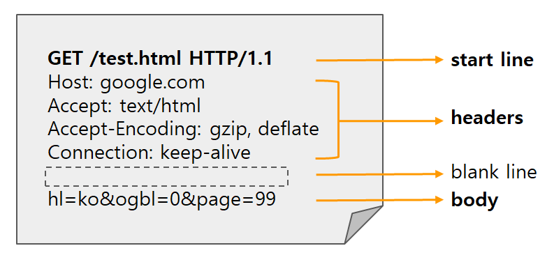
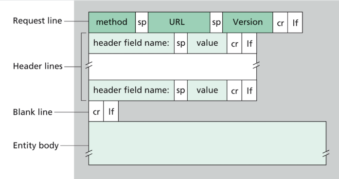
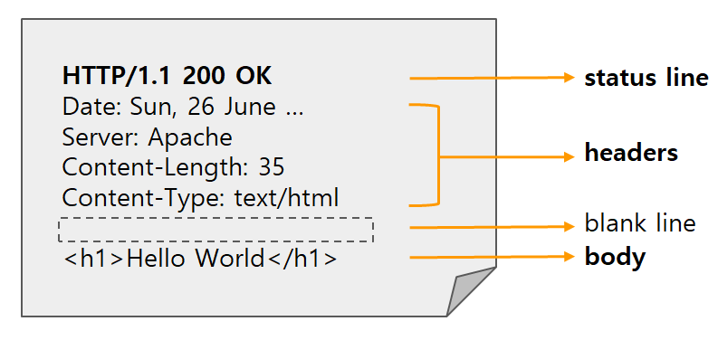

# HTTP 메시지

## 목차

- [1. HTTP 요청 메시지](#1-http-요청-메시지)
  - [1-1. 시작줄 (Start line)](#1-1-시작줄-start-line)
  - [1-2. 헤더](#1-2-헤더)
  - [1-3. 본문](#1-3-본문)
- [2. HTTP 응답 메시지](#2-http-응답-메시지)

  - [2-1. 상태 줄 (Status line)](#2-1-상태-줄status-line)
  - [2-2. 헤더](#2-2-헤더)
  - [2-3. 본문](#2-3-본문)

- 서버와 클라이언트 간에 데이터가 교환되는 방식
- 요청(request)은 클라이언트가 서버로 전달해서 서버의 액션이 일어나게끔 하는 메시지
- 응답(response)은 요청에 대한 서버에 답변
- HTTP 프로토콜 초기 버전과 HTTP/1.1은 사람이 읽을 수 있는 메시지로 전달됨

## 1. HTTP 요청 메시지




### 1-1. 시작줄 (Start line)

#### 1-1-1. HTTP 메서드 (HTTP method )

- 서버가 수행해야 할 동작을 나타냄
- `GET`, `POST`, `PUT`, `DELETE` 등

#### 1-1-2. 요청 타겟 (Request target)

- URL, 프로토콜, 포트, 도메인의 절대 경로로 나타낼 수 있으며, 요청 컨텍스트에 의해 특정지어 짐
  - 가장 일반적인 형식으로 `origin` 형식으로 알려진 절대 경로 (`?`와 쿼리 문자열과 함께 사용) <br> `GET`, `POST`, `HEAD`, `OPTION` 메서드와 함께 사용
    - `POST / HTTP/1.1`
    - `GET /background.png HTTP/1.0`
    - `HEAD /test.html?query=alibaba HTTP/1.1`
    - `OPTIONS /anypage.html HTTP/1.0`
  - `absolute` 형식으로 알려진 완전한 URL, 프록시에 연결하는 경우 대부분 `GET`과 함께 사용
    - `GET http://developer.mozilla.org/ko/docs/Web/HTTP/Messages HTTP/1.1`
  - `authority` 형식으로 알려지고 도메인 이름 및 옵션 포트로 이루어진 URL의 인증 컴포넌트 <br> HTTP 터널을 구축하는 경우 `CONNECT`와 함께 사용 가능
    - `CONNECT developer.mozilla.org:80 HTTP/1.1`
  - `asterisk` 형식으로 알려진 `*`로 서버 전체를 나타냄, `OPTION`과 함께 사용
    - `OPTIONS * HTTP/1.1`

#### 1-1-3. 프로토콜 버전 (HTTP version)

- 응답 메시지에서 사용 할 HTTP 버전을 알려줌

### 1-2. 헤더

#### General 헤더

- HTTP 헤더를 가리키는 데 사용되는 구식 용어
- 요청 메시지와 응답 메시지 모두에 사용할 수 있지만 콘텐츠 자체에는 적용되지 않음

#### 요청 헤더 (Request header)

- 서버가 응답을 맞춤화할 수 있도록 요청 컨텍스트에 대한 정보를 제공하기 위해 HTTP 요청에서 사용할 수 있는 헤더

```
GET /home.html HTTP/1.1
Host: developer.mozilla.org
User-Agent: Mozilla/5.0 (Macintosh; Intel Mac OS X 10.9; rv:50.0) Gecko/20100101 Firefox/50.0
Accept: text/html,application/xhtml+xml,application/xml;q=0.9,*/*;q=0.8
Accept-Language: en-US,en;q=0.5
Accept-Encoding: gzip, deflate, br
Referer: https://developer.mozilla.org/testpage.html
Connection: keep-alive
Upgrade-Insecure-Requests: 1
If-Modified-Since: Mon, 18 Jul 2016 02:36:04 GMT
If-None-Match: "c561c68d0ba92bbeb8b0fff2a9199f722e3a621a"
Cache-Control: max-age=0
```

#### 표현 헤더 (Representation header)

- HTTP 메시지 본문으로 전송된 리소스의 특정 표현을 설명하는 HTTP 헤더
- 요청과 응답 메시지 모두에 존재할 수 있음
- 예시 : `Content-Type`, `Content-Encoding`, `Content-Language`, `Content-Location`

### 1-3. 본문

- 모든 요청에 본문이 들어가지는 않음
- `GET`, `HEAD`, `DELETE`, `OPTIONS`처럼 리소스를 가져오는 요청은 본문이 필요 없음
- 종류
  - 단일 리소스 본문 : `Content-Type`와 `Content-Length`로 정의된 단일 파일로 구성
  - 다중 리소스 본문 : 각각 서로 다른 정보를 담고 있는 멀티파트 본문으로 구성

## 2. HTTP 응답 메시지




### 2-1. 상태 줄(status line)

#### 2-1-1. 프로토콜 버전 (HTTP version)

#### 2-1-2. 상태 코드 (status code)

- 요청의 성공 여부를 나타냄

#### 2-1-3. 상태 텍스트 (status text)

- 사람이 HTTP 메시지를 이해할 때 도움이 되는 상태 코드에 대한 짧고, 정보 제공 목적의 텍스트

### 2-2. 헤더

#### General 헤더

#### 응답 헤더 (Response header)

- HTTP 응답에서 사용될 수 있는 HTTP 헤더

```
200 OK
Access-Control-Allow-Origin: *
Connection: Keep-Alive
Content-Encoding: gzip
Content-Type: text/html; charset=utf-8
Date: Mon, 18 Jul 2016 16:06:00 GMT
Etag: "c561c68d0ba92bbeb8b0f612a9199f722e3a621a"
Keep-Alive: timeout=5, max=997
Last-Modified: Mon, 18 Jul 2016 02:36:04 GMT
Server: Apache
Set-Cookie: mykey=myvalue; expires=Mon, 17-Jul-2017 16:06:00 GMT; Max-Age=31449600; Path=/; secure
Transfer-Encoding: chunked
Vary: Cookie, Accept-Encoding
X-Backend-Server: developer2.webapp.scl3.mozilla.com
X-Cache-Info: not cacheable; meta data too large
X-kuma-revision: 1085259
x-frame-options: DENY
```

#### 표현 헤더 (Representation header)

### 2-3. 본문

- 모든 응답에 본문이 들어가지는 않음
- `201 (Created)`, `204 (No Content)`처럼 해당 페이로드 없이도 요청에 응답하는 상태 코드는 본문이 없음
- 종류
  - 단일 리소스 본문 : `Content-Type`와 `Content-Length`로 정의된 단일 파일로 구성
  - 단일 리소스 본문 : `Transfer-Encoding`가 `chunked`로 설정된 청크로 나뉘어 인코딩되는 길이를 모르는 하나의 파일로 구성
  - 다중 리소스 본문 : 각각 서로 다른 정보를 담고 있는 멀티파트 본문으로 구성

## 출처

- https://sungjk.github.io/2019/02/16/http-basic.html
- https://hahahoho5915.tistory.com/62#google_vignette
- https://developer.mozilla.org/ko/docs/Web/HTTP/Guides/Messages
