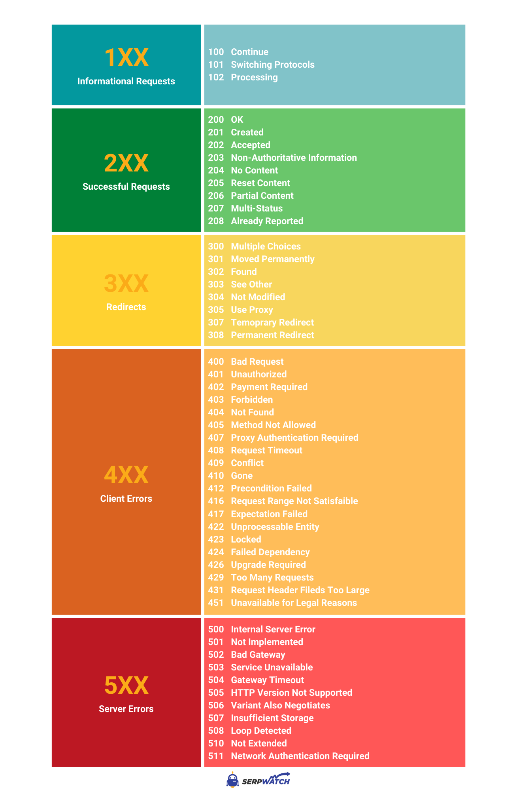

# HTTP 상태 코드

## 목차

- [Informational Requests (1XX)](#informational-requests-1xx)
- [Successful Requests (2XX)](#successful-requests-2xx)
- [Redirects (3XX)](#redirects-3xx)
- [Client Errors (4XX)](#client-errors-4xx)
- [Server Errors (5XX)](#server-errors-5xx)

## Informational Requests (1XX)

- 서버가 요청을 수신하고 이해했음을 나타냄

### 100 Continue

- 클라이언트가 서버로 보낸 요청에 문제가 없으니 다음 요청을 이어서 보내도 된다는 것을 의미
- 클라이언트의 작업이 완료되었다면 이 응답은 무시해도 됨

### 101 Switching Protocols

- 클라이언트가 서버에 프로토콜 전환을 요청했고, 서버가 전환하는 프로토콜을 나타냄

### 102 Processing

- 서버가 요청을 수신하였으며 이를 처리하고 있지만, 아직 제대로 된 응답을 알려줄 수 없음을 알려줌
- 더 이상 사용되지 않음

### 103 Early Hints

- 서버가 응답을 준비하는 동안에도 사용자 에이전트가 리소스를 미리 읽어들일 수 있도록 함
- 실험적인 기능

## Successful Requests (2XX)

- 클라이언트가 요청한 작업이 서버에 의해 수신되고 이해되며 수락되었음을 의미

### 200 OK

- 요청이 성공했음을 나타냄
- `GET` : 리소스를 가져왔고 메시지 본문으로 전송되었다는 것을 의미
- `HEAD` : 메시지 본문 없이 표현 헤더가 응답에 포함되어 있다는 것을 의미
- `POST` : 리소스가 명시하는 행동의 결과가 메시지 본문에 전송되었다는 것을 의미
- `TRACE` : 서버가 요청받은 메시지가 메시지 본문에 포함되어 있다는 것을 의미

### 201 Created

- 요청이 성공적으로 처리되었으며, 자원이 생성되었음을 나타냄
- 응답이 반환되기 이전에 새로운 리소스가 생성됨

### 202 Accepted

- 요청이 처리를 위해 수락되었으나, 아직 해당 요청에 대해 처리 중이거나 처리 시작되지 않았을 수도 있다는 것을 의미
- 요청이 처리 중 실패할 수도 있기 때문에 요청은 실행될 수도 실행되지 않았을 수도 있음

### 203 Non-Authoritative Information

- 돌려 받은 메타 정보 세트가 오리진 서버의 것과 일치하지 않지만 로컬이나 서드 파티 복사본에서 모아졌음을 의미
- `200 OK` 응답을 반드시 우선

### 204 No Content

- 요청이 성공했으나 요청에 대해서 보내줄 수 있는 콘텐츠가 없음

### 205 Reset Content

- 요청을 완수한 이후에 클라이언트에게 요청을 보낸 문서를 리셋하라고 알려줌

### 206 Partial Content

- 클라이언트에서 복수의 스트림을 분할 다운로드 하고자 범위 헤더를 전송했기 때문에 사용됨

### 207 Multi-Status

- 여러 리소스가 여러 상태 코드인 상황이 적절한 경우에 해당되는 정보를 전달함

### 208 Already Reported

- DAV에서 사용됨
- propstat 응답 속성으로 동일 컬렉션으로 바인드된 복수의 내부 멤버를 반복적으로 열거하는 것을 피하기 위해 사용

### 226 IM Used

- 서버가 GET 요청에 대한 리소스 요청을 완료했고, 응답은 하나 이상의 인스턴스 조작이 현재 인스턴스에 적용 되었음을 알려줌

## Redirects (3XX)

- 클라이언트가 리다이렉션되었음을 나타냄

### 300 Multiple Choice

- 요청에 대해 여러 가지 옵션이 있으며, 클라이언트가 그중에 하나를 반드시 선택해야 함

### 301 Moved Permanently

- 요청한 리소스의 URI가 영구적으로 이동되었으며, 서버는 새 URI로 응답함

### 302 Found

- 요청한 리소스의 URI가 일시적으로 변경되었으며, 클라이언트는 다른 URL을 탐색해야 함

### 303 See Other

- 클라이언트가 요청한 리소스를 다른 URI에서 GET 요청을 통해 얻어야 할 때, 서버가 클라이언트로 직접 보내는 응답

### 304 Not Modified

- 클라이언트에게 응답이 수정되지 않았음을 알려주며, 동일한 캐시 버전의 응답을 사용할 수 있음

### 305 Use Proxy

- 요청한 응답은 반드시 프록시를 통해서 접속해야 하는 것을 알려줌
- 보안 상의 문제로 사용되지 않음

### 306 unused

- 추후 사용을 위해 예약되어 있음

### 307 Temporary Redirect

- 서버는 클라이언트가 이전 요청에서 사용된 동일한 방법으로 다른 URI에서 리소스를 요청하도록 지시
- 이전 요청에서 사용한 HTTP 메서드를 변경해서는 안 됨
- `302 Found`와 동일한 의미를 가짐

### 308 Permanent Redirect

- 리소스는 영구적으로 다른 URI로 이동되며, 향후 모든 요청은 주어진 URI로 전달되어야 함
- 이전 요청에서 사용한 HTTP 메서드를 변경해서는 안 됨
- `301 Moved Permanently`와 동일한 의미를 가짐

## Client Errors (4XX)

- 클라이언트 측에 문제가 있음을 나타냄

### 400 Bad Request

- 잘못된 문법으로 인하여 서버가 요청을 이해할 수 없음

### 401 Unauthorized

- 요청된 응답을 받기 전에 클라이언트가 자신을 인증해야 함

### 402 Payment Required

- 디지털 결제 시스템에 사용될 예정
- 추후 사용을 위해 예약되어 있음

### 403 Forbidden

- 클라이언트는 요청된 리소스에 액세스할 권한이 없음
- `401 Unauthorized`과 달리 클라이언트가 누구인지 알려져 있음

### 404 NOT Found

- 서버는 요청받은 리소스를 찾을 수 없음
- 브라우저에서는 알려지지 않은 URL을 의미
- 서버는 인증받지 않은 클라이언트로부터 리소스를 숨기기 위하여 이 응답을 403 대신에 전송할 수 있음

### 405 Method Not Allowed

- 요청 메소드는 서버에서 알고 있지만, 제거되었고 사용할 수 없음
- 예를 들어, 클라이언트가 POST를 통해 데이터를 제출해야 하는 양식을 요청하는 경우

### 406 Not Acceptable

- 요청된 리소스는 요청에 전송된 수락 헤더에 허용되지 않는 콘텐츠만 생성할 수 있음

### 407 Proxy Authentication Required

- 클라이언트는 프록시를 통해 자신을 인증해야 함

### 408 Request Timeout

- 서버가 클라이언트의 요청을 기다리는 동안 시간 초과됨

### 409 Conflict

- 서버의 현재 리소스 상태와 충돌하여 요청을 처리할 수 없음을 나타냄

### 410 Gone

- 요청한 콘텐츠가 서버에서 영구적으로 삭제되어 전달해 줄 수 있는 주소 역시 존재하지 않음

### 411 Length Required

- `Content-Length` 헤더 필드가 정의되지 않은 요청이 들어와 서버가 요청을 거부함

### 412 Precondition Failed

- 클라이언트의 헤더에 있는 전체조건은 서버의 전제조건을 충족시키지 못함

### 413 Payload Too Large

- 요청이 너무 커서 서버가 처리할 수 없음을 나타냄

### 414 URI Too Long

- 클라이언트가 요청한 URI는 서버에서 처리하지 않기로 한 길이보다 긺

### 415 Unsupported Media Type

- 요청된 미디어 포맷이 서버에서 지원하지 않아 서버가 요청을 거부함

### 416 Requested Range Not Satisfiable

- `Range`헤더 필드에 요청된 지정 범위를 만족시킬 수 없음

### 417 Expectation Failed

- `Export`헤더 필드로 요청한 예상이 서버에서는 적당하지 않음을 알려줌

### 418 I'm a teapot

- 서버는 커피를 찻 주전자에 끓이는 것을 거절함
- 일부 웹 사이트에서 만우절 농담으로 정의됨

### 421 Misdirected Request

- 요청이 응답을 생성할 수 없는 서버로 전달됨

### 422 Unprocessable Entity

- 요청이 잘 만들어졌지만, 문법 오류로 인하여 따를 수 없음

### 423 Locked

- 클라이언트가 접근하려고 하는 리소스가 잠겨 있음

### 424 Failed Dependency

- 이전 요청이 실패하였기에 지금의 요청도 실패함

### 426 Upgrade Required

- 서버는 현재 프로토콜을 사용하여 요청을 처리하는 것을 거절하였지만, 클라이언트가 다른 프로토콜로 업그레이드하면 요청을 처리할 수 있음

### 428 Precondition Required

- 오리진 서버는 요청이 조건적이여야 함

### 429 Too Many Requests

- 클라이언트가 짧은 시간 안에 너무 많은 요청을 보냄

### 431 Request Header Fields Too Large

- 요청한 헤더 필드가 너무 크기 때문에 서버는 요청을 처리하지 않음

### 451 Unavailable For Legal Reasons

- 클라이언트가 정부에 의해 검열된 웹 페이지와 같은 불법적인 리소스를 요청함

## Server Errors (5XX)

- 서버 측에 문제가 있음을 나타냄

### 500 Internal Server Error

- 서버가 처리 방법을 모르는 상황이 발생함
- 서버는 아직 처리 방법을 알 수 없음

### 501 Not Implemented

- 요청 메소드가 서버에서 지원되지 않기 때문에 서버가 요청을 처리할 수 없음

### 502 Bad Gateway

- 서버가 요청을 처리하는 데 필요한 응답을 얻기 위해 게이트웨이로 작업하는 동안 잘못된 응답을 수신함

### 503 Service Unavailable

- 서버가 요청을 처리할 준비가 되지 않음
- 유지보수를 위해 작동이 중단되거나 과부화가 걸린 상태

### 504 Gateway Timeout

- 서버가 게이트웨이 역할을 하고 있으며 적시에 응답을 받을 수 없음

### 505 HTTP Version Not Supported

- 요청에 사용된 HTTP 버전은 서버에서 지원되지 않음

### 506 Variant Also Negotiates

- 서버의 내부 구성 오류가 있음

### 507 Insufficient Storage

- 서버의 저장 공간이 부족해 요청을 처리할 수 없음

### 508 Loop Detected

- 서버가 요청을 처리하는 동안 무한 루프를 감지함

### 510 Not Extended

- 서버가 요청을 이행하기 위해 추가 확장이 필요함

### 511 Network Authentication Required

- 클라이언트가 네트워크에 접속하려면 인증을 받아야 할 필요가 있음

## 출처

- https://serpwatch.io/blog/http-status-codes-cheat-sheet-pdf/
- https://developer.mozilla.org/ko/docs/Web/HTTP/Reference/Status
