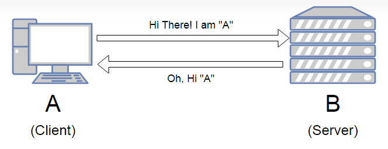
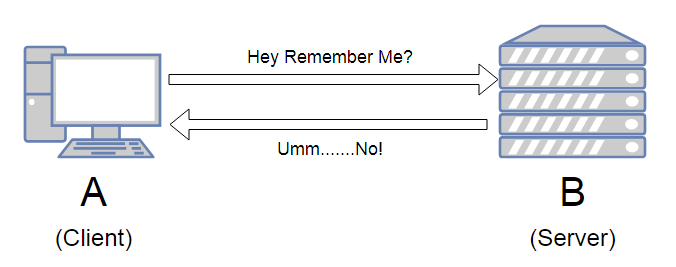
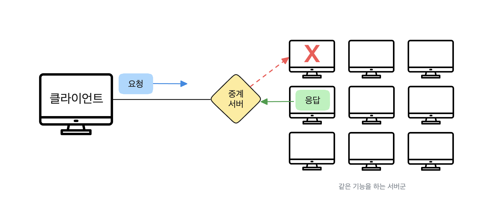
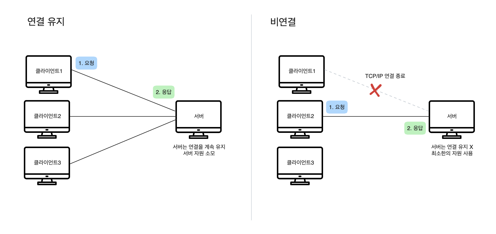
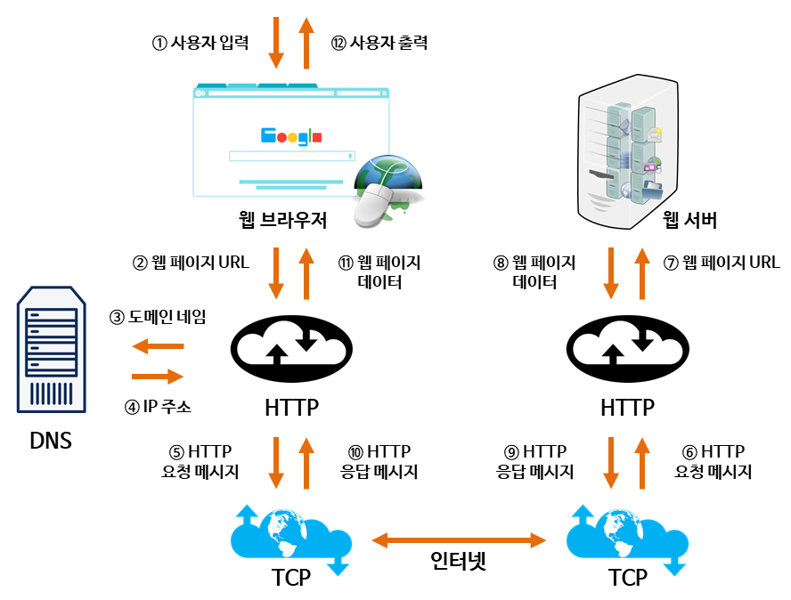

# HTTP

## 목차

- [1. 정의](#1-정의)
- [2. 특징](#2-특징)
  - [2-1. 상태 유지 vs 무상태](#2-1-1-상태-유지stateful)
  - [2-2. 연결 유지 vs 비연결](#2-2-1-연결-유지connection-oriented)
  - [2-3. 지속 연결](#2-3-지속-연결persistent-connection)
- [3. 장점](#3-장점)
- [4. 단점](#4-단점)
- [5. 작동 방식](#5-작동-방식)

## 1. 정의

- HTTP(HyperText Transfer Protocol)
- 웹에서 서버/클라이언트 모델을 따라 데이터를 주고받기 위한 통신 규약
- 네트워크 통신을 작동하게 하는 기본 기술
- 기본 포트 번호 80

## 2. 특징

- 클라이언트 서버 구조
  - 클라이언트가 서버에 요청을 보내고, 서버는 그 요청에 대해 응답을 보내는 방식으로 동작
- 비연결성(Connectionless)
  - 클라이언트와 서버가 연결을 맺고, 클라이언트 요청에 서버가 응답을 마치만 맺었던 연결을 끊어버리는 성질
  - 지속 연결(persistent connection) 옵션이 생겨서 여러 요청을 하나의 TCP 연결로 처리 가능
- 무상태성(Stateless)
  - 서버가 이전의 요청에 대한 상태를 보존하지 않는 성질
  - 매 요청마다 필요한 정보를 클라이언트가 포함해서 보내야 됨
- 텍스트 기반 프로토콜
  - 요청/응답 메시지 구조가 사람이 읽을 수 있고 디버깅이 비교적 쉬움

### 2-1-1. 상태 유지(Stateful)

- 작동 방식
  - 클라이언트가 서버에 요청을 보내면 서버는 클라이언트 상태 정보를 저장
  - 같은 클라이언트로 다시 요청이 오면, 서버는 저장된 상태 정보를 참조하여 요청을 처리
- 장점
  - 연속적인 데이터 처리가 필요한 경우, 문맥을 유지하여 더 빠르고 효율적인 통신 가능
- 단점
  - 서버가 모든 클라이언트 상태를 관리해야 하므로 리소스 소모가 큼
  - 서버 장애 시 상태 정보가 유실될 수 있어 복구가 복잡함
  - 특정 서버에 상태가 종속되어 수평적 확장이 복잡하고 어려움

### 2-1-2. 무상태(Stateless)

- 작동 방식
  - 서버는 클라이언트의 요청에 응답만 할 뿐, 그 상호작용을 기록하지 않음
  - 매번 새로운 클라이언트처럼 취급하기 때문에, 클라이언트는 요청 시마다 필요한 모든 데이터를 전송해야 됨
- 장점
  - 서버의 상태를 관리할 필요가 없어 설계가 단순함
  - 다른 서버가 즉시 요청을 이어받아 처리할 수 있어 장애로부터 자유로움
  - 서버를 자유롭게 늘릴 수 있어 수평적 확장에 용이하여 대규모 트래픽에 대응하기 좋음
- 단점
  - 매 요청마다 필요한 모든 정보를 담아야 하므로 데이터 전송량이 많아질 수 있음
  - 상태 유지가 필요한 경우에는 쿠키, 세션, 토큰 등 별도의 기술 구현이 필요

### 2-2-1. 연결 유지(Connection-Oriented)

- 작동 방식
  - 데이터를 전송하기 전에 송신자와 수신자 사이에 논리적인 통신 경로를 먼저 설정하는 방식
  - 연결이 활성화된 동안 데이터를 주고 받으며 통신이 끝나면 연결을 해제하는 방식
- 장점
  - 데이터가 순서대로 정확하게 전달되는 것을 보장함
  - 데이터가 중간에 유실되면 재전송을 요청하고, 순서가 뒤바뀌면 바로 잡음
- 단점
  - 연결을 설정하고 해제하는 과정 때문에 추가적인 시간과 리소스가 필요

### 2-2-2. 비연결(Connectionless)

- 작동 방식
  - 연결 설정 과정 없이, 송신자가 데이터를 보내고 싶을 때 바로 전송하는 방식
- 장점
  - 연결 설정 과정이 없어 오버헤드가 적고, 데이터를 빠르고 보낼 수 있음
- 단점
  - 데이터 패킷이 전송 중에 손실되거나, 순서가 뒤바뀌어 도착할 수 있음
  - 데이터가 제대로 도착했는지 확인하지 않음

### 2-3. 지속 연결(Persistent Connection)

- 기본 개념
  - HTTP/1.0에서는 요청-응답이 끝나면 TCP 연결을 바로 끊음
  - 지속 연결은 한 번 맺은 TCP 연결을 끊지 않고, 여러 요청과 응답을 같은 연결에서 처리하는 방식
  - HTTP/1.1에서는 모든 연결이 지속 연결로 동작
- 작동 방식
  - 클라이언트가 요청 보낼 때 헤더에 `Connection: keep-alive` 포함 (HTTP/1.0 기준)
  - 이후 같은 TCP 연결을 재사용해서 여러 개의 요청-응답 처리
  - 일정 시간 동안 새로운 요청이 없으면 서버가 연결을 종료
- 장점
  - 여러 번 3-way-handshake를 하지 않아도 되서 오버헤드 감소 및 네트워크 자원 절약
  - 같은 연결에서 연속 요청이 가능하게 되어 웹 페이지의 로딩 속도가 향상됨
- 단점
  - 연결을 오래 유지하면 서버 소켓 리소스를 많이 차지할 수 있음
  - 클라이언트가 요청을 안 보내도 연결이 열려있으면 비효율적일 수 있음

## 3. 장점

- 단순하고 확장 가능함
  - 사람이 읽을 수 있는 메시지 형식을 사용하여 이해하기 쉬움
  - 새로운 헤더나 메서드를 추가하여 기능을 확장하기 용이함
- 서버 부하 감소
  - 비연결성 특징으로 인해 서버는 동시에 많은 클라이언트 요청 처리 가능
  - 서버 자원을 효율적으로 관리할 수 있음
- 유연성
  - HTML 문서 뿐만아니라 이미지, 영상, JSON 등 다양한 형태의 데이터를 전송 가능

## 4. 단점

- 보안에 취약함
  - 통신 내용이 암호화되지 않은 평문으로 전송되기에 중간에서 데이터를 가로채거나 변조할 위험 존재
  - 보안을 위해 HTTPS를 사용해야 됨
- 상태 유지의 어려움
  - 무상태성으로 인해 이전 통신 내용을 기억하지 못하므로, 로그인 상태 유지 같은 기능을 구현하려면 쿠키, 세션, 토큰 같은 추가적인 기술 필요
  - 매 요청마다 인증 정보를 같이 보내야 함
- 연결 오버헤드
  - 비연결성으로 인해 매 요청마다 새로운 연결을 설정하고 해제하는 과정에서 시간과 자원 소모
  - 많은 헤더들이 중복되거나 필요 없는 정보가 포함될 수 있음
  - 대규모나 반복 요청 시 비효율성이 커짐

## 5. 작동 방식

1. 사용자가 웹 브라우저를 통해 찾고 싶은 웹 페이지의 URL 주소를 입력  
2. 브라우저는 사용자가 입력한 URL을 받아 통신을 준비  
3. 사용자가 입력한 URL 주소 중에서 도메인 네임(domain name) 부분을 DNS 서버에서 검색  
4. DNS 서버에서 해당 도메인 네임에 해당하는 IP 주소를 찾아 사용자가 입력한 URL 정보와 함께 전달  
5. 웹 페이지 URL 정보와 전달받은 IP 주소는 HTTP 프로토콜을 사용하여 HTTP 요청 메시지를 생성  
6. HTTP 요청 메시지는 TCP 프로토콜을 사용하여 인터넷을 거쳐 해당 IP 주소의 컴퓨터로 전송  
7. HTTP 요청 메시지는 HTTP 프로토콜을 사용하여 웹 페이지 URL 정보로 변환  
8. 웹 서버는 도착한 웹 페이지 URL 정보에 해당하는 데이터를 검색  
9. 검색된 웹 페이지 데이터는 또 다시 HTTP 프로토콜을 사용하여 HTTP 응답 메시지를 생성  
10. 생성된 HTTP 응답 메시지는 TCP 프로토콜을 사용하여 인터넷을 거쳐 원래 컴퓨터로 전송  
11. 도착한 HTTP 응답 메시지는 HTTP 프로토콜을 사용하여 웹 페이지 데이터로 변환  
12. 변환된 웹 페이지 데이터는 웹 브라우저에 의해 출력되어 사용자가 볼 수 있게 됨  

## 출처

- https://co-natus.tistory.com/entry/HTTP-Stateless-Connectionless#google_vignette
- https://inpa.tistory.com/entry/HTTP-%F0%9F%8C%90-%EB%B0%B1%EC%97%94%EB%93%9C-%EB%A1%9C%EB%93%9C%EB%A7%B5-HTTP%EB%8A%94-%EB%AC%B4%EC%97%87%EC%9D%BC%EA%B9%8C%EC%9A%94#http%EC%9D%98_%ED%86%B5%EC%8B%A0_%EA%B5%AC%EC%A1%B0
- https://hanamon.kr/%EB%84%A4%ED%8A%B8%EC%9B%8C%ED%81%AC-http-http%EB%9E%80-%ED%8A%B9%EC%A7%95-%EB%AC%B4%EC%83%81%ED%83%9C-%EB%B9%84%EC%97%B0%EA%B2%B0%EC%84%B1/
- http://tcpschool.com/webbasic/works
