# TCP/IP 4계층

## TCP/IP 4계층 개요

TCP/IP 4계층은 인터넷에서 실제로 사용되는 표준 네트워크 모델로, OSI 7계층을 단순화한 구조입니다.  

이 모델을 이해하면 데이터가 어떻게 만들어지고 전송되는지를 큰 그림에서 파악할 수 있습니다.  

이 문서에서는 **각 계층이 맡은 역할**, 데이터가 **캡슐화/역캡슐화**되는 과정, 그리고 **OSI 7계층과의 차이**까지 차근차근 설명하겠습니다.  

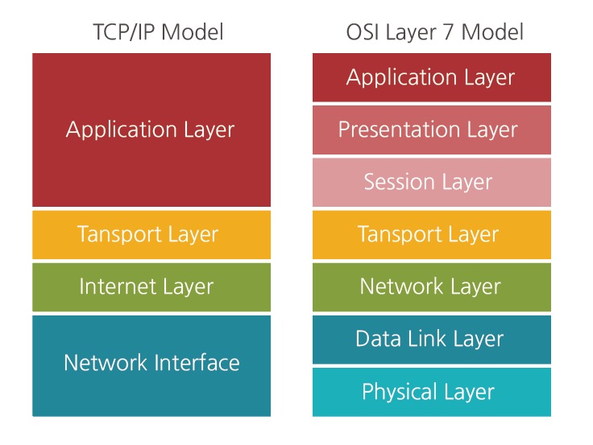

---

## 왜 계층인가?

본격적으로 각 계층을 알아보기 전에, 왜 굳이 통신 과정을 여러 계층으로 나누는지 이해할 필요가 있습니다.  

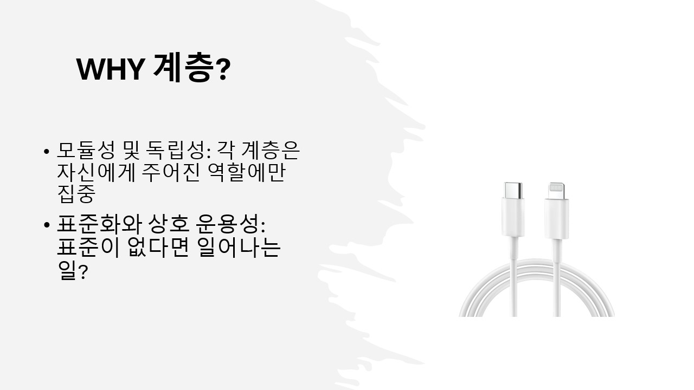

- **모듈성 및 독립성**  
  각 계층은 자신에게 주어진 역할에만 집중합니다.  
  예를 들어, 웹 개발자는 HTTP(애플리케이션 계층)만 신경 쓰면 되지, 데이터가 Wi-Fi를 통해 전달되는지, 광케이블을 통해 전달되는지(물리 계층) 걱정할 필요가 없습니다.  
  이렇게 계층별로 독립성이 보장되면 특정 계층의 기술이 바뀌더라도 전체 시스템에 미치는 영향이 적어집니다.  

- **표준화와 상호 운용성**  
  네트워크 같은 중요한 기술에 표준이 없다면 본인이 표준을 만들겠다고(애플 8핀 같은...) 온갖 표준들이 난립할 것입니다.  
  다행히 전 세계 모든 제조사가 이 계층 모델이라는 표준을 따르기 때문에, 삼성 스마트폰에서 보낸 메시지가 애플 서버를 거쳐 LG 노트북으로 아무 문제 없이 전달될 수 있는 것입니다.  

---

## 애플리케이션 계층 (Application Layer)

우리가 쓰는 프로그램의 계층입니다.  

웹브라우저가 저 멀리 있는 서버에게 데이터를 보낸다고 가정하고 시작합시다.  

HTTP 요청을 보내면 OS를 통해 소켓을 열어서 전송 계층으로 보내게 될 것입니다.  

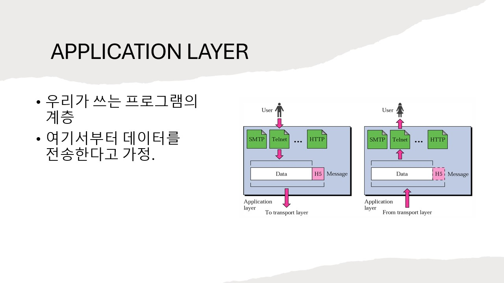

---

## 전송 계층 (Transport Layer)

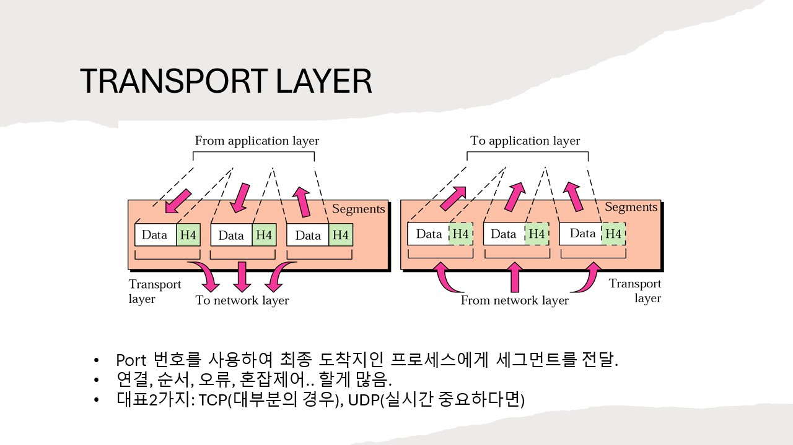

애플리케이션 계층에서 만들어진 데이터는 이제 '어떻게' 보낼지 결정해야 합니다.  

전송 계층은 데이터가 안정적으로, 빠짐없이 목적지 애플리케이션까지 전달되도록 책임지는 중요한 역할을 합니다.  

이 계층을 대표하는 프로토콜이 TCP와 UDP입니다.  

- **주요 역할**  
  출발지(Source)와 목적지(Destination)의 프로세스(Port) 간의 연결을 설정합니다.  
  데이터가 순서에 맞고, 오류 없이 전달되도록 제어합니다.  
  데이터를 적절한 크기로 나누는 **분할(Segmentation)** 역할도 수행합니다.  

- **데이터 단위**: 세그먼트 (Segment)  

- **대표적인 프로토콜**  
  - **TCP (Transmission Control Protocol)**  
    신뢰성을 최우선으로 하는 프로토콜입니다.  
    데이터를 보내기 전에 상대방과 '3-way handshake'라는 과정을 통해 연결을 설정합니다.  
    데이터를 보낸 후에는 잘 받았는지 확인(ACK)합니다.  
    데이터가 중간에 유실되면 재전송을 요청하고, 순서가 뒤바뀌면 바로잡아 줍니다.  
    HTTP, FTP, SMTP 등 신뢰성이 중요한 대부분의 애플리케이션이 TCP를 사용합니다.  

  - **UDP (User Datagram Protocol)**  
    속도를 최우선으로 하는 프로토콜입니다.  
    TCP와 같은 복잡한 연결 설정이나 확인 절차 없이, 데이터를 그냥 '보내기만' 합니다.  
    그래서 '비연결성' 프로토콜이라고 부릅니다.  
    데이터가 중간에 사라지거나, 순서가 바뀌어도 책임지지 않습니다.  
    실시간 영상 스트리밍(유튜브), 온라인 게임, 인터넷 전화(VoIP) 등 약간의 데이터 손실이 있더라도 빠른 전송이 더 중요한 서비스에 사용됩니다.  

> 유튜브가 UDP를 쓰나요?  
> 이건 자료마다 내용이 달랐습니다.  
> 영상은 화질이 좀 깨지더라도 UDP를 쓴다더라 → 이제 대역폭이 늘어서 TCP를 쓴다더라 → 구글은 UDP 기반으로 구글만의 프로토콜을 따로 구현해서 쓴다 등...  
> 구글이 또 어떻게 변할지 모르니 참고만 하시길 바랍니다.  

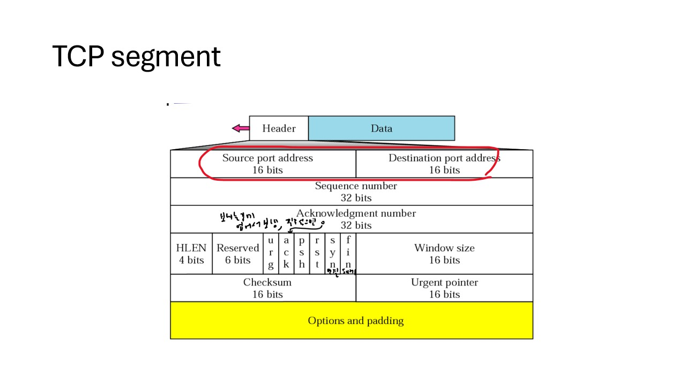

예시로 TCP 헤더 그림입니다. 포트가 들어간다는 것을 볼 수 있습니다.  

---

## 인터넷 계층 (Internet Layer)

인터넷 계층의 핵심 임무는 수많은 네트워크를 거쳐 최적의 경로를 찾아내고(Routing), 데이터가 정확한 목적지 컴퓨터까지 도달하도록 만드는 것입니다.  

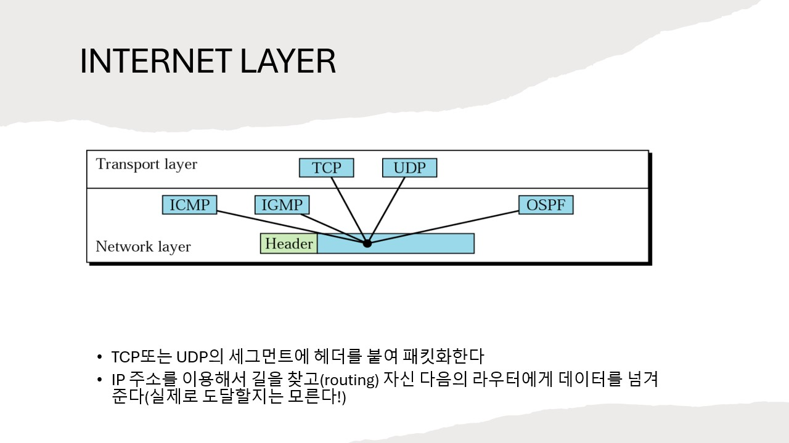

- **주요 역할**  
  데이터를 **패킷(Packet)** 이라는 단위로 만들고, 각 패킷에 출발지 및 목적지의 논리적 주소인 IP 주소를 붙입니다.  
  그리고 이 IP 주소를 보고 수많은 네트워크 경로 중 가장 효율적인 길을 찾아 데이터를 전송합니다.  
  실제로 도달하지는 못합니다!  
  도착하지 않으면 UDP는 그냥 내버려 둘 것이고(혹은 그 위 Application 계층을 통해 다시 보낼 수도 있고), TCP는 다시 전송할 것이니 여기서는 그냥 라우터에 전달만 합시다.  

- **데이터 단위**: 패킷 (Packet)  

- **대표적인 프로토콜**  
  - **IP (Internet Protocol)**  
    인터넷 계층의 핵심으로, 데이터에 IP 주소를 부여하고 경로를 설정하는 역할을 합니다.  
    하지만 데이터의 전송 자체를 보장하지는 않기 때문에, 신뢰성은 바로 위 전송 계층의 TCP가 담당합니다.  
    (현재 주로 IPv4를 사용하며, 주소 고갈 문제로 IPv6로 전환되고 있습니다.)  

  - **ICMP (Internet Control Message Protocol)**  
    네트워크 통신 중 발생하는 오류(예: 목적지에 도달할 수 없음)를 보고하거나, 네트워크 상태를 진단하는 데 사용됩니다.  
    우리가 흔히 사용하는 ping 명령어가 바로 ICMP를 이용한 것입니다.  

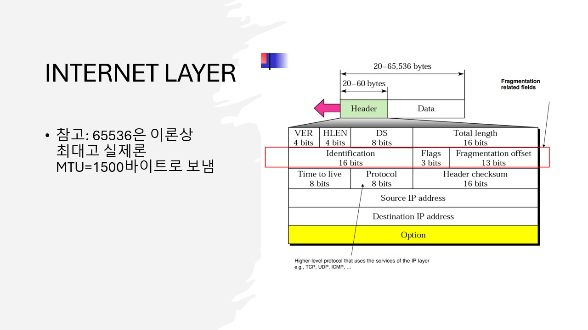

예시로 패킷에 붙는 헤더 그림입니다. IP 주소가 포함된 것을 볼 수 있습니다.  

---

## 네트워크 인터페이스 계층 (Network Interface Layer)

마지막으로, 컴퓨터 안의 논리적인 데이터가 실제로 네트워크를 통해 이동할 수 있는 물리적인 신호로 바뀌는 단계입니다.  

이 계층은 실제 하드웨어와 가장 밀접하게 관련되어 있습니다.  

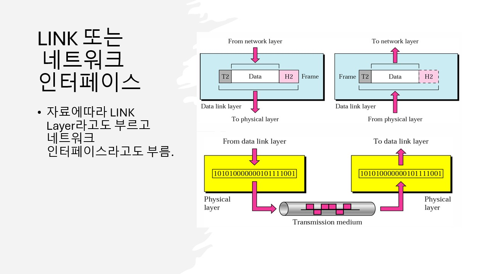

이 계층은 **Physical Layer**와 **Data Link Layer**를 합친 계층입니다.  
Link layer라고도 부릅니다.  

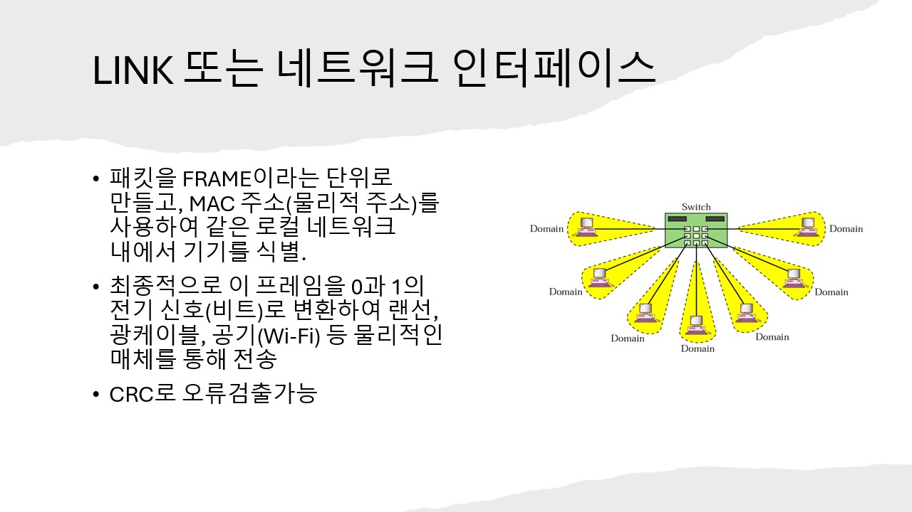

- **주요 역할**  
  IP 패킷을 **프레임(Frame)** 이라는 단위로 만들고, **MAC 주소(물리적 주소)** 를 사용하여 같은 로컬 네트워크 내에서 기기를 식별합니다.  
  최종적으로 이 프레임을 0과 1의 전기 신호(비트)로 변환하여 랜선, 광케이블, 공기(Wi-Fi) 등 물리적인 매체를 통해 전송합니다.  

- **데이터 단위**: 프레임 (Frame)  

- **대표적인 프로토콜/기술**  
  - Ethernet: 우리가 흔히 사용하는 유선 랜(LAN) 환경의 표준 기술  
  - Wi-Fi: 무선 네트워크 환경의 표준 기술  
  - MAC 주소: 네트워크 카드(NIC)마다 부여된 고유한 하드웨어 주소  

---

## 캡슐화, 역캡슐화

캡슐화는 애플리케이션의 데이터가 하위 계층으로 내려가면서 각 계층의 규칙에 맞는 헤더 정보가 덧씌워지는 과정입니다.  

그림처럼 데이터가 계층을 내려갈 때마다 헤더가 계속 붙습니다.  

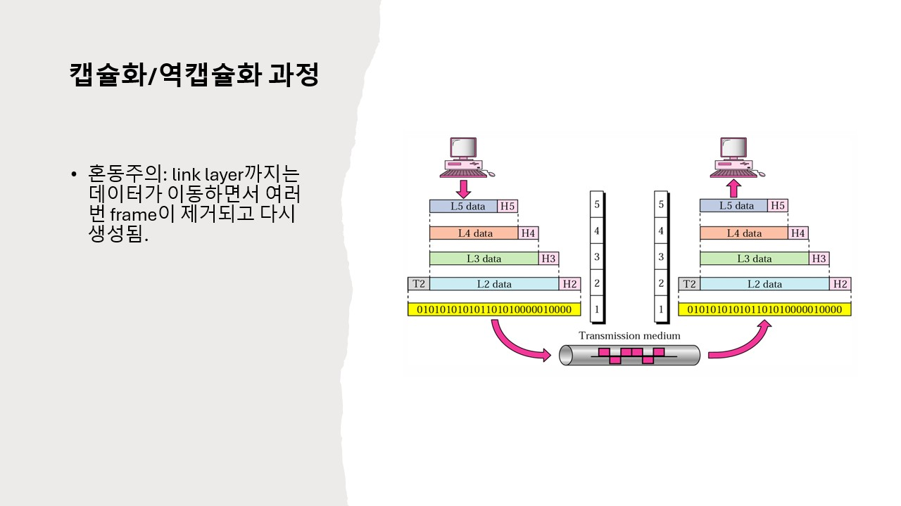

역캡슐화는 반대로, 데이터를 수신한 컴퓨터가 하위 계층부터 상위 계층으로 데이터를 올리면서 각 계층의 헤더를 하나씩 제거하고 원본 데이터를 찾아내는 과정입니다.  

그림처럼 데이터가 계층을 올라갈 때마다 헤더가 제거됩니다.  

이런 그림이 대부분 그림 하나에 그려져서 혼동이 있을 수 있는데,  
네트워크, 프레임 헤더는 제거와 생성이 반복됩니다.  
거쳐가는 라우터는 여러 개니까요.  

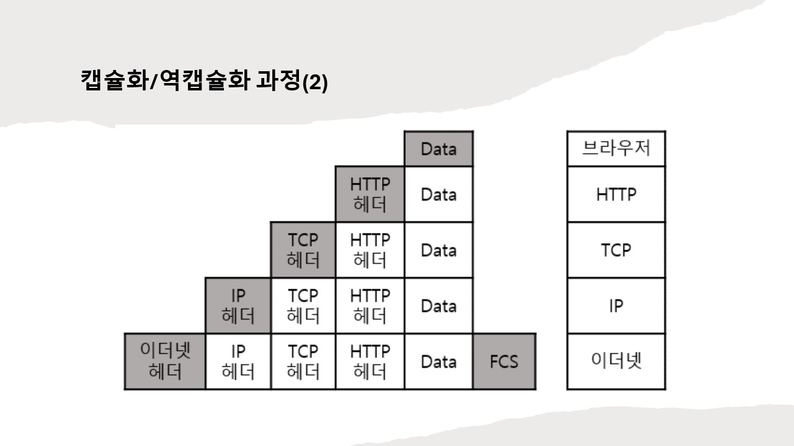

---

## OSI 7 계층과의 차이?

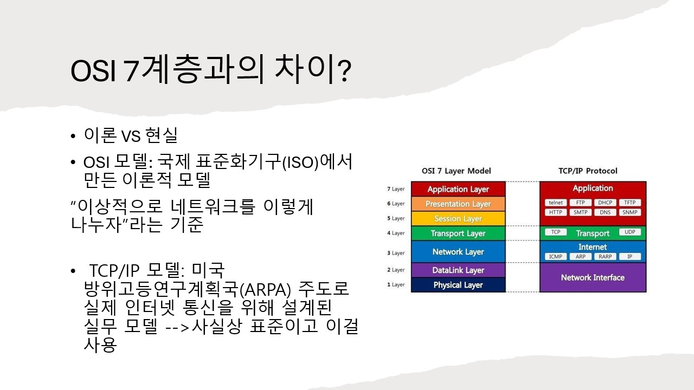

- **OSI 모델**  
  국제 표준화기구(ISO)에서 만든 이론적 모델  
  “이상적으로 네트워크를 이렇게 나누자”라는 기준  

- **TCP/IP 모델**  
  미국 방위고등연구계획국(ARPA) 주도로 실제 인터넷 통신을 위해 설계된 실무 모델 (사실상 표준)  

→ OSI 7계층은 개념적인 모델일 뿐 실제로는 TCP/IP 4계층을 씁니다.  
