# 오류 제어

<br>

## 목차
- [오류 제어](#오류-제어)
  - [목차](#목차)
  - [정의 및 필요성](#정의-및-필요성)
    - [정의](#정의)
    - [필요성](#필요성)
  - [오류 감지 기법](#오류-감지-기법)
    - [Checksum](#checksum)
    - [Sequence Number](#sequence-number)
    - [ACK Timeout](#ack-timeout)
    - [중복 ACK](#중복-ack)
  - [오류 복구 기법](#오류-복구-기법)
    - [**1. ARQ (Automatic Repeat reQuest) 기반 기법**](#1-arq-automatic-repeat-request-기반-기법)
    - [**2. Timeout-based Retransmission (타임아웃 기반 재전송)**](#2-timeout-based-retransmission-타임아웃-기반-재전송)
    - [**3. 중복 ACK 기반 Fast Retransmit (빠른 재전송)**](#3-중복-ack-기반-fast-retransmit-빠른-재전송)
    - [**4. Selective Acknowledgment (SACK)**](#4-selective-acknowledgment-sack)

<br>

## 정의 및 필요성

### 정의

데이터 전송 중 발생할 수 있는 아래의 오류 검출 및 복구하는 메커니즘

데이터가 송신자가 보낸 그대로 수신자에게 정확히 전달되게 보장하는 메커니즘

TCP는 신뢰성 있는 전송 제공하기 위해 오류 제어 수행

TCP는 크게 **오류 감지**와 **오류 복구** 두 단계로 나누어 오류를 제어

<br>

**발생 가능 오류**

- **데이터 손실**
    - 원인: 네트워크 혼잡, 라우터 버퍼 오버플로우, 물리적 전송 오류
    - 결과: 패킷이 목적지에 도달하지 못함
- **데이터 중복**
    - 원인: 네트워크 장비 오류, 재전송 메커니즘 오동작
    - 결과: 같은 패킷이 여러 번 도착
- **데이터 손상**
    - 원인: 전송 매체의 노이즈, 전자기 간섭
    - 결과: 패킷은 도착하지만 내용이 변경됨
- **데이터 순서 뒤바뀜**
    - 원인: 서로 다른 경로로 전송, 네트워크 지연 차이
    - 결과: 패킷이 전송 순서와 다르게 도착

<br>

### 필요성

TCP는 신뢰성 없는 IP서비스 위에서 동작

IP는 패킷을 전송할 때 최선을 다하지만 패킷의 전달, 순서, 내용의 무결성 보장 X

<br>

데이터를 주고받는 과정에서 네트워크는 오류가 당연히 발생

수많은 라우터를 거치고 다양한 물리적 매체를 통과하면서 위와 같은 문제가 발생

문제들로부터 데이터 보호하고 애플리케이션 계층에 신뢰성 있는 서비스 제공하는 것이 전송 계층 핵심 역할

<br>

데이터링크 계층에서도 오류 제어를 수행

하지만 이는 인접한 노드(라우터 등) 간의 통신에 한정됨

라우터 내부에서 데이터가 손상될 수도 있음

최종 송신자와 수신자 간의 end-to-end 오류 제어는 전송 계층에서 담당해야 함

<br>

## 오류 감지 기법

### Checksum

데이터가 원본 그대로 변경되지 않았음을 확인하기 위한 값

데이터 손상만 감지할 수 있고 데이터 손실, 데이터 중복, 데이터 순서 바뀐 문제는 감지할 수 없

<br>

**동작 방식**

체크섬의 동작은 송신 측과 수신 측에서 각각 이루어짐

<br>

**1. 송신 측 (데이터를 보낼 때)**

- TCP 헤더와 데이터를 포함한 전체 세그먼트를 16비트 단위로 나눔
- 이 16비트 워드(word)들을 모두 더함 (1의 보수 덧셈 사용)
- 더한 값에 다시 1의 보수(모든 비트를 뒤집음)를 취하여 **체크섬 값**을 계산
- 계산된 체크섬 값을 TCP 헤더의 체크섬 필드에 넣어서 함께 전송

<br>

**2. 수신 측 (데이터를 받았을 때)**

- 수신한 세그먼트 전체와 헤더에 포함된 체크섬 값까지 포함하여 16비트 단위로 모두 더함
- **만약 전송 중 오류가 없었다면**, 이 합계는 모든 비트가 1이 됨 (`1111 1111 1111 1111`)
- 만약 계산 결과가 모든 비트가 1이 아니라면, 수신 측은 데이터가 오는 도중에 변질되었다고 판단

<br>

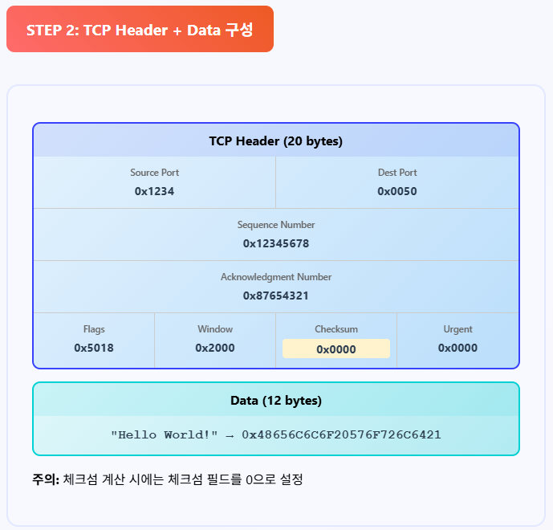

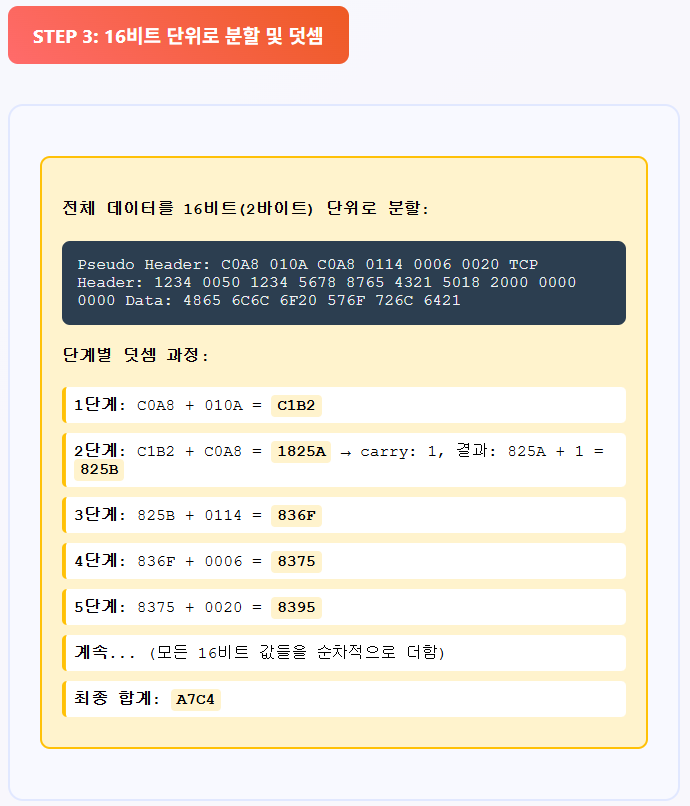

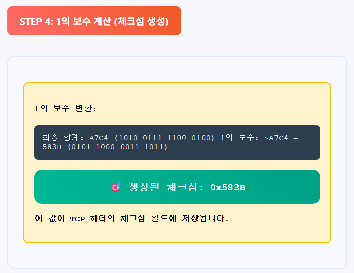

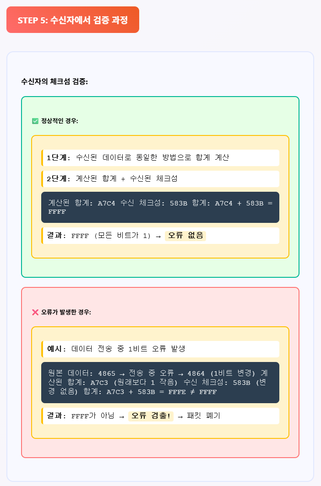

<br>

**Checksum으로 오류가 감지되면?**

체크섬 계산을 통해 데이터 손상이 감지되면, 수신 측은 해당 TCP 세그먼트를 아무런 응답 없이 그냥 폐기

그러면 송신 측에서는 해당 세그먼트에 대한 ACK를 받지 못하게 됨

결국 타임아웃이 발생하여 문제가 있었던 세그먼트를 재전송 

이것이 TCP의 오류 감지와 복구가 연계되는 방식

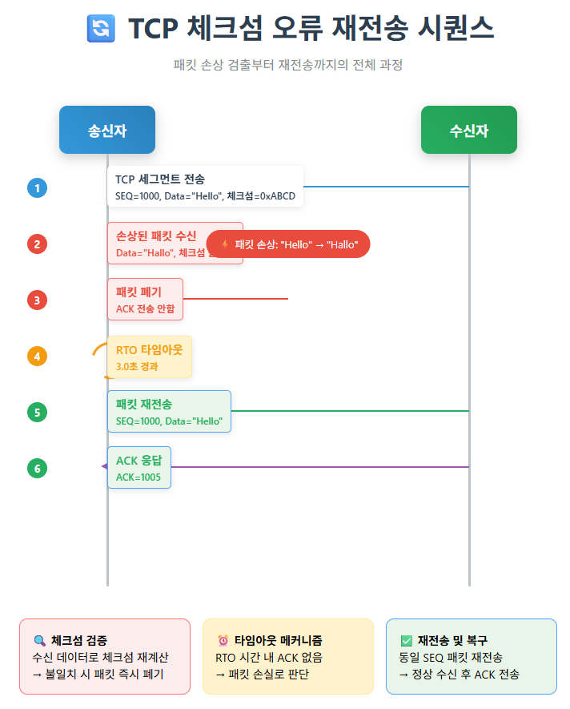

<br>

**특징**

- 링크 계층이 CRC로 검사해도, 구간에 따라 오류 검사가 없을 수 있음
- 또 라우터 메모리에서 오류가 날 수 있어, TCP의 종단 간 체크섬이 필요
- 전송 중 비트가 뒤집히는 오류 및 단일 비트 오류를 잘 검출
- 하지만 일부 복잡한 오류(예: 두 비트가 동시에 바뀌어 합계가 같아지는 경우)는 잡아내지 못할 수도 있음

<br>

### Sequence Number

TCP는 전송하는 데이터의 각 바이트에 **순서 번호**를 부여

이 번호는 데이터의 논리적인 순서를 나타냄

수신 측은 이 순서 번호를 기반으로 패킷의 정상 수신 여부와 순서를 판단

- **순서 검출**: 패킷이 올바른 순서로 도착했는지 확인
- **중복 검출**: 동일한 패킷이 중복 수신되었는지 확인
- **누락 검출**: 중간에 빠진 패킷이 있는지 확인

패킷의 손실이나 순서 뒤바뀜을 감지

이로 인해 발생할 수 있는 오류 상황을 파악하는 데 결정적인 역할

<br>

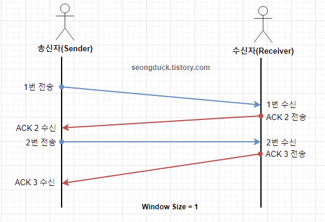

<br>

**송신 측 조치**

누락 검출 시

- 수신자는 자신이 마지막으로 성공적으로 받은 패킷의 다음 번호에 대한 ACK 계속해서 송신자에게 보냄
    - 즉 받지 못한, 문제 되는 번호의 ACK를 보내는 것
- 송신자는 이 중복 ACK를 받거나 타임아웃이 발생하면, 누락된 패킷을 **재전송**
    - 받은 문제 되는 번호의 패킷을 재전송하는 것

<br>

순서 검출 시

- 수신자는 먼저 온 번호의 패킷을 임시 버퍼에 저장해둠
- 계속해서 오지 않은 이전 번호 패킷에 대한 ACK를 보냄
- 이전 번호 패킷이 도착하면 순서대로 데이터를 상위 계층에 전달

<br>

중복 검출 시

- 수신 측은 도착한 패킷의 시퀀스 번호를 확인
- 수신 측은 현재 수신 버퍼에 있는 데이터의 시퀀스 번호와 비교
- 시퀀스 번호가 이미 받은 데이터 범위에 속한다면 이 패킷은 중복된 패킷으로 판단되어 즉시 폐기
- 수신자는 아직 받지 못한 가장 작은 순서 번호에 대한 ACK를 송신자에게 다시 보냄

<br>

**순서번호 동작 원리**

- 정상적인 순서 전송
    
    ```
    송신자: SEQ=100, 데이터=50바이트 → 다음 SEQ=150
    송신자: SEQ=150, 데이터=30바이트 → 다음 SEQ=180
    송신자: SEQ=180, 데이터=20바이트 → 다음 SEQ=200
    
    수신자 기대 순서: 100 → 150 → 180 → 200
    ```
    

- 순서가 바뀐 경우 검출
    
    ```
    송신: [SEQ=100][SEQ=150][SEQ=180]
    수신: [SEQ=100][SEQ=180][SEQ=150] ← 순서 바뀜 검출
    
    수신자 동작:
    - SEQ=100 받음 → 다음 기대: 150
    - SEQ=180 받음 → 150이 아니므로 버퍼에 저장, ACK=150 전송
    - SEQ=150 받음 → 순서 맞음, 버퍼 데이터와 함께 처리
    ```
    

- 중복 패킷 검출
    
    ```
    시나리오: 재전송으로 인한 중복 수신
    
    송신자: [SEQ=100] 전송 → ACK 없음 → [SEQ=100] 재전송
    수신자: 첫 번째 [SEQ=100] 처리 → ACK=150 전송
            두 번째 [SEQ=100] 수신 → 중복으로 판단하여 폐기
    ```
    

- 패킷 누락 검출
    
    ```
    송신: [SEQ=100][SEQ=150][SEQ=180]
    수신: [SEQ=100][ 손실 ][SEQ=180]
    
    수신자 상태:
    - SEQ=100 받음 → 다음 기대: 150
    - SEQ=180 받음 → 150이 누락됨을 감지
    - ACK=150을 계속 전송 (누락된 데이터 요청)
    ```
    
<br>

### ACK Timeout

타임아웃의 개념

- **목적**: **패킷 손실** 간접적으로 검출
- **원리**: 일정 시간 내에 ACK가 오지 않으면 손실로 판단해 재전송
- **타이머**: RTO (Retransmission Timeout) 사용

<br>

타임아웃 기반 손실 검출

송신자 동작:

1. 패킷 전송 시 타이머 시작

2. RTO 시간 내에 ACK 수신 → 타이머 중지

3. RTO 시간 초과 → 패킷 손실로 판단

4. 패킷 재전송 및 RTO 값 증가 

<br>

타임아웃의 문제점

- **느린 검출**: RTO 시간만큼 기다려야 함
- **불필요한 재전송**: 패킷이 지연되었을 뿐인데 재전송할 수 있음
- **성능 저하**: 타임아웃 발생 시 전송 속도 급격히 감소

<br>

### 중복 ACK

중복 ACK의 개념

- **목적**: 타임아웃보다 빠른 패킷 손실 검출
- **원리**: 동일한 ACK 번호를 여러 번 받으면 패킷 손실 의심
- **기준**: 보통 3개의 중복 ACK로 손실 판단

<br>

중복 ACK 3회 오면 패킷 손실로 판정

타임아웃 전에 즉시 재전송함

빠른 재전송(Fast Retransmit)의 트리거

<br>

아래 그림에서 SEQ 150이 손실됨

이후에 순서가 맞지 않은 패킷들 수신자 버퍼에 임시 저장

그러면서 SEQ 150 달라고 계속 ACK 150 송신자에게 전송

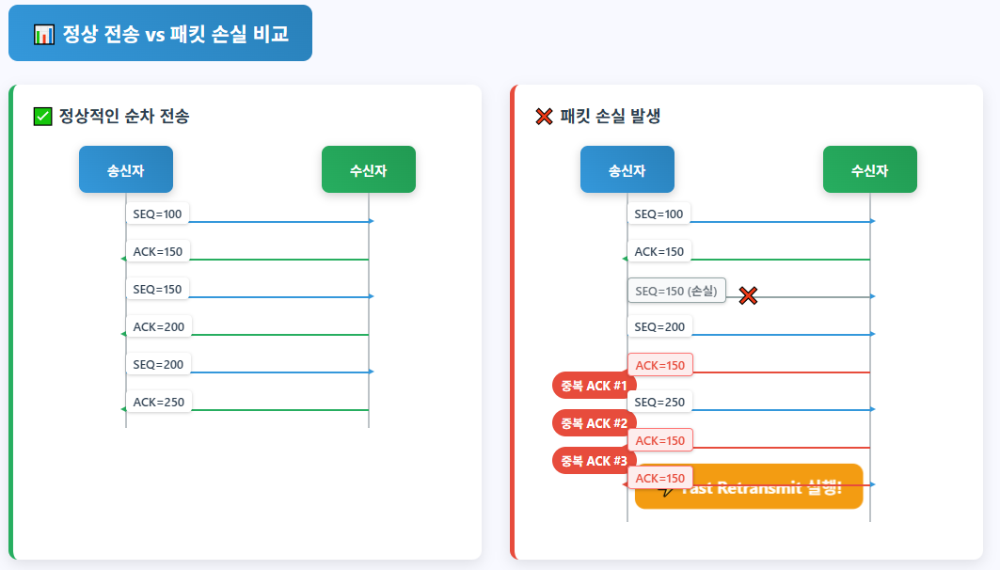

<br>

## 오류 복구 기법

### **1. ARQ (Automatic Repeat reQuest) 기반 기법**

- 확인응답 (ACK) + 재전송 방식의 기본 메커니즘
- 오류나 손실 발생 시 자동으로 재전송 수행

<br>

**Stop And Wait ARQ**

ACK가 오지 않으면 타임아웃 후 재전송

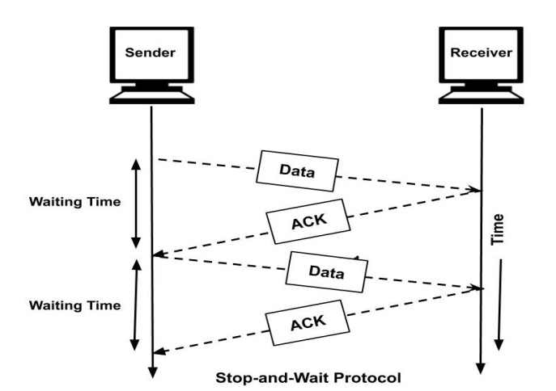

<br>

**Go-Back-N ARQ**

중간에 특정 패킷에서 오류가 발생하거나 손실되면? 

오류가 발생한 그 패킷부터 그 이후에 보낸 모든 패킷을 재전송

잘 도착한 패킷까지도 재전송해야 하므로 비효율적

TCP는 이를 완화하기 위해 SACK를 사용

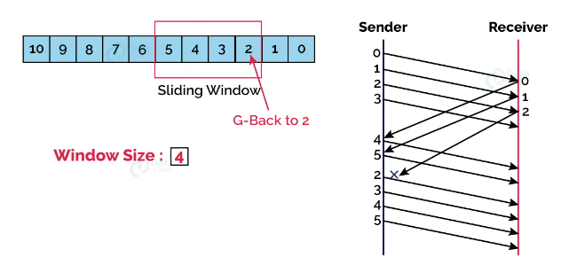

<br>

**Selective Repeat ARQ**

특정 패킷에서만 오류가 발생하거나 손실되면?

수신자는 정확히 그 손실된 패킷만 송신자에게 알려줌

송신자는 그 손실된 패킷만 선택적으로 재전송 

잘 도착한 패킷은 다시 보내지 않음

SACK 옵션이 이 아이디어 직접 구현한 것

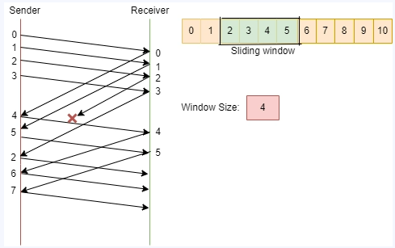

Go-Back-N ARQ, Selective Repeat ARQ는 슬라이딩 윈도우 메커니즘 사용하는 대표적인 오류 제어 기법

<br>

### **2. Timeout-based Retransmission (타임아웃 기반 재전송)**

- 가장 기본적인 오류 복구 메커니즘
- 모든 패킷 손실 상황에 대한 최후의 복구 수단
- RTO(Retransmission Timeout) 초과 시 재전송
- 원리
    - 송신자는 데이터를 보낸 후, 해당 데이터에 대한 ACK 기다리기 위해 타이머 작동
    - 만약 설정된 타임아웃 내에 ACK가 도착하지 않으면?
        - 송신자는 데이터 또는 ACK가 네트워크에서 손실되었다고 판단
        - 이 경우, 송신자는 가지고 있던 해당 데이터를 재전송함
- 특징
    - 네트워크 지연이 심해 ACK가 늦게 도착하는 경우에도 작동
    - 따라서 때로는 불필요한 재전송을 유발
    - 타임아웃 값(RTO)은 네트워크의 왕복 시간(RTT)을 측정하여 동적으로 조절

<br>

### **3. 중복 ACK 기반 Fast Retransmit (빠른 재전송)**

- 3개의 중복 ACK 감지 시 즉시 재전송
- 타임아웃 대기 없이 빠른 복구
- 타임아웃 재전송의 지연 문제를 보완하기 위한 기법
- **원리**:
    - 송신자가 패킷을 보냈는데, 그 패킷에 대한 알맞은 ACK가 오지 않음
    - 동일한 ACK가 3번 연속으로 중복해서 도착하는 경우를 감지
    - 이러한 중복 ACK는 특정 패킷이 손실되었을 가능성이 매우 높다는 의미
    - 타임아웃 기다리지 않고, 3번째 중복 ACK를 받자마자 손실된 것으로 추정되는 패킷 즉시 재전송
- **특징**:
    - 빠른 재전송을 통해 복구 시간을 단축하고 효율성을 높임
    - 불필요한 타임아웃 지연을 피할 수 있음

<br>

### **4. Selective Acknowledgment (SACK)**

- 수신한 바이트 범위를 명시해 송신자가 실제로 빠진 구간만 골라 재전송하게 함
- 윈도우 내 다중 손실에서도 효율적인 복구가 가능
- 누적 ACK 방식의 한계를 보완
- 불필요한 재전송 최소화해 재전송 효율을 극대화하는 기법
- **원리**:
    - 일반적인 TCP ACK는 '여기까지는 모든 데이터가 순서대로 잘 도착했다'는 **누적 ACK** 방식
    - 만약 중간에 한 패킷이 손실되면, 그 뒤에 오는 패킷들은 잘 받았어도 계속 손실된 패킷의 ACK 보냄
    - **SACK**는 아래 2개 정보 송신자에게 알려줌
        - 수신자가 누락된 패킷 정보 (by 누적 ACK)
        - 수신자가 '성공적으로 받은 불연속적인 블록'의 정보
    - **예시**:
        - 패킷 1, 2, **(3번 손실)**, 4, 5번이 도착
        - 수신자는 "2번까지는 OK! (누적 ACK 3번)"
        - 추가로 "4번부터 5번까지도 받았습니다!"라고 SACK 옵션을 통해 알려줌
- **특징**:
    - 송신자는 SACK 정보를 통해 손실된 특정 패킷만 재전송하면 됨
    - 불필요한 재전송을 줄이고 네트워크 대역폭을 효율적으로 사용 가능
    - 특히 여러 개의 패킷이 연속적으로 손실되는 경우(Burst Loss)에 더욱 효과적

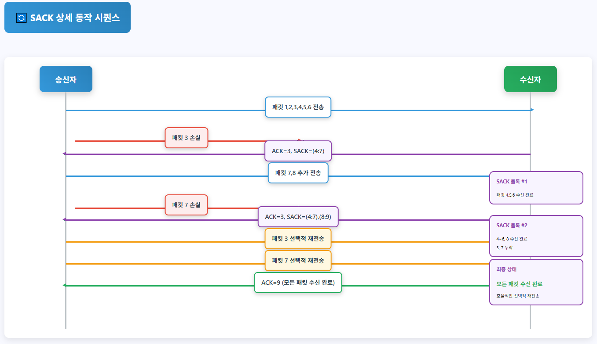
