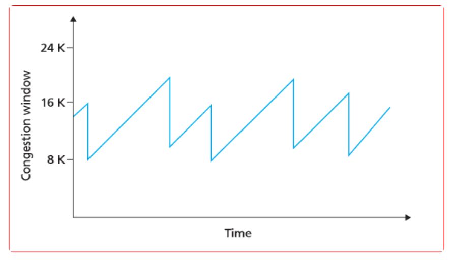
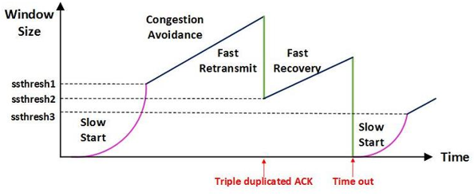

# 혼잡 제어

 

## 목차
- [혼잡 제어](#혼잡-제어)
  - [목차](#목차)
  - [정의 및 필요성](#정의-및-필요성)
    - [정의](#정의)
    - [필요성](#필요성)
  - [혼잡 제어 알고리즘 구성 요소](#혼잡-제어-알고리즘-구성-요소)
    - [핵심 원칙 : AIMD **(Additive Increase, Multiplicative Decrease)**](#핵심-원칙--aimd-additive-increase-multiplicative-decrease)
    - [혼잡 제어 4단계](#혼잡-제어-4단계)
    - [1단계 : slow start](#1단계--slow-start)
    - [2단계 : congestion avoidance](#2단계--congestion-avoidance)
    - [3단계 : fast retransmit](#3단계--fast-retransmit)
    - [4단계 : fast recovery](#4단계--fast-recovery)
  - [혼잡 제어 알고리즘 종류](#혼잡-제어-알고리즘-종류)

 

## 정의 및 필요성

### 정의

송신자의 전송 속도와 네트워크의 처리속도 차이로 인한 문제를 해결하기 위한 기능

 

네트워크 상에서 트래픽이 몰려 송신 측에서 일정 시간 내에 응답 패킷 받지 못했다면 패킷 재전송

이는 결국 네트워크 혼잡 가중시키고, 송신 측 컴퓨터 리소스 낭비

네트워크 전체의 혼잡을 완화하고 방지

 

네트워크 경로의 혼잡 상태에 맞춰 송신 속도를 자동으로 동적으로 조절 

네트워크의 성능 저하를 막고 네트워크 자원 효율적으로 사용되도록 하는 것

TCP는 단순히 송신자와 수신자 간의 관계(흐름 제어)만 보는게 아니라 중간 네트워크 수용 능력까지 고려함

 

네트워크에 데이터 너무 많이 흘러들어가 네트워크 내부 자원 부족으로 인해 발생할 수 있는 혼잡 현상 예방

발생할 수 있는 혼잡 현상

- 라우터 버퍼 오버플로우
- 지연 폭증
- 패킷 손실

 

이는 TCP의 전송 효율성과 안정성을 보장하는 핵심적인 기능

 

흐름 제어는 서버와 클라이언트 사이에서 송수신되는 패킷의 수를 제어

혼잡 제어는 네트워크 중간에 라우터 등 통신 장비가 처리할 수 있는 패킷의 수를 조절

 

### 필요성

- **네트워크 자원의 한계**:
    - 인터넷은 공유 자원
    - 대역폭, 라우터의 처리 능력, 버퍼 공간 등은 무한하지 않음
    - 동시에 너무 많은 사용자가 데이터를 전송하면, 라우터나 스위치 같은 중간 장비의 버퍼 가득 차게 됨
    - 라우더 버퍼 오버플로우로 패킷 손실 증가
- **성능 저하 및 붕괴 (Congestion Collapse) 방지**:
    - 라우터 버퍼가 가득 차면, 새로 도착하는 패킷은 강제로 폐기됨
    - 패킷이 폐기되면 송신자는 이를 손실로 인지하고 **재전송**하게 됨
    - 재전송된 패킷은 이미 혼잡한 네트워크에 더 많은 부하 가중시켜 혼잡 더욱 심화시키는 악순환 만듬
    - 이러한 악순환이 심해지면, 결국 네트워크는 패킷 폐기와 재전송으로만 가득 차게 됨
    - 실질적인 데이터 전송량은 0에 수렴하는 '혼잡 붕괴' 현상이 발생할 수 있습니다.
- **공정성  확보**:
    - 혼잡 제어가 없다면, 더 많은 대역폭을 점유하려고 시도하는 송신자가 네트워크를 독점 가능
    - 혼잡 제어는 모든 TCP 연결이 네트워크 자원을 비교적 공평하게 사용할 수 있도록 조절
- **효율성 증대**:
    - 적절한 혼잡 제어는 네트워크 자원을 최적으로 활용
    - 전송 지연을 줄이고 전체적인 데이터 처리량을 높일 수 있음
    - 데이터가 안정적이고 예측 가능하게 전달

 

## 혼잡 제어 알고리즘 구성 요소

### 핵심 원칙 : AIMD **(Additive Increase, Multiplicative Decrease)**

**개념**

- TCP 혼잡 제어의 가장 기본이 되는 원칙이자 전략
- 네트워크 용량을 탐색하고 혼잡을 완화하는 방법
- 네트워크의 혼잡 상태에 따라 송신자가 데이터 전송률을 어떻게 조절할 것인지에 대한 핵심적인 전략
- 대부분의 TCP 혼잡 제어 알고리즘은 이 AIMD 원칙을 따름

 

**장점**

- 혼잡을 효과적으로 피하고 네트워크 용량을 효율적으로 사용함
- 여러 TCP 연결 간의 공정성을 확보하는 데 기여
    - 각 연결이 각자의 cwnd 가지고 통신
    - 만약 모든 연결이 똑같이 `cwnd`를 증가시키다 혼잡이 발생하면 모두 절반으로 줄임
    - 이렇게 반복하면 각 연결이 공평하게 대역폭을 나눠 갖게 됨

 

**단점**

- 네트워크의 모든 대역을 활용하여 제대로 된 속도로 통신하기까지 시간이 오래 걸림
    - 윈도우 크기를 너무 조금씩 늘리기 때문
- 네트워크가 혼잡해지는 상황 미리 감지 못함
    - 네트워크가 혼잡해지고 나서 줄이는 방식

 

**Additive Increase (점진적 증가):** 

- 네트워크 혼잡이 감지되지 않으면, `cwnd` (혼잡 윈도우) 크기를 선형적으로(조금씩) 늘려감
- 그러면서 네트워크의 추가 여유 용량을 조심스럽게 탐색

**Multiplicative Decrease (지수적 감소)**:    

- 네트워크 혼잡이 감지되면, `cwnd` 크기를 지수적으로(급격히) 줄임
- 네트워크에 가해지는 부하를 빠르게 감소시킴

 

### 혼잡 제어 4단계

아래에서 이해 필요한 용어

- MSS (Maximum Segment Size) = 하나의 TCP 세그먼트가 포함할 수 있는 최대 데이터 크기
- ssthresh (slow start threshold) = 혼잡 윈도우 임계값, 혼잡 없이 보낼 수 있겠다고 추정하는 상한선
- 혼잡 윈도우 (Congestion Window, `cwnd`) = 송신자가 현재 네트워크의 혼잡 상태를 기반으로 판단한, 네트워크에 보낼 수 있는 최대 데이터의 양.

 

### 1단계 : slow start

- **정의**:
    - TCP 연결이 시작되거나, 심각한 혼잡이 발생했을 때 `cwnd`를 초기화하고 빠르게 증가시키는 단계
- **역할**:
    - 송신자가 네트워크에 대한 정보가 없는 상태
    - `cwnd`를 아주 낮은 값(예: 1 MSS)부터 지수적으로 늘려가며 네트워크의 가용 용량을 빠르게 파악
    - `cwnd`는 매 ACK를 받을 때마다 1 MSS씩 증가 (ACK 1개당 `cwnd` + 1 MSS)
    - 즉, 한 RTT(왕복 시간) 동안 `cwnd`는 2배씩 증가하여 지수적으로 성장
- **필요성**:
    - 초기에는 네트워크가 얼마나 많은 데이터를 감당할 수 있는지 모름
    - 그렇기 때문에 일단 `cwnd`를 급격히 늘려 최대한 빨리 네트워크의 병목 대역폭을 찾아내기 위함
    - `ssthresh`에 도달하면 다음 단계로 넘어감

 

### 2단계 : congestion avoidance

- **정의**:
    - `cwnd`가 `ssthresh`에 도달한 후, 혼잡이 발생하지 않도록 조심스럽게 `cwnd`를 증가시키는 단계
    - `cwnd`의 증가 속도를 완화 시키는 것
- **역할**:
    - slow start 단계에서 `ssthresh`에 도달한 후에는 `cwnd`를 선형적으로 증가
    - `cwnd`는 매 RTT마다 1 MSS씩 증가 (ACK 1개당 `cwnd` + 1/`cwnd` MSS 증가)
    - slow start처럼 급격히 늘리지 않고 천천히 늘려감
    - 그러면서 네트워크의 한계를 넘어서지 않도록 '회피'하는 전략
- **필요성**:
    - 네트워크 용량의 한계에 가까워졌을 때, 급격한 `cwnd` 증가는 혼잡을 유발할 수 있음
    - 조심스럽게 증가시켜 혼잡을 미리 방지하고 네트워크를 안정적으로 유지하기 위함

 

### 3단계 : fast retransmit

- **정의**:
    - 타임아웃을 기다리지 않고 패킷 손실을 감지하여 즉시 재전송하는 메커니즘
- **역할**:
    - 송신자가 3개의 중복 ACK를 받으면, 이것이 패킷 손실의 강력한 징후라고 판단
    - 타임아웃 이전에 손실된 것으로 추정되는 패킷을 즉시 재전송
- **필요성**:
    - 패킷 손실 시 타임아웃까지 기다리는 불필요한 지연을 줄여 네트워크 지연 최소화
    - 네트워크 처리량을 향상시키고, 혼잡 상황에서의 빠른 복구를 도움

 

### 4단계 : fast recovery

- **정의**:
    - fast retransmit과 함께 사용되는 congestion avoidance 상태로의 빠른 전환 메커니즘
- **역할**:
    1. fast retransmit (3개의 중복 ACK)이 발생했을 때, `ssthresh`를 현재 `cwnd`의 절반으로 설정
    2. `cwnd`를 `ssthresh` + 3 MSS로 설정
    (3개의 중복 ACK로 인해 네트워크에 3 MSS가 더 남아있다고 가정)
    3. slow start단계로 돌아가지 않고 congestion avoidance단계로 진입해 `cwnd` 선형적으로 증가시킴
- **필요성**:
    - 타임아웃처럼 심각한 혼잡이 아니라 '일시적인 패킷 손실'로 판단될 때
        - `cwnd`를 1 MSS로 급격히 줄이지 않고도 혼잡을 완화
        - 빠르게 정상적인 데이터 전송 상태로 복귀하기 위함
    - 이는 네트워크 처리량 저하를 최소화
    - 타임아웃 없이 혼잡 회피로 복귀
    - 혼잡 상태에서 성능 유지

 

## 혼잡 제어 알고리즘 종류

기본적으로 혼잡 윈도우 (Congestion Window, `cwnd`)'라는 송신 허용량 값을 조절하며 작동

이 `cwnd` 값은 네트워크의 혼잡 상황에 따라 늘어나거나 줄어들며 전송 속도를 제어

대부분의 TCP 혼잡 제어 알고리즘은 AIMD 원칙을 따름

 

**주요 혼잡 제어 알고리즘 목록**

1. **TCP Tahoe**
2. **TCP Reno**
3. **TCP New Reno** 
4. **TCP Vegas** 
5. **TCP CUBIC**
6. **TCP BBR (Bottleneck Bandwidth and Round-trip propagation time)**