# HTTP 메소드

## 목차

- [GET](#get)
- [HEAD](#head)
- [POST](#post)
- [PUT](#put)
- [PATCH](#patch)
- [DELETE](#delete)
- [CONNECT](#connect)
- [OPTIONS](#options)
- [TRACE](#trace)

## GET

- 기본 역할
  - 대상 리소스의 현재 표현을 가져오는 데 사용되는 주요 정보 조회 방식
- 동작 방식
  - URI로 식별된 리소스를 요청하고, 성공하면 보통 `200 (OK)` 응답으로 반환
  - 리소스는 파일일 수도 있지만, DB, 뷰, 게이트웨이, 동적 실행 결과 등 다양하게 구현 가능
  - 클라이언트는 `Range` 헤더를 써서 리소스의 일부만 요청 가능.
- 성능과 최적화
  - 정보 검색의 중심이므로, 캐싱을 포함한 거의 모든 웹 성능 최적화는 GET에 초점을 맞춤
- 제한 사항
  - GET 요청에 본문(content)을 포함 하는 것은 일반적으로 의미가 정의되지 않으며, 보안상 위험(요청 스머글링) 때문에 사용해서는 안됨
- 캐싱
  - GET 요청에 대한 서버의 응답은 캐시 가능
  - 캐시 서버는 이 응답을 저장해 두었다가 동일한 요청(GET, HEAD)이 다시 올 경우, 원 서버까지 가지 않고 저장된 응답을 대신 전달할 수 있음
- 보안 고려사항
  - GET 요청 시 사용자 입력이 URI에 노출될 수 있기에 민감한 데이터는 적합하지 않음
  - 이 경우 캐싱 이점이 필요 없으면 POST 사용이 더 안전함

### GET의 정적 데이터 조회 과정

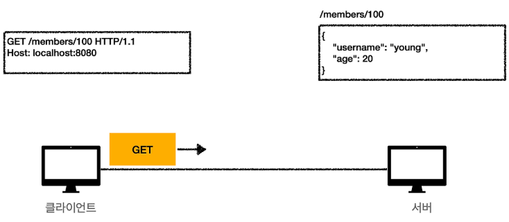

- 클라이언트에서 서버로 데이터 조회를 위한 GET 메서드를 호출함

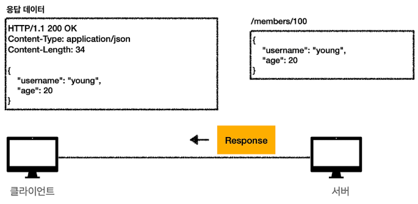

- 요청이 정상적이라면 서버에서는 적절한 응답 결과를 생성해 클라이언트로 전송함

### GET의 동적 데이터 조회 과정

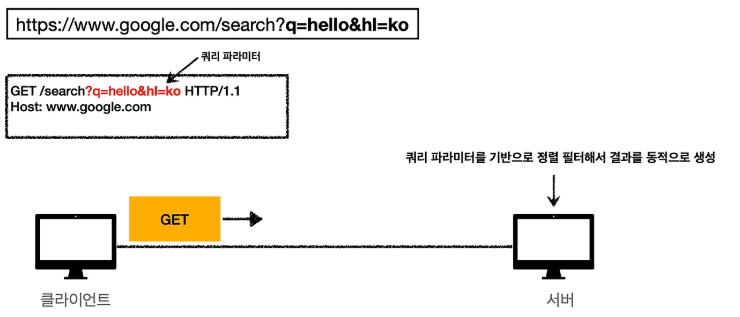

- 클라이언트에서 Query parameter 동적 데이터에 대한 요청을 서버로 전달하면 서버는 이에 맞게 parameter 기반으로 정렬을 통해 응답 데이터를 생성해 클라이언트로 보내줌

### GET의 HTML Form 데이터 조회 과정

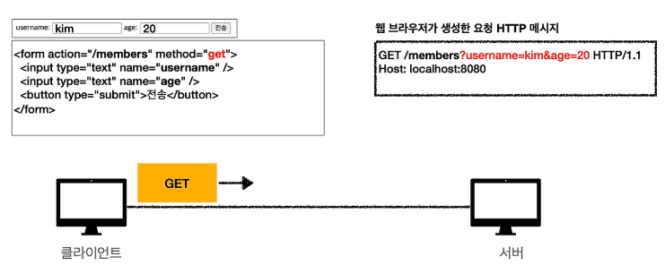

- HTML Form을 이용해 조회할 데이터를 정해서 서버로 요청을 보낼 수 있음

## HEAD

- 기본 역할
  - GET과 동일하지만 서버가 응답에 본문을 전송하지 않음
- 사용 목적
  - 리소스가 실제 데이터를 다운로드하지 않고, 해당 리소스에 대한 메타데이터를 얻기 위해 사용
  - 하이퍼링크 유효성 검사, 최근 수정 여부 확인 등
- 응답 헤더
  - GET과 동일한 헤더를 보내야 함
  - 효율성을 위해 본문을 생성해야만 알 수 있는 헤더는 생략 가능 (`Content-Length`, `Vary` 등)
- 제한 사항
  - HEAD 요청에 본문을 담는 건 의미 없고 보안상 위험
- 캐싱
  - HEAD 응답은 캐시 가능
  - 이전에 캐시된 동일 리소스의 GET 응답에 영향을 줄 수 있음

## POST

- 기본 역할
  - 요청 본문을 서버 리소스에 전달하여 서버가 정의한 방식대로 처리하도록 요청
- 주요 용도
  - HTML 폼 데이터 전송
  - 게시판/블로그 글 작성
  - 새로운 리소스 생성
  - 기존 리소스에 데이터 추가
- 응답 상태 코드
  - 처리 결과에 따라 다양하게 반환됨
  - 요청 성공하여 새로운 리소스가 생성된 경우, 서버는 `201 (Created)` 응답으로 반환
  - 이 때 `Location` 헤더에는 새로 생성된 리소스의 URI가 포함되어야 함
  - 이미 존재하는 리소스를 보여주는 것과 같다면 서버는 `303 (See Other)` 응답과 해당 리소스의 URI를 `Location` 헤더에 담아 리다이렉트 시킬 수 있음
- 캐싱
  - POST 요청에 대한 응답은 일반적으로 캐시되지 않음
  - `Content-Location`과 명시적 캐시 유효성 정보가 있으며 캐시 가능

### POST의 JSON 데이터 전송

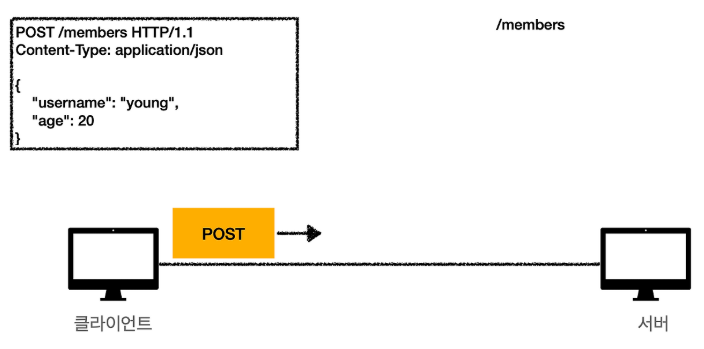

- 클라이언트가 JSON 형식으로 데이터를 바디에 담은 후 요청을 보냄

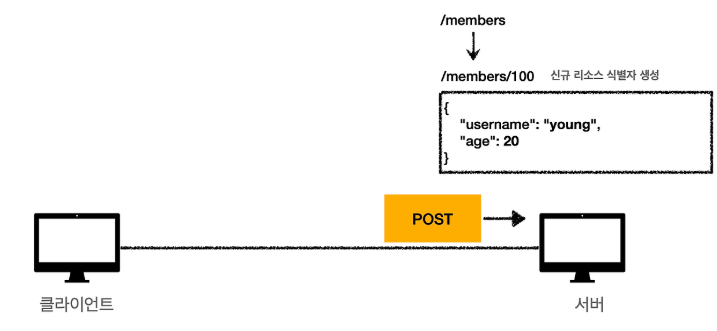

- 서버 리소스에 클라이언트 요청 데이터를 적재함

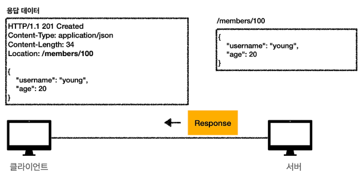

- 업데이트된 리소스 결과에 대한 데이터를 응답 메시지 바디에 담아서 클라이언트 측으로 전송함

## PUT

- 기본 역할
  - 대상 리소스를 요청 본문에 담긴 표현으로 생성하거나 교체
  - 성공하면 나중에 GET으로 같은 리소스를 조회 시 동일한 내용이 반환될 것을 기대하게 됨
- POST와의 차이
  - POST : 서버가 리소스를 생성하거나 처리함
    - 클라이언트가 서버에게 데이터를 처리해 달라고 요청
    - 새로운 URI의 주소는 서버가 결정
  - PUT : 클라이언트가 리소스를 정의함
    - 클라이언트가 대상 리소스의 URI를 정확히 알고 있음
    - 해당 URI의 리소스 상태를 완전히 대체하려는 의도를 가짐
- 멱등성 (Idempotent)
  - 동일한 PUT 요청을 여러 번 보내도 서버의 리소스 상태는 동일하게 유지됨
- 응답 상태 코드
  - 새로운 리소스 생성 성공 : `201 (Created)`
  - 기존 리소스 수정 성공 : `200 (OK)`, `204 (NO Content)`
  - 데이터 불일치/제약 조건 위반 : `403 (Conflict)`, `415 (Unsupported Media Type)`
- 캐싱
  - PUT 요청에 대한 응답은 캐시되지 않음
- 유효성 검사기
  - `ETag`, `Last-Modified`와 같은 유효성 검사 헤더는 변환 없이 그대로 저장된 경우에만 반환 가능
- 부분 PUT
  - `Content-Range` 헤더를 사용하여 리소스의 일부만 수정하는 가능

### PUT 요청에 대해 기존 리소스가 존재하는 경우

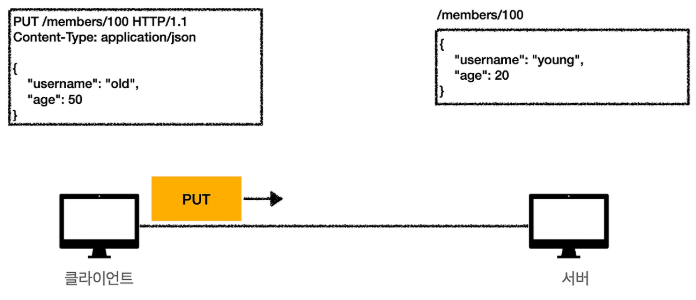

- 아래와 같은 경로에 존재하는 리소스를 대체하는 요청을 서버로 전송함

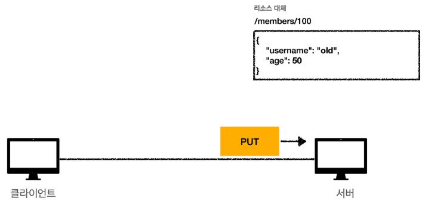

- 기존 데이터가 존재한다면 요청 당시 바디에 있던 데이터로 완전히 대체됨

### PUT 요청에 대해 기존 리소스가 존재하지 않는 경우

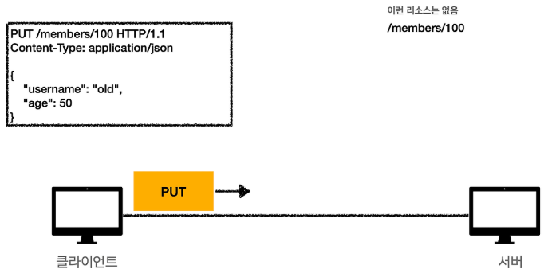

- 업데이트된 리소스 결과에 대한 데이터를 응답 메시지 바디에 담아서 클라이언트 측으로 전송함

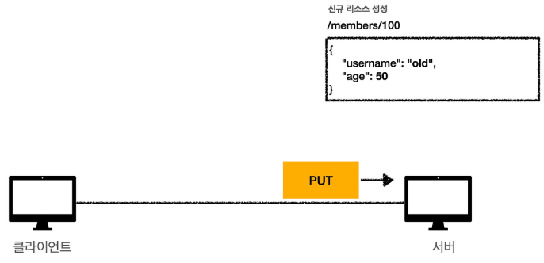

- 기존 데이터가 없었기 때문에 요청 데이터를 기반으로 새로운 리소스가 생성됨

## PATCH

- 역할
  - PUT : 요청 본문의 내용으로 리소스 전체를 완전히 교체
  - PATCH : 제공된 지침에 따라 리소스의 일부만 수정
- 안전성 및 멱등성
  - PATCH는 안전하지도 않고 멱등성을 보장하지도 않음
  - 클라이언트가 조건부 요청(`If-Match` 헤더, ETag 사용)을 통해 멱등성을 보장 할 수 있음
- 원자성
  - 서버는 모든 변경 사항을 하나의 단위로 적용해야 함
  - 일부만 적용되어서는 안되며, 전체 변경이 불가능한 경우 어떤 변경도 적용되서는 안됨
- 충돌 위험
  - 여러 PATCH 요청이 동시에 들어오면 리소스를 손상시킬 수 있음
- 캐싱
  - PATCH에 대한 응답은 캐시되지 않음 (해당 URI의 기존 캐시된 데이터를 오래된 것으로 처리)
  - `Expires`, `Cache-Control`, `Content-Location`이 명확히 설정된 경우만 캐시 가능
- 엔티티 헤더
  - 요청에 포함된 엔티티 헤더는 패치 문서 자체에만 적용되며, 수정되는 리소스에는 적용되지 않음
- 패치 문서 형식
  - 모든 리소스에 적합한 단일 표준 패치 문서 형식은 없음
  - 서버는 요청받은 패치 문서가 해당 리소스 유형에 적합한지 확인해야 함
- PATCH 사용 시점
  - 패치 문서의 크기가 PUT으로 보낼 전체 리소스 데이터보다 크다면 PUT이 더 효율적
  - 예측 불가능한 방식으로 리소스를 수정하는 경우에는 POST 고려

### 리소스의 일부를 변경하고자 하는 경우

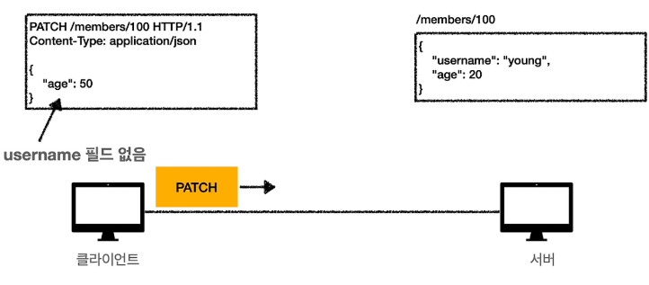

- age 값을 수정하고자 할 때 PATCH 메서드를 사용함

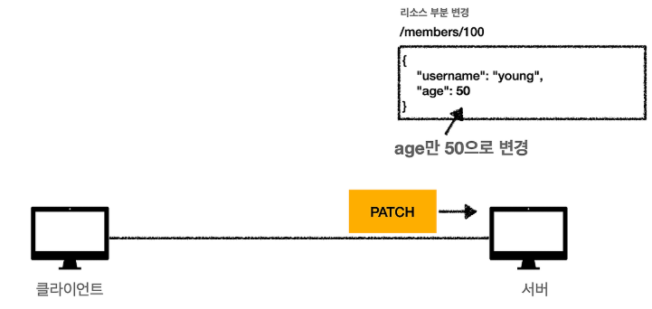

- age 필드 데이터만 변경된 것을 확인할 수 있음

## DELETE

- 기본 역할
  - 서버에 대상 리소스와의 연결을 제거하도록 요청
  - 실제 데이터 삭제 여부나 저장 공간 반환 여부는 서버 구현에 따라 다름
- 주요 용도
  - 원격 저장 환경(버전 관리, 리소스 취소/삭제)에 사용
  - PUT이나 POST로 생성된 리소스를 제거할 때 자주 사용
- 응답 상태 코드
  - `202 (Accepted)` : 요청은 접수되었으나, 아직 삭제 작업이 실행되지 않은 상태
  - `204 (No Content)` : 삭제 작업이 성공적으로 완료되었으며, 본문에 추가 정보가 없음
  - `200 (OK)` : 삭제 작업이 성공적으로 완료되었으며, 본문에 처리 상태를 정보를 포함하여 전달
- 제한 사항
  - DELETE 요청에 본문을 포함 하는 것은 안됨
  - 보안상 위험(요청 스머글링) 때문에 사용해서는 안됨
- 캐싱
  - DELETE에 대한 응답은 캐시되지 않음
  - 성공 시 해당 URI에 대한 모든 기존 응답을 무효화함

### 특정 자원의 리소스를 삭제하고자 하는 경우

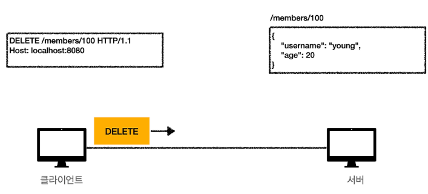

- 특정 경로의 리소스를 삭제할 수 있음

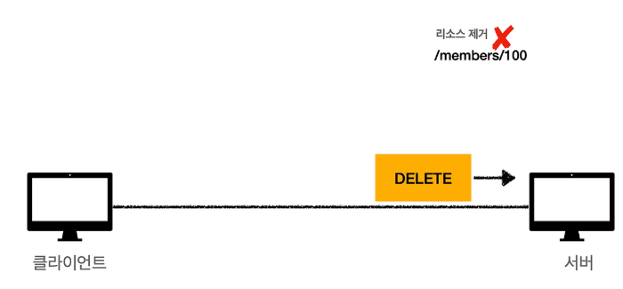

- 서버의 요청을 받고 데이터베이스의 해당 리소스를 제거함

## CONNECT

- 기본 역할
  - 수신자에게 요청된 목적지 서버로 가는 터널을 생성하도록 요청
  - 터널 생성 시 그 이후는 TCP 통신으로 전환
  - 프록시 서버에 요청하기 위해 사용
- 요청 형식
  - 목적지 서버의 호스트와 포트 번호로만 구성
  - `CONNECT server.example.com:443 HTTP/1.1`
- 응답 상태 코드
  - `2xx (Successful)` 응답 시 터널 모드로 전환
  - 성공 시 `Content-Length`나 `Transfer-Encoding` 헤더 포함하면 안 됨
- 보안 위험
  - 악의적인 사용자가 프록시를 속여 웹 트래픽이 아닌 포트로 터널을 생성하도록 요청할 수 있음
  - 안전한 포트만 허용하도록 제한 권장
- 캐싱
  - CONNECT에 대한 응답은 캐시되지 않음

## OPTIONS

- 기본 역할
  - 특정 리소스 또는 서버 전체에 대해 사용 가능한 통신 옵션/요구사항을 확인
  - GET, POST 등을 취하지 않고 서버의 능력이나 특정 리소스의 요구사항을 확인
- 요청 대상
  - `*` (애스터리스크)
    - 서버 전체의 능력 테스트
    - ping(연결 상태 확인) 또는 no-op(아무 작업 안 함)의 용도로 사용
  - 특정 리소스 URI
    - 해당 리소스와의 통신에서 가능한 메서드/옵션 확인
- 서버 응답
  - `Allow` : 서버가 지원하는 HTTP 메서드 목록을 알려줌
  - 기타 리소스에 적용 가능한 확장 기능 정보
- 본문
  - 일반적으로 OPTIONS 요청에는 본문을 보내지 않음
  - `Content-Type`을 명시해야 보낼 수 있음
- 캐싱
  - OPTIONS에 대한 응답은 캐시되지 않음

## TRACE

- 기본 역할
  - 요청 메시지가 서버까지 가는 과정에서 어떤 변경이 있었는지 확인하기 위한 loop-back 테스트 요청
  - 최종 수신자는 자신이 받은 요청 메시지를 응답 본문에 담아 클라이언트에게 되돌려 보냄
- 보안 주의사항
  - 클라이언트는 절대로 민감한 정보(쿠키, 인증 정보)를 포함해서는 안됨
  - 서버는 응답을 생성할 때, 민감한 정보가 포함될 가능성이 있는 요청 필드는 제외해야 함
- 활용 사례
  - 클라이언트가 실제로 서버에 도달하는 요청 메시지 확인 가능
  - Via 헤더를 통해 요청이 거친 프록시 체인을 추적할 수 있음
  - `Max-Forwards`를 활용해 프록시 체인 길이 제한 가능 (무한 루프에 빠진 프록시 체인 테스트 하는 데 유용)
- 본문
  - 클라이언트는 TRACE 요청에 본문을 보내서는 안됨
- 캐싱
  - TRACE에 대한 응답은 캐시되지 않음

## 요약

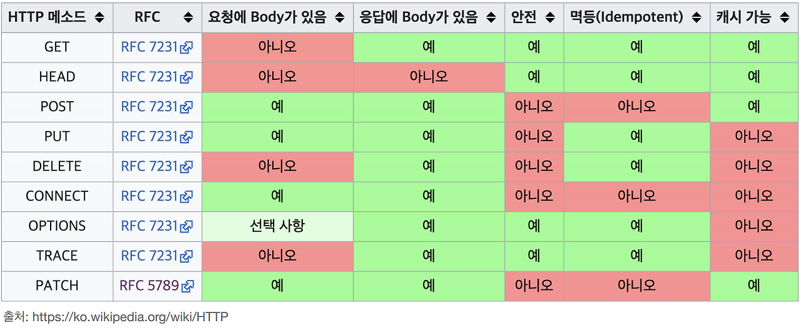

## 출처

- https://httpwg.org/specs/rfc9110.html#method.definitions
- https://httpwg.org/specs/rfc5789.html#patch
