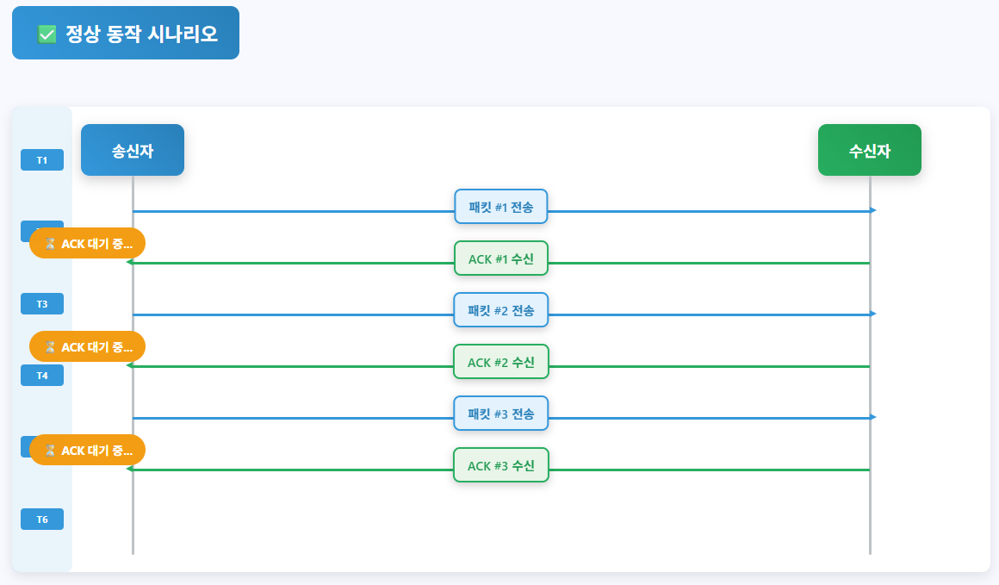
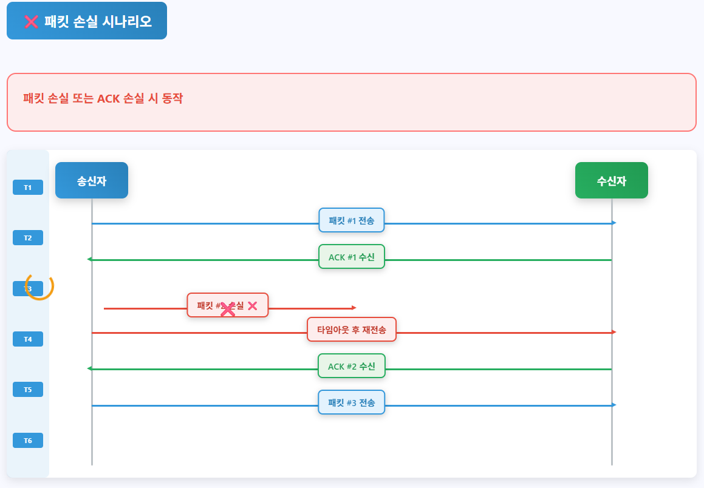
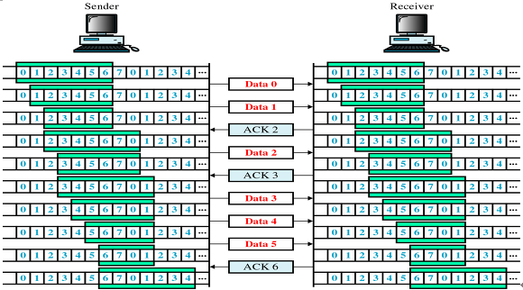
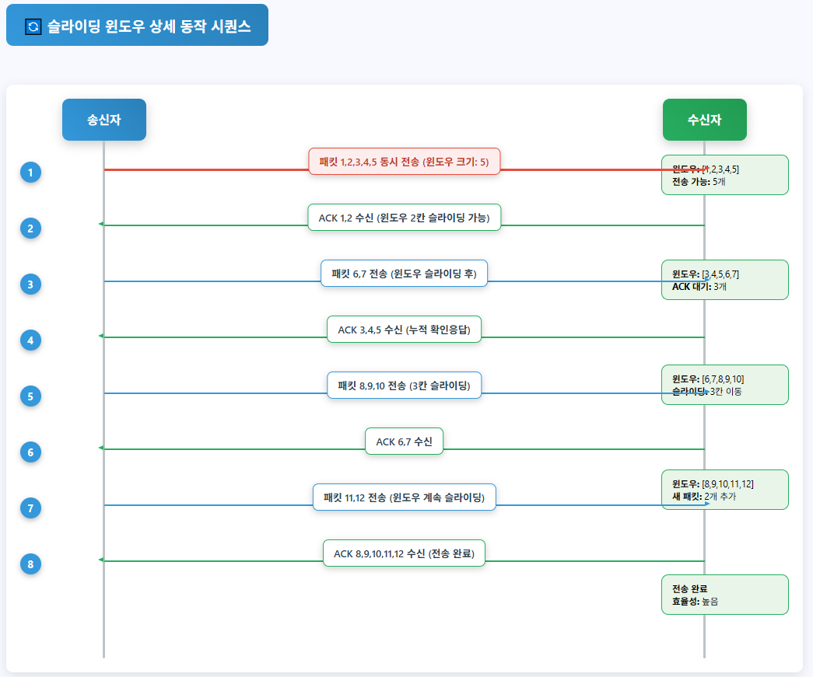
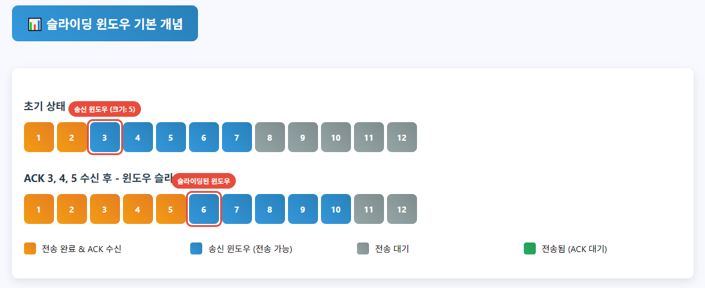

# 흐름 제어

 

## 목차
- [흐름 제어](#흐름-제어)
  - [목차](#목차)
  - [정의 및 필요성](#정의-및-필요성)
    - [정의](#정의)
    - [필요성](#필요성)
  - [흐름 제어 방법](#흐름-제어-방법)
    - [stop and wait](#stop-and-wait)
    - [sliding window](#sliding-window)

 

## 정의 및 필요성

### 정의

송신 측이 데이터를 너무 빨리, 많이 보냄

수신 측이 데이터를 처리하는 속도를 감당하지 못하거나 버퍼가 넘침

데이터가 유실될 수 있음

불필요한 추가 패킷 전송이 발생하게 됨

 

따라서 송신 측과 수신 측 간의 데이터 전송 속도를 조절

수신측이 송신측에게 현재 자신의 상태, 특히 처리 가능한 데이터의 양을 피드백

송신 측의 전송 가능 바이트를 제한

수신 버퍼 오버플로우 없이 안정적으로 바이트 스트림을 전달 받을 수 있게 함

 

데이터의 손실 없이 효율적인 통신을 보장하는 기능

이는 TCP의 신뢰성을 보장하는 중요한 메커니즘

 

### 필요성

- **수신자 보호**:
    - 송신자가 너무 빠르게 전송하면, 수신자의 버퍼가 오버플로우
    - 데이터 손실 발생
- **네트워크 효율성**:
    - 버퍼 오버플로우로 인한 데이터 손실 발생
    - 데이터 손실 발생 시 불필요한 재전송이 필요해짐
    - 네트워크 효율성이 떨어지고 전체적인 통신 지연이 발생
    - 데이터 손실을 사전에 방지하여 불필요한 재전송을 줄이는 역할
- **신뢰성 있는 통신 보장**:
    - 수신자가 안정적으로 데이터를 처리할 수 있도록 보장
    - 데이터가 버퍼 오버플로우로 인해 손실되는 것을 사전에 방지
    - TCP의 '신뢰성 있는 데이터 전송'을 지킬 수 있음

 

## 흐름 제어 방법

### stop and wait

**개념**

송신자와 수신자 간의 데이터 전송 속도를 조절하는 가장 간단한 흐름 제어 프로토콜

이름처럼 '보내고(Stop)' '기다리는(Wait)' 방식으로 동작

 

송신자는 데이터를 한 단위(프레임 또는 패킷) 보냄

송신자는 수신자로부터 ACK or timeout 발생할 때까지 다음 데이터 안 보내고 기다림

수신자는 이 데이터를 받아서 처리한 후, 잘 받았다는 ACK을 송신자에게 보냄

수신자는 데이터를 제대로 받지 못하면 ACK을 보내지 않아 timeout 발생함

ACK를 수신하면 다음 프레임을 전송하고, 타임아웃 발생하면 이전 프레임을 재전송

 

송신 측은 동시에 두 개 이상의 패킷을 네트워크에 띄우지 않음

수신 측의 처리 속도를 쉽게 따라갈 수 있음

수신자가 데이터를 검증하고 처리할 때까지 송신자가 기다려 줌

수신 버퍼 오버플로우가 절대 발생하지 않음

 

ACK 패킷에 시퀀스 번호를 부여해 시퀀스 번호 확인을 통해 중복 수신이나 손실 상황을 구분

 

**동작 방식**

 

- [송신자] 데이터 전송 및 타이머 시작
    - 송신자는 `Seq 0` (순서 번호 0)을 가진 데이터 프레임을 수신자에게 보냄
    - 동시에 `Seq 0` 데이터에 대한 타이머를 작동
    - 송신자는 `ACK 0`을 받을 때까지 대기
- [수신자] 데이터 수신 및 ACK 전송
    - 수신자는 `Data 0`을 성공적으로 받음
    - 수신자는 `Data 0`의 순서 번호를 확인
    - 다음으로 기대하는 데이터의 순서 번호인 `ACK 1` 송신자에게 보냄
- [송신자] ACK 수신 및 다음 데이터 전송 준비
    - 송신자는 `ACK 1`을 받으면, `Data 0`이 성공적으로 전달되었음을 확인
    - `Data 0`에 대한 타이머를 멈춤
    - 이제 송신자는 `Seq 1`  가진 다음 데이터 프레임을 전송할 준비

 

- [송신자] 데이터 전송 및 타이머 시작
    - 송신자는 `Seq 1` 데이터를 보냄
    - 타이머를 시작하고 대기
- [데이터 손실]
    - `Data 1`이 네트워크에서 손실되어 수신자에게 도착하지 않음
- [송신자] 타임아웃 발생 및 재전송
    - 송신자는 `Data 1`에 대한 ACK를 정해진 시간 내에 받지 못함
    - 타이머가 만료(Timeout) 됨
    - 송신자는 `Data 1`이 손실되었다고 판단하고, `Data 1`을 다시 재전송
    - 다시 타이머를 시작하고 대기
- [수신자] 재전송된 데이터 수신 및 ACK 전송
    - 수신자는 재전송된 `Data 1`을 성공적으로 받음
    - 수신자는 `ACK 2`을 송신자에게 보냄
- [송신자] ACK 수신 및 다음 데이터 전송
    - 송신자는 `ACK 2`을 받고 타이머를 멈춘 후, 다음 `Data 2`을 전송

 

**장점**

- 구현이 매우 간단
- 데이터 손실 및 중복을 쉽게 처리 가능
- 오류 복구와 흐름 제어를 동시에 제공
    - ACK이 안 오면 재전송
- 송수신 속도의 차이 커도 수신자 버퍼 오버플로우 위험이 없어 수신자 버퍼 작아도 됨
    - 한 번에 하나의 데이터 처리하기 때문

 

**단점** 

- 아래의 상황에서 효율이 저하됨
    - 네트워크 왕복 시간(RTT)이 긴 경우
    - 데이터 전송 시간이 짧은 경우
    - 네트워크 대역폭이 큰 경우 = 고속 네트워크 환경인 경우
    - 네트워크 지연이 큰 경우
- 송신자는 대부분의 시간을 ACK 기다리는데 소비하기 때문
- 이러한 비효율성을 커버하기 위해 여러가지 오류 제어 방식을 함께 도입해서 사용

 

### sliding window

**개념** 

Stop-and-Wait의 비효율성 극복, 네트워크 자원 최대한 활용해 더 많은 데이터 빠르게 전송하기 위해 등장

 

송신자와 수신자 간의 데이터 전송량을 동적으로 조절

수신 측에서 설정한 윈도우 크기만큼 송신 측에서 확인 응답(ACK) 없이 패킷을 전송할 수 있게함

 

송신자가 여러 개의 세그먼트를 한 번에 연속적으로 전송할 수 있도록 허용하는 기법

수신자의 버퍼 상황에 따라 윈도우 크기가 조절되며, 송신 가능한 데이터 양이 결정됨

수신자의 버퍼 오버플로우를 방지하면서도 네트워크 효율성을 극대화

 

**윈도우**

- 송신 측과 수신 측은 각각 데이터를 담을 수 있는 버퍼를 가지고 있음
- 별도로 **윈도우**라는 일종의 마스킹 도구를 가지고 있음
- "송신자가 수신자의 ACK 기다리지 않고도 현재 네트워크에 최대로 보낼 수 있는 데이터의 양" 의미
- 수신자는 자신이 아래의 것들을 송신자에게 계속해서 알려줌
    - 현재 얼마만큼의 데이터를 더 받을 수 있는지
    - 자신의 버퍼에 비어있는 공간이 얼마인지
- 이 공간의 크기가 곧 '수신 윈도우(Receive Window = rwnd)' 크기가 됨
- 송신자는 이 rwnd 값을 넘지 않는 범위 내에서 여러 개의 데이터 패킷을 연속적으로 보낼 수 있음
- 송신 윈도우
    - 송신자가 한 번에 보낼 수 있는 데이터 범위
- 수신 윈도우
    - 수신자가 수용 가능한 데이터 크기
    - TCP에서 수신 측이 자신의 버퍼 여유 공간을 송신 측에 알려줌

 

**슬라이딩**

- 송신자가 데이터를 성공적으로 전송하고 수신자가 이를 잘 받아 ACK를 보냄
- 그러면 송신자의 윈도우는 받은 ACK만큼 앞으로 이동(Sliding)
- 윈도우가 슬라이딩하면서 송신자가 보낼 수 있는 새로운 데이터 영역이 생김

 

**윈도우 크기**

최초의 윈도우 크기는 3 way handshaking을 통해 수신 윈도우 크기로 설정

이후에는 통신 상황에 따라 두 가지 주요 윈도우 값에 의해 동적으로 결정

 

윈도우 크기는 수신 측에서 송신 측으로 확인 응답(ACK)을 보낼 때 TCP 헤더에 담아서 보냄

이때 송신 측과 수신 측은 자신의 현재 버퍼 크기를 서로에게 알려주게 됨

송신 측은 수신 측이 보내준 버퍼 크기를 사용하여 자신의 윈도우 크기를 정하게 됨

 

송신자가 보낼 수 있는 데이터 양(윈도우 크기)은 다음 두 값 중 더 작은 값으로 결정

$송신 윈도우 크기=min⁡(수신 윈도우 크기(rwnd),혼잡 윈도우 크기(cwnd))$

 

**1.** 수신 윈도우 (Receive Window, `rwnd`)

- 결정 주체: 수신자 (Receiver)
- 의미:
    - 수신자의 TCP 버퍼에서 현재 데이터를 받을 수 있는 비어있는 공간의 크기
    - 수신자가 현재 처리 능력으로 수신자 버퍼에 얼마나 많은 데이터를 더 받아들일 수 있는지 나타냄
    - 수신자 측 버퍼의 여유 공간에 의해 결정
- 동작 방식:
    - 수신자는 자신의 TCP 버퍼 상태를 지속적으로 모니터링
    - 데이터를 처리하여 버퍼 공간이 비워지면 `rwnd` 값이 증가
    - 수신자는 송신자에게 보내는 모든 ACK 패킷의 TCP 헤더 (window size)에 이 `rwnd` 값 포함해 보냄
- 목적:
    - 흐름 제어
    - 송신자가 수신자의 버퍼를 오버플로우 시키는 것을 방지하여 데이터 손실을 막음

 

2. 혼잡 윈도우 (Congestion Window, `cwnd`)

- 결정 주체: 송신자 (Sender)
- 의미:
    - 송신자가 현재 네트워크의 혼잡 상태를 기반으로 판단한, 네트워크에 보낼 수 있는 최대 데이터의 양.
    - 이는 수신자의 능력(rwnd)과는 별개로, 네트워크 자체의 수용 능력을 반영
- 동작 방식:
    - 혼잡 제어 알고리즘에 따라 `cwnd` 값이 동적으로 조절
    - 혼잡이 감지되지 않으면:
        - `cwnd`를 서서히 증가시켜 네트워크 용량을 탐색
    - 혼잡이 감지되면 (패킷 손실, 타임아웃):
        - `cwnd`를 급격히 감소시켜 네트워크 부하를 줄임
- 목적:
    - 혼잡 제어
    - 네트워크 전체의 혼잡 붕괴를 막고 자원을 효율적으로 사용

 

**동작방식**

1. 송신자의 데이터 전송
    1. 송신 윈도우 확인 : 
        1. 송신자는 현재 자신의 송신 윈도우 내에서 보내지 않은 데이터 확인
    2. 데이터 연속 전송 : 
        1. 송신 윈도우 내에서 ACK 기다리지 않고 여러 개의 데이터 패킷 연속적으로 수신자에게 보냄
        2. 각 패킷은 sequence number가 부여됨
2. 수신자의 데이터 수신 및 ACK 전송
    1. 데이터 수신
        1. 수신자는 도착한 데이터 패킷들을 받음
    2. 순서 확인 및 버퍼 저장
        1. 도착한 패킷 순서 번호 확인
        2. 순서에 맞는 패킷은 버퍼에 저장 후 상위 계층으로 전달
        3. 순서에 맞지 않는 패킷은 일단 버퍼에 저장 후 순서에 맞는 패킷 계속 기다림
    3. ACK 전송
        1. 성공적으로 받은 마지막 순서 패킷의 다음 바이트 순서 번호를 ACK에 담아 보냄
        2. ACK에 수신 윈도우에 남아있는 여유 공간의 크기 rwnd도 함께 포함됨
3. 송신자의 윈도우 슬라이딩
    1. ACK 수신
        1. 송신자는 수신자로부터 ACK 받음
    2. 가장 최근에 ACK 받은 바이트의 순서 번호 갱신 
        1. ACK에 포함된 다음 바이트 순서 번호 확인해 가장 최근에 ACK 받은 바이트의 순서 번호 갱신
    3. 윈도우 슬라이딩
        1. 바이트 순서 번호 증가한만큼 송신자 윈도우 시작점 오른쪽으로 슬라이딩함
        2. 바뀐 윈도우 범위에서 새로운 데이터 보낼 수 있게 됨
    4. 송신 윈도우 크기 갱신
        1. ACK에 포함된 rwnd와 cwnd 비교해 더 작은 값으로 보낼 수 있는 최대 데이터량 갱신
4. 반복
    1. 위 과정들이 데이터 다 받을 때까지 반복됨

