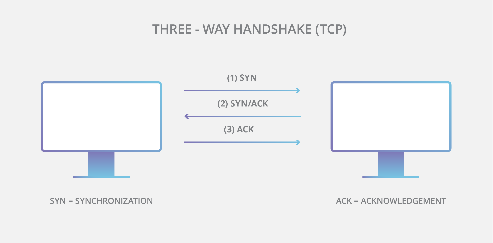
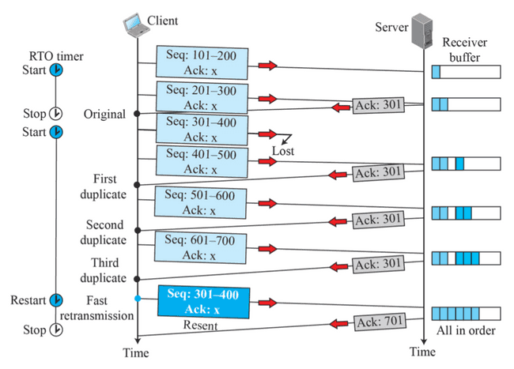

# TCP란?

 

## 목차
- [TCP란?](#tcp란)
  - [목차](#목차)
  - [TCP란?](#tcp란-1)
    - [정의](#정의)
    - [TCP의 특징](#tcp의-특징)
    - [필요성](#필요성)
  - [TCP가 reliable network 보장 위해 해결해야 하는 문제](#tcp가-reliable-network-보장-위해-해결해야-하는-문제)
  - [TCP 통신 과정](#tcp-통신-과정)
    - [통신 과정](#통신-과정)
    - [통신 과정에서 발생할 수 있는 문제점](#통신-과정에서-발생할-수-있는-문제점)

 

## TCP란?

### 정의

- 전송 계층(Transport Layer) 프로토콜
- TCP = Transmission Control Protocol
- 인터넷에서 데이터를 안정적으로 전송하기 위한 프로토콜
- IP 위에서 동작 → "TCP/IP" 스택의 핵심
- 주요 기능:
    - 신뢰성 있는 데이터 전송
    - 연결 지향
    - 바이트 스트림 제공

 

### TCP의 특징

- **연결 지향적**: 3-way handshake로 연결 설정
- **신뢰성 보장**: 손실된 세그먼트 재전송 및 데이터 손상 검사
- **순서 보장**: 순서가 어긋난 패킷을 정렬
- **흐름 제어**: 송수신 속도 차이를 조율
- **혼잡 제어**: 네트워크 혼잡 상황 감지 및 대응

 

 

### 필요성

- IP는 단순히 패킷을 목적지까지 전달
- 전달 성공 보장하지 않음 (손실, 중복, 순서 뒤바뀔 수 있음)
- TCP가 위에서 **신뢰성과 제어 기능**을 더해 안정적인 데이터 전송 제공

 

## TCP가 reliable network 보장 위해 해결해야 하는 문제

1. **손실** : packet이 손실될 수 있는 문제
2. **순서 바뀜** : packet의 순서가 바뀌는 문제
3. **혼잡 (Congestion)** : 네트워크가 혼잡한 문제
4. **과부화 (Overload)** : 수신자가 과부화 되는 문제

 

## TCP 통신 과정

### 통신 과정

 

통신 과정을 간단히 정리하면 아래와 같다. 

1. 송신자가 수신자에게 데이터 전송을 시작
2. 송신자가 데이터를 전송하면 TCP에 의해 데이터가 보내짐
3. 데이터는 네트워크를 통해 수신자에게 도착
4. 도착한 데이터는 수신자의 버퍼에 저장
5. 수신자의 애플리케이션이 버퍼에 저장된 데이터를 읽음
6. 수신자는 잘 받았다는 의미로 송신자에게 ACK 보냄

 

### 통신 과정에서 발생할 수 있는 문제점

1. 송신자가 매우 빠른 속도로 데이터 전송
    1. 수신자의 버퍼에 데이터가 가득참
    2. 버퍼 가득 차있는 동안 전송된 데이터 잃어버림
2. 사용하는 네트워크에 매우 많은 인원이 데이터 전송
    1. 정체 현상이 발생