# 네트워크 기기

## 💡 핵심 요약

> - **한 줄 정의 :** 컴퓨터와 기기들을 서로 연결하여 데이터가 오고 갈 수 있는 길을 만들고, 통신 흐름을 제어하는 물리적인 하드웨어 장치.
> - **핵심 키워드:** `#스위치` `#라우터` `#로드밸런서` `#방화벽` `#OSI 7계층` `#리피터` `#허브`
> - **왜 중요한가?** : 계층별로 장비를 나누면, 각 장비가 **계층에만 집중**하도록 역할을 나눔으로써, 전체 네트워크가 훨씬 **효율적이고 빠르며, 관리하기 쉽게** 동작하기 때문입니다.

# 주의사항

각 계층의 장비들은 특정 계층을 대표하는 장비이지만, 보편적으로 네트워크 장비의 계층은 **가장 높은 수준의 핵심 기능이 속한 계층**을 기준으로 분류합니다. 

예를들어 L3스위치는  L2스위치의 기능을 포함하고 있지만 가장 핵심 기능은 3계층의 라우팅 기능이기 때문에 3계층 장비라고 표현합니다.

---

# **Layer 1: 물리 계층 (Physical Layer)**

> 데이터(0, 1)를 전기 신호, 빛, 전파와 같은 물리적인 신호로 바꿔 케이블을 통해 전송하는, 모든 통신의 가장 기초가 되는 계층 

## **1. 리피터 (Repeater)**

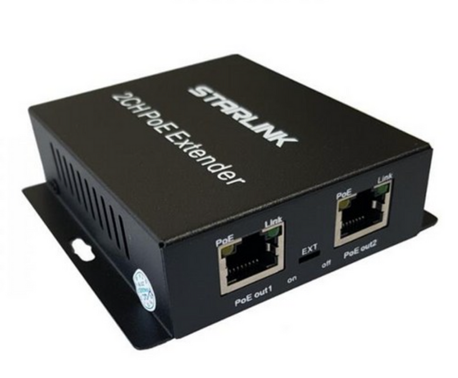

약해진 전기 신호를 원래의 깨끗한 형태로 **증폭하고 재생성** 하여 더 먼 거리까지 도달하게 하는 장비입니다. 

### **왜 단순 '증폭'이 아닌 '재생성'을 할까**
    
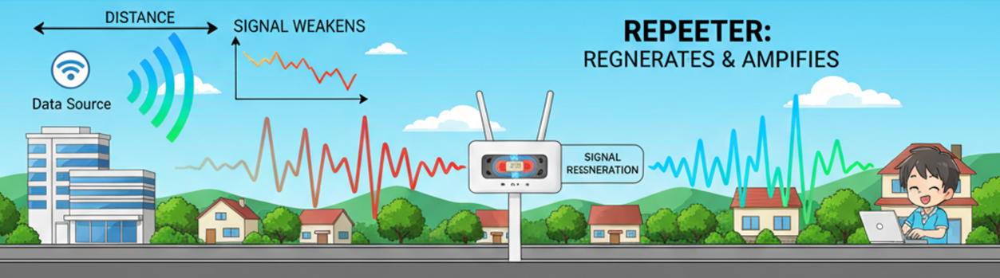

1. 거리가 멀어지면 **신호는 약해지고 노이즈가 섞여 왜곡**됩니다.

2. 이때 단순히 신호를 증폭하면 **노이즈까지 함께 커집니다.** 

3. 따라서 리피터는 약해진 신호에서 0과 1을 **새로 판독하여 깨끗한 신호**를 만들어 보냅니다.

- **참고** : 리피터는 아날로그 신호를 디지털로 변환(ADC)하는 과정 없이, 약해진 아날로그 신호를 보고 0 또는 1을 추측하여 새로운 아날로그 신호를 만듭니다.

---

## **2. 허브 (Hub)**

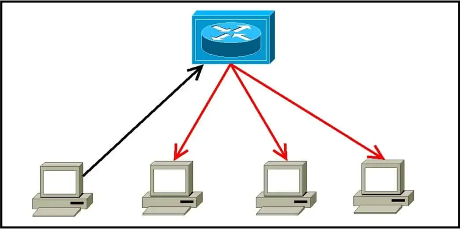

한 포트로 들어온 신호를 **모든 포트로 그대로 복사해서 전달** 하는 장비로, '멀티포트 리피터'라고도 불립니다.

### **단점(스위치로 대체된 이유):**
- **불필요한 트래픽** : 데이터를 모든 포트로 뿌리기 때문에, 관련 없는 노드에도 데이터를 수신하게 되어 비효율적이고 보안에 취약합니다.
- **단일 충돌 도메인 (Single Collision Domain)** : 허브에 연결된 모든 장치는 하나의 통신 회선을 공유합니다. 따라서 두 개 이상의 장치가 동시에 데이터를 보내면 '충돌'이 발생해 통신이 실패합니다. 장치 수가 많아질수록 성능이 급격히 저하됩니다.
- **지능의 부재** : 허브는 MAC 주소나 IP 주소를 전혀 이해하지 못합니다.

---

### 충돌 도메인이란

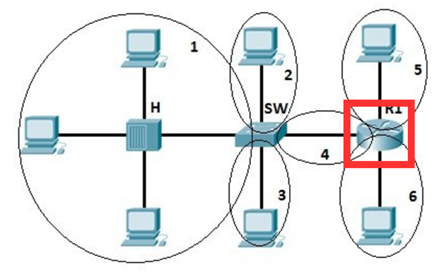

두 개 이상의 장치가 동시에 데이터를 전송할 때 충돌이 발생할 수 있는 범위(가장 단순한 예시 : 위병소 무전기, 워키토키 등)

---

## **3. 모뎀 (Modem)**

컴퓨터의 디지털 신호를 아날로그 회선(전화선 등)으로 전송할 수 있도록 **변조(MOdulation)** 하고, 들어온 아날로그 신호를 다시 디지털로 **복조(DEModulation)** 하는 장비입니다.

- **요즘은 어디에 있을까요?**
    - 과거에 쓰던 다이얼업 모뎀은 거의 사라졌습니다. 현재는 통신사(ISP)에서 제공하는 **유무선 공유기에 라우터와 모뎀 기능이 통합** 되어 있습니다 (광 모뎀, 케이블 모뎀 등).

---

# **Layer 2: 데이터 링크 계층 (Data Link Layer)**

> 동일한 로컬 네트워크(LAN) 내에서, MAC 주소를 사용하여 기기 간의 데이터(프레임) 전송을 담당합니다.
> 

## **1. 브리지 (Bridge)**

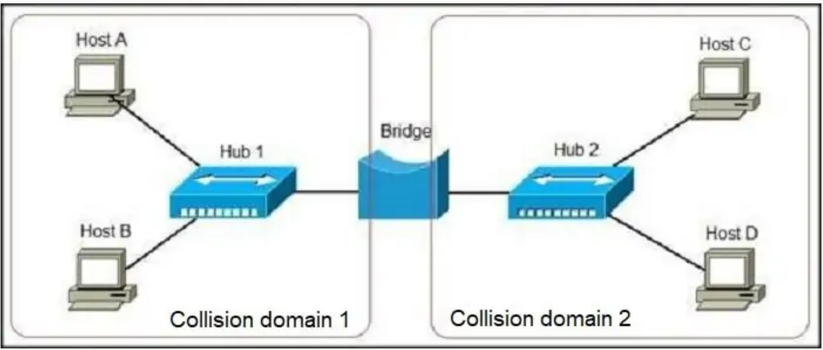

네트워크를 여러 개의 **세그먼트(Segment)** 로 나누거나, 나누어진 세그먼트를 하나로 연결하는 장치입니다. 브리지의 가장 큰 역할은 **충돌 도메인을 분리** 하는 것입니다.

### **작동 방식:**
1. **학습(Learning)** : 각 포트에 연결된 장비의 **출발지 MAC 주소** 를 학습하여 'MAC 주소 테이블'을 만듭니다. 
    
    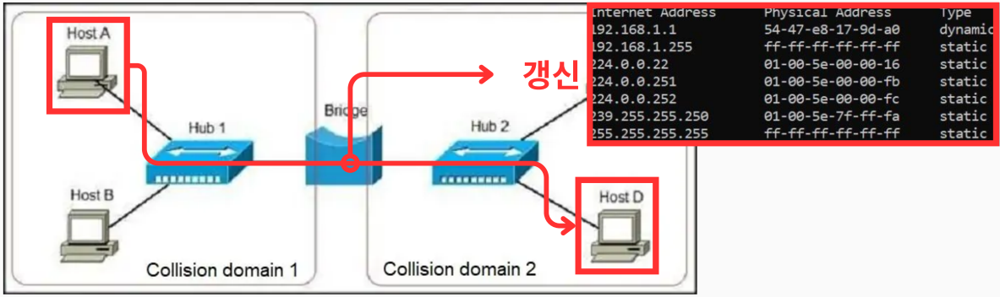
    
2. **판단(Forwarding/Filtering)** : 데이터가 들어오면 **목적지 MAC 주소**를 테이블에서 확인합니다. 
    
    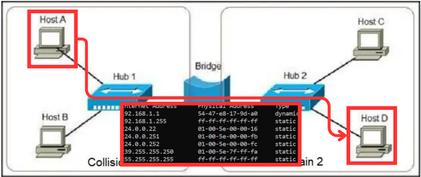
    
    - 목적지가 출발지와 **같은 세그먼트** 에 있으면 데이터가 넘어가지 않도록 차단합니다 (Filtering).
        
        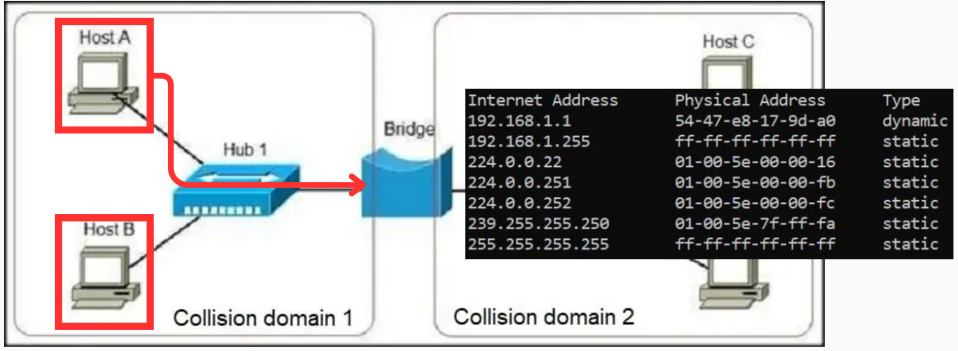
        
    - 목적지가 **다른 세그먼트** 에 있다면 해당 포트로만 데이터를 전달합니다 (Forwarding).
        
        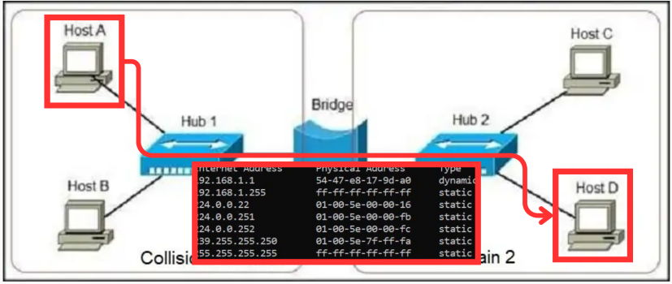
        
3. **플러딩(Flooding)** : 만약 목적지 주소가 테이블에 없다면, 일단 허브처럼 모든 포트로 데이터를 뿌려서 목적지를 찾습니다.
    
    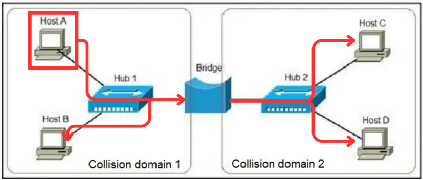
        
### **단점**
소프트웨어 기반으로 동작하여 속도가 느리고, 포트 수가 적어 현재는 스위치로 거의 대부분 대체되었습니다.

---

### 소프트웨어 기반 장치가 느린 이유

- 소프트웨어 기반 장치는 **CPU** 사용
- 하드웨어 기반 장치는 **CPU와 ASIC(맞춤형 설계)칩** 을 사용

하드웨어 기반장치에서는 특수목적 칩인 ASIC칩을 사용해 주소 조회, IP 주소 라우팅 등을 **CPU 대신 수행** 해서 속도가 빠릅니다.

**소프트웨어 기반 장치가 느림에도 사용하는 이유**

- 다양한 기능을 추가, 삭제, 변경하기 쉬움
- 하드웨어 기반 장치는 특정 기능을 수정하려면 칩을 변경해야할 수 있음
- 예시) PC나 일반 서버에 설치된 소프트웨어 라우터나 방화벽의 경우 기능 추가, 업데이트가 있을 수 있음

---

### 네트워크 세그먼트란

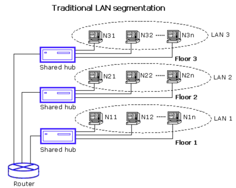

4계층의 전송 단위인 세그먼트(Segment)와는 다른 개념으로 **네트워크를 물리적 또는 논리적으로 분리된 하나의 구역으로 나누는 것**을 의미합니다.

---

## **2. 스위치 (Switch)**

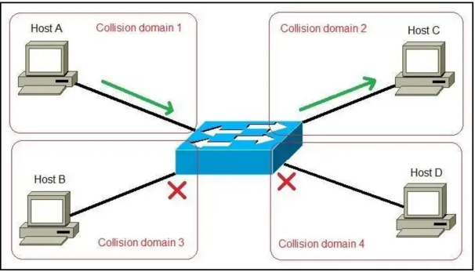

현대 LAN의 **핵심 장비**로, 브리지의 원리를 하드웨어(ASIC 칩) 기반으로 구현하여 훨씬 빠르고 효율적입니다. 

- **핵심 기능**: 각 포트에 연결된 장치의 MAC 주소를 학습하여 **목적지 MAC 주소를 가진 특정 포트로만** 데이터를 전송합니다.
- **장점** :
    - **효율적인 트래픽 관리**: 필요한 곳으로만 데이터를 보내 충돌을 최소화합니다.
    - **성능 향상**: 각 포트가 독립된 충돌 도메인을 가지며
    - **충돌 최소화** : 송신과 수신을 동시에 하는 **전이중 통신**을 지원합니다.

### 스위치 작동 방식

- **Store and forward** : 프레임을 다 받아 검사 후 오류가 없으면 전송
- **Cut through** : 받아 들이는 데이터의 헤더만 보고 오류 검사 없이 전송
- **Fragment free** : 프레임의 첫 64바이트 검사 후 바로 전송

---

## **3. NIC (Network Interface Card)**

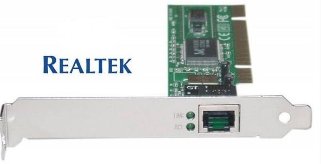

컴퓨터를 네트워크에 물리적으로 연결하는 '랜카드'입니다. 고유한 MAC 주소를 가지고 있어 정확한 장치 식별을 가능하게 합니다. 

- **동작 계층**:
    - L1(신호 생성)
    - L2(MAC 주소 부여, 데이터 프레이밍)의 기능을 모두 수행합니다.

---

# **Layer 3: 네트워크 계층 (Network Layer)**

> IP 주소를 사용하여 서로 다른 네트워크 간의 데이터(패킷) 전송을 책임지며, 최적의 경로를 찾아주는 **라우팅(Routing)** 을 수행합니다.
### 라우팅이란

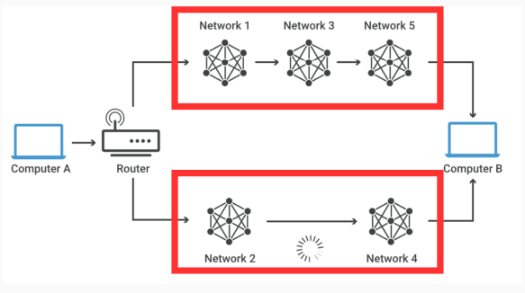

 하나 이상의 네트워크 에서 경로(Hop to Hop)를 선택하는 프로세스

## **1. 라우터 (Router)**

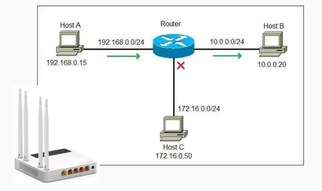

서로 다른 네트워크들을 연결하고, **라우팅 테이블** 을 이용해 목적지까지의 **최적 경로를 설정**하여 패킷을 전달하는 장치입니다.

### **주요 특징** :

- **브로드캐스트 도메인 분리** : 한 네트워크의 브로드캐스트가 다른 네트워크로 전파되는 것을 막아 불필요한 트래픽을 차단합니다.
- **경로 결정 (Routing)** : 라우팅 알고리즘을 통해 최적의 데이터 전송 경로를 선택합니다.
- **보안 (방화벽 및 접근 제어) :** 라우터는 네트워크의 관문 역할을 하므로, 외부의 침입을 막는 1차 방어선이 됩니다.  **접근 제어 목록(ACL)** 과 같은 규칙을 설정하여 허가되지 않은 IP 주소나 특정 서비스(포트)의 접근을 차단하는 기본적인 **방화벽** 기능을 수행합니다.
- **네트워크 주소 변환 (NAT - Network Address Translation)** : **사설 IP 주소** 를 인터넷에서 통용되는 **단 하나의 공인 IP 주소** 로 변환해 줍니다. 이를 통해 공인 IP 주소를 절약하고, 외부에서 내부 네트워크를 직접 볼 수 없게 하여 보안을 강화합니다.
- **네트워크 서비스 제공 (DHCP, DNS 등)** : 특히 가정이나 소규모 사무실에서 사용하는 공유기(라우터)는 네트워크에 접속하는 기기들에게 자동으로 IP 주소를 할당해 주는 **DHCP 서버** 역할을 합니다.

### **작동 방식** :

1. **패킷을 수신**하면
2. 헤더의 목적지 IP를 **라우팅 테이블과 비교**하여 **다음 경로(Next Hop)를 결정**하고,
    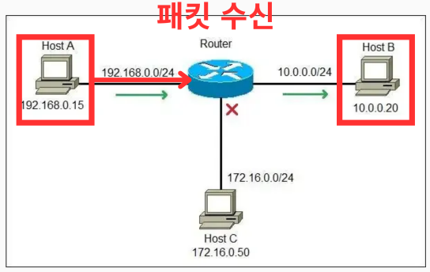
    
3. MAC 주소를 새로 부여하여 패킷을 재캡슐화한 후 전송합니다. 
    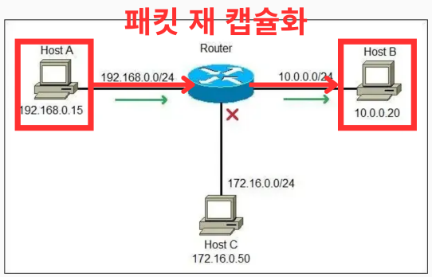
    

---

## **2. L3 스위치**

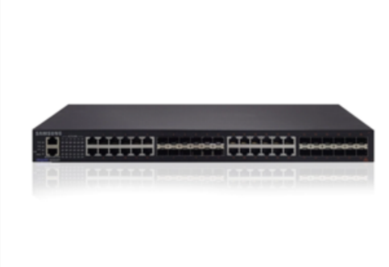

L2 스위치에 **라우팅 기능을 추가**한 고성능 장비입니다. 하드웨어(ASIC) 기반으로 동작하여 소프트웨어 기반의 전통적인 라우터보다 훨씬 빠른 속도로 IP 패킷을 처리합니다. 

### **주요 목적** : 대규모 내부 네트워크에서 VLAN(가상 네트워크) 간의 **빠른 내부 라우팅**을 위해 사용됩니다.

### **라우터와 과거 L3 스위치의 차이점**
|  | **L3 스위치** | **라우터** |
| --- | --- | --- |
| **목적** | 빠른 내부 네트워크 간 라우팅(ex. VLAN 간 통신) | 서로 다른 네트워크 간의 연결 (예: LAN ↔ WAN, 인터넷 연결) |
| **처리 방식** | 하드웨어 (ASIC 칩) | 소프트웨어 (범용 CPU) |
| **포트 구성** | 포트 밀도가 높음 (예: 24, 48 포트) | 포트 밀도가 낮음 (WAN, LAN 등 다양한 포트) |
| **주요 기능** | 고속 IP 패킷 포워딩 | 복잡한 라우팅 프로토콜, NAT, VPN, 방화벽, QoS 등 |

참고 : 요즘은 L3 switch가 빠른 라우터라고 인식해도 될 정도로 차이가 없음

---

# **Layer 4: 전송 계층 (Transport Layer)**

> 포트(Port) 번호를 사용하여 특정 서비스(프로그램)를 식별하고, **종단 간(End-to-end)** 신뢰성 있는 데이터 전송을 관리합니다.

## **1. L4 스위치 (Load Balancer)**

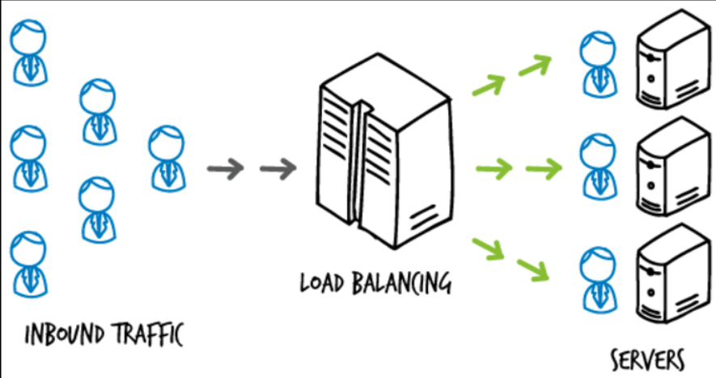

- 서버의 과부하를 방지하기 위해 **로드밸런싱** 을 지원하는 스위치입니다.
- 로드밸런싱은 서버에 가해지는 트래픽을 **IP와 Port를 사용**해 **여러 대의 서버에 고르게 분배** 하는 것입니다.
    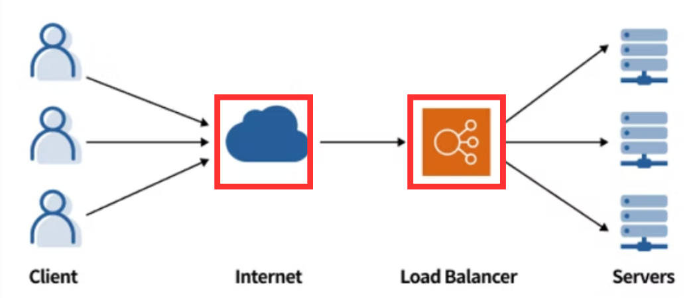
    
- 로드밸런서와 L4 스위치는 직접 관리하는 서버 중 어떤 서버에게 세그먼트를 전달할 지 결정합니다.

- 클라이언트와 서버가 Connection을 생성하면 중간자인 L4 스위치도 **Connection을 생성해 리스트를 관리** 합니다.

#### 로드 밸런싱 주요 전략
- **라운드 로빈(Round Robin)**
    서버에 들어온 요청을 **순서대로** 각 서버에 번갈아 가며 배정하는 방식입니다.

- **가중 라운드 로빈(Weighted Round Robin)**
    각 서버에 가중치를 부여하고, **가중치가 높은 서버에 더 많은 클라이언트의 요청을 전달**하는 방식입니다.

- **최소 연결 방식(Least Connections)**
    현재 **연결된 클라이언트의 수가 가장 적은 서버에** 새로운 요청을 할당하는 방식입니다.

- **가중치 최소 연결(Weighted Least Connections)**
    최소 연결 방식+가중치입니다. 각 서버의 **현재 연결된 클라이언트 수를 확인하는 동시에 서버의 가중치도 고려**해 가장 적합한 서버에 요청을 할당하는 방식입니다.
 

### **핵심 기능** :

- **부하 분산** : 서버에 가해지는 트래픽을 여러 대의 서버에 고르게 분배합니다. 주로 **포트 번호** 를 기준으로 트래픽을 분배합니다.
- **헬스 체크 (Health Check)** : 주기적으로 서버 상태를 점검하여, 장애가 발생한 서버는 서비스에서 제외시켜 **고가용성** 을 보장합니다.
- **DNAT** : 주로 **외부에서 들어오는 트래픽의 목적지 주소를 실제 서버 주소로 변경(DNAT)** 하는 방식으로 로드밸런싱을 수행합니다.
- **보안** : 실제 서버 IP를 외부에 노출하지 않고 가상 IP를 통해 통신하여 보안성을 높입니다.
- **Connection 관리** : TCP와 같은 연결 지향형 통신을 이해하기 때문에, 한 번 맺어진 연결(세션)이 유지되도록 Connection 리스트(State Table)를 관리합니다.

### **장점** :

- **부하 분산**
- **고가용성 및 장애 극복** : 하나의 서버가 정상작동하지 않더라도 **헬스체크(Health Check)등을 통해** 같은 기능을 하는 **다른 서버로 트래픽을 옮길** 수 있습니다.
- **확장성** : 중간자 역할을 하기 때문에 서버 사용량이 늘어나면 클라이언트에서 업데이트 없이 간편하게 서버를 추가할 수 있습니다.
- **보안**

### **단점** :

- **세션 불일치 문제 발생 가능성** : 사용자의 **첫 번째 요청은 A 서버로, 다음 요청은 B 서버로 전달**될 수 있습니다.
    1. 만약 **A 서버**에 사용자의 로그인 정보나 장바구니 내용 같은 **세션(Session) 정보가 저장**됨
    2. **B 서버**는 **이 정보를 알지 못해** "로그인이 풀리거나" "장바구니가 비는" 등의 문제가 발생할 수 있습니다.
        - **해결 방안**
            - **스티키 세션(Sticky Session)** : 특정 사용자의 요청을 항상 동일한 서버로 보냄
            - **세션 스토리지 구축** : 모든 서버가 세션 정보를 공유하도록 하는 설계
- **설정 및 관리의 복잡성** :
로드밸런서 자체의 설정, 헬스 체크 방식, 부하 분산 전략 선택 등 초기 구축과 운영에 대한 전문적인 지식이 필요하며, 이는 전체 시스템의 복잡도를 높이는 원인이 될 수 있습니다.
- **도입 비용 및 성능** : 
고성능의 로드밸런싱 장비(하드웨어)는 가격이 비쌀 수 있습니다. 또한, 로드밸런서가 모든 트래픽을 처리하는 중간 지점이 되므로, 로드밸런서 자체의 성능이 전체 시스템의 병목점이 되지 않도록 신중한 설계가 요구됩니다.

---

# **Layer 7: 애플리케이션 계층 (Application Layer)**

> HTTP, FTP 등 사용자와 직접 상호작용하는 프로토콜이 동작하며, 데이터의 **실제 내용(콘텐츠)** 을 다룹니다.

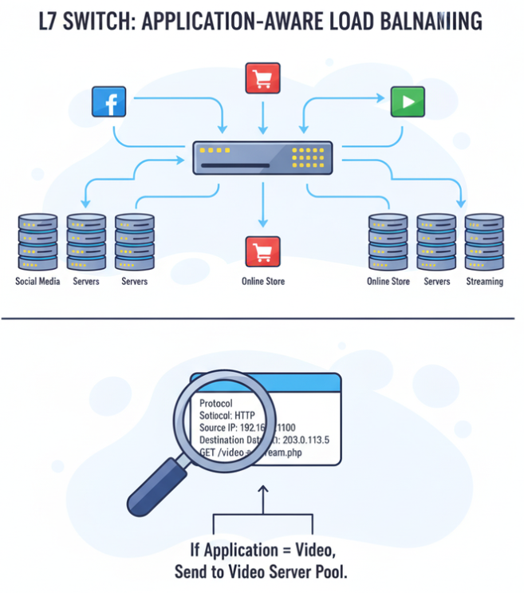

## **1. L7 스위치 (Application Delivery Controller)**

L4 스위치의 기능을 넘어, 패킷의 **데이터(콘텐츠)까지 분석** 하여 트래픽을 관리하는 가장 지능적인 스위치입니다.

### **L4와의 결정적 차이(작동방식)** :

- **L4 스위치**: "80번 포트로 가는 요청이네. 웹 서버 중 한 곳으로 보내야지." (단순 포트 기반 분배)
- **L7 스위치**: "80번 포트 요청인데, URL이 `/images`네. 이미지 서버로 보내야겠다. 그런데 헤더에 악성 패턴이 보이니 이건 차단해야지." (콘텐츠 기반의 정교한 분배 및 보안)

### **주요 기능** :

- **패킷 심층 분석(Deep Packet Inspection)** : HTTP 헤더, URL, 쿠키, SSL/TLS 인증서 등을 분석합니다.
- **보안 강화** : 애플리케이션 데이터의 내용 자체를 분석할 수 있으므로, 웹 방화벽(WAF, Web Application Firewall)의 역할을 수행할 수 있습니다.
- **지능적 로드밸런싱** : 요청의 종류에 따라 가장 잘 처리할 수 있는 서버 그룹으로 트래픽을 보냅니다.
- **서비스 품질 보증 :**
    - **트래픽 우선순위 제어 :**
        - 상황: 쇼핑몰 사이트에서 '상품 구경' 요청과 '결제' 요청이 동시에 대량으로 들어옴
        - L7 스위치의 판단: URL을 분석하여 `/products` 요청보다 `/payment` 요청이 비즈니스에 훨씬 중요하다는 것을 인지합니다.
        - 동작: 서버 자원이 한정되어 있을 때, '결제' 요청을 우선적으로 처리하도록 트래픽 순서를 제어하여 중요한 서비스의 품질을 보장합니다.
- **캐싱 및 압축** :
    - **캐싱(Caching)** :
        - **첫 번째 요청**: 사용자가 로고 이미지(`logo.png`)를 요청하면, L7 스위치는 웹 서버로부터 이미지를 받아 사용자에게 전달하고, **그 이미지를 자신의 메모리에 복사(캐시)** 해 둡니다.
        - **두 번째 요청**: 다른 사용자가 같은 로고 이미지를 요청하면, L7 스위치는 웹 서버까지 가지 않고 자신이 저장해 둔 **캐시에서 바로 이미지를 꺼내** 전달합니다. 이로 인해 서버의 부하가 줄고 사용자는 훨씬 빠르게 이미지를 볼 수 있습니다.
    - **압축(Compression)** :
        - 웹 서버가 보낸 텍스트 기반의 데이터(HTML, CSS 등)를 L7 스위치가 **압축해서 사용자에게 전달** 합니다. 파일 크기가 작아지므로 사용자의 데이터 다운로드 속도가 빨라집니다.

---

# **각 계층의 스위치 비교**

| 구분 | L2 스위치 | L3 스위치 | L4 스위치 | L7 스위치 (ADC) |
| --- | --- | --- | --- | --- |
| 주요 기능 | 스위칭 (Switching) | 라우팅 (Routing) | 로드 밸런싱 (Load Balancing) | 애플리케이션 딜리버리 |
| 확인 데이터(헤더 위주) | 목적지 MAC 주소, 출발지 MAC 주소, VLAN 태그(802.1Q, 선택적) | 출발지/목적지 IP 주소, TTL(Time To Live), 프로토콜 번호(TCP/UDP 등) | 출발지/목적지 포트 번호, 시퀀스 번호, 플래그(SYN, ACK 등) | 애플리케이션 데이터(HTTP 헤더, URL, 쿠키 등) |
| 참조 정보 | MAC 주소 (2계층) | IP 주소 (3계층) | Port 번호 (4계층) | 애플리케이션 데이터 (7계층) |
| 데이터 단위 | 프레임 (Frame) | 패킷 (Packet) | 세그먼트 (Segment) | 데이터/메시지 (Data) |
| 주요 목적 | 동일 네트워크 내 장치 연결 | 서로 다른 네트워크 간 연결 | 서버 부하 분산 | 지능형 트래픽 분산 및 제어 |

# 📚 출처 및 프롬프트

### 출처

**https://www.cloudflare.com/ko-kr/learning/network-layer/what-is-routing/**

**http://www.ktword.co.kr/test/view/view.php?no=2724**

**https://www.simulationexams.com/tutorials/ccna/vlan/vlans-2.htm**

**https://study-ccna.com/**