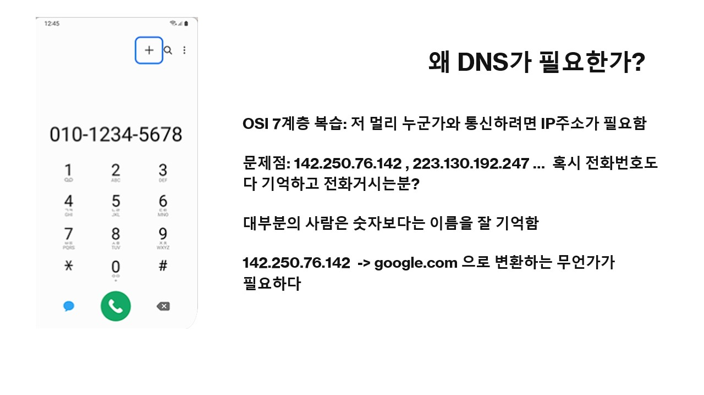
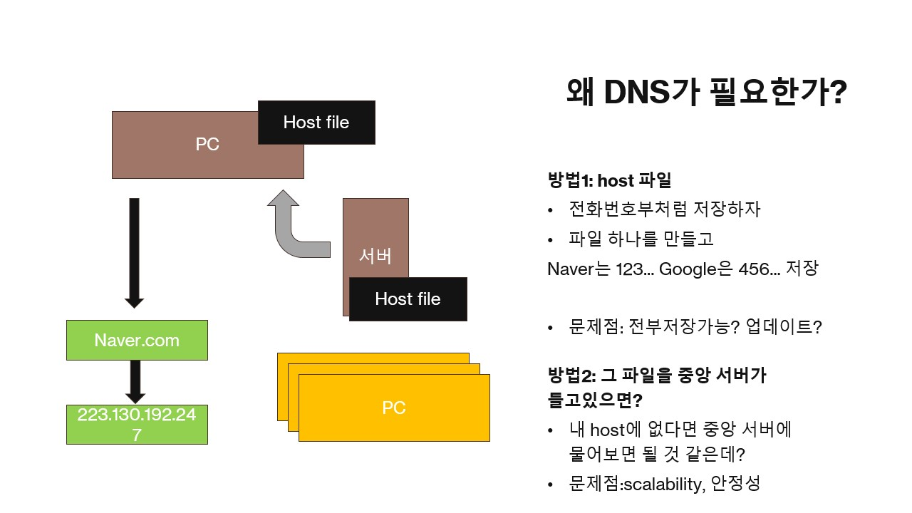
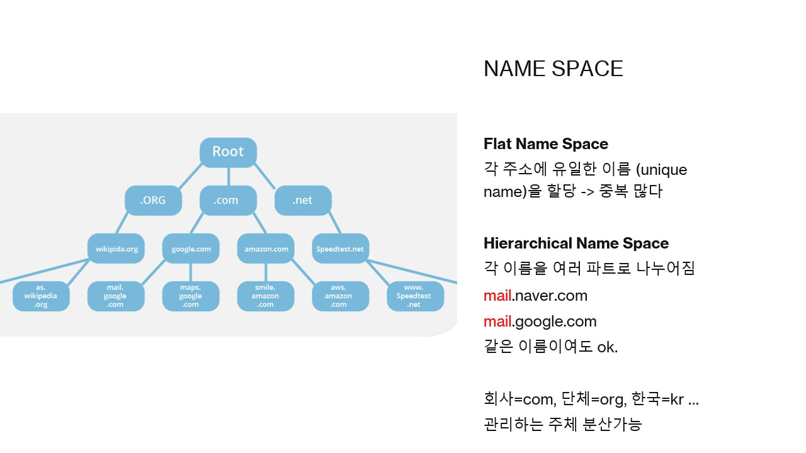
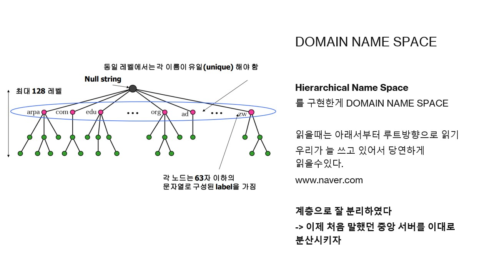
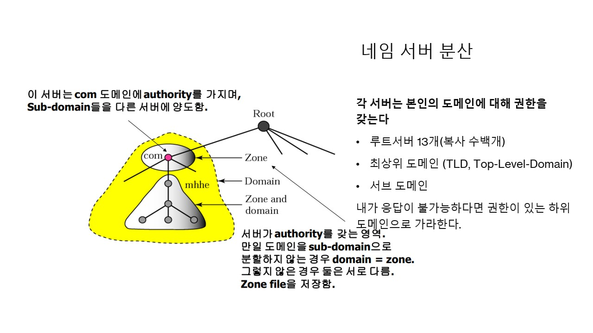
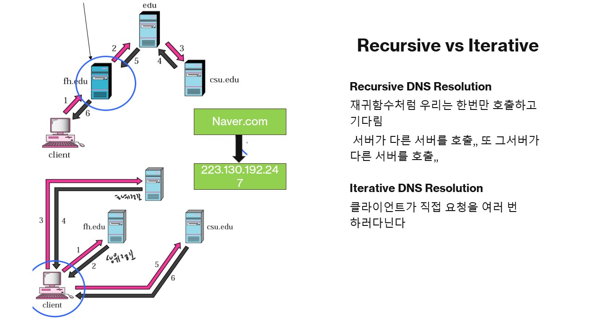
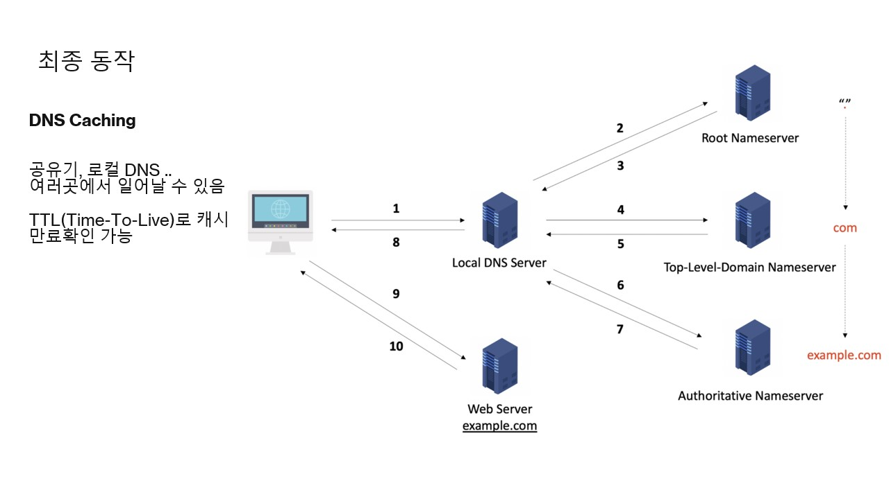

# DNS (Domain Name System)

## DNS 개요

DNS는 'Domain Name System'의 약자로, 사람이 기억하기 쉬운 도메인 이름(예: `google.com`)을 컴퓨터가 통신할 때 사용하는 IP 주소(예: `142.250.76.142`)로 변환해주는 시스템입니다.

DNS는 왜 필요할까요?

만약 DNS가 없다면, 우리는 웹사이트에 접속할 때마다 복잡하고 긴 숫자로 된 IP 주소를 직접 입력해야 할 것입니다.
그런데 우리는 전화번호조차 외우고 다니지 않습니다. 당연히 ip주소도 외우기 힘듭니다.

우리는 전화번호를 모두 외우는 대신 '친구1', '엄마'처럼 이름으로 저장하고 실제 번호를 불러옵니다. 전화번호부처럼 도메인 이름도 실제ip로 변환하는 무언가가 있으면 좋겠지요?

그런데 어떤 방식으로 변환할까요? 지금부터 그 과정을 알아보겠습니다.

---

## 초기의 DNS 아이디어와 한계

오늘날의 복잡하고 정교한 DNS 시스템이 처음부터 있었던 것은 아닙니다. 초기에는 다음과 같은 간단한 방법들이 고려되었지만, 명확한 한계가 있었습니다.

- **방법 1: 각 컴퓨터가 `hosts` 파일로 저장하기**  
   - 모든 PC가 각자의 컴퓨터에 '전화번호부'처럼 도메인과 IP 주소 목록을 파일로 가지고 있는 방식입니다.

  - **문제점:** 새로운 웹사이트가 생기거나 IP 주소가 바뀔 때마다 전 세계 모든 PC의 파일을 동시에 업데이트하는 것은 현실적으로 불가능합니다. **확장성**이 매우 떨어집니다.

- **방법 2: 하나의 중앙 서버에서 관리하기**
  - 모든 도메인 목록을 단 하나의 중앙 서버에 저장하고, 모든 PC가 그 서버에 물어보는 방식입니다.
  - **문제점:** 전 세계의 모든 요청이 한 서버로 몰리면 과부하로 서버가 다운될 위험이 큽니다. 이 서버의 장애 때문에 모두가 인터넷을 못하는 상황이 일어날 수 있습니다.   
  즉, **Scalability**와 **안정성**에 문제가 있습니다.

이러한 문제들 때문에, DNS는 중앙 집중 방식이 아닌 **분산된 계층 구조**로 설계되었습니다.

---

## 이름 공간 (Name Space)
분산된 계층 구조의 DNS를 알아보기 전에 잠시 도메인 이름은 어떻게 짓는지에 대해 알아보겠습니다.

- **Flat Name Space**
  - flat name space 방식은 모든 이름이 유일해야 하는 단순한 구조입니다,
  - 만약 flat하게 짓는다면 mail, ai, internet 같은 특별한 이름은 선점하기도 힘들고, 단순하게 이름짓는데도 중복을 피하기 힘들 것입니다.

- **Hierarchical Name Space**  
  - 따라서 DNS는 이름 중복을 피하고 관리를 쉽게 하기 위해 **계층적 이름 공간** 구조를 사용합니다. 
  - 계층 구조는 각 이름을 여러 파트로 나누어 중복을 허용하면서도 전체 주소는 고유하게 만듭니다.
  - 예를 들어, `mail.google.com`과 `mail.naver.com`에서 'mail'이라는 이름은 중복되지만, 전체 주소는 서로 다릅니다.

- 알면 좋은 용어 정리:
    - 맨 위는 **루트**(root), 그 아래 Top Level Domain을 줄인 **TLD**(.com, .org, .kr …), 그 아래 **세부 도메인**이 이어집니다.(그림참조)

---

- **Domain Name Space**  
   사실 용어만 거창하지 여러분들이 당연하듯이 알고 있습니다.
   - `www.google.com'은 루트-> com -> google -> www 방향으로 진행되지만 읽을때는 www google com 이렇게 읽습니다.
  - `www.google.com` 이라는 주소는 가장 오른쪽부터 `.`(루트) -> `com`(최상위 도메인) -> `google`(차상위 도메인) -> `www`(호스트) 순으로 구성됩니다.

---
## 네임서버 분산과 권한(Authority)
  
  - 이렇게 분리한 계층을 이용해 권한 분배(분산)를 할 수 있습니다.
  - 각 네임서버는 자신이 책임지는 도메인 에 대해 권한(Authority) 을 가집니다  (ex: com이라면 naver.com, google.com ... 등등에 답할수 있음.)
  - ip 주소를 알려줄수 없다면 다음에 물어 볼 하위 네임서버로 위임 합니다.
  (ex:현재 네임서버가 kr이고 www.jbnu.ac.kr 을 물어본다면 ac네임서버로 보낸다)

---
## Recursive vs Iterative

- Recursive Resolution  
    - 마치 재귀함수처럼 도메인서버 A에게 물어봤으면 A가 B에게 이어서 물어보고 B가 C에게 물어보는 방식입니다 
    - 클라이언트에서는 로컬 DNS에 한 번만 물어보고 결과만 기다리므로 비용이 적게 들지만 로컬 DNS는 다른 네임서버로부터 응답이 올때까지 연결을 유지해야하는 단점이 있습니다.

- Iterative Resolution  
    - 위와 반대로 클라이언트가 직접 루트, TLD, Authoritative 이렇게 차례차례 질의 하는 방식입니다.
    - recursive의 반대로 클라이언트가 바쁩니다.

현실의 PC는 보통 재귀 방식으로 로컬DNS에게 묻고 
로컬 DNS가 루트→TLD→Authoritative 로 iterative하게 묻는 방식입니다.

## DNS 동작 원리
최종적으로 DNS 동작을 정리하겠습니다. 
우리가 주소창에 `www.example.com`을 입력하면, 우리 PC는 가장 먼저 설정된 **Local DNS 서버**(보통 통신사에서 제공)에게 물어보는 것으로 통신을 시작합니다. 이 전체 과정을 **DNS Resolution**이라고 합니다.

1.  **PC → Local DNS 서버**
    - PC는 Local DNS 서버에게 "www.example.com의 IP 주소가 뭐야?"라고 한 번(Recursive Query) 질문합니다. 그러면 Local DNS 서버가 모든 과정을 책임지고 최종 결과값을 알려줍니다.

2.  **Local DNS 서버 → 다른 네임서버들 (Iterative Query)**
    - Local DNS 서버는 PC를 대신해 IP 주소를 찾기 위해 여러 서버와 통신합니다.
      - **(2→3)** 먼저 **Root 네임서버**에게 "`.com` 네임서버 주소 알려줘"라고 묻습니다.
      - **(4→5)** 응답받은 **TLD(.com) 네임서버**에게 "`example.com` 네임서버 주소 알려줘"라고 묻습니다.
      - **(6→7)** 마지막으로 응답받은 **Authoritative 네임서버**(`example.com`을 직접 관리하는 서버)에게 "www.example.com의 IP 주소는 뭐야?"라고 묻고 최종 IP 주소를 얻습니다.

3.  **Local DNS 서버 → PC**
    - Local DNS 서버는 최종적으로 알아낸 IP 주소를 PC에게 전달합니다.

### DNS 캐싱 (Caching)
Local DNS는 상당히 바쁠것같지만 생각보다 그렇지 않습니다.
- 공유기, Local DNS, 다른 네임서버들에서 전부 캐시가 일어날수 있기 때문에 재조회 대신 캐시된 결과를 사용합니다.
- 만약 다른 사용자가 동일한 도메인을 다시 요청하면, 위와 같은 복잡한 과정을 반복하지 않고 캐시에서 바로 IP 주소를 응답하여 속도를 크게 향상시킵니다.
- 한번 조회된 도메인의 IP 주소는 일정 시간 동안 저장(캐싱)되며 이 캐시가 저장되는 시간은 **TTL(Time-To-Live)** 값에 의해 결정됩니다. 
