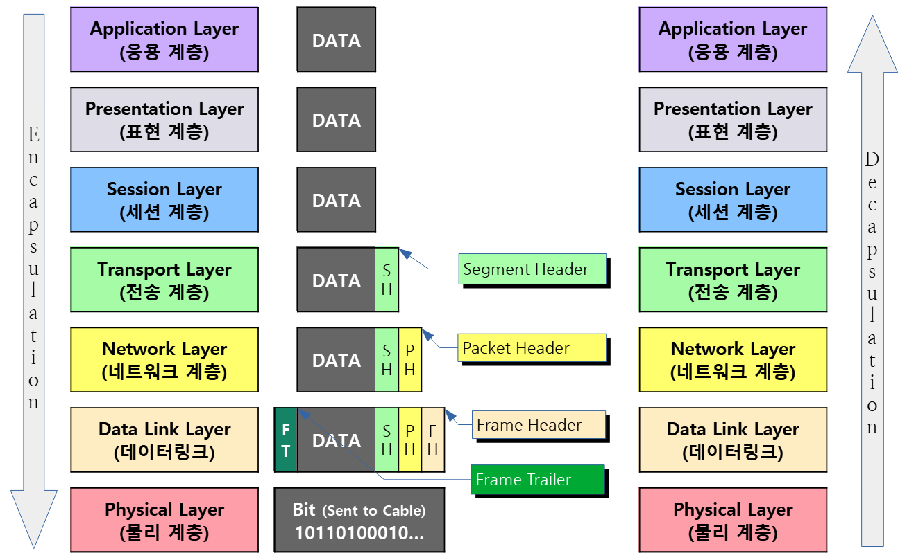

# OSI 7계층 PDU

 

## 목차
- [OSI 7계층 PDU](#osi-7계층-pdu)
  - [목차](#목차)
  - [OSI 7계층 PDU](#osi-7계층-pdu-1)
    - [OSI 7계층 전송 흐름](#osi-7계층-전송-흐름)
    - [왜 이런 방식으로 덧붙이는지?](#왜-이런-방식으로-덧붙이는지)

 

## OSI 7계층 PDU

### OSI 7계층 전송 흐름

 

 

**OSI 7계층 전송 흐름** 

- 송신자에서 데이터가 각 계층별로 캡슐화되어 **`헤더가 차례로 추가됨`**
- 물리 계층에서 신호로 전환되어 전송됨
- 수신자에서 데이터가 **`각 계층별로 역캡슐화`** 되어 헤더가 차례로 제거됨
- 이렇게 흐름을 거쳐 송신자에서 수신자로 데이터가 전송됨

 

- **캡슐화** :
    - 데이터는 맨 위 7계층에서부터 아래로 내려오면서
    - 각 계층마다 자신의 역할에 `필요한 정보(헤더)`를 덧붙여 포장.
    - 상위 계층에서 내려오면서 각 계층 프로토콜이 헤더(필요 시 트레일러도 포함)를 붙임
- **역캡슐화** :
    - 데이터를 받은 컴퓨터는 맨 아래 1계층부터 위로 올라가면서
    - 정확히 `역순으로 헤더를 벗겨내며 원본 데이터를 확인`.
    - 반대로 하위 계층에서 올라오면서 각 계층이 자신의 헤더를 해석하고 제거

 

- **`각 계층은 데이터 전송 단위`** 를 가지고 있음 (PDU: Protocol Data Unit)
    - 응용, 표현, 세션: 데이터(Data)
    - 전송: 세그먼트(Segment), 데이터그램(Datagram)
    - 네트워크: 패킷(Packet)
    - 데이터 링크: 프레임(Frame)
    - 물리: 비트(Bit)

 

### 왜 이런 방식으로 덧붙이는지?

**계층별 역할 분리**

- **`각 계층은 자신만의 기능`** (전송, 라우팅, 오류 제어 등)을 담당
- 헤더 덧붙여 하위 계층에 **`필요한 제어 정보`** (주소, 순서, 오류 검증 등)를 전달해 기능을 수행할 수 있게 함
- **`계층별로 문제를 분리`** 해 디버깅과 최적화가 쉬워짐
- 네트워크에 문제가 생겼을 때, **`어느 계층의 문제인지`** 범위를 좁혀서 찾아낼 수 있음

 

**독립성 및 호환성 유지**

- 계층 간 독립성을 유지해 하위 계층이 변해도 **`상위 계층에 영향을 주지 않음`**
- 프로토콜과 장비의 호환성을 보장
- 각 계층은 자신의 역할에만 충실
- 다른 계층이 어떻게 동작하는지 신경 쓰지 않음
- 다른 계층과 독립적으로 개발, 수정 가능

 

**효율적인 데이터 처리**

- 헤더 정보로 데이터 흐름 제어, 신뢰성 보장, 목적지 지정 등이 가능해짐
- **`복잡한 통신 과정을 효과적으로 관리`**

 

**재사용성과 확장성** 

- **`프로토콜 구조가 모듈화되어`** 새로운 기술, 기능이 쉽게 추가되며 재사용이 가능
- 새로운 기술이 나와도, **`해당 계층의 헤더만 정의하면 되어`** 전체 구조 갈아엎을 필요 없음