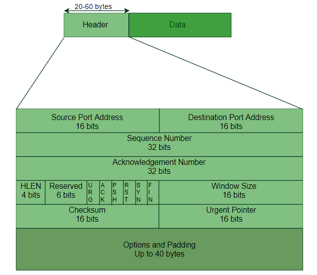
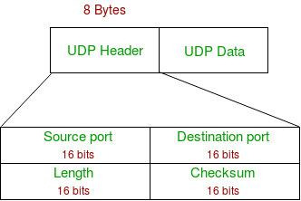
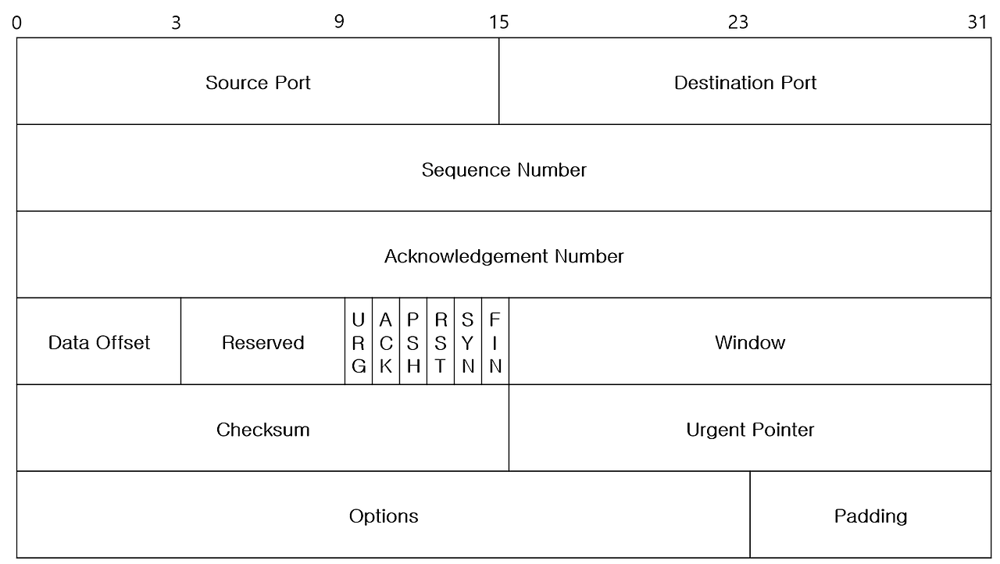
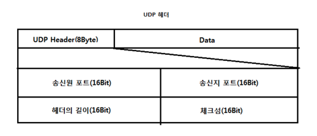

# Segment / Datagram

 

## 목차
- [Segment / Datagram](#segment--datagram)
  - [목차](#목차)
  - [Segment / Datagram](#segment--datagram-1)
    - [구조](#구조)
    - [TCP 헤더](#tcp-헤더)
    - [UDP 헤더](#udp-헤더)

 

## Segment / Datagram

### 구조

4계층 Transport Layer (전송 계층)에서 사용하는 PDU는 사용하는 프로토콜에 따라 두 가지로 나뉨

- **세그먼트 (Segment)**: **TCP** 프로토콜에서 사용하는 데이터 단위
- **데이터그램 (Datagram)**: **UDP** 프로토콜에서 사용하는 데이터 단위

 

세그먼트, 데이터그램은 각각 TCP/UDP 헤더 + 데이터 (data payload)로 나뉨

이 데이터는 상위 계층인 application layer에서 내려온 데이터임

 

**Segment 구조**

 

**Datagram 구조**

 

### TCP 헤더

 

TCP 헤더는 기본적으로 **20바이트**의 고정 길이를 가짐

추가적인 정보가 필요할 경우 **옵션(Options)** 필드가 붙어 최대 60바이트까지 확장될 수 있음

 

**TCP 헤더 구성**

- 출발지 포트
- 도착지 포트
- sequence number
- Acknowledgement number
- 헤더 길이
- 예약 필드 (reserved)
- 제어 플래그
- 윈도우 크기 (window size)
- checksum
- 긴급 포인터
- 옵션

 

**1. 출발지 & 목적지 포트 (Source & Destination Port)**

- **Source Port (2 바이트)**:
    - 데이터를 보내는 컴퓨터의 어떤 프로그램에서 데이터가 시작되었는지를 나타내는 포트 번호.
- **Destination Port (2 바이트)**:
    - 데이터를 받는 컴퓨터의 어떤 프로그램으로 데이터를 전달해야 하는지를 나타내는 포트 번호.
- **역할**:
    - 이 포트 번호 덕분에 운영체제는 도착한 세그먼트를 올바른 애플리케이션에 정확히 전달 가능.

 

**2. 순서 & 확인 번호 (Sequence & Acknowledgment Number)**

TCP의 신뢰성을 책임지는 가장 중요한 필드들

- **Sequence Number (4 바이트)**:
    - "내가 보내는 데이터의 첫번째 바이트 전체 데이터 흐름에서 몇 번째 바이트"라고 알려주는 번호.
    - 이 번호 덕분에 수신 측은 데이터를 순서대로 재조립할 수 있게됨.
    - 각 segment에 붙어 식별할 수 있게 하는 ID 같은 것이 아님
    - 각 세그먼트가 운반하는 데이터가 **전체 데이터 흐름에서 몇번째 바이트부터 시작하는지 알려주는 주소**
- **Acknowledgment Number (4 바이트)**:
    - "내가 당신에게 받아야 할 다음 데이터는 몇 번째 바이트부터 시작해"라고 알려주는 **번호**.
    - 상대방에게 데이터를 잘 받았음을 알려주는 역할.

 

**3. 헤더 길이 & 예약 필드**

- **Header Length (4 비트)**:
    - TCP 헤더의 전체 길이를 나타냄.
    - 이 값에 4를 곱하면 실제 헤더의 바이트 길이.
    - 4로 나누는 이유는 헤더 공간을 효율적으로 절약하기 위해서
        - TCP 크기 20~60 바이트인데 크기 bit 값으로 저장하려면 공간 많이 차지
- **Reserved (6 비트)**:
    - 미래를 위해 예약된 필드.
    - 현재는 사용되지 않고 0으로 채워져 있음.

 

**4. 제어 플래그 (Control Flags)**

TCP의 연결 상태를 제어하는 6개의 중요한 1비트짜리 Flag. 

켜져 있으면(1) 특별한 의미를 가짐.

- **URG (Urgent)**:
    - 긴급한 데이터라는 의미.
    - 정상적인 데이터 처리 순서를 무시하고 즉시 처리되어야 할 때 사용.
    - ex : 원격 터미널에서 Ctrl+C로 명령 강제로 중단할 때
- **ACK (Acknowledgment)**:
    - Acknowledgment Number 필드가 유효하다는 의미.
    - 연결 수립 후 대부분의 세그먼트에서 1로 설정됨.
- **PSH (Push)**:
    - 받은 데이터를 버퍼에 쌓아두지 말고 즉시 상위 계층(애플리케이션)으로 전달하라고 요청.
    - 실시간 채팅이나 터미널에 입력하는 경우처럼 바로 보여야 하는 경우 사용.
- **RST (Reset)**:
    - 비정상적인 연결을 강제로 끊을 때 사용.
- **SYN (Synchronize)**:
    - 연결을 시작할 때(3-way handshake) 사용.
    - "연결을 요청합니다"라는 의미.
- **FIN (Finish)**:
    - 연결을 정상적으로 종료할 때(4-way handshake) 사용.
    - "보낼 데이터가 더 이상 없습니다"라는 의미.

 

**5. 윈도우 크기 & 체크섬**

- **Window Size (2 바이트)**:
    - 한 번에 수신할 수 있는 데이터의 크기를 상대방에게 알려주는 값.
    - 이 값을 통해 수신 측의 버퍼가 넘치지 않도록 데이터 전송량을 조절하는 흐름 제어 수행.
- **Checksum (2 바이트)**:
    - 데이터 전송 중 헤더나 데이터에 오류가 발생했는지 검사하기 위한 값.
    - **오류 검출**을 통해 데이터의 무결성을 보장.

 

**6. 긴급 포인터 & 옵션**

- **Urgent Pointer (2 바이트)**:
    - URG 플래그가 1로 설정되었을 때, 긴급한 데이터가 어디까지인지를 알려주는 포인터.
    - **Sequence Number를 기준점**으로 삼아, 얼마나 떨어져 있는지(Offset)를 알려주는 방식으로 긴급한 데이터의 위치를 알려줌
- **Options (가변 길이)**:
    - 필요에 따라 추가적인 기능을 사용하기 위한 필드
    - 예: Maximum Segment Size (MSS) - 한 번에 전송할 수 있는 최대 데이터 크기 지정
    - 옵션에 가능한 것은?
        - MSS (Maximum Segment Size) : 한번에 수신할 수 있는 데이터 최대 크기 협상할 때 사용
        - Window Scale (윈도우 크기 확장) : 더 큰 수신 윈도우 사용하도록 협상할 때 사용
        - SACK (Selective Acknowledgment) : 어떤 데이터 빠졌는지 정확히 알려주는 것
        - Timestamps (타임스탬프) : 네트워크 왕복 시간 (RTT) 정확히 측정 등

 

### UDP 헤더

 

UDP 헤더는 단순함과 속도를 위해 설계되었음

TCP 헤더처럼 복잡한 기능 없이, 데이터를 빠르고 가볍게 전달하는 데 필요한 최소한의 정보만 담고 있음

오직 데이터를 특정 애플리케이션에 전달하는 최소한의 기능에만 집중

빠르고 효율적인 통신이 가능하도록 설계됨

 

UDP 헤더는 8바이트의 고정된 크기

UDP 헤더는 총 4개의 필드로 구성되어 있음

따라서 각 필드는 2바이트(16비트)의 크기를 가짐

 

**UDP 헤더 구성**

- 출발지 포트
- 목적지 포트
- 해더 길이
- Checksum

 

**1. 출발지 포트 (Source Port)**

- **크기**: 2 바이트 (16 비트)
- **역할**: 데이터를 보내는 쪽 컴퓨터의 애플리케이션(프로세스)을 식별하는 번호.
- **설명**:
    - 이 datagram에 대한 응답을 받을 필요가 없는 경우, 이 필드는 0으로 설정될 수 있음.
    - 즉, 선택적으로 사용되는 필드.
    - TCP는 양방향 통신 위해 반드시 source port 필요함

 

**2. 목적지 포트 (Destination Port)**

- **크기**: 2 바이트 (16 비트)
- **역할**: 데이터를 받는 쪽 컴퓨터의 애플리케이션(프로세스)을 식별하는 번호.
- **설명**:
    - 운영체제는 이 포트 번호를 보고 어떤 프로그램에게 데이터를 전달해야 할지 결정.
    - UDP 헤더에서 가장 핵심적인 필드.

 

**3. 헤더 길이 (Header Length)**

- **크기**: 2 바이트 (16 비트)
- **역할**: UDP 헤더(8바이트)와 데이터(Payload) 모두 합친 전체 datagram의 길이 바이트 단위로 나타냄.
- **설명**:
    - 이 필드의 최소값은 데이터가 없는 경우인 8바이트.

 

**4. 체크섬 (Checksum)**

- **크기**: 2 바이트 (16 비트)
- **역할**: 데이터 전송 중 오류가 발생했는지 검사하기 위한 값.
- **설명**:
    - 이 필드는 IPv4에서는 선택 사항(optional)이지만, IPv6에서는 필수.
    - 사용하지 않을 경우 모든 비트를 0으로 채움.