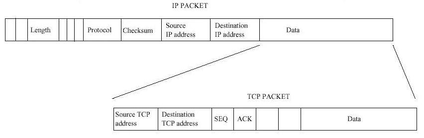
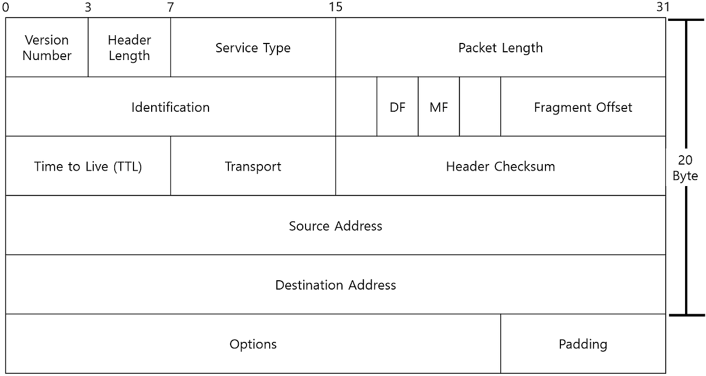

# Packet

<br>

## 목차
- [Packet](#packet)
  - [목차](#목차)
  - [Packet](#packet-1)
    - [구조](#구조)
    - [IP 헤더](#ip-헤더)

<br>

## Packet

### 구조



<br>

3계층 Network Layer (네트워크 계층)에서 사용하는 PDU

<br>

패킷은 각각 IP 헤더 + 데이터 (data payload)로 나뉨

이 데이터는 상위 계층인 transport layer에서 내려온 segment, datagram로 통째로 들어감

따라서 패킷의 구조는 아래와 같음

```
[ IP헤더 + TCP/UDP 헤더 + 애플리케이션 데이터 ]
```

<br>

### IP 헤더



<br>

IP 헤더는 기본적으로 **20바이트**

필요에 따라 옵션(Options)이 추가되어 최대 60바이트까지 늘어날 수 있음

(IPv4 기준)

<br>

**IP 헤더 구성**

- 버전 (Version Number)
- 헤더 길이 (Header Length)
- 서비스 유형 (Service Type)
- 패킷 전체 길이 (Packet Length)
- 식별자 (Identification)
- 분할 관련 필드 중 Flags
- 분할 관련 필드 중 Fragment Offset
- 생존 시간 (TTL)
- 프로토콜 (Protocol)
- 헤더 체크섬 (Header Checksum)
- 출발지 IP 주소 (Source Address)
- 목적지 IP 주소 (Destination Address)
- 옵션 (Options)
- 패딩 (Padding)

<br>

**1. 버전 (Version Number)**

- **크기**: 4 비트
- **역할**: IP 프로토콜의 버전을 나타냄.
- **설명**:
    - IPv4이므로 이 값은 항상 **4**.
    - 라우터는 이 값을 보고 패킷을 IPv4 규칙에 따라 처리.

<br>

**2. 헤더 길이 (Header Length)**

- **크기**: 4 비트
- **역할**: IP 헤더 전체의 길이를 32비트 워드(4바이트) 단위로 나타냄.
- **설명**:
    - 대부분의 헤더는 옵션이 없어 20바이트이므로, 이 값은 보통 **5**.
    - 이 값에 4를 곱하면 실제 헤더의 바이트 길이.

<br>

**3. 서비스 유형 (Service Type)**

- **크기**: 8 비트
- **역할**: 이 패킷을 얼마나 중요하게, 또는 긴급하게 처리해야 하는지에 대한 우선순위 의미.
- **설명**:
    - 예를 들어, 실시간 영상 스트리밍 패킷은 일반 웹서핑 패킷보다 더 높은 우선순위 갖도록 설정 가능.

<br>

**4. 전체 길이 (Packet Length)**

- **크기**: 16 비트
- **역할**: **IP 헤더와 페이로드(데이터)를 모두 합친** 패킷 전체의 길이를 바이트 단위로 나타냄.
- **설명**: 이 값을 통해 수신 측은 어디까지가 하나의 패킷인지 식별 가능.

<br>

**5. 식별자 (Identification) & 분할 관련 필드**

이 세 필드는 큰 패킷이 작은 조각으로 나뉘어 전송될 때 사용.

- **Identification (16 비트)**:
    - 패킷이 여러 조각(Fragment)으로 나뉘었을 때 사용
    - "이 조각들은 원래 하나의 패킷이었다"는 것을 알려주는 고유한 ID 번호.
    - 패킷 크기가 네트워크의 **MTU (Maximum Transmission Unit)**보다 큰 경우 패킷 나눔
- **Flags (3 비트)**:
    - 패킷 분할과 관련된 3가지 Flags.
    - **DF (Don't Fragment)**:
        - 1로 설정되면 "이 패킷은 절대 조각내지 마세요"라는 의미.
    - **MF (More Fragments)**:
        - 1로 설정되면 "이 뒤에도 조각난 패킷이 더 있습니다"라는 의미.
        - 마지막 조각은 0이 됨.
- **Fragment Offset (13 비트)**:
    - 각 조각이 원래 패킷의 **어느 위치**에 있었는지를 알려주는 값.
    - 수신 측은 이 값을 보고 조각들을 올바른 순서로 재조립.

<br>

**6. 생존 시간 (TTL)**

- **크기**: 8 비트
- **역할**: 패킷이 인터넷 상에서 무한정 떠도는 것을 방지하는 수명.
- **설명**:
    - 패킷이 라우터를 하나 거칠 때마다 이 값이 1씩 감소.
    - 0이 되면 해당 패킷은 소멸.
    - 왜 라우터당 1씩 감소?
    - 패킷이 네트워크 안에서 무한정 떠도는 것을 막기 위한 가장 간단하고 확실한 방법.

<br>

**7. 프로토콜 (Protocol)**

- **크기**: 8 비트
- **역할**: 이 패킷의 페이로드(데이터 부분)에 어떤 프로토콜의 데이터가 들어있는지 알려주는 **꼬리표**.
- **설명**:
    - 이 값이 **6**이면 payload는 TCP segment.
    - 이 값이 17이면 payload는 UDP datagram.
    - 수신 측은 이 값을 보고 데이터를 4계층의 TCP 또는 UDP에게 전달.

<br>

**8. 헤더 체크섬 (Header Checksum)**

- **크기**: 16 비트
- **역할**: IP 헤더 자체에 오류가 발생했는지 검사하기 위한 값.
- **설명**: 데이터 부분은 검사하지 않고, 헤더 부분만 검사하여 전송 중 헤더 정보가 손상되었는지 확인.

<br>

**9. 출발지 & 목적지 IP 주소 (Source & Destination Address)**

IP 헤더의 가장 핵심적인 정보.

- **Source IP Address (32 비트 / 4 바이트)**:
    - 패킷을 보낸 컴퓨터의 IP 주소.
- **Destination IP Address (32 비트 / 4 바이트)**:
    - 패킷을 받을 최종 목적지 컴퓨터의 IP 주소.

<br>

**10. 옵션 (Options) & 패딩 (Padding)**

- **옵션 (Options)**
    - **크기**: 최대 40 바이트, 가변 길이
    - **역할:**
        - 경로 추적, 보안 설정 등 특수한 기능을 위해 사용되는 선택적 필드.
- **패딩 (Padding)**:
    - **역할:**
        - 헤더의 전체 길이가 4바이트의 배수가 되도록 패딩(Padding)이 추가될 수 있음.
        - CPU의 처리 효율을 극대화하기 위해서
        - **4바이트 워드(Word)** 단위로 한 번에 묶어서 읽어올 때 가장 빠르고 효율적으로 동작
        - TCP 헤더도 마찬가지임