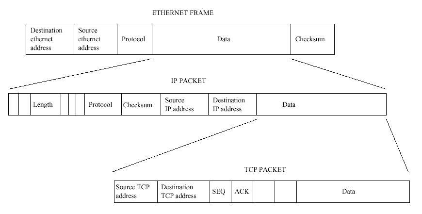
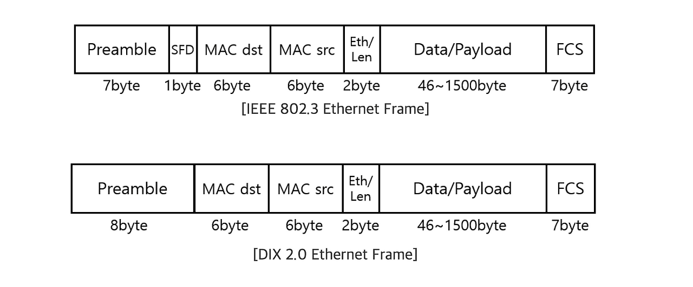
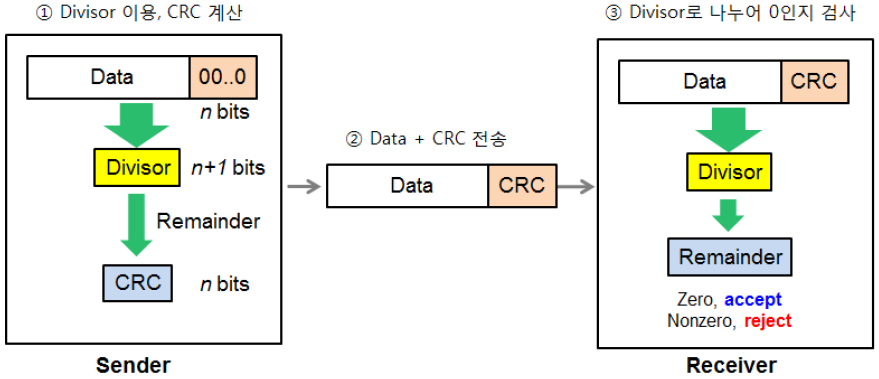

# Frame

<br>

## 목차
- [Frame](#frame)
  - [목차](#목차)
  - [Frame](#frame-1)
    - [구조](#구조)
    - [Ethernet 헤더](#ethernet-헤더)
    - [트레일러 (FCS)](#트레일러-fcs)

<br>

## Frame

### 구조



<br>

2계층 Data Link Layer (데이터 링크 계층)에서 사용하는 PDU

<br>

같은 네트워크 안에서 바로 옆 장비에게 데이터를 안전하게 전달하기 위한 포장지

데이터의 앞부분에 헤더(Header)가 붙을 뿐만 아니라, 뒷부분에 트레일러(Trailer)라는 꼬리표가 붙음

<br>

따라서 프레임은 각각 Ethernet 헤더 + 데이터 (data payload) + 트레일러로 나뉨

이 데이터는 상위 계층인 network layer에서 내려온 packet으로 통째로 들어감

따라서 프레임의 구조는 아래와 같음

```
[ Ethernet 헤더 + IP헤더 + TCP/UDP 헤더 + 애플리케이션 데이터 + 트레일러 ]
```

<br>

### Ethernet 헤더



<br>

Ethernet 헤더는 같은 로컬 네트워크(LAN) 내에서, 즉 바로 옆에 연결된 장비에게 데이터를 정확히 전달하기 위한 주소 정보를 담고 있음

인터넷 전체를 보는 IP 헤더와 달리, 아주 가까운 거리를 책임지는 '동네 배송 운송장' 같은 역할

<br>

Ethernet 헤더는 **MAC 주소**를 이용해 로컬 네트워크 내에서의 정확한 배송지를 지정

헤더를 보고 상위 계층으로 데이터를 올바르게 연결해주는 핵심적인 역할을 수행

<br>

TCP/IP 네트워크에서 사실상의 표준으로 사용되는 **이더넷 II(Ethernet II)** 프레임 헤더를 기준으로 설명

위의 그림이 각각

- IEEE 802.3 (표준 프레임)
- DIX 2.0 (Ethernet II)

<br>

Ethernet 헤더는 총 14 바이트

<br>

**Ethernet 헤더 구성**

- 목적지 MAC 주소 (Destination MAC Address)
- 출발지 MAC 주소 (Source MAC Address)
- 이더타입 (EtherType / Type)

<br>

**Ethernet 헤더는 아니지만 프레임 앞에 붙음**

- 프리앰블 (Preamble)
- SFD (Start Frame Delimiter)

<br>

**1. 목적지 MAC 주소 (Destination MAC Address)**

- **크기**: 6 바이트 (48 비트)
- **역할**: 프레임을 최종적으로 받아야 할 **목적지 장비의 물리적인 하드웨어 주소**.
- **설명**:
    - 같은 네트워크 안에 있는 특정 컴퓨터, 다른 네트워크로 나가기 위한 Gateway(Router) MAC 주소.

<br>

**2. 출발지 MAC 주소 (Source MAC Address)**

- **크기**: 6 바이트 (48 비트)
- **역할**: 이 프레임을 보내는 **출발지 장비의 물리적인 하드웨어 주소**.
- **설명**:
    - 이 주소를 통해 수신 측 장비는 누가 프레임을 보냈는지 알 수 있음.

<br>

**3. 이더타입 (EtherType / Type)**

- **크기**: 2 바이트 (16 비트)
- **역할**: 프레임의 페이로드(데이터 부분)에 **어떤 3계층 프로토콜의 패킷이 들어있는지 알려주는 식별자**.
- **설명**:
    - 2계층은 3계층에 무엇이 있는지 전혀 신경 쓰지 않고, 오직 이 EtherType 값만 보고 판단.
    - "이 데이터는 어떤 프로토콜에게 주면 되겠구나" 라고 판단하고 상위 계층으로 전달하는 역할만 함.
    - 값 & 의미
        - **`0x0800`**: 페이로드에 **IPv4** 패킷이 들어있음을 의미.
        - **`0x0806`**: 페이로드에 **ARP** 패킷이 들어있음을 의미.
        - **`0x86DD`**: 페이로드에 **IPv6** 패킷이 들어있음을 의미.

<br>

프리앰블 (Preamble) & SFD

엄밀히 말해 헤더는 아니지만, 프레임의 맨 앞에서 중요한 역할을 하는 부분.

- **프리앰블 (Preamble, 7 바이트)**:
    - `10101010` 패턴이 7번 반복되는 신호.
    - 수신 측 장비 (NIC)에게 "이제 곧 프레임이 시작될 테니 동기화하고 준비하세요!"라고 알려주는 준비 신호.
- **SFD (Start Frame Delimiter, 1 바이트)**:
    - `10101011` 패턴을 가짐.
    - 긴 준비 신호 끝나고, “진짜 이더넷 헤더는 바로 여기서부터 시작됩니다!"라고 알려주는 시작 표시.

<br>

- 프레임 자체의 일부라기보다는 물리 계층에서 붙는 시그널.
- Ethernet은 동기화 기반 전송이라서, 송수신기가 같은 클럭으로 비트를 해석.
- Preamble은 규칙적인 패턴, 수신 측은 이 신호를 받아 자기 클럭을 송신 측과 맞춤.
- 마지막에 나오는 SFD의 끝부분 `11`은 "동기화 끝, 이제 진짜 MAC 헤더 시작"을 의미.
- Preamble은 프레임 시작을 알리기 위한 “동기화 신호”, SFD는 **프레임의 첫 비트 위치를 확정해 주는 마커**

<br>

### 트레일러 (FCS)

이더넷 헤더 외에 프레임 구조에서 가장 중요한 부분이 바로 이 **트레일러**. 

프레임에서 데이터의 맨 뒷부분에 붙음.

보통 4바이트(32비트) 크기를 가짐.

<br>

트레일러의 역할은 오류 검출

소포 내용물 새거나 중간에 누가 열어보지 못하도록 붙이는 봉인 스티커, 위조 방지 스티커와 같은 역할

<br>

트레일러에는 보통 FCS(Frame Check Sequence)라는 값이 들어감.

- **FCS (Frame Check Sequence)**:
    - 데이터가 전송되는 도중에 깨지거나 변질되지 않았는지 확인하기 위한 **오류 검출 코드**.
    - 데이터가 물리적인 회선(랜선, 광케이블 등) 통해 전송되는 과정에서 오류 발생했는지 여부를 검출

<br>

**오류 검출 동작 방식 (CRC 알고리즘)**

FCS는 **CRC(Cyclic Redundancy Check)** 라는 수학적인 알고리즘을 통해 생성되고 검증. 

<br>



**동작 방식**

1. **송신 측 (보내는 쪽)**

- **계산**:
    - 이더넷 헤더 + 페이로드을 가지고 CRC 알고리즘으로 계산하여 4바이트짜리 **FCS 값**을 만듬.
    - 이 값은 내용물의 '디지털 지문'이라고 생각.
- **추가**:
    - 계산된 FCS 값을 프레임의 맨 뒤, 즉 트레일러에 붙여서 함께 전송.

<br>

2. **수신 측 (받는 쪽)**

- **재계산**:
    - 수신한 이더넷 헤더 + 페이로드을 가지고 송신 측과 **동일한 CRC 알고리즘**으로 FCS 값을 다시 계산.
- **비교**:
    - 자신이 직접 계산한 FCS 값과, 프레임의 트레일러에 붙어서 온 FCS 값을 **비교**.

<br>

**비교 결과에 따른 처리**

- **값이 일치하는 경우**
    - "데이터가 전송 중에 손상되지 않고 무사히 도착했구나!"라고 판단.
    - 트레일러와 헤더를 제거한 뒤, 페이로드(IP 패킷)를 상위 계층인 네트워크 계층으로 올려보냄.
- **값이 일치하지 않는 경우**
    - "전송 중에 노이즈 등으로 인해 데이터에 오류가 발생했구나!"라고 판단.
    - 수신 측은 해당 프레임을 폐기함
    - 2계층은 오류를 수정하거나 송신 측에 "다시 보내줘!"라고 요청 안 함
        - 그냥 버리는 것으로 역할이 끝남.