# DHCP

## RARP

- Reverse ARP
- ARP의 역기능을 수행하는 프로토콜
- 물리 주소에 해당되는 논리 주소를 찾아내는 프로토콜
- RARP는 자기 자신의 IP 주소만을 알아낼 수 있다는 한계가 있음

## BOOTP

- Bootstrap Protocol (부트스트랩 프로토콜)
- IP 정보만 얻어올 수 있는 RARP의 단점을 극복하기 위해 제작된 프로토콜
- 서버에서 클라이언트로 네트워크 정보를 유동적으로 할당할 수 있는 프로토콜
- 서버에서 클라이언트로 요청 메시지를 받게 되면 서버 내에 미리 설정되어 있는 테이블 리스트에서 Mac 주소에 매핑되어 있는 네트워크 정보를 클라이언트로 할당함
- 정적인 호스트 구성 프로토콜 방식임

## DHCP

- Dynamic Host Configuration Protocol (동적 호스트 구성 프로토콜)
- 네트워크에 접속하는 컴퓨터나 스마트폰 같은 장치에게 IP 주소를 포함한 필수 네트워크 정보들을 자동으로 할당해주고 관리하는 역할
  - IP 주소, 서브넷 마스크, 기본 게이트웨이, DNS 서버 주소 등을 자동으로 설정해주는 역할
  - 해당 클라이언트에게 일정 기간 임대해주는 동적 주소 할당 프로토콜
- BOOTP의 동작에 동적인 기능이 확장된 통신 프로토콜
  - DHCP 서버는 IP와 MAC을 매핑시켜 놓은 동적인 데이터베이스와, 유효한(클라이언트에게 할당할) IP 주소의 동적 데이터베이스를 보유함
  - 클라이언트가 요청 메시지를 보내면 동적 데이터베이스를 먼저 확인하고 있다면 IP 할당
  - 동적 데이터베이스에 없다면, 유효한 IP 중 하나를 선택하여 클라이언트에 할당
  - 할당한 IP를 동적 데이터베이스에 할당했다는 내역 추가

## 장점

- 사용자 개입 없이 IP 주소를 자동으로 할당하여 편하게 관리할 수 있음
- 중앙 관리로 중복 위험을 크게 줄일 수 있음
- 사용하지 않는 IP 주소를 회수하여 다른 장치에 재할당함으로써 제한된 IP 주소 자원을 효율적으로 사용할 수 있음
- 상황에 맞게 임대 시간을 설정할 수 있음
  - 사무실이나 집에서는 임대 시간을 길게, 공용 와이파이나 PC방에서는 임대 시간을 짧게 설정함

## 단점

- DHCP 서버에 의존하기 때문에 서버가 다운되면 IP 할당이 제대로 이루어지지 않음
- 일반적으로 인증이 없어 사이버 공격에 취약함
  - 승인받지 않은 DHCP 서버가 잘못된 정보에 클라이언트에 제공할 수 있음
  - 승인받지 않은 클라이언트가 DHCP 서버를 가로채 리소스에 대한 접근 권한 탈취 가능
  - 악성 클라이언트가 DHCP 리소스를 소모시킬 수 있음

## 구성요소

- DHCP 클라이언트
  - 시스템이 시작하면 DHCP 서버에 IP 주소를 요청함
  - IP 주소를 부여받으면 TCP/IP 설정이 초기화되고 다른 호스트와 TCP/IP로 통신이 가능해짐
- DHCP 서버
  - 네트워크 인터페이스를 위해 IP 주소를 가지고 있는 서버에서 실행되는 프로그램
  - 일정한 범위의 IP 주소를 다른 클라이언트에게 할당하여 자동으로 설정해줌
  - 클라이언트에게 할당된 IP 주소를 변경없이 유지해 줄 수 있음
  - 클라이언트에게 IP 할당 요청이 들어오면 IP를 부여함
  - 할당 가능한 IP들을 관리함

## DHCP 프로토콜 원리

- DHCP 서버가 IP 주소를 영구적으로 단말에 할당하는 것이 아닌 임대기간을 명시하여 해당 기간 동안만 단말이 IP 주소를 사용하도록 임대해주는 것
- 단말(DHCP Client)이 임대기간 이후에도 해당 IP 주소 사용을 원한다면 IP 주소 임대기간 연장을 DHCP 서버에 요청 필요
- 임대 받은 IP 주소가 더 이상 필요하지 않으면 IP 주소 반납 절차 수행함

## DHCP 패킷

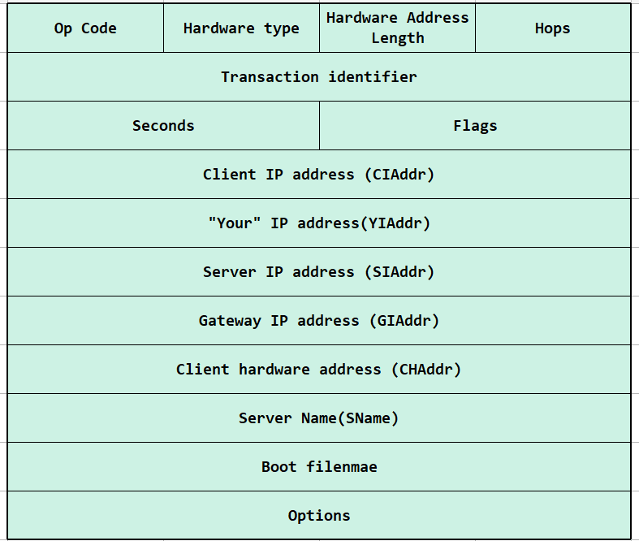
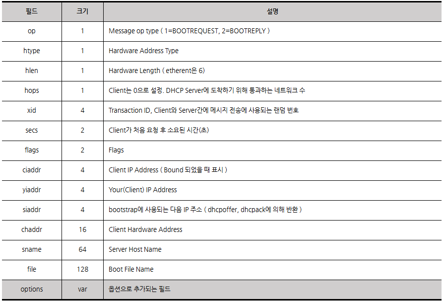
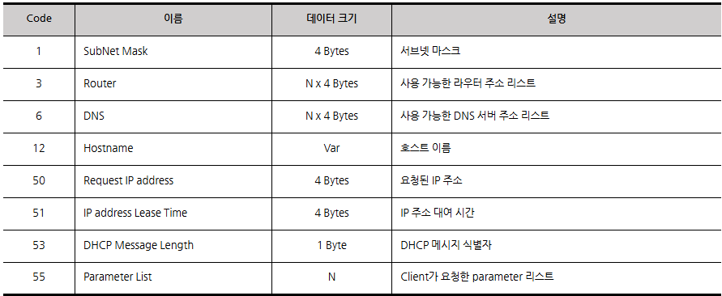

### 기본 DHCP 패킷

- Op Code
  - 1은 request, 2는 reply를 의미함
- Hardware Type
  - 어떤 link layer인지를 의미함. 대부분 Ethernet 사용함.
- Hardware Address Length
  - 하드웨어 주소의 길이를 의미함. Ethernet의 경우 주소의 길이는 6바이트
- Hops
  - 패킷이 지날 수 있는 최대의 hop을 결정함 (지날 수 있는 게이트웨이의 수)
  - 로컬망이면 게이트웨이를 지날 필요가 없으므로 0
- Transaction identifier
  - 클라이언트와 서버간에 메시지 전송에 사용되는 랜덤 번호 -클라이언트에 의해 request 패킷에 채워지고, reply 패킷에서 자기가 보낸 request에 대한 reply인지 구별하는 데 사용됨
- Seconds
  - 클라이언트가 IP 주소를 취득 / 갱신을 시작한 이후의 경과 시간 (초)
- Flag
  - 클라이언트가 보내는 BOOTP FLAG 타입
  - Unicast (0x0000), Broadcast (0x8000)
- Client IP address
  - 클라이언트의 현재 IP address
  - 클라이언트가 할당 받은 IP address
  - IP 임대 기간을 갱신하거나, 반납 할 때 사용됨
- Your IP address
  - DHCP 서버로부터 할당 받는 IP
- Server IP address
  - DHCP 서버로부터 응답 패킷이 올 때 포함되는 서버의 IP address
- Gateway IP address
  - DHCP 서버로부터 할당 받는 라우터 IP address
- Client hardware address
  - 16바이트의 클라이언트 물리적 주소가 채워짐
  - IPv4에서는 6바이트의 맥주소 사용
- Server Name
  - 64바이트의 공간을 가지며 서버에 의해 응답 패킷으로 옮. 서버의 도메인 이름을 포함함
- Boot filename
  - 서버에 의해 응답 패킷으로 오며, 128바이트 공간에 boot 파일의 full pathname을 포함함.
  - 이를 이용해 클라이언트는 다른 부팅 정보를 얻을 수 있음

### 옵션 DHCP 패킷

- Requested IP address (Option 50)

  - Discover와 request에서만 보내는 옵션
  - 클라이언트가 서버에게 특정 IP를 할당해 달라고 요청하는 옵션

- IP Lease Time (Option 51)

  - 클라이언트가 서버로부터 할당받은 IP 주소를 얼마 동안 사용할 수 있는지 알려주는 옵션
  - 클라이언트는 이 시간이 지나면 IP 주소를 더 이상 사용할 수 없음
  - T1, T2 지점에서 DHCP 서버에 갱신 요청(renew, rebind)을 시도함

- DHCP Message Type (Option 53)

  - DHCP Message Type을 정하는 Option
    | 값 | 메시지 타입 | 내용 |
    | -- |------------- | ------------------------------------ |
    | 1 | DHCP Discover | 클라이언트가 사용한 DHCP 서버를 찾는 메시지 |
    | 2 | DHCP Offer | DHCP 서버가 IP 설정값에 대해 클라이언트에게 제안하는 메시지 |
    | 3 | DHCP Request | DHCP 서버에서 제안받은 설정값을 요청하는 메시지 |
    | 4 | DHCP Decline | 현재 IP가 사용 중임을 클라이언트가 서버에 알려주는 메시지 |
    | 5 | DHCP Ack | DHCP 서버가 클라이언트에 받은 요청을 수락하는 메시지 |
    | 6 | DHCP Nak | DHCP 서버가 클라이언트에 받은 요청을 수락하지 않는다는 메시지 |
    | 7 | DHCP Release | 클라이언트가 현재 IP를 반납할 때 사용하는 메시지 |
    | 8 | DHCP Inform | 클라이언트가 서버에 IP 설정값을 요청하는 메시지 |

- DHCP Server Identifier (Option 54)

  - 클라이언트가 어떤 DHCP 서버에서 응답을 받은 것인지 구분하기 위해 서버의 IP 주소를 알려주는 옵션
  - 네트워크에 DHCP 서버가 여러 개 있는 경우 클라이언트에서 어느 서버와 세션을 이어갈지 결정함. 그러면 다른 서버들은 선택되지 않은 것을 알고 요청을 취소함
  - 서버의 IP를 모르는 상황일 수도 있음

- Parameter request list (Option 55)

  - DHCP 클라이언트가 특정 정보를 요청하는 파라미터
  - DHCP 클라이언트를 구성하는 정보에 대한 옵션 리스트

- Renewal Time Value (Option 58)

  - 클라이언트가 Renewal할 때까지 시간 간격을 지정하는 옵션
  - 서버가 지정해주는 임대 IP의 Rebinding Time을 지정한다 (50%)

- Rebinding Time Value (Option 59)

  - 클라이언트가 Rebinding할 때까지 시간 간격을 지정하는 옵션
  - 서버가 지정해주는 임대 IP의 Rebinding Time을 지정한다 (87.5%)

- Vendor class identifier (Option 60)
  - DHCP 클라이언트의 Vendor 정보를 알려주는 옵션

## DHCP 메시지

- DHCP Discover

  - 클라이언트가 네트워크에 접속하면, DHCP 서버를 찾기 위해 "DHCP 서버를 찾습니다"라는 브로드캐스트 메시지를 네트워크에 보냄
  - 클라이언트 IP는 0.0.0.0. 이는 지정된 주소가 없음을 의미함
  - 서버 IP는 255.255.255.255. 이는 브로드캐스팅을 한다는 것을 의미함
  - 주요 파라미터
    - Client MAC address

  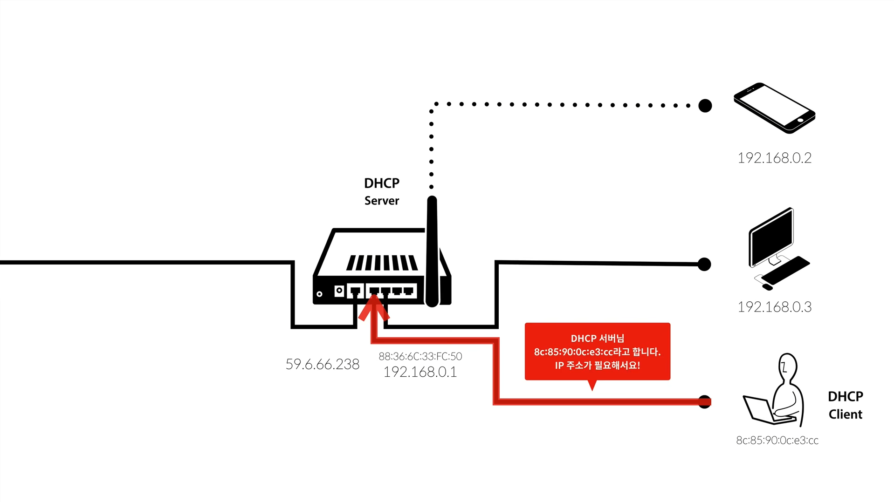
  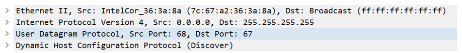
  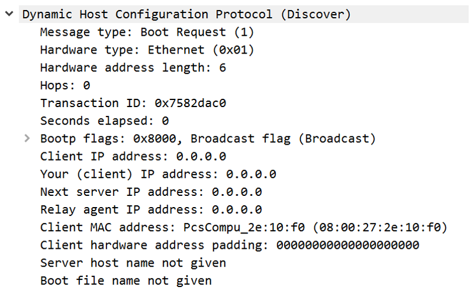
  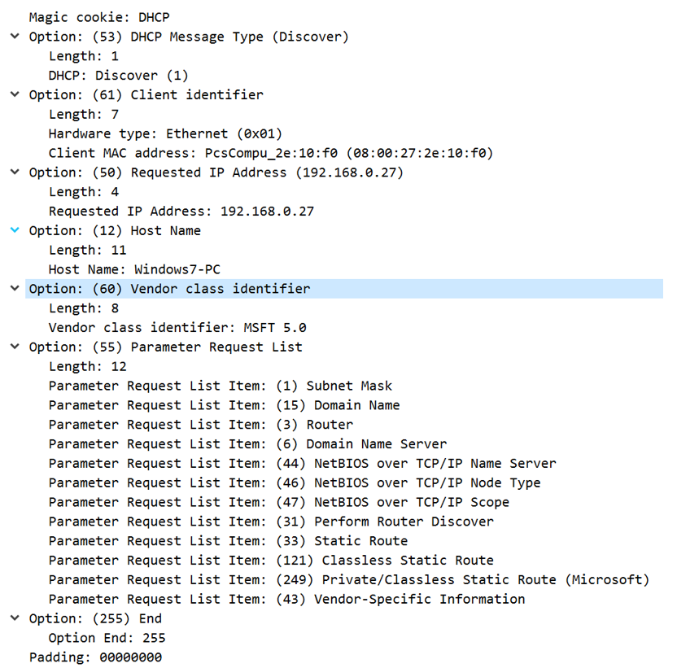

- DHCP Offer

  - Discover 메시지를 수신한 DHCP 서버는 클라이언트에게 할당할 수 있는 IP 주소와 서브넷 마스크, 게이트웨이, DNS 정보 등을 포함한 제안 메시지를 보냄
  - 주요 파라미터
    - Client MAC address
    - Your IP address
    - Subnet Mask (Option 1)
    - Router (Option 3)
    - DNS (Option 6)
    - IP Lease Time (Option 51)
    - DHCP Server Identifier (Option 54)

  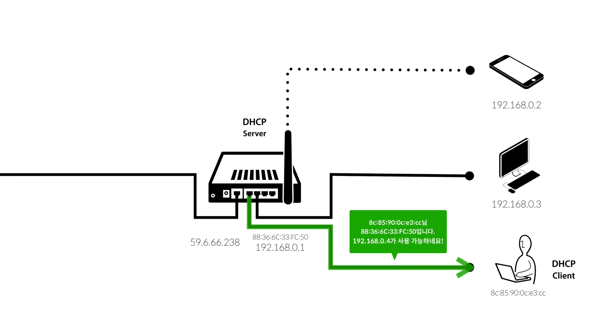
  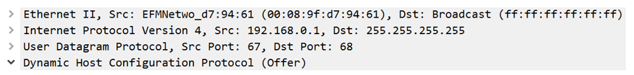
  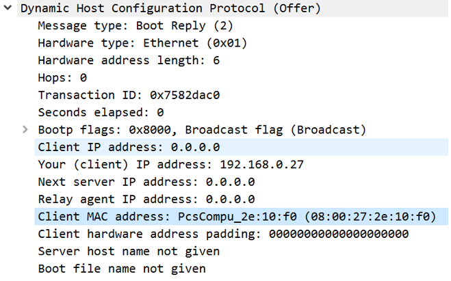
  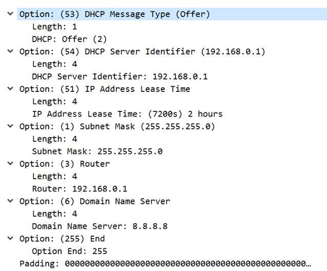

- DHCP Request

  - 클라이언트는 서버로부터 받은 제안 중 하나를 선택하고, 해당 IP 주소를 사용하겠다는 요청 메시지를 브로드캐스트로 보냄
  - 이는 다른 DHCP 서버들에게 다른 제안을 선택했음을 알려주는 역할도 함
  - 주요 파라미터
    - Client MAC address
    - Requested IP Address (Option 50)
    - DHCP Server Identifier (Option 54)

  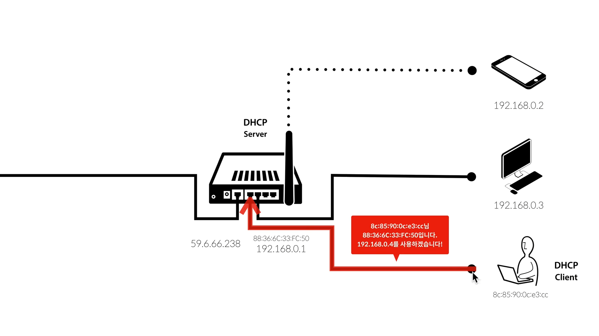
  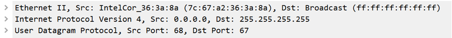
  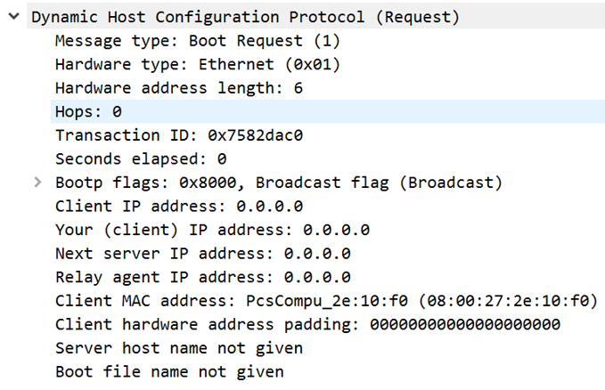
  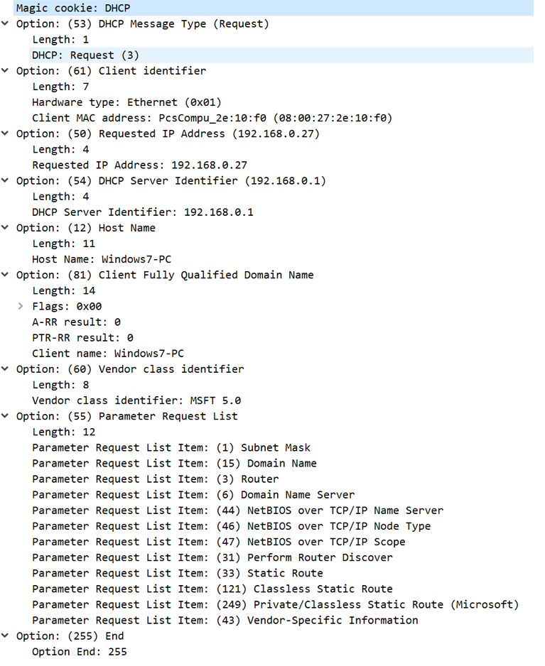

- DHCP Acknowledge

  - DHCP 서버는 클라이언트의 요청을 최종 확인하고, IP 주소 임대 시간 등의 정보를 담은 승인 메시지를 보냄
  - 이 메시지를 받은 클라이언트는 IP 주소를 사용하여 네트워크 통신을 시작할 수 있음
  - 주요 파라미터
    - Client MAC address
    - Your IP address
    - Subnet Mask (Option 1)
    - Router (Option 3)
    - DNS (Option 6)
    - IP Lease Time (Option 51)
    - DHCP Server Identifier (Option 54)

  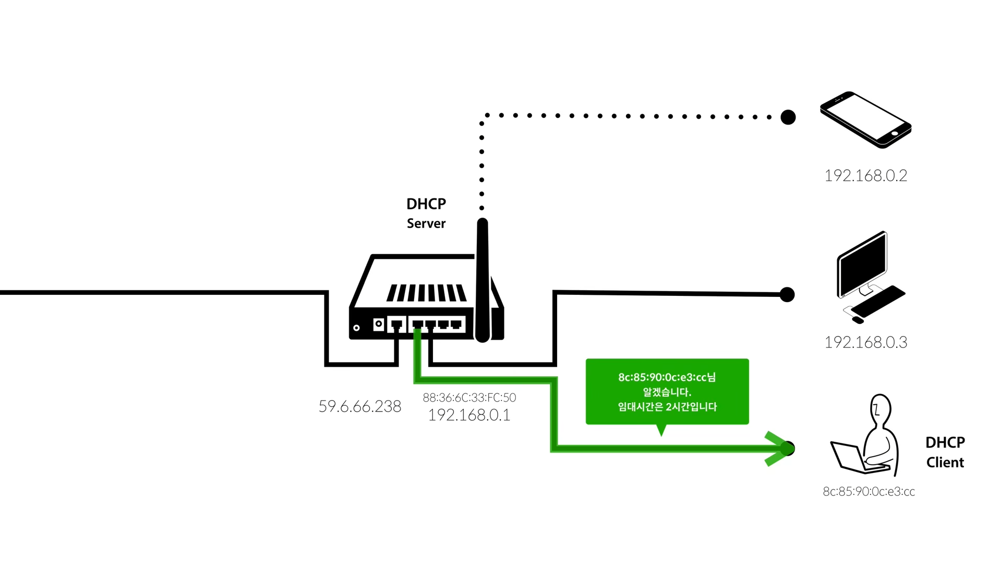
  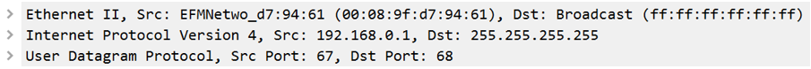
  
  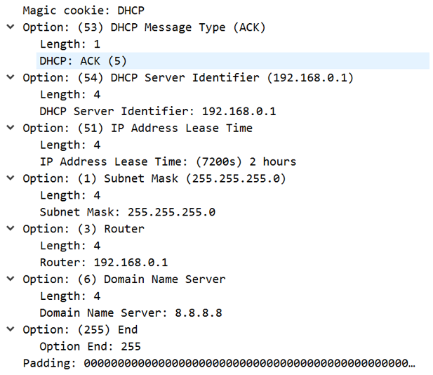

  

## 임대 (Lease)

- DHCP 서버가 클라이언트에게 IP 주소와 관련 네트워크 설정을 일정 시간 동안 빌려주는 것
- 클라이언트는 그 기간 동안만 해당 IP 주소를 사용할 수 있고 기간이 지나면 갱신 또는 반환해야 함

## 갱신 (Renewal)

- 클라이언트는 임대 시간이 끝나기 전에 서버에 IP 주소를 계속 사용하고 싶다고 요청함

### Renewal (T1)

- DHCP에서 IP를 할당받은 후 임대 시간의 50%가 지나면 DHCP 갱신 과정을 수행함
- DHCP 클라이언트는 DHCP 서버 정보와 이미 사용 중인 IP 정보를 보유한 상태이므로 Discover, Offer를 생략하고 Request를 전송하고 서버는 ACK를 보내면서 갱신 과정을 진행함
- 브로드캐스트가 아닌 유니캐스트로 진행되므로 효율적임
- DHCP 서버와 정상적으로 통신이 된다면 갱신 성공!

### Rebinding (T2)

- 임대 시간이 87.5% 지난 시점에서 시도함
- 유니캐스트가 아닌 브로드캐스트로 Request, ACK 과정을 진행함
- 만약 응답할 서버가 없다면 Discover를 브로드캐스트로 날려 새로운 DHCP 서버를 찾음 (초기 요청과 동일한 과정으로 진행됨)
- Rebinding도 실패한다면 만료시간이 끝나면 IP가 없는 상태가 됨

갱신이 실패하면 남은 시간의 75% 지난 시점(초기 임대 시간의 87.5% 지난 시점)에서 갱신을 다시 시도함

- 이 때도 갱신을 실패하면 추가 갱신 없이 임대 시간이 모두 지난 후에 IP를 반납 후 재할당 받아야함

## 반환 (Release)

- 갱신 과정에 모두 실패하여 임대 시간이 모두 지났거나, IP 주소를 더 이상 사용할 필요가 없을 때 DHCP에게 할당 받았던 IP를 반환함

  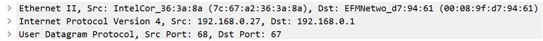
  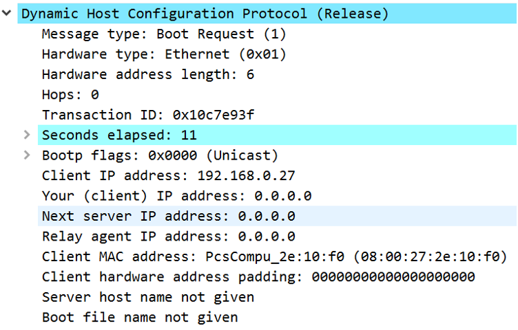
  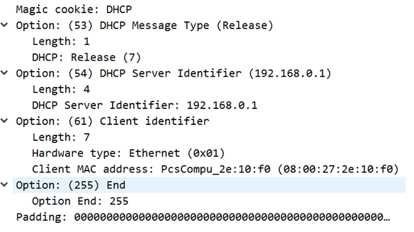

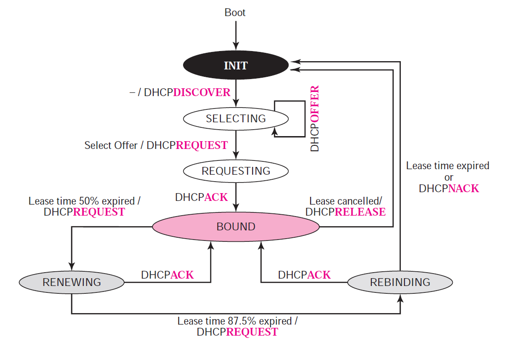

## 공격 위험

- 취약점 발생 원인
  - 사용자는 DHCP에 대한 정보를 저장하지 않음
  - 인증과 암호화 매커니즘이 없음
- DHCP Spoofing

  - DHCP는 UDP로 동작하여 인증을 수행하지 않음
  - DHCP Spoofing은 DHCP 프로토콜이 인증을 수행하지 않는 취약점을 이용하여 DHCP 프로토콜이 제공하는 정보를 조작해서 타겟 PC를 속임
  - 조작된 Gateway 주소, DNS 주소 정보를 전달하여 공격을 수행

  - 주요 위험 요소
    - MITM(Man-In-The-Middle) 공격 : 사용자의 네트워크 트래픽을 가로채어 데이터 탈취
    - 서비스 거부 공격(Dos) : 잘못된 IP 주소를 배포하여 네트워크 마비
    - 네트워크 혼란 : 클라이언트가 잘못된 IP 정보를 받아 통신 불가 상태 발생

  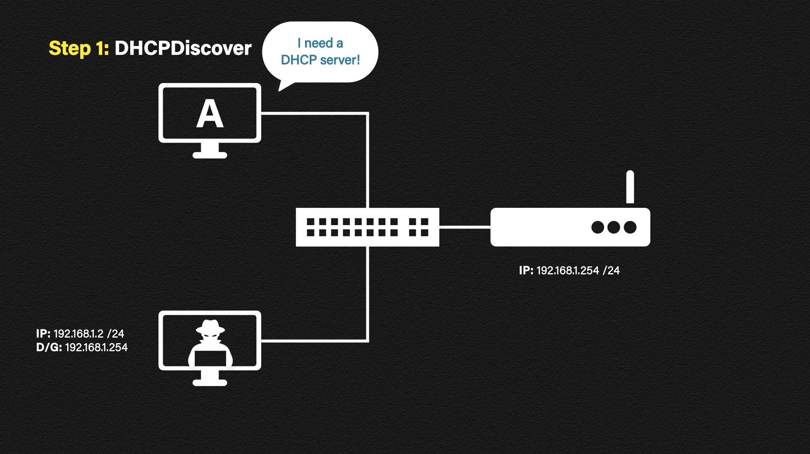
  
  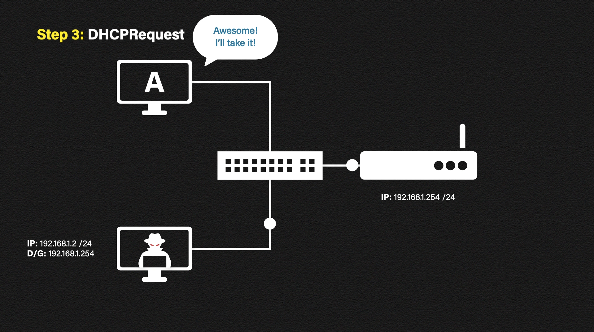
  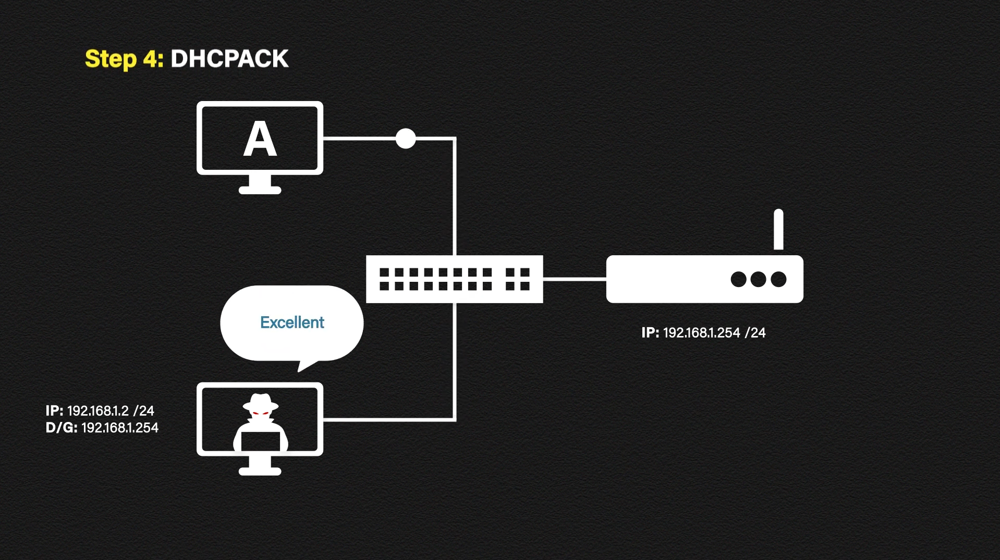

- DHCP Snooping
  - 스위치에서 동작하며 네트워크 포트를 신뢰된 포트와 비신뢰 포트로 구분하여 DHCP 패킷을 필터링함
  - 신뢰된 포트
    - 공식적인 DHCP 서버에서 제공하는 응답을 허용
    - 일반적으로 DHCP 서버가 연결된 포트가 해당됨
  - 비신뢰 포트
    - 클라이언트가 연결되는 포트
    - 허가받지 않은 DHCP 서버로부터의 응답을 차단하여 네트워크 보안을 강화함

## 같은 망에서의 DHCP

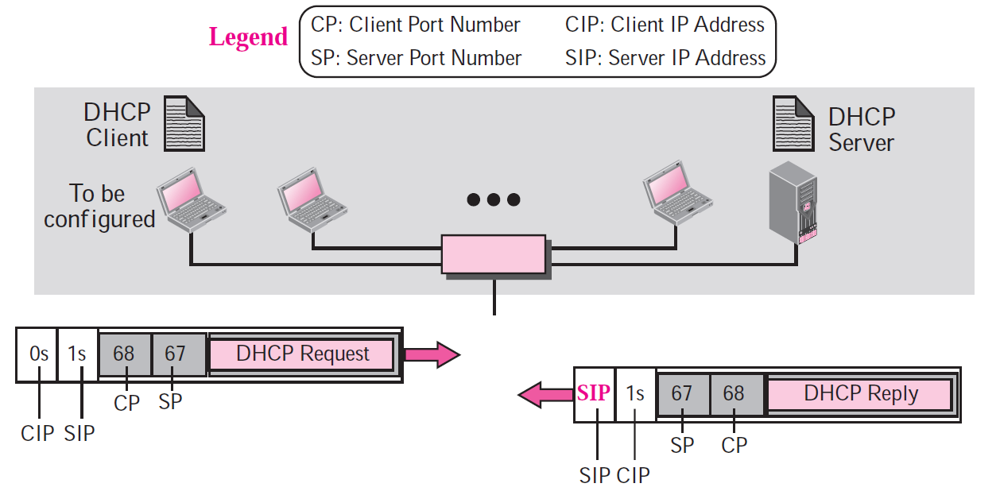

- DHCP 서버가 UDP 포트 67번에 Passive Open을 수행하고 클라이언트로부터 request를 기다림
  - Passive Open : 서버가 클라이언트의 연결을 기다리는 상태로 listen 상태로 진입하여 연결 요청을 대기함
- 부팅된 클라이언트는 포트 68번에 Active Open을 수행함
  - Active Open : 클라이언트가 서버에 연결을 요청하는 상태로 SYN
- 클라이언트는 자신의 IP 주소와 서버의 IP 주소를 모른 채로 브로드캐스팅으로 전송함
- DHCP 서버는 DHCP reply를 브로드캐스팅 혹은 유니캐스팅 방식으로 클라이언트에게 전달함

## 다른 망에서의 DHCP

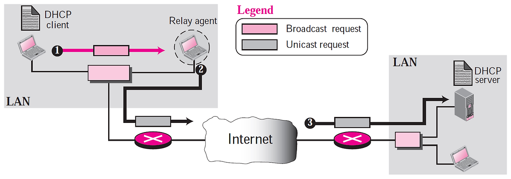

- 브로드캐스팅 주소를 통해서는 라우터 밖으로 벗어날 수 없음
- 즉, 동일한 망에서의 DHCP 처럼 request를 브로드캐스트해도 DHCP 서버에 닿지 못함
- DHCP 클라이언트가 DHCP request 메시지를 브로드캐스팅하면 같은 망에 있는 Relay Agent가 DHCP request 메시지를 DHCP 서버까지 유니캐스팅함
- DHCP 서버는 수신한 request에 대한 DHCP reply를 Relay Agent에게 유니캐스팅하고, 이를 수신한 Relay Agent는 DHCP relay를 DHCP 클라이언트에게 전송함

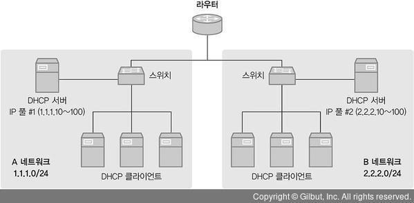

- 네트워크가 여러 개로 나뉜 환경에서는 브로드 캐스트가 전달되지 않으므로 각 네트워크 환경에서 DHCP 서버를 구축해야함

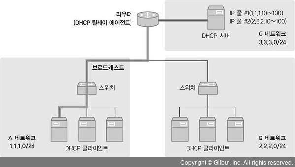

- 여러 네트워크를 가진 환경에서 Relay Agent를 사용하면 DHCP 서버 한 대로 여러 네트워크 대역에서 IP 풀을 관리할 수 있음
- A 네트워크와 B 네트워크에 대한 DHCP IP 풀을 C 네트워크의 DHCP 서버에서 관리함
- 브로드캐스트로 전달되는 DHCP 패킷을 동일 네트워크 대역의 DHCP Relay Agent가 수신하면서 DHCP 서버로 갈 수 있도록 유니캐스트로 변환해줌

## 에러 제어

- DHCP는 UDP 기반 프로토콜이므로, 에러 제어 서비스가 필수적임
- Checksum
  - DHCP는 UDP의 체크섬 사용을 요구함
  - UDP에서는 체크섬 확인이 선택적이기 때문임
- Timer & Retransmission Policy
  - DHCP 클라이언트가 일정 시간 동안 DHCP reply를 수신하지 못하면 DHCP request를 재전송함
  - 이 때, 네트워크에 장애가 발생하여 모든 클라이언트가 동시에 DHCP request를 전송하여 Traffic Jam이 발생하는 것을 방지하기 위해, Timer 값은 각각의 클라이언트가 Random하게 설정함

## 출처

- https://watermelon-sugar.tistory.com/47
- https://opentutorials.org/course/3265/20039
- https://blog.naver.com/onsystems/223410632620
- https://programming119.tistory.com/151?category=904929#google_vignette
- https://jinheeahn.wordpress.com/2015/06/04/dhcp-%EC%9D%B4%ED%95%B4%ED%95%98%EA%B8%B0/
- https://velog.io/@inhwa1025/DHCP%EB%9E%80-DHCP-%ED%94%84%EB%A1%9C%ED%86%A0%EC%BD%9C%EC%9D%98-%EC%9B%90%EB%A6%AC
- https://blog.naver.com/PostView.naver?blogId=tkdldjs35&logNo=222017789280
- https://dad-rock.tistory.com/580
- https://k-security.tistory.com/159#google_vignette
- https://www.youtube.com/watch?v=eWVzteyRFYo
