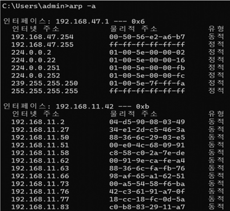
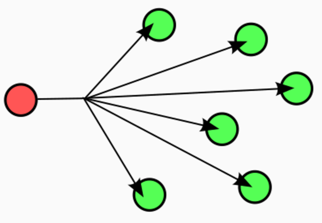
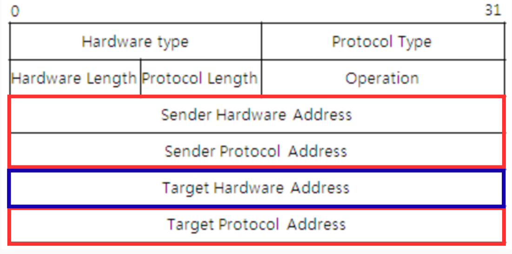
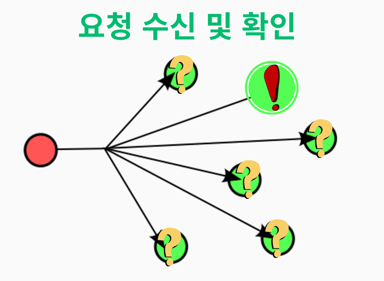
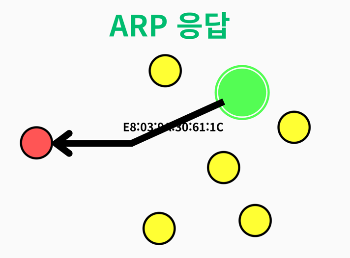
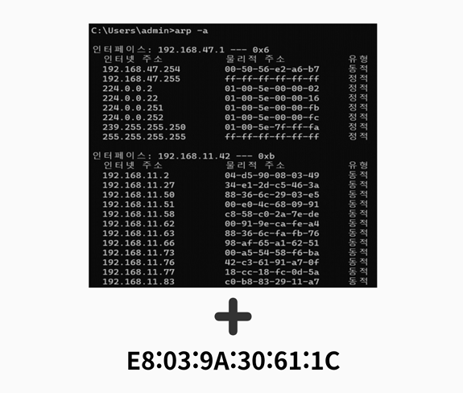
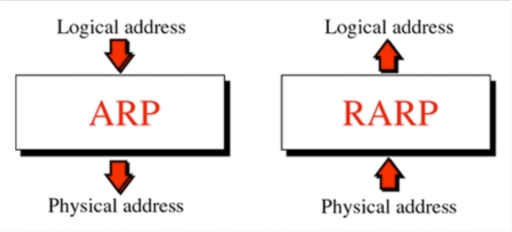

# ARP (Address Resolution Protocol)

## 💡 핵심 요약
> - **한 줄 정의** : 로컬 네트워크 상에서 IP 주소(3계층)를 알지만 MAC 주소(2계층)를 모를 때, IP 주소를 이용해 MAC 주소를 찾아내는 주소 결정 프로토콜.

> - **핵심 키워드:** `#IP_to_MAC #주소_결정` `#브로드캐스트 #ARP_캐시` `#로컬_네트워크` `#ARP_스푸핑`

> - **왜 중요한가?** : 3계층의 **IP 주소와 2계층의 MAC 주소를 연결하는 핵심 다리 역할**을 하기 때문입니다. 
ARP가 없다면, IP 주소만으로는 데이터를 담은 프레임을 만들 수 없어 통신이 시작조차 될 수 없습니다.

## 1. 개요

ARP(주소 결정 프로토콜)는 OSI 3계층의 논리적 주소인 **IP 주소**를 기반으로, 2계층의 물리적 주소인 **MAC 주소**를 알아내기 위해 사용하는 프로토콜입니다.

컴퓨터가 로컬 네트워크 내의 다른 장치와 통신하려면 최종적으로 MAC 주소를 알아야 2계층 프레임을 만들어 보낼 수 있습니다. ARP는 바로 이 IP 주소와 MAC 주소 사이의 "번역"을 담당하는 핵심적인 역할을 합니다.

### 주의
ARP는 IPv4 네트워크에 특화된 프로토콜입니다. IPv6에서는 주소 결정 기능이 **NDP(Neighbor Discovery Protocol)**로 대체되며, NDP는 ICMPv6 메시지를 사용하여 IPv6 주소를 MAC 주소로 매핑합니다. NDP는 라우터 발견, 중복 주소 감지 등 추가 기능을 제공합니다.

---
## 2. ARP의 동작 원리
ARP는 특정 IP 주소를 사용하는 장치의 MAC 주소를 알아내기 위해 4단계의 과정을 거칩니다.

#### **1단계: ARP Cache 확인**

- 장치는 데이터를 보내기 전, 자신의 **ARP Cache 테이블**을 먼저 확인합니다. ARP Cache는 최근에 통신했던 장치들의 IP-MAC 주소 매핑 정보를 저장하는 메모리 공간입니다.
- 캐시에 원하는 IP 주소에 해당하는 MAC 주소가 있다면, 즉시 해당 MAC 주소를 사용하여 통신을 시작합니다.
- 정보가 없다면 2단계로 넘어갑니다.

#### **2단계: ARP Request (브로드캐스트)**

- 캐시에 정보가 없으면, 송신자는 로컬 네트워크에 연결된 모든 장치에게 **ARP Request** 패킷을 **브로드캐스트**로 전송합니다. 이더넷 프레임의 목적지 MAC 주소는 브로드캐스트 주소인 `FF:FF:FF:FF:FF:FF`로 설정됩니다.

**간단한 패킷 구조**

[자세한 ARP 패킷 구조](#3-arp-패킷-구조)

  - 송신자의 IP 주소 및 MAC 주소
  - **찾고 있는 대상의 IP 주소**
  - 대상의 MAC 주소 필드 (알 수 없으므로 `00:00:00:00:00:00`으로 채워짐)

#### **3.1단계: ARP Request 수신 및 확인**

- ARP Request를 수신한 모든 장치는 패킷 안의 대상 IP 주소가 자신의 IP 주소와 일치하는지 확인합니다.
- IP 주소가 일치하지 않는 장치들은 해당 패킷을 무시(폐기)합니다.

#### **3.2단계: ARP Response**

- IP 주소가 일치하는 장치는 자신의 MAC 주소를 담은 **ARP Response** 패킷을 만들어 **유니캐스트** 방식으로 송신자에게 직접 응답합니다.

#### **4단계: ARP Cache 갱신**

- ARP Response를 수신한 원래의 송신자는 패킷에서 대상의 MAC 주소를 추출하여 자신의 **ARP Cache 테이블에 기록**합니다.
- 이제 해당 IP-MAC 매핑 정보가 있으므로, 이 정보를 이용해 실제 데이터 통신을 시작합니다.

#### **주의사항**
ARP Cache Table과 MAC Table의 차이
- **ARP Cache Table**
    - 사용처 : 컴퓨터, 서버 등 각 개별 장치가 사용
    - 저장 : IP 주소와 MAC 주소의 매핑 정보를 저장합니다. (IP 주소 A = MAC 주소 B)
    - 목적 : 다른 장치와 통신할 때마다 매번 ARP 브로드캐스트를 날리는 비효율을 막기 위해, 한 번 확인한 IP-MAC 매핑 정보를 임시로 저장해두는 개인적인 캐시(임시 저장소)

- **MAC Address Table**
    - 사용처 : 네트워크 스위치(Switch)가 사용합니다.
    - 저장 : 스위치의 포트 번호와 그 포트에 연결된 장치의 MAC 주소를 저장합니다. (포트 1번 = MAC 주소 A)
    - 목적 :  데이터(프레임)가 스위치로 들어왔을 때, 목적지 MAC 주소를 보고 정확한 포트로만 데이터를 전달하기 위해 사용합니다. 
    이 테이블이 없으면 스위치는 허브처럼 모든 포트로 데이터를 뿌리게 되어 네트워크 전체에 불필요한 트래픽이 발생합니다.

- **차이점 비교표**
    | 구분 | ARP Cache Table | MAC Address Table (CAM Table) |
    | 소유자 | 개별 PC, 서버 (호스트)	| 네트워크 스위치 |
    | 저장 내용 | IP 주소 ↔ MAC 주소 | 스위치 포트 ↔ MAC 주소 |
    | 주요 목적 | 불필요한 브로드캐스트 감소 | 효율적인 프레임 전달 (스위칭) |
    | 관련 계층 | 3계층(IP)과 2계층(MAC)의 연결 | 2계층(Data-Link) 내부 동작 |

---
## 3. ARP 패킷 구조
ARP 메시지는 이더넷 프레임 안에 담겨 전송되며, 주요 필드는 다음과 같습니다.

| 필드 | 길이(바이트) | 설명 |
| :--- | :--- | :--- |
| **Hardware Type** | 2 | 네트워크 유형을 정의합니다. (예: 이더넷은 1) |
| **Protocol Type** | 2 | 프로토콜을 정의합니다. (예: IPv4는 0x0800) |
| **Hardware Length**| 1 | 하드웨어 주소(MAC)의 길이를 지정합니다. (이더넷은 6) |
| **Protocol Length**| 1 | 프로토콜 주소(IP)의 길이를 지정합니다. (IPv4는 4) |
| **Operation** | 2 | 메시지 유형을 지정합니다. (1: ARP Request, 2: ARP Response) |
| **Sender H/W Addr** | 6 | 송신자의 MAC 주소 (SHA) |
| **Sender Protocol Addr**| 4 | 송신자의 IP 주소 (SPA) |
| **Target H/W Addr** | 6 | 수신자의 MAC 주소 (THA). 요청 시에는 비어있음. |
| **Target Protocol Addr**| 4 | 수신자의 IP 주소 (TPA) |

---
## 4. ARP의 문제점과 보안 위협

### 4.1. 성능 저하
- ARP는 목적지의 MAC 주소를 모를 때마다 네트워크 전체에 브로드캐스트를 발생시킵니다.
- 네트워크에 연결된 장치가 많아질수록 ARP 트래픽이 증가하여 전체적인 네트워크 성능 저하의 원인이 될 수 있습니다.

### 4.2. [보안 취약점: ARP 스푸핑 (ARP Spoofing)](./ARP_Spoofing.md)
- ARP는 별도의 **인증 메커니즘이 없는 프로토콜**입니다. 즉, ARP 응답이 정말 신뢰할 수 있는 장치로부터 온 것인지 검증하지 않습니다.
- 공격자는 이 취약점을 이용해 **위조된 ARP 패킷**을 네트워크에 보내 다른 장치들의 ARP Cache 테이블을 오염시킬 수 있습니다.
- 이를 **ARP 스푸핑**이라고 하며, 공격자가 네트워크 트래픽을 중간에서 가로채는 **중간자 공격(Man-in-the-Middle)**, 서비스 거부 공격(DoS), 세션 하이재킹 등 심각한 보안 문제로 이어질 수 있습니다.

### 4.3. ARP 스푸핑 대응 방안
- **정적(Static) ARP 테이블 관리**: 게이트웨이와 같이 네트워크의 중요 장비에 대해서는 IP와 MAC 주소를 수동으로 ARP Cache에 고정시켜, 변조된 ARP 패킷에 의해 정보가 갱신되지 않도록 막습니다.
- **DAI (Dynamic ARP Inspection)**: 고급 네트워크 스위치에서 제공하는 보안 기능으로, DHCP 서버의 정보를 기반으로 유효하지 않은 ARP 패킷을 차단합니다.

---

## 5. RARP와 DHCP

#### **RARP (Reverse ARP)**: 
ARP와 반대로, 장치가 자신의 **MAC 주소는 알지만 IP 주소를 모를 때** IP 주소를 요청하기 위해 사용하던 프로토콜입니다.

#### **DHCP (Dynamic Host Configuration Protocol)**: 
최근에는 RARP의 역할을 **DHCP**가 완전히 대체하고 있습니다. 

DHCP는 IP 주소뿐만 아니라 **서브넷 마스크, 게이트웨이 주소, DNS 서버 주소 등 네트워크 설정에 필요한 모든 정보**를 클라이언트에게 **동적으로 할당** 해주므로 RARP에 비해 훨씬 기능이 많고 효율적입니다.

## 6. 예시
1. 홈 네트워크에서 노트북(IP: 192.168.1.2)이 로컬 웹 서버(IP: 192.168.1.100)에 접속하려는 상황
2. 노트북은 ARP Cache를 확인하지만 192.168.1.100에 대한 항목이 없음.
3. 노트북은 “192.168.1.100을 가진 장치는 누구인가?”라는 ARP Request를 브로드캐스트로 보냄.
4. 서버는 자신의 MAC 주소를 포함한 ARP Response로 응답
5. 노트북은 이 MAC 주소를 ARP Cache에 저장
6. 이를 사용하여 서버로 데이터 패킷을 전송하며 통신을 시작합니다.