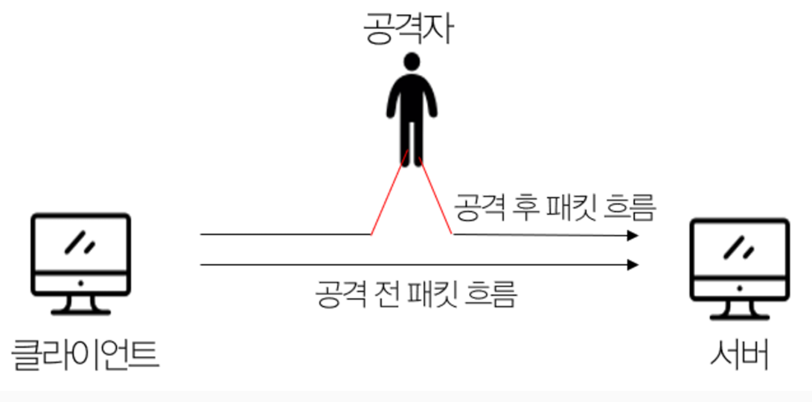

# ARP 스푸핑

## 💡 핵심 요약
> - **한 줄 정의** : 공격자가 로컬 네트워크에서 **특정 IP 주소에 대한 MAC 주소를 자신의 MAC 주소인 것처럼 속여**, 네트워크 트래픽을 중간에서 가로채는 공격(MITM) 기법.

> - **핵심 키워드:** `#MITM 공격` `#중간자 공격` `#ARP 캐시 포이즈닝` `#스니핑` `#로컬 네트워킹 보안 위협` `#게이트웨이 사칭`

> - **왜 중요한가?** : ARP 프로토콜의 인증 부재 취약점을 이용해 **정상적인 통신 흐름을 공격자에게로 왜곡**시키기 때문입니다. 이를 통해 공격자는 사용자의 아이디, 비밀번호와 같은 민감 정보를 쉽게 엿보거나(스니핑), 데이터를 변조하고, 특정 사용자의 네트워크를 마비시키는 등 심각한 피해를 유발할 수 있습니다. 

## 1. 개요

ARP 스푸핑은 로컬 네트워크(LAN)에서 공격자가 자신의 **MAC 주소를 다른 기기(주로 게이트웨이)의 MAC 주소인 것처럼 속여**, 네트워크 통신을 중간에서 가로채는(Man-in-the-Middle, MITM) 공격 기법입니다.

---

## 2. ARP 스푸핑 동작 과정 
#### **전제조건**
공격자, 피해자, 게이트웨이(Gateway)가 동일한 로컬 네트워크에 있습니다.

#### **1단계: 위조된 ARP 패킷 전송(ARP Reply 조작)**
공격자는 **요청이 없었음에도 불구**하고(Unsolicited) **특정 노드를 사칭**하는 **ARP 응답(ARP Reply) 패킷을 네트워크에 주기적**으로 **전송(Flooding)** 합니다.

#### **2단계 : ARP 캐시 테이블 오염**
노드들은 ARP 응답 패킷을 수신하면, 그 패킷의 **유효성이나 출처를 검증하는 절차 없이** ARP 캐시 테이블의 정보를 업데이트합니다. 이는 **ARP 프로토콜의 설계상 취약점**입니다.

#### **3단계 : 데이터 패킷 경로 왜곡**
ARP 캐시 테이블이 오염되면, 피해자와 게이트웨이 간의 모든 통신 패킷 경로가 공격자를 향하도록 왜곡됩니다.

즉, 이 단계에서 스위치는 프레임의 목적지 MAC 주소(공격자 MAC)를 보고 **패킷을 공격자에게 전달**합니다.

#### 4단계 : 패킷 포워딩(연결 유지)
공격자가 자신에게 온 패킷을 원래 목적지로 전달하지 않으면 피해자의 네트워크 연결은 즉시 끊어지게 되어 공격이 발각됩니다. 이를 방지하기 위해 공격자는 **패킷 포워딩(Packet Forwarding)**을 수행합니다.

- **동작 방식**: 공격자의 시스템은 수신한 패킷의 내용을 확인(또는 복사/변조)한 후, **원래의 목적지 MAC 주소로 프레임의 목적지 주소를 수정하여 네트워크로 다시 전송**합니다.

    > 피해자 PC로부터 받은 패킷 → 게이트웨이로 재전송
    > 게이트웨이로부터 받은 패킷 → 피해자 PC로 재전송

- **목적**: 피해자와 게이트웨이는 통신이 정상적으로 유지되는 것처럼 인식해, 공격자는 들키지 않고 **지속적으로 트래픽을 감청하거나 조작**할 수 있게 됩니다.

---

## ARP 스푸핑의 최종 목적
#### 정보 탈취(Sniffing)
암호화되지 않은 네트워크 트래픽을 도청하여 사용자의 계정 정보(ID, 비밀번호), 금융 정보, 개인 정보 등 **민감한 데이터를 탈취**합니다.

#### 데이터 변조
사용자와 서버가 주고받는 데이터를 **실시간으로 변조**합니다. 

#### 세션 하이재킹
사용자의 세션 ID를 가로채 인증된 사용자인 것처럼 위장하여 **정상적인 서비스에 무단으로 접근**합니다.

#### 서비스 거부 공격(DOS)
특정 사용자와 게이트웨이 간의 트래픽을 차단하거나 유실시켜 해당 **사용자가 인터넷에 접속할 수 없도록 네트워크를 마비**시킵니다.

---

## 대응 방안
#### **정적(Static) ARP 테이블 사용**
핵심적인 장비(예: 게이트웨이)의 IP 주소와 MAC 주소를 수동으로 **ARP 테이블에 영구적으로 등록**하는 방법입니다. 

ARP 테이블이 동적으로 업데이트되지 않으므로 변조 공격을 방지할 수 있습니다.

- 단점: 네트워크 내 모든 기기를 관리하기에는 비효율적일 수 있습니다.
- 명령어 예시 : `arp -s <IP 주소> <MAC 주소>`

#### **ARP 스푸핑 탐지 및 차단 솔루션 활용**
네트워크 트래픽을 **지속적으로 감시**하여 **비정상적인 ARP 패킷을 탐지하고 차단**하는 보안 소프트웨어나 네트워크 장비(스위치 등)의 보안 기능을 사용합니다.

#### **HTTPS와 같은 암호화된 프로토콜 사용**
공격자가 중간에서 트래픽을 가로채더라도(스니핑), **데이터가 암호화되어 있어 내용을 해석할 수 없으**므로 정보 유출을 막을 수 있습니다.

#### **네트워크 분리**
중요 서버나 장비가 위치한 네트워크와 일반 사용자의 **네트워크를 분리(VLAN 등)** 하여 공격의 영향 범위를 최소화합니다.
