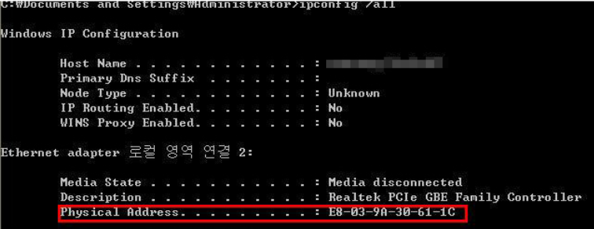
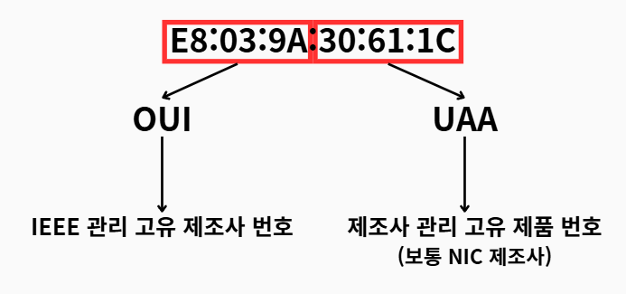
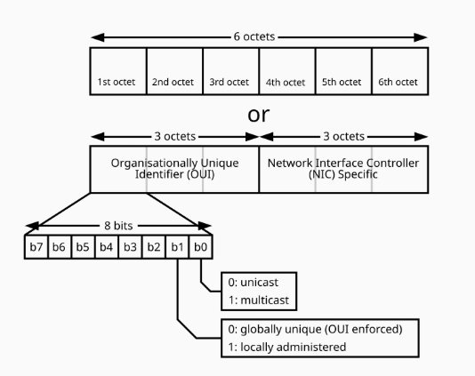

# MAC 주소 (Media Access Control Address)

## 💡 핵심 요약

> - **한 줄 정의 :**  데이터 링크 계층(2계층)에서 통신하기 위해 네트워크 카드(NIC)에 할당된, 전 세계적으로 유일한 물리적 하드웨어 주소.
> - **핵심 키워드:** `#물리적_주소` `#2계층` `#데이터링크` `#NIC` `#스위치` `#고유식별번호` `#OUI` `#UAA`
> - **왜 중요한가?** : IP 주소가 최종 목적지(End to End) **네트워크** 를 찾아가는 주소라면, MAC 주소는 그 네트워크 내에서 데이터를 받을 정확한 **장치**(Hop to Hop) 를 찾아가는 역할을 하기 때문입니다. 스위치는 이 MAC 주소를 보고 데이터를 특정 장치에만 전달하여, 로컬 네트워크의 통신 효율을 극대화하고 불필요한 트래픽을 막아줍니다.

## 1. 개요

MAC 주소는 OSI 7계층 중 **2계층(Data-Link Layer)** 에서 사용되는 **물리적 주소**입니다. 네트워크에 연결된 각 장치(NIC, Network Interface Card)에 부여된 고유한 하드웨어 식별 번호로, 동일한 로컬 네트워크 내에서 장치 간 통신(Hop-to-Hop)을 위해 사용됩니다.

IP 주소가 건물의 '주소'라면, MAC 주소는 각 방의 '문패'처럼 최종적으로 그 장치를 찾아가는 데 사용되는 고유한 이름과 같습니다.

---
## 2. 데이터 링크 계층의 구조: LLC와 MAC

데이터 링크 계층(Layer 2)은 IEEE 802 표준에 의해 두 개의 하위 계층(Sublayer)으로 나뉩니다. 이는 역할과 책임을 더 명확하게 분리하기 위함입니다.

#### 2.1. LLC (Logical Link Control) 부계층
- **역할**: 상위 계층인 네트워크 계층(Layer 3)과 하위의 MAC 부계층 사이의 인터페이스 역할을 합니다. 네트워크 계층의 프로토콜(IP 등)을 식별하고, 오류 제어 및 흐름 제어를 담당합니다.
- **특징**: LLC는 모든 종류의 물리적 매체(유선 LAN, 무선 LAN 등)에 독립적으로 동작할 수 있도록 설계되었습니다. 즉, 하드웨어의 종류와 상관없이 일관된 연결 서비스를 제공합니다.

#### 2.2. MAC (Media Access Control) 부계층
- **역할**: 물리적인 네트워크 매체(케이블, 공기 등)에 직접 접근하는 것을 제어합니다. 데이터의 **프레임화(Framing)**, **주소 처리(Addressing)**, **매체 접근 제어(Media Access Control)**를 담당합니다.
- **주소 처리**: 바로 이 계층에서 사용하는 주소가 **MAC 주소**입니다. 프레임의 헤더에 출발지와 목적지 MAC 주소를 포함시켜 데이터가 올바른 장치로 전달되도록 합니다.
- **매체 접근 제어**: 여러 장치가 동시에 통신 매체를 사용하려고 할 때 발생할 수 있는 충돌을 방지하고 제어하는 규칙을 정의합니다. (예: CSMA/CD)
- 

---
## 3. MAC 주소의 구조와 특징

### 3.1. MAC 주소의 형식
MAC 주소는 **48비트(6바이트)**로 구성된 주소 체계입니다. 보통 16진수로 표현되며, 각 바이트는 콜론(`:`)이나 하이픈(`-`)으로 구분됩니다.
- **예시**: `E8:03:9A:30:61:1C`

### 3.2. MAC 주소의 고유성 보장

MAC 주소의 전 세계적인 고유성은 IEEE와 하드웨어 제조사의 관리하에 보장됩니다.

48비트 주소는 다음과 같이 두 부분으로 나뉩니다.

- **OUI (Organizationally Unique Identifier)**: 앞쪽 24비트(3바이트). **IEEE**가 네트워크 장비 제조사에 할당하는 고유 번호입니다. 이를 통해 어떤 제조사에서 만든 장비인지 알 수 있습니다.

- **UAA (Universally Administered Address) 또는 NIC Specific**: 뒤쪽 24비트(3바이트). **각 제조사**가 자사의 제품에 개별적으로 할당하는 고유 번호입니다.

이러한 구조 덕분에 이론적으로 약 281조 개의 고유한 주소를 생성할 수 있습니다.

### 3.3. 상세구조 

- **I/G (Individual/Group) 비트** : 
    - 첫 번째 바이트의 **가장 첫 번째 비트(최하위 비트:LSB)** 입니다.
    - **0 (Individual)**: 해당 MAC 주소가 하나의 특정 장치에만 할당되었음을 의미합니다.
        - 이를 유니캐스트(Unicast) 주소라고 합니다. 대부분의 장비는 이 값을 가집니다.

    - **1 (Group)**: 해당 MAC 주소가 여러 장치로 구성된 그룹을 나타냄을 의미합니다. 
        - 이를 멀티캐스트(Multicast) 주소라고 합니다. 
        - 이 주소로 전송된 패킷은 해당 그룹에 속한 모든 장치에 전달됩니다.

- **U/L (Universal/Local) 비트** : 
    - 첫 번째 바이트의 **두 번째 비트(최하위 에서 두 번째 비트)** 입니다.
    - **0 (Universal)**: 전 세계적으로 유일함이 보장되는 주소를 의미합니다. 
        - OUI를 통해 IEEE로부터 할당받은, 일반적으로 장치에 고정되어 나오는 주소(Burned-In Address)입니다.

    - **1 (Local)**: 로컬 네트워크 관리자가 임의로 할당한 주소임을 의미합니다. 
        - 네트워크 내에서만 고유성이 유지되며, 다른 네트워크의 주소와 중복될 수 있습니다. 가상 머신(VM)이나 특정 네트워크 프로토콜에서 사용됩니다.

### 3.4. 유니캐스트, 멀티캐스트, 브로드캐스트
MAC 주소의 첫 번째 바이트는 주소의 종류를 나타내는 특별한 비트를 포함합니다.
- **유니캐스트 (Unicast)**: 단일 목적지로 향하는 1:1 통신.
- **멀티캐스트 (Multicast)**: 지정된 그룹의 여러 목적지로 향하는 1:N 통신.
- **브로드캐스트 (Broadcast)**: 로컬 네트워크의 모든 장치로 향하는 1:All 통신. MAC 주소는 `FF:FF:FF:FF:FF:FF`를 사용합니다.

### 3.5. 하나의 장치, 여러 개의 MAC 주소
하나의 물리적 장치에는 여러 개의 네트워크 인터페이스(NIC)가 탑재될 수 있습니다.

예를 들어, 스마트폰은 Wi-Fi 모듈, Bluetooth 모듈 등을 가질 수 있으며, **각 NIC마다 별개의 고유한 MAC 주소가 할당됩니다**.

---
## 4. MAC 주소와 IP 주소의 차이
네트워크 통신을 이해하려면 MAC 주소와 IP 주소의 차이점을 아는 것이 중요합니다.

| 구분 | MAC 주소 (물리적 주소) | IP 주소 (논리적 주소) |
| :--- | :--- | :--- |
| **계층** | 2계층 (Data-Link) | 3계층 (Network) |
| **주소 길이**| 48비트 | 32비트 (IPv4 기준) |
| **변경성** | 불변 (하드웨어에 고정) | 가변 (네트워크 접속 시 할당) |
| **통신 범위**| 로컬 네트워크 (LAN) 내부 | 전체 네트워크 (인터넷) |
| **역할** | 바로 옆 장비(Hop)를 찾아갈 때 사용 | 최종 목적지 컴퓨터를 찾아갈 때 사용 |