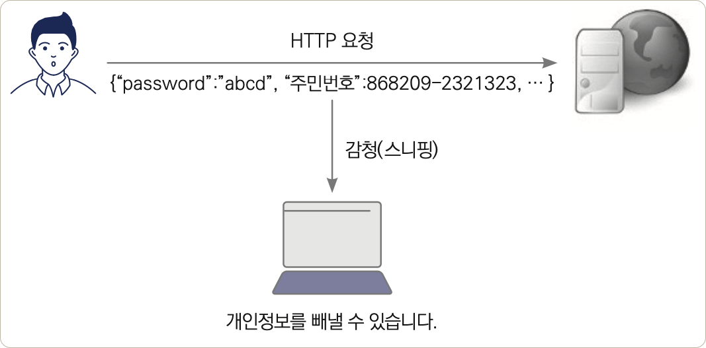
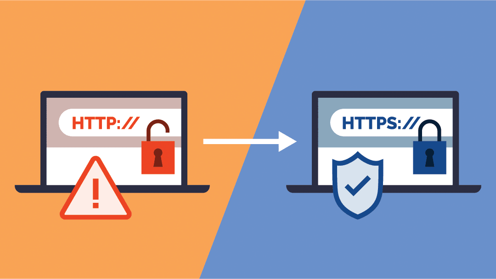
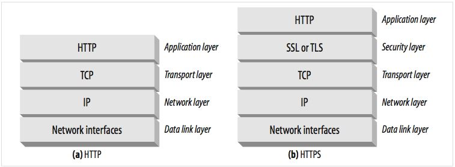

# HTTPS

 

## 목차 
- [HTTPS](#https)
  - [목차](#목차)
  - [HTTPS](#https-1)
    - [HTTP 문제점](#http-문제점)
    - [HTTPS 개념 \& HTTPS 필요성](#https-개념--https-필요성)
    - [HTTP \& HTTPS 차이점](#http--https-차이점)
    - [HTTPS 장단점](#https-장단점)

 

## HTTPS

### HTTP 문제점

HTTP 특징 : **`평문 (Plain Text) 통신 프로토콜`** = 데이터 암호화 하지 않고 주고 받는 것

 

**발생 문제점**

- **도청**
    - 데이터 암호화 되지 않는 Plain Text 통신 프로토콜
    - 공격자가 네트워크 중간에서 오가는 요청/응답 데이터 엿볼 수 있음
    - 공용 와이파이에서 패킷 캡처만 해도 로그인 정보, 개인정보, 금융 정보 등 노출
    - ex : 패킷 스니핑으로 정보 가로채 계정 탈취
- **데이터 변조**
    - 데이터 엿보는 것 넘어 내용 마음대로 수정 가능
    - 사용자는 데이터 변조되었다는 사실 인지하기 어려움
    - 전송 중 비트 변경을 탐지할 내장 메커니즘이 없기 때문
    - ex : 계좌번호 바꿔치기, 파일 다운로드 중 악성 코드로 교체, 피싱 사이트로 리다이렉트
- **신원 위장 (스푸핑)**
    - 공격자는 실제 사이트와 똑같이 생긴 가짜 사이트(피싱 사이트)를 만들어 사용자를 속일 수 있음
    - 통신하고 있는 서버가 진짜 내가 접속하려던 서버가 맞는지 확인할 방법이 없음
    - 신뢰 기반으로 작동하기 때문
    - ex : 가짜 은행 사이트 접속, DNS 스푸핑 공격, 중간자 공격(MITM)

 

### HTTPS 개념 & HTTPS 필요성

HTTPS : Hypertext Transfer Protocol Secure의 약자. 

기존의 HTTP 프로토콜에 '보안(Secure)' 기능이 추가된 버전.

HTTPS가 완전히 새로운 프로토콜이 아니라, 기존의 HTTP 통신을 더 안전하게 감싼 형태라는 점.

 

HTTPS의 'S'를 책임지는 핵심 기술이 바로 **SSL(Secure Sockets Layer)** 또는 TLS(Transport Layer Security). 

TLS가 SSL의 최신 후속 버전이므로, 현재는 **TLS**가 표준 용어.

TLS는 HTTP가 있는 Application Layer과 TCP가 있는 Transport Layer 사이에 독립적인 보안 계층을 만듬.

그 위에서 오가는 모든 데이터를 보호.

 

위의 HTTP 문제점 도청, 데이터 변조, 신원 위장 문제를 해결하기 위해 HTTPS가 필요함.

기밀성, 무결성, 인증을 제공하기 위해 HTTPS가 필요함. 

 

### HTTP & HTTPS 차이점

1. **기본 구조**

HTTPS는 완전히 새로운 프로토콜이 아님

기존의 HTTP 아래에 보안을 위한 SSL/TLS 계층이 추가된 형태

- **HTTP 통신 스택**
    - `Application Layer`: **HTTP**
    - `Transport Layer`: TCP
    - `Internet Layer`: IP
- **HTTPS 통신 스택**
    - `Application Layer`: **HTTP**
    - `Security Layer`: **SSL / TLS** <-- **이 계층이 추가됨, 데이터 암호화 후 전송**
    - `Transport Layer`: TCP
    - `Internet Layer`: IP

 

2. **보안 측면**

- **HTTP**:
    - 평문 전송 → 도청, 변조, 위장 공격에 취약
    - 서버 진위 확인 불가
- **HTTPS**:
    - TLS로 데이터 암호화 해서 복호화 키 없이는 내용 확인 불가능 → 기밀성 보장
    - 레코드마다 MAC/HMAC으로 변조 검출 → 변조 방지
    - 서버 인증서 기반 인증 → 피싱 방지

 

3. **사용 포트**

- **HTTP**: TCP **80번 포트**
- **HTTPS**: TCP **443번 포트**

 

4. **속도**

- **HTTP**: TLS Handshake 없음 → 연결 속도 빠름
- **HTTPS**: 초기 Handshake 필요 → 약간 느림
    - **하지만 TLS 1.3, 세션 재사용** 등 최적화로 거의 차이 없음

 

5. **주소 표시**

- **HTTP**: `http://`
- **HTTPS**: `https://` (브라우저에서 🔒 자물쇠 표시)

 

6. **인증서 필요 여부**

- **HTTP**: 인증서 불필요
- **HTTPS**: CA에서 발급한 인증서 필요 (유료/무료 모두 가능, 예: Let's Encrypt)

 

### HTTPS 장단점

**장점**

- **데이터 암호화 (기밀성)**
    - 모든 통신 내용 암호화
    - 중간에 도청하더라도 내용 알 수 없음
- **무결성 보장**
    - TLS 레코드마다 HMAC과 시퀀스 번호로 변조, 재전송, 순서 바꿈을 검출
    - 악성코드 삽입이나 데이터 조작과 같은 공격 방지 가능
- **인증 기능**
    - CA 인증서를 통해 서버가 진짜임을 보장.
        - 인증서와 CA 체인 검증으로 가짜 서버, MITM 차단
    - 피싱 사이트 방지
- **검색 엔진 최적화 (SEO) 혜택**
    - Google 같은 검색엔진은 안전한 웹 환경 장려 위해 HTTPS 사용하는 웹사이트에 검색 순위 가산점 부여
    - 동일한 조건의 사이트라면 HTTP 사이트보다 HTTPS 사이트가 검색 결과 상위에 노출될 확률 높음

 

**단점** 

- **초기 연결 속도 저하**
    - TLS Handshake 과정에서 추가 지연 발생.
    - TLS 1.3, 세션 재사용으로 많이 개선됨.
- **서버 부하 및 처리 속도 저하 및 리소스 소모**
    - 주고받는 모든 데이터를 암호화하고 복호화해야 함.
    - 따라서 서버의 CPU에 추가적인 부하가 발생.
- **인증서 구매 및 관리, 운영 비용**
    - SSL/TLS 인증서 발급/갱신 관리 필요.
    - 일부 CA 인증서는 유료.
    - 물론 Let’s Encrypt 등 무료도 있음.
- **구현 복잡성**
    - 서버 설정, 인증서 설치/갱신, 보안 취약점 패치 등 관리 필요.
    - 잘못된 설정 시 보안이 오히려 약해질 수 있음.
    - 인증서 발급, 배포, 갱신, 폐기와 체인 검증 실패 처리 등 운영 복잡성 따름.