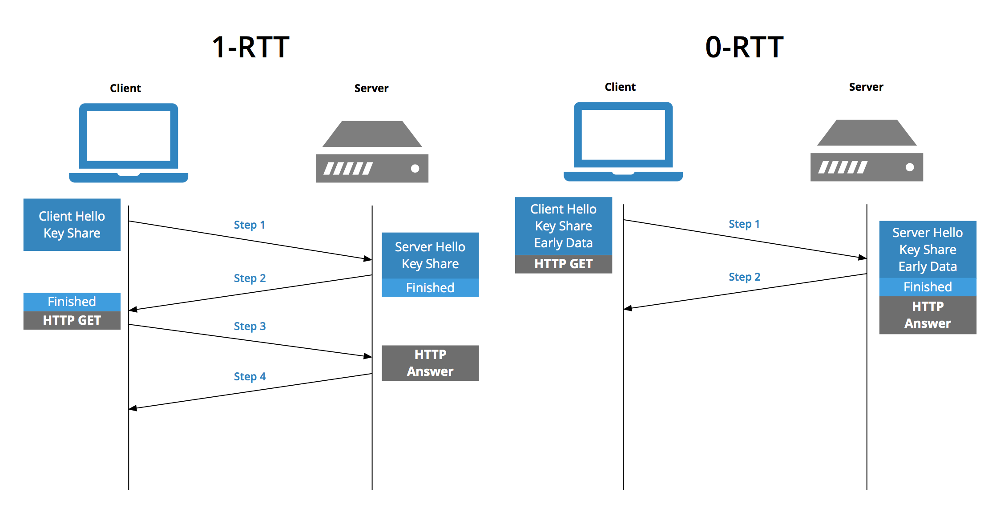

# TLS (Transport Layer Security)

 

## 목차
- [TLS (Transport Layer Security)](#tls-transport-layer-security)
  - [목차](#목차)
  - [SSL \& TLS](#ssl--tls)
    - [SSL/TLS 개념](#ssltls-개념)
    - [TLS Handshake](#tls-handshake)
    - [TLS 프로토콜](#tls-프로토콜)
    - [TLS 헤더](#tls-헤더)
    - [TLS 성능 관련](#tls-성능-관련)

 

## SSL & TLS

### SSL/TLS 개념

네트워크를 통해 전달되는 데이터의 **보안**을 제공하기 위해 설계된 **암호화 프로토콜**

 

- **SSL (Secure Sockets Layer)**
    - 1990년대 중반, 넷스케이프(Netscape)사에서 웹 통신을 보호하기 위해 처음 개발
    - 인터넷 통신의 보안을 위해 등장
    - 웹 브라우저와 서버 간 통신을 암호화하기 위해 등장
    - 하지만 SSL 2.0과 3.0에서 심각한 보안 취약점이 발견되어, 현재는 SSL을 사용하는 것이 금지
- **TLS (Transport Layer Security)**
    - 국제 인터넷 표준화 기구(IETF)가 SSL 3.0을 기반으로 더욱 강화하고 표준화하여 발표한 프로토콜
    - 이름이 바뀌었지만, SSL의 기본적인 메커니즘을 계승 발전
    - SSL에서 암호화 방식/보안 구조가 개선됨
    - 현재 웹에서 사용되는 HTTPS 보안은 전부 TLS 기반
    - 버전: TLS 1.0 (SSL 3.0의 업그레이드 버전) → TLS 1.1 → TLS 1.2 → TLS 1.3 (최신, 2018)

 

**SSL/TLS의 3가지 핵심 기능**

SSL/TLS는 이전에 학습한 HTTPS의 3가지 보안 목표를 직접적으로 구현하는 기술

 

**1) 암호화 (Encryption) - 기밀성 확보**

데이터가 평문으로 노출되지 않도록 암호화.

SSL/TLS는 두 가지 암호화 방식을 함께 사용하는 하이브리드 방식을 채택하여 효율성을 높임

- **비대칭키(공개키) 암호화**:
    - 속도가 느리지만 키를 교환하기에 안전.
    - 통신 초기 단계인 TLS Handshake 과정에서, 앞으로 사용할 '대칭키' 안전하게 주고받는 데 사용됨.
- **대칭키 암호화**:
    - 속도가 매우 빠름.
    - Handshake 끝나고, 안전하게 교환된 '대칭키(세션키)' 이용해 실제 데이터를 암호화하는 데 사용됨.

 

**2) 무결성 (Integrity) - 안전성 확보**

전송되는 데이터가 중간에 변경되지 않았음을 보장.

- 메시지 인증 코드(MAC, Message Authentication Code)를 사용.
- 데이터를 보내기 전에, 원본 데이터의 '지문(Fingerprint)'과 같은 해시(Hash) 값을 생성
- 이를 암호화하여 데이터와 함께 보냄.
- 데이터를 받은 측에서는 동일한 방식으로 '지문'을 만들어보고, 수신한 '지문'과 일치하는지 비교.
- 만약 두 지문이 다르면, 데이터가 중간에 변조되었다는 의미이므로 해당 연결을 즉시 중단.

 

**3) 인증 (Authentication) - 신뢰성 확보**

통신하는 상대방이 진짜인지 확인해줌.

- SSL/TLS 인증서 (Digital Certificate)를 통해 신뢰성 보장.
- 클라이언트(브라우저)는 서버로부터 받은 인증서를 신뢰할 수 있는 인증 기관(CA)의 공개키로 검증.
- 이를 통해 사용자는 자신이 접속한 사이트가 위장된 피싱 사이트가 아닌, 진짜 사이트임을 확신 가능.

 

### TLS Handshake

TLS Handshake 목적

- **신원 확인 :** 서버(또는 클라이언트)를 인증 (일반적으론 서버 인증).
- **암호화 규칙 합의** : 클라이언트와 서버가 서로 사용할 암호화 매개변수(암호 스위트) 를 합의.
- **비밀키 공유 :** 실제 데이터 암호화, 복호화할 때 사용할 대칭키(세션 키) 안전하게 만들어 공유.
- **데이터 통신** : 이후 레코드 프로토콜로 암호화된 애플리케이션 데이터를 주고받음.

 

**TLS Handshake 상세 과정 (4단계) (TLS 1.2)**

**1단계: Client Hello (클라이언트의 첫인사)**

클라이언트가 서버에게 통신을 시작하고 싶다는 의사를 밝히며, 자신이 어떤 능력을 가졌는지 알려줌.

- **전송하는 정보**:
    1. **Client Random Number**
        1. 클라이언트가 생성한 랜덤 데이터.
        2. 나중에 비밀키를 만드는데 사용될 임의의 숫자.
    2. **TLS Version**
        1. 클라이언트가 지원하는 TLS 버전 목록.
    3. **Supported Cipher Suites**
        1. 클라이언트가 지원하는 암호화 방식(Cipher Suites) 목록.
        - Cipher Suite란? = 인증, 키 교환, 데이터 암호화, 무결성 검증에 사용할 알고리즘들을 한 세트로 묶어놓은 것.

 

**2단계: Server Hello (서버의 응답 및 신원 증명)**

클라이언트의 제안을 받은 서버가 응답하며, 자신을 증명하는 신분증을 제시.

- **전송하는 정보**:
    1. **Server Random Number**
        1. 서버가 생성한 랜덤 데이터.
        2. 서버 측에서 만든 임의의 숫자.
    2. **Choosen TLS Version**
        1. 선택된 TLS 버전. 
        2. 클라이언트가 제시한 버전 목록 중 서버가 지원하는 가장 높은 버전을 선택. 
    3. **Selected Cipher Suite**
        1. 선택된 암호화 방식 (Cipher Suite).
        2. 클라이언트가 제시한 목록 중 서버가 가장 안전하다고 판단하는 방식을 하나 선택.
    4. **Server Certificate** 
        1. 가장 중요한 부분.
        2. 서버의 디지털 인증서.
        3. 진짜 요청한 서버가 맞다는 것을 증명하는 인증서. 
        4. 이 인증서 안에는 서버의 공개키와 인증 기관(CA)의 서명이 들어있음.
    5. **Server Hello Done**
        1. 서버가 초기 협상을 마쳤음을 알림.
    6. **(선택사항) 서버의 키 교환 정보** 
        1. 선택된 키 교환 알고리즘에 따라 추가 정보가 전송될 수 있음.

 

**3단계: Client의 검증 및 비밀키 재료 전송**

서버로부터 정보를 받은 클라이언트는 이제 서버를 믿을 수 있는지 검증함.

비밀키를 만드는 데 가장 중요한 재료를 만들어 보냄.

- **클라이언트의 행동**:
    1. **인증서 검증**:
        - 브라우저에 내장된 신뢰할 수 있는 CA(인증 기관) 목록을 통해 서버 인증서가 유효한지 확인.
        - CA의 공개키로 인증서의 서명을 복호화해봄.
        - 인증서에 적힌 도메인 이름이 내가 접속하려는 사이트와 일치하는지 확인.
        - 인증서가 만료되지는 않았는지 확인.
        - 이 과정에 실패하면 브라우저는 "연결이 비공개로 설정되어 있지 않습니다." 같은 경고를 띄움.
    2. **비밀키 재료(Pre-Master Secret) 생성**:
        - 인증서 검증이 성공하면, 클라이언트는 또 다른 임의의 데이터인 Pre-Master Secret 생성.
        - 이 데이터가 바로 세션 키(대칭키)의 핵심 재료.
- **클라이언트 → 서버**:
    1. **Client Key Exchange Message** :
        - 클라이언트는 방금 만든 'Pre-Master Secret'을 서버 인증서에 있던 '공개키'로 암호화하여 서버에게 보냄.
        - 서버의 공개키로 암호화했기 때문에, 오직 그에 맞는 개인키를 가진 서버만이 이 내용을 열어볼 수 있음.
    2. **Change Cipher Spec**: 
        1. "이제부터 새로 협상한 암호/키로 레코드를 처리하겠다"는 신호
        2. 비밀 상태로 전환.
    3. **Finished (Encrypted)**:
        - 지금까지 협의한 내용(Client Random, Server Random, Pre-Master Secret)을 모두 조합.
        - 조합하여 마스터 키(Master Secret)를 만듬.
        - 이로부터 최종 세션 키(대칭키)를 생성.
        - "Handshake 과정이 잘 끝났는지 확인해봅시다."라는 메시지를 방금 만든 세션 키로 암호화해서 서버에 보냄.
        - 서버가 이 메시지를 성공적으로 해독하면, 클라이언트와 서버가 동일한 세션 키를 생성했음이 증명됨.

 

**4단계: Server의 최종 확인 및 Handshake 완료**

클라이언트로부터 비밀키 재료를 받은 서버는 최종적으로 세션 키를 만듬 

모든 과정이 성공적으로 끝났음을 알림.

- **서버의 행동**:
    1. 자신만이 가진 개인키로 클라이언트가 보낸 암호화된 Pre-Master Secret을 복호화.
    2. 이제 서버도 클라이언트와 마찬가지로 Client Random, Server Random, Pre-Master Secret 세 가지 정보를 모두 갖게 됨.
    3. 클라이언트와 동일한 방식으로 '마스터 키'와 '세션 키'를 생성.
- **서버 → 클라이언트**:
    1. **Change Cipher Spec**: 
        1. "이제부터 새로 협상한 암호/키로 기록(레코드)을 처리하겠다"는 신호
    2. **Finished (Encrypted)**:
        - 서버 역시 "Handshake 과정이 모두 끝났습니다."라는 확인 메시지를 자신이 만든 세션 키로 암호화하여 클라이언트에게 보냄.
        - 클라이언트는 이 메시지를 성공적으로 복호화함으로써, 서버 또한 자신과 동일한 세션 키를 가지고 있음을 최종적으로 확인.

 

**5단계 : Handshake 종료**

4단계의 Handshake 과정이 성공적으로 끝나면, 클라이언트와 서버는 완벽하게 동일한 대칭키(세션 키) 안전하게 공유.

이후부터는 이 세션 키 사용해 모든 HTTP 요청과 응답 데이터를 암호화하여 빠르고 안전하게 통신을 이어감.

 

**알아볼 것**

- 서버 인증서 전달 및 검증 (CA 인증서, 체인 구조)
- 키 교환 방식 (RSA, Diffie-Hellman, ECDHE)
- 세션키 생성 및 공유 과정
- 세션 키 합의 및 암호화 통신 시작

 

### TLS 프로토콜

TLS 프로토콜 스택

- 크게, 두 그룹으로 구성
    - 상위 handshake 관련 프로토콜들
    - 하위 record 프로토콜 (단편화,압축,무결성,암호화 기능 제공)

 

**1) TLS Handshake Protocol**

- **역할:**
    - 클라이언트와 서버 간의 안전한 통신 채널을 설정하는 역할.
    - TLS 세션 수립 단계에서 사용.
- **주요 기능**:
    - TLS 버전, 암호화 방식(Cipher Suite) 등 통신에 사용할 파라미터를 협상.
    - 서버의 인증서를 교환하고 클라이언트가 이를 검증하여 서버의 신원을 확인.
    - 암호화 통신에 사용할 세션 키(대칭키)를 안전하게 생성하고 공유.

 

**2) Change Cipher Spec Protocol**

- **역할**:
    - 보안 파라미터 변경을 알리는 신호.
- **주요 기능**:
    - 이 프로토콜은 단 하나의 메시지만을 가짐.
    - 이 메시지는 "지금부터는 방금 handshake 과정에서 협의한 새로운 암호화 규칙(Cipher Spec)으로 통신을 시작하겠습니다."라는 의미.
    - 암호화되지 않은 handshake 통신에서 암호화된 데이터 통신으로 전환되는 스위치 역할.

 

**3) TLS Alert Protocol**

- **역할**:
    - 통신 중 오류가 발생했거나 특정 상태를 상대방에게 알리는 역할.
- **주요 기능**:
    - 핸드셰이크 실패, 인증서 오류, 암호 해독 실패 등 다양한 종류의 오류를 상대방에게 통보.
    - `close_notify` 메시지를 보내 안전하게 연결을 종료하는 데에도 사용됨.
- **메시지 구조**:
    - Alert Level
        - 경고의 심각도를 나타내는 레벨(Level)
        - ex :  `warning`, `fatal`
    - Alert Description
        - 경고의 종류를 나타내는 설명(Description)
        - ex : `handshake_failure`, `bad_certificate`
    - 이 2개로 구성된 간단한 구조.

 

**4) TLS Record Protocol**

- **역할**:
    - TLS의 가장 기본이 되는 프로토콜.
    - 모든 TLS 통신의 데이터를 포장하고 보호하는 역할.
    - 상위 프로토콜(handshake, alret 등)에서 온 데이터를 받아 보안 처리를 한 후 전송 계층으로 넘김.
    - 상위 프로토콜의 메시지들을 레코드 단위로 나눠 기능 처리함.
- **주요 기능**:
    - **데이터 분할**:
        - 상위 계층에서 온 큰 데이터를 적절한 크기(보통 16KB 이하)의 블록으로 나눔.
    - **압축 (선택사항)**:
        - 데이터 크기를 줄이기 위해 압축 가능.
        - 현재는 보안 취약점 때문에 거의 사용 X.
    - **메시지 인증**:
        - 데이터 무결성을 보장하기 위해 MAC(메시지 인증 코드)을 추가.
    - **암호화**:
        - 합의된 세션 키를 사용하여 데이터를 암호화.

 

### TLS 헤더

 

모든 하위 프로토콜들의 메시지는 **TLS 레코드 프로토콜**에 의해 '보안 컨테이너'에 담겨 전송. 

이 컨테이너의 앞부분에 붙는 정보가 바로 **TLS 레코드 헤더**.

 

**각 필드 상세 설명:**

1. **Content Type (콘텐츠 유형) - 1바이트**
    - 이 레코드에 담겨있는 데이터가 어떤 하위 프로토콜의 메시지인지 알려줌.
    - `20 (0x14)`: Change Cipher Spec 프로토콜
    - `21 (0x15)`: 경고 (Alert) 프로토콜
    - `22 (0x16)`: 핸드셰이크 (Handshake) 프로토콜
    - `23 (0x17)`: 애플리케이션 데이터 (Application Data) - (예: 암호화된 HTTP 메시지)
2. **Version (버전) - 2바이트**
    - 사용 중인 TLS 프로토콜의 버전을 나타냄.
    - `0x0301`: TLS 1.0
    - `0x0302`: TLS 1.1
    - `0x0303`: TLS 1.2
    - `0x0304`: TLS 1.3
    - (참고: 역사적인 이유로 SSL 3.0이 버전 3.0이라서 TLS 1.0이 3.1부터 시작.)
3. **Length (길이) - 2바이트**
    - 뒤따라오는 페이로드(Payload)의 길이를 바이트 단위로 나타냄.
    - 이 필드의 크기는 2바이트이므로, 최대 길이는 $2^{16}−1$ 바이트.
    - 하지만, 표준에서는 페이로드의 최대 크기를 $2^{14}$ 바이트 (16KB)로 제한.
    - 16KB는 메모리, 속도, 보안 사이의 균형을 맞춘 매우 실용적인 타협점이기 때문.
4. **Payload (페이로드)**
    - 실제 전송되는 데이터가 담기는 부분.
    - Content Type이 `Handshake`이면 핸드셰이크 메시지가 이 부분에 위치.
    - `Application Data`이면 암호화된 실제 데이터(예: HTTP 요청/응답)가 이 부분에 위치.
    - 이 데이터는 MAC 값이 포함된 상태로 암호화되어 있음.

 

### TLS 성능 관련

**TLS Handshake overhead**

- **handshake 지연**
    - TLS 연결 시 handshake 과정에서 최소 1~2 RTT(Round Trip Time) 필요.
- **공개키 연산 비용**
    - RSA, ECDHE 같은 비대칭키 연산은 CPU 부담이 큼.
    - RSA는 키 길이가 길수록 속도 저하.
    - ECDHE는 보안 강도 대비 계산량이 더 적어 현대 표준.
- **세션 키 유도 및 관리**
    - PRF/HKDF 기반 키 유도 연산.
    - 한 번만 하면 이후는 대칭키 기반 암호화라서 큰 부담은 아님.
- **대칭키 암호화/복호화**
    - 실제 데이터 전송 시에는 AES, ChaCha20 같은 대칭키 암호화 사용.
    - 현대 CPU는 하드웨어 가속을 지원해서 속도는 빠른 편.
    - 하지만 대규모 트래픽 환경에서는 여전히 CPU 부담 존재.
- **레코드 단위 처리**
    - TLS는 데이터를 레코드 단위(최대 16KB)로 쪼개서 암호화.
    - 작은 패킷이 많으면 오버헤드가 상대적으로 증가.

 

**TLS 성능 최적화 기법**

- **TLS 버전 선택**
    - TLS 1.2은 핸드셰이크에 2-RTT가 필요. (두 번의 왕복 통신)
    - TLS 1.3은 핸드셰이크 RTT 감소 (1-RTT, 0-RTT 가능) → 연결 지연 최소화.
    - 초기 연결 지연 시간을 절반 가까이 줄이기 가능.
    - 오래된 암호화 방식 복잡한 옵션이 제거되어 최적화된 연결 성능을 제공
- **세션 재사용**
    - 사용자가 사이트에 다시 방문할 때, 매번 무거운 전체 핸드셰이크 과정을 반복하는 것은 비효율적
    - 이전에 맺었던 보안 세션 정보를 재활용하여 핸드셰이크 과정을 건너뛰거나 대폭 단축
    - **세션 티켓 (Session Tickets)**:
        - 서버가 세션 정보를 암호화하여 '티켓' 형태로 클라이언트에게 보관.
        - 클라이언트는 재접속 시 이 티켓을 서버에 제시하여 바로 암호화 통신을 시작 가능.
        - 서버에 부담을 주지 않아 확장성이 좋음.
    - **0-RTT (Zero Round-Trip Time Resumption)**:
        - TLS 1.3에서 도입된 강력한 기능.
        - 클라이언트가 세션 티켓과 함께 첫 번째 `ClientHello` 메시지에 암호화된 초기 데이터(HTTP 요청 등)를 함께 보낼 수 있음.
        - 이를 통해 핸드셰이크 지연을 거의 0으로 만들 수 있음.
        - 초기 지연(1 RTT)조차 제거해 성능 크게 향상.
        - 단, 재전송 공격(Replay Attack)에 대한 보안 고려가 필요해 민감 요청에는 사용 금지.
    - TLS 1.2: 세션 ID / 세션 티켓으로 이전 세션 재사용 가능.
    - TLS 1.3: PSK(Pre-Shared Key) 기반 세션 재개 지원.
- **암호화 방식 선택**
    - AES-GCM과 같은 AEAD 방식의 암호화는 암호화와 무결성 검증을 한 번에 효율적으로 처리.
    - 따라서 성능이 우수.
    - TLS 1.3은 이러한 최신 암호화 방식만 사용하도록 강제함.
    - RSA 키 교환은 CPU 부담이 크므로 비권장.
- **하드웨어 가속**
    - 최신 CPU에는 AES 암호화를 위한 전용 하드웨어 가속 명령어(AES-NI)가 내장되어 있음.
    - 이를 사용하면 암호화로 인한 CPU 부하가 거의 무시할 수 있는 수준으로 줄어듬.
    - 대부분의 최신 서버와 PC는 이를 지원함.
- **프로토콜 상위 개선**
    - HTTP/2, HTTP/3(QUIC)은 HTTPS만 사용 가능
    - HTTP/2는 강력한 성능 향상 기능을 제공
        - 하나의 TCP 연결에서 여러 요청/응답을 동시에 처리하는 다중화(Multiplexing)
        - 헤더 중복을 제거하는 헤더 압축(Header Compression) 등
    - TLS handshake에서 발생하는 약간의 지연 HTTP/2가 제공하는 엄청난 속도 향상으로 인해 상쇄됨

