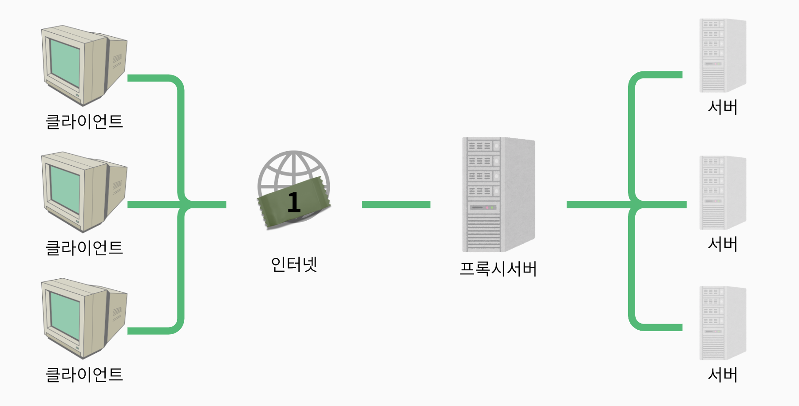
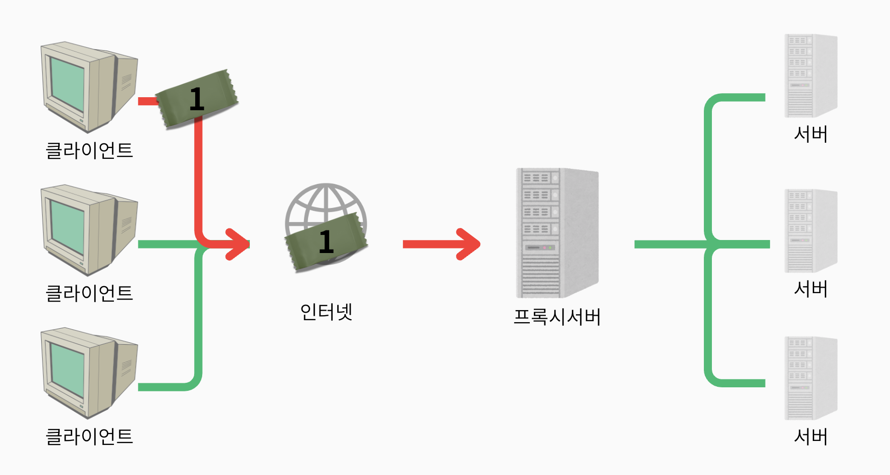
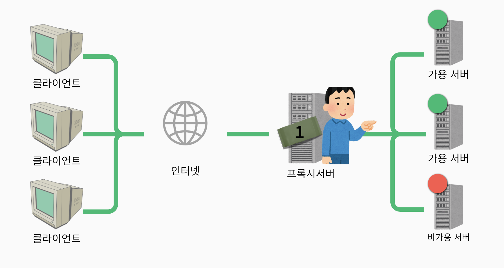
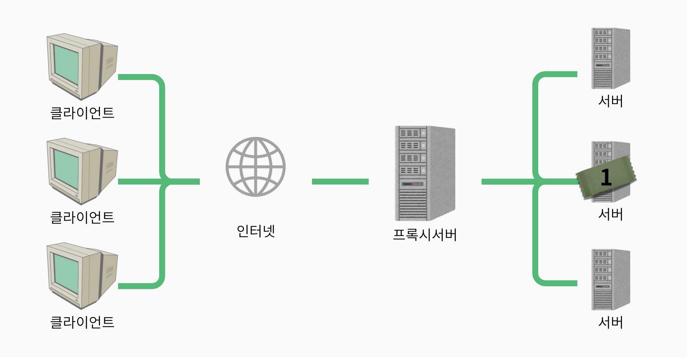
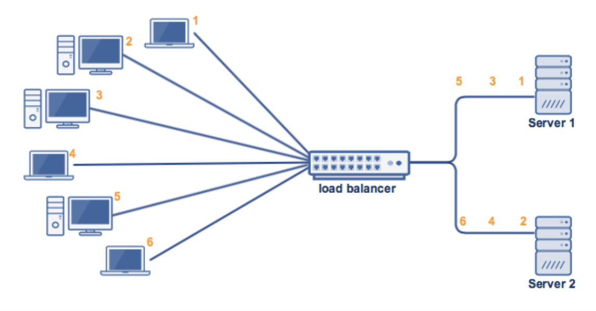
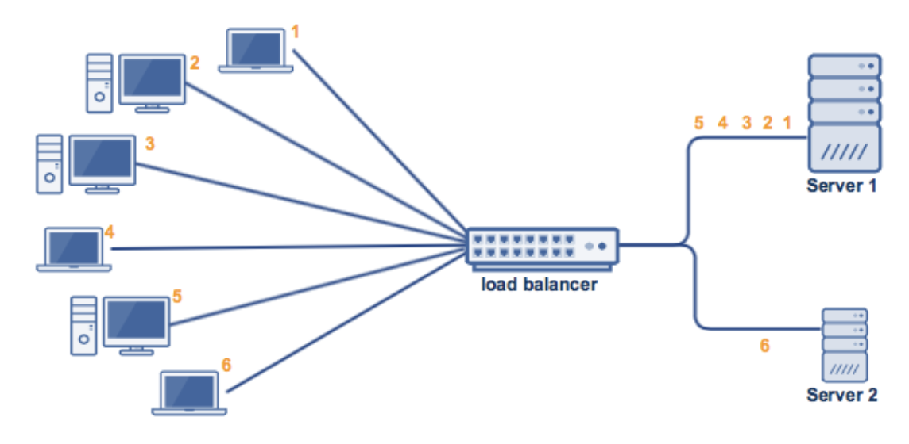
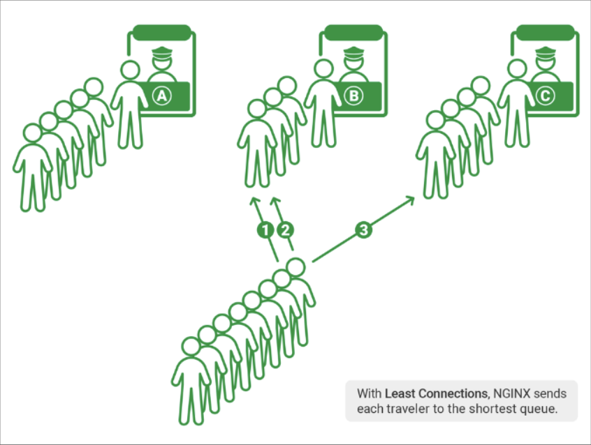
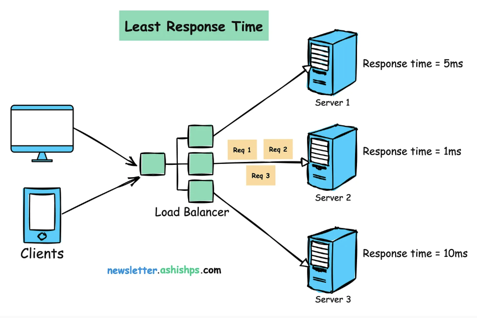

# 로드밸런싱 (Load Balancing)

## 💡 핵심 요약
- **한 줄 정의** : 네트워크 또는 서버에 들어오는 부하(트래픽)을 분산시켜주는 기술
- **핵심 키워드** : 두 개 이상의 서버, 로드밸런서, 트래픽 분산, 고가용성
- **왜 중요한가?** : 서버 과부하를 방지하고, 시스템의 성능과 가용성을 높이며, 장애 복구와 확장성을 지원하기 때문입니다.

# **1. 개념 (What is this?)**

load(서버가 받는 트래픽) + balancing(균형)

로드밸런싱은 네트워크 또는 서버에 가해지는 부하(트래픽)를 여러 서버에 분산시키는 기술입니다. 

하나의 서버에 트래픽이 집중되지 않도록 관리해 과부하를 방지하고, 시스템 성능과 가용성을 정상상태로 유지시키는데 중요한 역할을 합니다. 

로드밸런서는 클라이언트의 요청을 받아 여러 백엔드 서버 중 최적의 서버로 트래픽을 전달하는 리버스 프록시 역할을 하기도 합니다.

---

# **2. 왜 필요한가? / 등장 배경 (Why is it needed?)**
- 서버 과부하 방지: 단일 서버에 트래픽이 몰리면 성능 저하나 장애가 발생할 수 있습니다. 여러 서버로 분산해 안정적인 서비스 제공이 가능합니다.

- 고가용성: 서버 중 하나가 장애가 나더라도, 나머지 서버가 트래픽을 처리해 서비스 중단을 최소화합니다.

- 확장성: 트래픽이 증가하면 서버를 추가해 쉽게 확장할 수 있습니다.

- 성능 최적화: 클라이언트 요청을 가장 적합한 서버로 분배해 응답 속도를 높이고, 리소스 활용을 극대화합니다.

- 장애 복구: 서버 장애 시 자동으로 다른 서버로 트래픽을 리디렉션하여 복구 시간을 줄입니다.

---

# **3. 동작 원리 및 주요 특징 (How does it work?)**
0. **헬스 체크** : 로드밸런서는 주기적으로 각 서버의 상태를 확인합니다.
    

1. **요청 수신** : 클라이언트로부터 들어오는 요청을 로드밸런서가 수신
    

2. **서버 선택** : 설정된 알고리즘에 따라 최적의 서버를 선택
    

3. **요청 전달** : 선택된 서버로 요청을 전달
    

4. **응답 반환** : 서버의 응답을 클라이언트에게 다시 전달
    

중요한 점은 클라이언트는 로드밸런서를 엔드포인트로 인식하고 통신한다는 점입니다.

## 기본기능

### Health Check

- 액티브 헬스 체크
    - 로드밸런서가 주기적으로 서버에 요청을 보내 상태 확인
    - **TCP 연결 시도** 또는 **HTTP 요청**을 통한 상태 검증
- 패시브 헬스 체크
    - 실제 트래픽의 응답을 모니터링하여 서버 상태 판단
    - 응답 시간 초과나 오류 응답 시 비정상 서버로 판단

만약 헬스 체크에 실패하면 해당 서버는 일시적으로 트래픽 풀에서 제외(서버가 비정상이라고 판단), 정상 복구되면 다시 포함합니다.

# 4. **장점과 단점**
## **👍 장점 (Advantages)**

### 애플리케이션 가용성

서버 장애 또는 유지 관리로 인해 애플리케이션 가동 중지 시간이 늘어 방문자가 애플리케이션을 사용할 수 없게 될 수 있습니다. 

로드 밸런서는 서버 문제를 자동으로 감지하고 클라이언트 트래픽을 사용 가능한 서버로 리디렉션하여 시스템의 내결함성을 높입니다. 

로드 밸런싱을 사용하여 다음 태스크를 더 쉽게 수행할 수 있습니다.

- 애플리케이션 가동 중지 없이 애플리케이션 서버 유지 관리 또는 업그레이드 실행

- 백업 사이트에 자동 재해 복구 제공

- 상태 확인을 수행하고 가동 중지를 유발할 수 있는 문제 방지

### 애플리케이션 확장성

로드 밸런서를 사용하여 여러 서버 간에 네트워크 트래픽을 지능적으로 전달할 수 있습니다. 

로드 밸런싱이 다음을 수행하므로 애플리케이션에서 수천 개의 클라이언트 요청을 처리할 수 있습니다.

- 한 서버에서 트래픽 병목 현상 방지

- 필요한 경우 다른 서버를 추가하거나 제거할 수 있도록 애플리케이션 트래픽을 예측합니다.

- 안심하고 조정할 수 있도록 시스템에 중복성을 추가합니다.

### 애플리케이션 보안

로드 밸런서에는 인터넷 애플리케이션에 또 다른 보안 계층을 추가할 수 있는 보안 기능이 내장되어 있습니다. 

이는 공격자가 서버 장애를 일으키는 수백만 개의 동시 요청으로 애플리케이션 서버를 가득 채우는 분산 서비스 거부 공격을 처리하는 데 유용한 도구입니다. 

로드 밸런서는 다음을 수행할 수도 있습니다.

- 트래픽 모니터링 및 악성 콘텐츠 차단

- 공격 트래픽을 여러 백엔드 서버로 자동으로 리디렉션하여 영향 최소화

- 추가 보안을 위해 네트워크 방화벽 그룹을 통해 트래픽 라우팅

### 애플리케이션 성능

로드 밸런서는 응답 시간을 늘리고 네트워크 지연 시간을 줄여 애플리케이션 성능을 향상시킵니다. 다음과 같은 몇 가지 중요한 태스크를 수행합니다.

- 서버 간에 로드를 균등하게 배포하여 애플리케이션 성능 향상

- 클라이언트 요청을 지리적으로 더 가까운 서버로 리디렉션하여 지연 시간 단축

- 물리적 및 가상 컴퓨팅 리소스의 신뢰성 및 성능 보장

## **👎 단점 (Disadvantages)**

- 시스템 아키텍쳐 복잡성 증가

- 단일 장애점(SPOF) 발생 가능성 (이중화 필요)

- 초기 구축 및 관리 비용 발생

---

# 5. **로드밸런서의 분류**
## 5-1. OSI 계층에 따른 분류

### Layer 4 네트워크 계층 로드 밸런서

- **전송 계층**에서 동작하며 IP 주소와 포트 번호를 기반으로 트래픽 분산
- **빠른 처리 속도**를 제공하며 TCP/UDP 트래픽 모두 처리 가능
- 패킷 내용을 검사하지 않아 더 효율적이지만 **단순한 라우팅 규칙**만 적용 가능

### Layer 7 어플리케이션 계층 로드 밸런서

- **애플리케이션 계층**에서 동작하며 HTTP 헤더, URL, 쿠키 등의 콘텐츠 기반으로 트래픽 분산
- **고급 라우팅** 기능 제공 (경로 기반, 호스트 기반 라우팅)
- **SSL 종료**, **압축**, **캐싱** 등의 부가 기능 제공 가능

## 5-2. 구현 방식에 다른 분류

### **하드웨어 로드밸런서**

- 전용 물리 장비로 구현
- **높은 성능**과 처리량을 제공하지만 **비용이 높고** 유연성이 제한적
- 대규모 트래픽 처리에 적합

### **소프트웨어 로드밸런서**

- 일반 서버에 설치되는 소프트웨어로 구현
- **비용 효율적**이고 **유연한 구성** 가능
- 클라우드 환경에 적합하며 확장성이 우수

### **가상 로드밸런서**

- 가상화 환경에서 VM으로 구현
- 하드웨어와 소프트웨어의 중간 형태

---

# **5. 언제 사용해야 할까?**

- **✅ 사용하면 좋은 경우**
    - 읽기 작업이 쓰기 작업보다 압도적으로 많은 테이블
    - `WHERE`, `JOIN`, `ORDER BY` 절에 자주 사용되는 컬럼
    - 카디널리티(Cardinality)가 높은 (고유한 값의 비율이 높은) 컬럼
- **❌ 사용을 고려해야 할 경우**
    - 쓰기(INSERT/UPDATE/DELETE) 작업이 매우 빈번한 테이블
    - 데이터의 중복도가 높아 카디널리티가 낮은 컬럼 (예: 성별)
    - 테이블의 전체 데이터 규모가 작아 Full Scan이 더 빠른 경우

# 6. 로드밸런싱 알고리즘

## 정적 로드 밸런싱

정적 로드 밸런싱 알고리즘은 고정된 규칙을 따르며 현재 서버 상태와 무관합니다. 

### 라운드 로빈 방식

- 요청을 서버에 **순차적으로 순환** 할당
- 구현이 간단하고 서버 성능이 동일할 때 효과적
- 연결된 세션ㅇ
- 서버별 처리 능력 차이를 고려하지 않는 한계

### 가중 기반 라운드 로빈 방식

- 서버별로 **가중치**를 부여하여 처리 능력에 따라 차등 할당
- 서버 성능 차이가 있는 환경에 적합

### IP 해시 방식

IP 해시 방법에서 로드 밸런서는 클라이언트 IP 주소에 대해 해싱이라고 하는 수학적 계산을 수행합니다. 
클라이언트 IP 주소를 숫자로 변환한 다음 개별 서버에 매핑합니다.

## 동적 로드 밸런싱

동적 로드 밸런싱 알고리즘은 트래픽을 배포하기 전에 서버의 현재 상태를 검사합니다. 

### 최소 연결 방법(Least Connection)

- **현재 활성 연결 수(Connection)가 가장 적은** 서버로 요청 전달
- 세션 지속 시간이 다양한 애플리케이션에 효과적
- 다만, 세션이 언제 끊길지 알 수 없기 때문에 잘 사용하지 않음

### 최소 응답 시간 방법

- 서버의 **CPU, 메모리 사용률** 등을 실시간 모니터링하여 부하 분산
- 전용 에이전트가 각 서버의 리소스 상태를 수집

### 가중치 기반 최소 연결 방법

- **응답 시간과 활성 연결 수**를 결합하여 최적 서버 선택
- 사용자에게 빠른 서비스 제공

### 리소스 기반 방법

- 서버의 **CPU, 메모리 사용률** 등을 실시간 모니터링하여 부하 분산
- 전용 에이전트가 각 서버의 리소스 상태를 수집

---

# **🤔 Q&A 및 심화 질문 (Deeper Questions)**

- 라운드 로빈과 최소 연결 방식의 실제 성능 차이는?

- 세션 지속성이 필요한 서비스에서 로드밸런서의 역할은?

- L4와 L7 로드밸런서의 선택 기준은?

- 장애 복구를 위한 로드밸런서 이중화 방법은?

---

# **🔗 연관 개념 (Related Concepts)**

- `[[리버스 프록시(Reverse Proxy)]]`

- `[[API 게이트웨이(API Gateway)]]`
