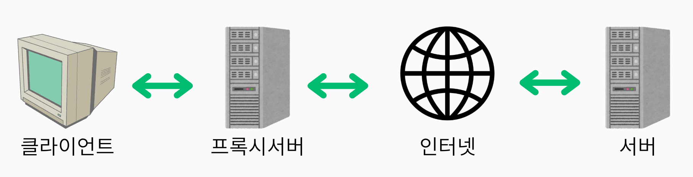
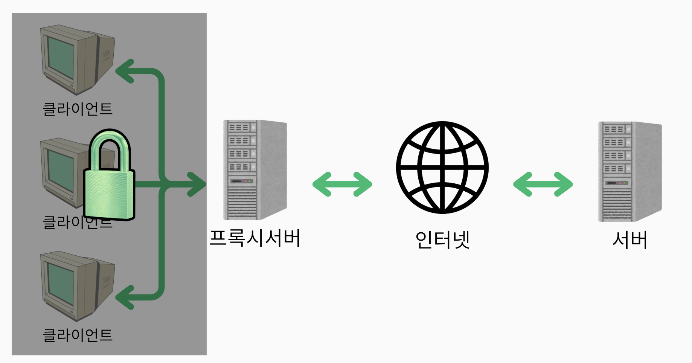
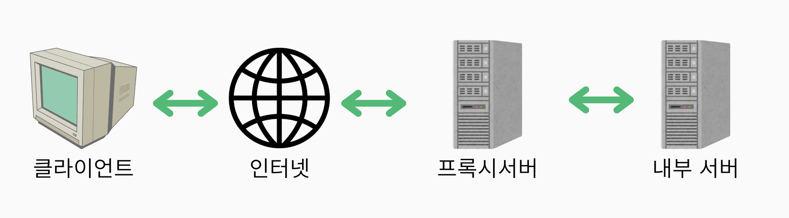
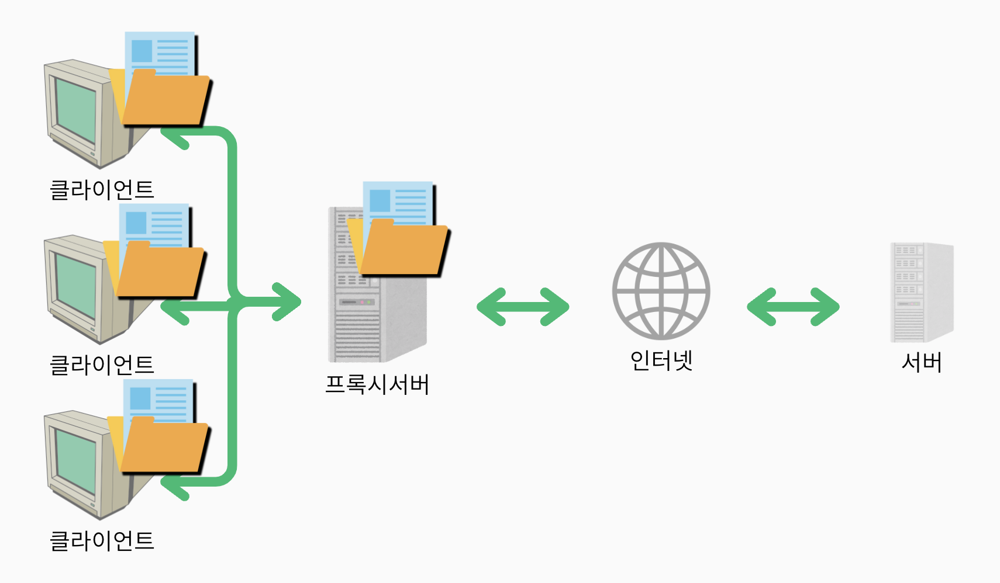
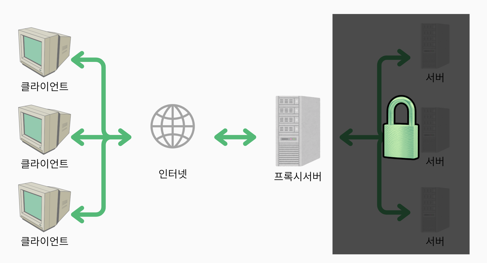

# 프록시 서버(Proxy Server)

## 💡 핵심 요약
- **한 줄 정의** : 클라이언트와 서버 사이에서 중개 역할을 하여 요청과 응답을 처리하는 서버
- **핵심 키워드** : 중개 서버, 요청 필터링, 캐싱, 익명성, 보안, 대리
- **왜 중요한가?** : 

# **1. 개념**
프록시 서버는 서버와 클라이언트 사이에서 중개자 역할을 하는 서버입니다.

클라이언트의 요청을 받아 대신 서버에 전달하고, 서버의 응답을 다시 클라이언트에게 반환합니다.

# **2. 왜 필요한가? / 등장 배경**
## 필요성 및 등장 배경
1. **인터넷 검열 우회 및 지역 제한 해제**

    프록시는 클라이언트가 **자신의 위치를 숨기고** 다른 지역의 서버에 접속할 수 있게 해줍니다.

    우리가 가장 흔히 이용하는 프록시의 기능으로 넷플릭스 등의 스트리밍 서비스나 게임 서버 접속 시 지역 제한을 우회하는 데 사용됩니다.

2. **보안 강화**.

    프록시는 클라이언트나 내부 서버의 실제 IP 주소를 숨기고, **악성 트래픽을 필터링**하여 내부 네트워크를 보호합니다.

3. **접근 제어 및 정책 적용**

    기업이나 기관에서는 프록시를 통해 **내부 사용자의 인터넷 접근을 관리**하고, 특정 사이트 차단이나 사용 기록 로깅 등의 정책을 적용할 수 있습니다.

4. **속도 향상 및 트래픽 절감(캐시)**

    초기 프록시 서버는 웹 서핑 속도를 높이고, 느린 외부 회선의 병목을 해결하기 위해 등장했습니다. 
    
    내부 네트워크에 캐시를 두어 자주 요청되는 데이터를 빠르게 제공함으로써, 외부 트래픽을 줄이고 네트워크 병목 현상을 방지할 수 있었습니다.

# **3. 위치에 따른 분류**
## 3.1 Forward Proxy(정방향 프록시)

클라이언트와 인터넷 사이에 위치해 **클라이언트를 대신**해 인터넷 서버와 통신하는 서버입니다.

### 3.1.1 주요 기능
- **인터넷 접근 제어**

    내부 사용자의 인터넷 접근을 제한하거나 관리할 수 있습니다.​

- **익명성 제공**
    
    클라이언트의 실제 IP를 숨겨 개인정보 보호와 익명성을 제공합니다.​
    
    - **지역 제한 우회**
        
        특정 지역에서만 접근 가능한 서비스에 우회 접속이 가능합니다.​

- **캐싱**

    자주 요청되는 외부 콘텐츠를 프록시 서버에 저장하여 빠른 응답과 네트워크 트래픽 절감 효과를 얻을 수 있습니다.​

- **트래픽**
    
    내부 사용자의 인터넷 사용 내역을 기록하고 분석할 수 있습니다.

---

## 3.2 Reverser Proxy(역방향 프록시)

인터넷과 내부 서버 사이에 위치해 **내부 서버를 대신**해 클라이언트와 통신하는 서버입니다.

### 3.2.1 주요 기능
- **로드 밸런싱**

    여러 서버에 클라이언트 요청을 분산시켜 서버 부하를 줄이고, 서비스의 가용성을 높입니다.​

- **SSL 종료**

     SSL/TLS 암호화 처리를 프록시에서 담당하여 백엔드 서버의 부담을 줄입니다.​

- **캐싱**
    
    자주 요청되는 콘텐츠를 프록시에서 캐싱하여 빠른 응답과 서버 부하 감소를 실현합니다.​

- **익명서 제공 및 보안 강화**
    
    백엔드 서버의 IP와 정보를 숨기고, 외부 공격으로부터 서버를 보호합니다. WAF(Web Application Firewall) 기능도 포함할 수 있습니다.​

- **API 게이트웨이**

    여러 서비스(API)를 통합하여 단일 진입점을 제공하고, 인증·권한 관리·속도 제한·모니터링 등 중앙 집중화가 가능합니다.

# **5. 언제 사용해야 할까? (Use Cases)**
- **✅ 사용하면 좋은 경우**
    - 엔터프라이즈 환경: 회사, 학교, 공공기관 등에서 내부 사용자의 인터넷 접근을 제어하고, 웹 콘텐츠 필터링 및 악성 사이트 차단이 필요할 때. 예를 들어, 직원들이 업무 외 사이트에 접속하지 못하도록 하거나, 네트워크 사용 내역을 모니터링할 때 효과적입니다.​

    - 웹 서비스 환경: 대규모 웹 서비스에서 서버 부하 분산(로드 밸런싱), DDOS 공격 방어, 정적 콘텐츠 캐싱, API 게이트웨이 등으로 고가용성 및 보안이 필요한 경우. CDN이나 NGINX/Apache 리버스 프록시가 대표적입니다.​

    - 개인 사용자 환경: 인터넷 검열 우회, 지역 제한 콘텐츠 접근, 광고 차단, 익명성 확보 등 개인 정보 보호와 자유로운 인터넷 사용이 필요할 때.​

    - 폐쇄망 환경: 외부와의 연결 포인트를 하나로 통합해 네트워크 보안과 관리 효율성을 높이고자 할 때. 예를 들어, 폐쇄망에서 서드파티 제품을 사용할 때 프록시를 통해 트래픽을 관리합니다.​
- **❌ 사용을 고려해야 할 경우**
    - 성능 오버헤드: 프록시 서버를 경유하면서 지연 시간이 발생할 수 있으므로, 실시간성이 중요한 서비스에서는 신중히 도입해야 합니다.​

    - 단일 장애점(SPOF): 프록시 서버가 장애를 일으키면 전체 네트워크나 서비스가 영향을 받을 수 있으므로, 이중화 및 장애 대비가 필요합니다.

    - 규정 준수 및 프라이버시: 데이터 프라이버시, 법적 규제 등 준수해야 할 사항이 있는 경우, 프록시 서버의 로그 및 데이터 처리 정책을 신중히 검토해야 합니다.

    - 확장성: 트래픽 증가에 따라 프록시 서버의 확장 계획이 필요합니다.
---

# **🤔 Q&A 및 심화 질문 (Deeper Questions)**
- 포워드 프록시와 리버스 프록시의 실제 네트워크 구성 차이는 무엇인가요?

- 프록시 서버를 통한 캐싱이 성능에 미치는 영향은?

- 프록시 서버 장애 시 네트워크 복구 방안은?

---

# **🔗 연관 개념 (Related Concepts)**
- VPN (Virtual Private Network): 프록시와 유사하게 트래픽을 중계하지만, 암호화와 터널링을 통해 더 강력한 보안과 익명성을 제공합니다.

- 방화벽 (Firewall): 네트워크 접근을 제어하는 보안 장치로, 프록시와 함께 사용되어 보안 정책을 강화할 수 있습니다.

- 캐시 서버: 프록시의 캐싱 기능과 유사하게, 자주 요청되는 데이터를 저장해 빠른 응답을 제공합니다.

- 로드 밸런서: 리버스 프록시의 핵심 기능 중 하나로, 여러 서버에 트래픽을 분산시켜 서비스의 안정성과 성능을 높입니다.

- API 게이트웨이: 리버스 프록시를 활용해 여러 API 서비스의 진입점을 통합하고, 인증·권한 관리·속도 제한 등 중앙 집중화된 관리가 가능합니다.
