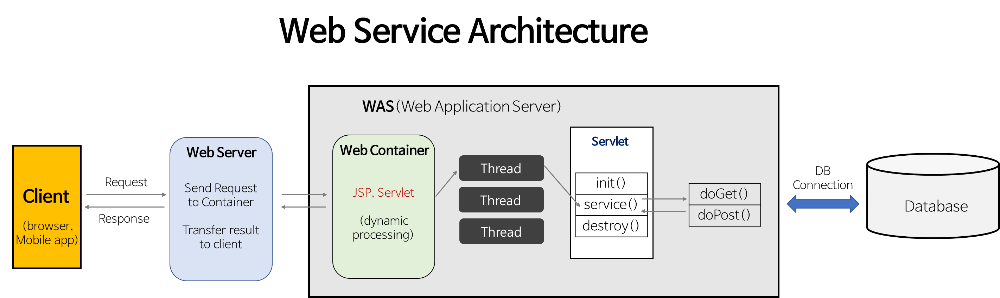
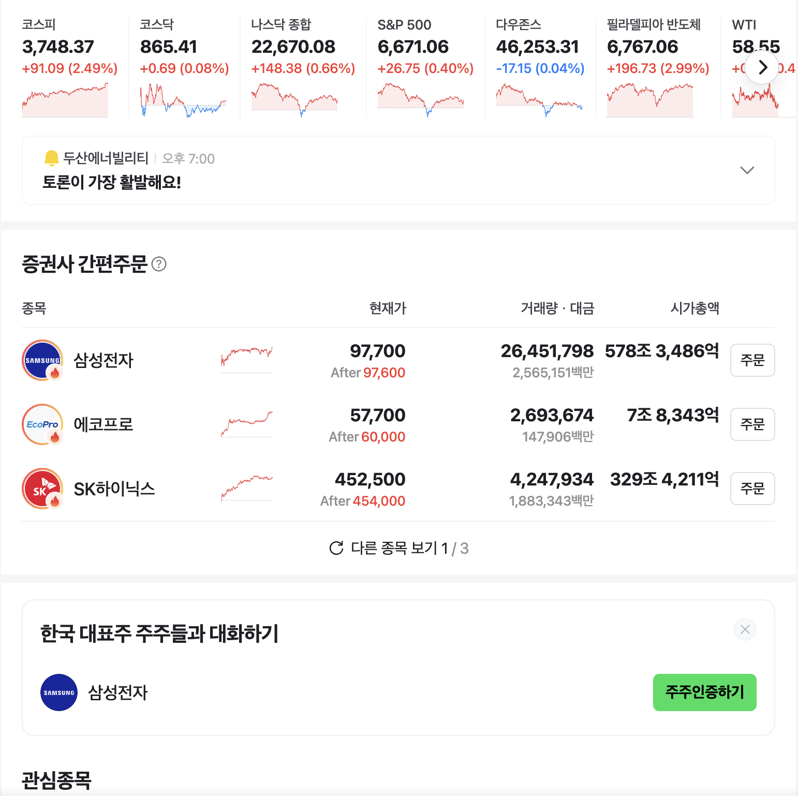

# 웹서버와 WAS의 차이점

## 핵심 비교 표

| 구분            | Web Server                                   | Web Application Server (WAS)                |
|-----------------|----------------------------------------------|---------------------------------------------|
| **주요 역할**   | 정적 콘텐츠(HTML, CSS, 이미지 등) 제공       | 동적 콘텐츠(비즈니스 로직, DB 연동 등) 처리 |
| **처리 대상**   | 정적 파일                                    | 웹 애플리케이션, 동적 페이지                |
| **주요 기능**   | HTTP 요청 처리, 정적 파일 서빙, Reverse Proxy, 로드 밸런싱 | 비즈니스 로직 실행, 데이터베이스 연동, 세션/트랜잭션 관리, 동적 페이지 생성 |
| **예시 소프트웨어** | Apache, Nginx, IIS                        | Tomcat, JBoss, WebLogic, WebSphere          |
| **프로토콜**    | 주로 HTTP/HTTPS                              | HTTP/HTTPS, WebSocket, gRPC  |
| **보안**        | 기본적인 보안(SSL, 방화벽 등)                | 인증/인가, 세션 관리, 고급 보안 기능         |
| **사용 예시**   | 회사 소개, 블로그, 이미지 서버 등             | 온라인 쇼핑몰, SNS, 금융 서비스 등          |
| **확장성**      | 정적 파일 캐싱, 로드 밸런싱                   | 클러스터링, 세션 복제, 분산 트랜잭션        |
| **동작 방식**   | 요청 → 정적 파일 응답 or WAS로 전달           | 요청 → 비즈니스 로직 처리 → 동적 응답 생성   |

---

## 실제 서비스 예시

- **정적 웹사이트**: 회사 소개, 블로그, 이미지 서버 등은 Web Server만으로 충분합니다.
- **동적 웹사이트**: 온라인 쇼핑몰, SNS, 금융 서비스 등은 WAS가 반드시 필요합니다.
- **실제 환경**: Web Server와 WAS를 조합하여, Web Server는 정적 파일과 보안, 로드 밸런싱을 담당하고, WAS는 동적 로직과 데이터 처리를 담당합니다.

**참고**:
여기서 말하는 정적 웹사이트는 HTML, CSS, JS 파일로만 구성된 사이트를 의미합니다.
동적 웹사이트는 사용자 요청에 따라 서버에서 콘텐츠를 생성하는 사이트를 의미합니다.

네이버 증권과 같이 실시간으로 받아오는 데이터가 많고, 사용자 맞춤형 정보를 제공하는 서비스는 WAS가 반드시 필요합니다.

---

## 결론

- Web Server는 정적 콘텐츠 제공에 최적화되어 있고, WAS는 동적 콘텐츠와 비즈니스 로직 처리에 특화되어 있습니다.
- 두 서버는 협업 구조로 구성하는 것이 일반적이며, 이를 통해 성능, 확장성, 보안, 유지보수성을 모두 확보할 수 있습니다.

---
