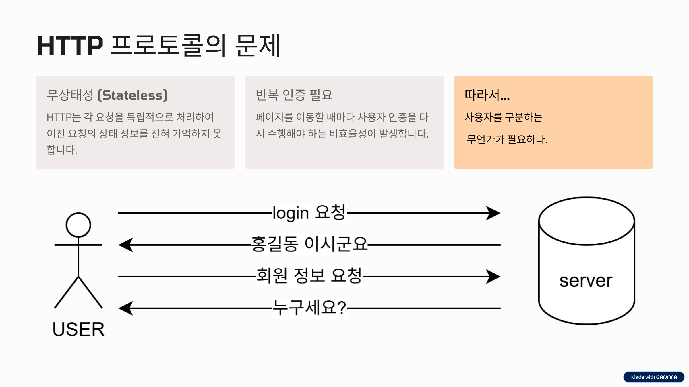
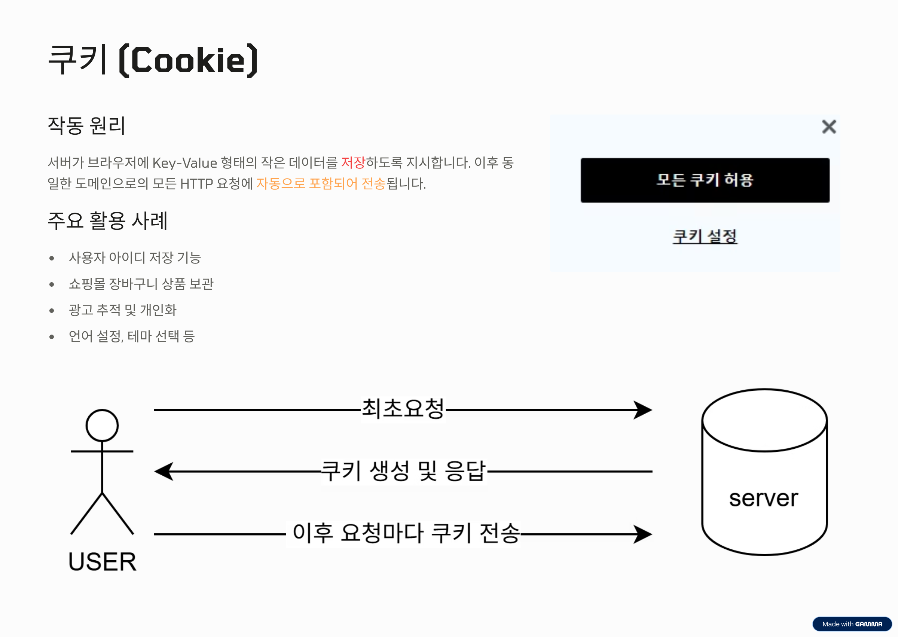
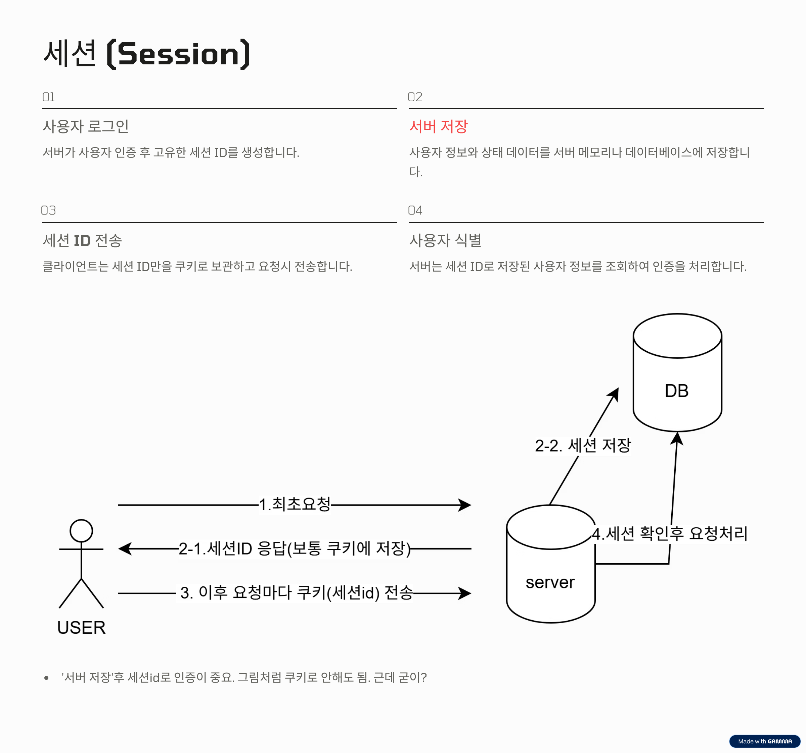

# 쿠키 vs? 세션 vs 토큰: 웹 인증의 핵심

## HTTP 프로토콜의 문제: 무상태성 (Stateless)

HTTP 프로토콜은 기본적으로 **Stateless**이라는 특징을 가집니다. 즉, 서버는 방금 전의 요청과 지금의 요청이 같은 사용자로부터 온 것인지 전혀 알지 못합니다. 이 때문에 사용자는 페이지를 이동할 때마다 로그인을 반복해야 하는 불편함이 생깁니다. 이 문제를 해결하고 사용자를 식별하기 위한 '무언가'가 필요하게 되었습니다.

## 쿠키 (Cookie)

쿠키는 서버가 사용자의 웹 브라우저에 저장하도록 지시하는 Key-Value 형태의 작은 데이터 조각입니다. 브라우저에 한번 저장된 쿠키는, 이후 동일한 도메인으로 요청을 보낼 때마다 자동으로 함께 전송됩니다. 이를 통해 서버는 쿠키에 담긴 정보를 보고 사용자를 식별할 수 있습니다.

* **주요 활용 사례:** 아이디 저장, 쇼핑몰 장바구니, 광고 추적 및 개인화 등

>## 쿠키 VS? 세션
>제목에 ?이 붙어있는데 오타가 아닙니다.  
 쿠키는 후술할 세션 ID나 토큰을 담는 '저장소'의 역할이지 '인증'을 위한 기술은 아닙니다. 위 활용사례에서 보듯이 다양한 기능에 쓰이고 있습니다.  
그래서 면접에서 관련 개념을 설명할 때 쿠키는 '저장'방식일 뿐임을 설명하여 쿠키 vs 세션보다 쿠키 vs 웹스토리지(저장측면)나 세션 vs 토큰(인증측면)을 설명합시다.

 

### 쿠키의 특징과 보안

쿠키는 구현이 간단하고 브라우저가 자동으로 관리해준다는 장점이 있습니다. 하지만 데이터가 사용자 컴퓨터에 직접 저장되므로 조작 및 탈취의 위험이 있어 보안에 취약합니다.

또한 단순히 쿠키로 id나 비밀번호를 보내는것은 파라미터에 비밀번호를 보내는 것과 다를바가 없는 위험한 인증입니다. 실제로는 이렇게 사용되지 않으니 세션과 토큰을 사용합시다.

물론 이러한 단점을 보완하기 위한 보안 옵션도 존재합니다.
* **HttpOnly:** JavaScript에서 쿠키에 접근하는 것을 막아 XSS(크로스 사이트 스크립팅) 공격을 방어합니다.
* **Secure:** HTTPS 프로토콜을 사용하는 경우에만 쿠키를 전송하도록 설정합니다.
* **SameSite:** 다른 도메인에서의 요청 시 쿠키 전송을 제어하여 CSRF(크로스 사이트 요청 위조) 공격을 방어합니다.

하지만 결국 클라이언트가 보관하고 전송하므로 이런 옵션을 믿기 보다는 HTTPS를 사용하여 통신자체의 보안을 강화할 방법을 생각해야 합니다. 

## 세션 (Session): 중요한 정보는 서버에

세션은 쿠키의 보안 문제를 해결하기 위해 나온 방식으로, 사용자의 민감한 정보를 클라이언트가 아닌 **서버**에 저장하는 것이 핵심입니다.

서버는 사용자 인증이 성공하면 고유한 **세션 ID**를 생성하여 서버 내 저장소(메모리, 데이터베이스 등)에 사용자 정보와 함께 보관합니다. 그리고 클라이언트에게는 이 세션 ID만을 쿠키에 담아 전달합니다. 이후 클라이언트는 요청 시마다 세션 ID를 보내고, 서버는 이 ID를 통해 저장된 실제 사용자 정보를 찾아 인증을 처리합니다.

### 세션의 장단점과 확장성 문제
세션방식은 "서버"가 저장하고 관리한다는 것이 장점이자 단점입니다.  

세션은 중요한 데이터가 서버에 있어 안전하며, 서버에서 특정 세션을 강제로 무효화하는 것도 가능합니다.
"모든 디바이스에서 로그아웃" 같은 것이 서버가 모든 연결을 알고 있기 때문에 무효화처리를 할 수 있는 것입니다.

하지만 모든 사용자 정보를 서버가 직접 관리해야 하므로 서버 메모리 사용량이 증가합니다. 특히 서버를 여러 대로 증설하는 분산 환경에서는 특정 서버에 저장된 세션을 다른 서버가 어떻게 공유할 것인지에 대한 복잡한 문제가 발생하여 **확장성**에 제약이 생깁니다.

예를 들어 서버 앞에 로드밸런스가 있는경우, 사용자1의 요청이 서버1에게 연결되어 서버1이 세션을 저장했다면 재요청시에도 서버1에게 가야합니다. 세션 DB를 쓰는 방식도 있으나 "DB"를 조회하는 행동은 꽤나 비싼 비용입니다. 로드밸런싱을 "잘" 하여 해당 세션을 가진 서버에게 요청이 가도록 하는 방법도 있겠으나 복잡한 아키텍쳐가 예상 될 것입니다.

## 토큰 (Token) 기반 인증: 상태 없는 신분증, JWT

토큰 기반 인증은 세션의 확장성 문제를 해결한 현대적인 인증 방식으로, **JWT(JSON Web Token)** 가 사실상 표준으로 사용됩니다. 이 글에서 "토큰"이라하면 JWT와 동일하게 취급하셔도 무방합니다.

토큰 방식은 서버가 사용자의 상태를 전혀 저장하지 않는 **무상태성(Stateless)** 을 지향합니다. 서버는 인증된 사용자에게 정보와 서버의 서명이 있는 토큰을 발급하고, 사용자는 이후 요청마다 이 토큰을 HTTP 헤더에 담아 보냅니다. 서버는 별도의 저장소를 조회할 필요 없이, 토큰 자체의 유효성만 검증하여 인증을 처리합니다.

### JWT의 구조: 서명(Signature)의 역할

그런데 아까 쿠키그림이랑 별 차이가 없다는것을 알아차리셨을 것입니다.  
유일한 차이점은 검증단계가 추가 된것입니다. 토큰을 통해 위변조가 일어났는지 검사가 가능합니다.

JWT가 저장소 없이도 신뢰성을 보장하는 이유는 **서명(Signature)** 덕분입니다. JWT는 **헤더(Header), 내용(Payload), 서명(Signature)** 세 부분으로 구성되며, 각 부분은 Base64로 인코딩됩니다.

* **헤더:** 암호화 알고리즘, 토큰 타입 등의 정보
* **내용:** 사용자 정보, 권한, 만료 시간 , ~~비밀번호~~ 실제 데이터 
* **서명:** 헤더와 내용을 합친 후, 서버만 아는 비밀 키로 암호화한 값. 이 서명을 통해 토큰의 위변조 여부를 확인할 수 있습니다.

>### 내용에는 절대 비밀번호를 넣으면 안됩니다.
>토큰은 base64로 인코딩된 문자열일 뿐입니다. 암호화된건 서명밖에없습니다.  
토큰을 쓰는 이유는 stateless하게 인증을 하면서 위변조를 방지하기 위함이지 보안을위해 쓰는 것이 아닙니다.

### 토큰의 장단점

토큰은 상태를 저장하지 않아 서버를 자유롭게 확장할 수 있다는 것이 가장 큰 장점입니다.

반면, 한번 발급된 토큰은 만료되기 전까지 통제가 어렵고, 만약 탈취당하면 그 자체로 인증 정보로 사용될 수 있어 보안 위험이 큽니다. 또한, 토큰에 담는 정보가 많아지면 크기가 커져 네트워크 오버헤드가 발생할 수 있습니다.

## 보너스: 리프레시 토큰 (Refresh Token)의 역할

토큰 탈취의 위험을 줄이기 위해 **리프레시 토큰** 개념이 사용됩니다. 지금까지 설명한 인증을 위한 토큰을 **Access Token**이라 부릅니다. 인증에 직접 사용되는 **액세스 토큰(Access Token)** 은 해킹 위험 때문에 보통 만료 시간을 짧게 설정합니다.

그리고 이와 별개로, 만료 시간이 긴 **리프레시 토큰(Refresh Token)**을 발급합니다. 액세스 토큰이 만료되면, 클라이언트는 리프레시 토큰을 서버에 보내 새로운 액세스 토큰을 재발급 받습니다. 만약 토큰 유출이 의심되면, 서버는 저장된 리프레시 토큰 정보를 삭제하여 더 이상 새로운 액세스 토큰이 발급되지 않도록 차단할 수 있습니다.

>그런데 서버에서 리프레시 토큰을 '삭제' 한다는것은 미리 리프레시 토큰을 서버가 '저장'해야한다는 것입니다. 이러면 결국 세션이랑 방식이 비슷해집니다.  
물론 그럼에도 Access Token을 쓰는 동안은 DB까지 조회할 일이 없으므로 토큰의 이점을 얻을수 있습니다.

## 세션 vs 토큰: 무엇을 선택해야 할까?

두 방식의 특징을 마지막으로 정리하면 다음과 같습니다.

* **세션** 
    - 서버가 모든 상태를 직접 제어하므로 보안성이 높습니다
    - ID만 보내므로 트래픽이 적습니다
    - 서버 확장(Scale-out)이 복잡합니다.
* **토큰** 
    - 확장성이 뛰어납니다
    - 보안성이 낮습니다:액세스 토큰 탈취시 위험
    - 세션보다 더 많은 트래픽을 유발합니다

결론적으로, 어떤 방식이 절대적으로 우월하다기보다는 서비스의 규모, 아키텍처, 보안 요구사항 등 **상황에 따라 적절한 기술을 선택**하는 것이 중요합니다.
