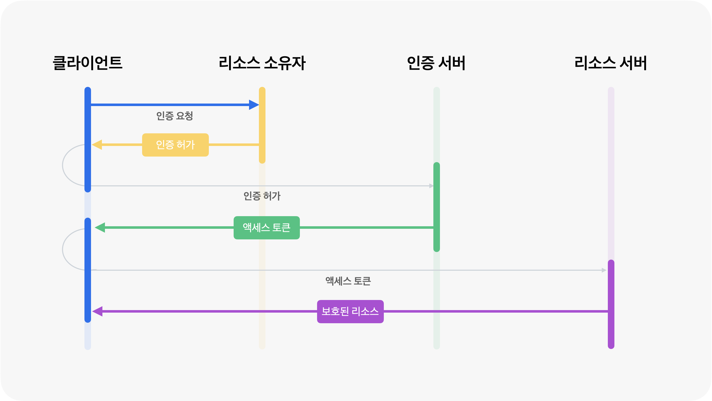
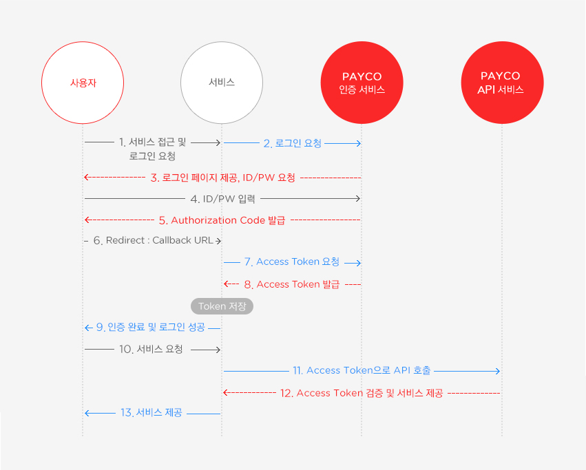

# OAuth 발표 자료

---

## Remind: 인증과 인가
지난 발표 (쿠키 vs 세션 vs 토큰)에서 사용자를 **인증**하는 여러방법에 대해 다뤘었습니다.  
이번에는 **인가**를 하는 방법중 하나인 OAuth를 다룰 것인데, 잠시 인증과 인가의 차이를 보겠습니다. 

### 인증 (Authentication)
- 사용자의 신원을 확인하는 과정  
- “누구인가?”를 검증  
- 아이디/비밀번호, 지문, OTP 등  
- 실패 시 **401 Unauthorized**

### 인가 (Authorization)
- 인증된 사용자의 접근 권한을 결정  
- “무엇을 할 수 있는가?”를 판단  
- 자원에 대한 접근 권한을 제어  
- 실패 시 **403 Forbidden**

즉 저희가 이전에 다룬 쿠키나 세션으로 사용자의 정보를 확인하는 것은 인증(Authentication)입니다.  
여기서 인증을 통해 사용자가 누구인지 확인한 후, 그 사용자가 어떤 자원에 접근할 수 있는지(회원 삭제 등) 결정하는 것이 인가(Authorization)입니다.

> OAuth 자체는 인가(Authorization)를 위한 프로토콜입니다. 그런데 소셜로그인을 사용해보신 분들은 아시겠지만 인증(로그인)을 포함하고 있습니다. 그래서 사실상 인가뿐만 아니라 인증에도 사용됩니다.

---

## Remind: 토큰 기반 인증
지난 시간에 토큰 기반 인증에 대해서도 다뤘었습니다.  
토큰의 장점 중 **다양한 플랫폼 간 공유 가능하다**가 있습니다.  
OAuth에서도 이 점이 매우 중요합니다. 사용자가 여러 서비스에서 동일한 인증을 사용할 수 있게 해주기 때문입니다.

### 토큰 기반 인증 요약
- 사용자는 로그인 후 **Access Token**을 발급받음  
- 이후 요청 시 아이디/비밀번호 대신 토큰 사용  
- 서버는 토큰을 검증해 사용자 인증

---

## OAuth의 등장 배경

이제 OAuth가 왜 등장했는지 배경을 보겠습니다.  
### 기존 방식의 문제점
위 그림은 저희 서버가 GitHub API를 사용해
사용자의 깃허브 계정 정보를 받아오는 상황을 예로 든 것입니다.

그런데 이런 방식에는 문제가 있습니다.
유저는 제3자 앱인 저희 서버를 완전히 신뢰할 수 없습니다.
만약 유저가 자신의 깃허브 아이디와 비밀번호를 직접 저희 서버에 제공한다면,
저희 **서버는 유저의 깃허브 계정에 무제한 접근**할 수 있게 됩니다.

게다가 서버가 **해킹**이라도 당한다면,
유저의 계정 정보가 그대로 노출될 위험이 있습니다.

이러한 문제를 해결하기 위해 등장한 것이 바로 OAuth입니다.
OAuth는 비밀번호를 직접 주지 않아도, 필요한 권한만 안전하게 위임할 수 있는 방식을 제공합니다.

---

## OAuth란

### OAuth 정의
> 제3자 애플리케이션이 사용자 자원에 접근할 수 있도록 허용하는 프로토콜입니다

- 비밀번호를 줄 필요 없이, **접근 권한만 위임**합니다
- '권한'이라는 단어에서 알 수 있듯이, 인가를 위한 프로토콜입니다.

#### 예시
- “구글 계정으로 로그인”  
- "네이버 계정으로 로그인"
- "vsCode에서 GitHub 리포지토리 접근 권한 허용"  

여러분도 이미 한 번쯤 사용해 보셨을 겁니다.  
로그인은 구글이나 네이버 같은 인증 서버에서 처리되고, 그 이후에는 제3자 애플리케이션이 여러분의 데이터를 사용하거나 서비스를 제공하게 됩니다.

---

## OAuth 구성요소

Oauth의 동작을 이해하기 위해서는 4가지 주요 주체를 알아야 합니다.

### OAuth 시스템을 구성하는 4가지 주요 주체

| 구성요소 | 설명 |
|-----------|------|
| **Resource Owner** | 사용자, 데이터의 주인 |
| **Client** | 제3자 애플리케이션 (사용자 자원 접근 요청) |
| **Resource Server** | 보호된 리소스를 가진 API 서버 (예: Google API) |
| **Authorization Server** | 인증 서버, 사용자를 인증하고 토큰 발급 |

위 용어는 OAuth 2.0 공식 문서에서 정의한 것입니다.
다만 저희같은 백엔드 개발자 입장에서는 설명을 읽다보면 상당히 혼란스러울 수 있습니다.
- Client는 사용자로 착각하기 쉽지만, 여기서는 저희 서버를 의미합니다. 
- 실제 사용자는 Resource Owner라고 합니다.
- 또한 서버도 저희 서버가 아니라, Resource Server와 Authorization Server를 의미합니다.  

이해하기 어렵다면 다음과 같이 생각해도 됩니다. (이하 설명에서도 사용)
| 구성요소 | 설명 |
|-----------|------|
| **Resource Owner** | 사용자 |
| **Client** | 내 서비스 |
| (두 서버 합쳐서)**Server** | 구글(권한을 위임받을 외부 서비스 이름) |

참고로 이전 버전인 OAuth 1.0에서는 Resource Server와 Authorization Server를 구분하지 않고 하나의 서버로 다뤘습니다.

---

## OAuth의 3단계 흐름

전체 단계을 보기전에 큰 흐름을 봅시다. 우선 이걸 한번에 다 이해하려고 하지 말고,  
우리는 서버 개발자이므로 서버입장에서 생각해봅시다

최종적으로 우리 서버가 구글에 접근하여 우리 사용자의 데이터를 가져오는 것이 목표입니다.  
**이를 위해서 Access Token을 발급받아야 합니다.**

그리고 구글에서 Access Token을 발급받기 위해서는 사용자의 인증과 동의가 필요합니다.  
**이를 위해서 사용자로부터 Code라는 것을 받아와야 합니다.**

그렇다면 남은 것은 사용자가 어떻게 인증하고 동의하는가 입니다. 뒤에서 설명하겠습니다.

---

## OAuth 사전작업

### 사전 등록 단계
그전에 잠시 우리 서비스에서 OAuth를 사용하기 위한 사전 작업이 필요합니다.

우리 서비스에서 구글에 접근하려면 당연히 구글도 우리 서비스를 알아야 합니다.  
따라서 구글(위 사진은 깃허브)에 미리 등록을 해야합니다. 대부분 위 사진같은 화면이 제공됩니다.
- 우리 서비스의 URL 등록
- 사용자가 코드를 발급받고 우리 서비스로 돌아갈 때의 callback 주소 등록

등록이 완료되면 client_id와 client_secret 이 발급됩니다.

- Client ID  
어플리케이션(서비스)을 식별하는 식별자ID를 의미합니다  
우리 서비스말고도 다양한 서비스가 등록했을 것입니다, 구글 입장에서 어떤 서비스에게 제공할지 구분하는 ID가 필요할 것입니다.
- Client Secret  
Client ID에 대한 비밀번호로 외부에 노출되면 안됩니다.

## 예시URL

URL로 https://localhost:8080/callback   
redirect URL로 https://localhost:8080/callback 을 등록했다고 가정하겠습니다.

그렇다면 우리가 사용자에게 제공할 URL이 나옵니다(url예시는 깃허브입니다).  
>https://github.com/login/oauth/authorize   
?client_id=Ov23Ijjp8hMwghEcds1D  
&redirect_uri=https://localhost:8080/callback

즉 사용자는 이 URL로 접속하여 로그인을 하고, 권한을 동의하면  
사용자는 redirect_uri로 등록된 주소로 Code를 받고 돌아오게 됩니다. 

---

## OAuth 단계별 자세히
3단계를 모두 설명하였습니다. 이제 전체적인 흐름을 자세히 보겠습니다.

위 이미지를 보시면 우선 1~6이 사용자가 인증을 받고 코드를 발급받는 과정입니다.  
- 1~3: 사용자가 클라이언트(우리 서비스)에서 "구글로 로그인"을 클릭할 것입니다.
- 4: 사용자가 구글(Authorization Server)로 이동하여 로그인후 권한 동의를 할 것입니다.  

### client ID와 redirect URL 검증
여기서 구글 로그인 화면이 뜨기 전에 구글 서버에서는 클라이언트 아이디와 리다이렉트 URL을 검증합니다.

구글은 다음을 확인합니다.
- 사용자가 보낸 클라이언트 아이디와 리다이렉트 URI를 비교 확인한다.
- 일치하면 코드 발급, 다르면 404 또는 동작 안함.

로그인 페이지의 [URL](#예시url)은 누구나 알 수 있기 때문에, 해커가 redirect URL을 바꿔서 공격할 수도 있습니다.
따라서 구글 서버에서는 미리 등록된 id, URL과 일치하는지 확인합니다.

검증이 완료되면 5~6단계로 사용자가 코드를 발급받고, 리다이렉트 URL로 돌아오게 됩니다.

## 여기까지 진행했을 때 Resource Server가 알고 있는 것

사용자가 코드까지 발급받았다면 Resource Server가 알고 있는 정보는 다음과 같습니다.

1. **Client Id**: 연결된 서비스가 누구인지  
2. **Client Secret**: 연결된 서비스의 비밀번호  
3. **Redirect URL**: 통신할 통로  
4. **User Id**: 연결된 사용자 정보  
5. **Authorization Code**: 사용자에게 부여된 인가 코드  

이제 우리 서비스가 구글에 코드를 보낼 차례입니다.  
이 단계에서도 해커가 코드를 탈취하거나 우리 서버를 사칭 할 수 있기 때문에, 코드뿐만 아니라 1~4 정보를 함께 보내서 모두 일치해야 토큰을 발급합니다.

---

### 위에서 설명한 과정이 7~8단계의 토큰을 발급받는 과정입니다
7. 우리 서버가 인가 코드 + 서버의 정보로 구글(Authorization Server)에 토큰 요청  
8. Authorization Server가 검증 후 Access Token 발급

---

## 토큰 발급이 끝나면?: Access Token으로 리소스 접근 가능

이제 토큰까지 발급받았으면 끝입니다! 우리가 늘 하던 방식대로 API 서버(리소스 서버)에 접근하면 됩니다.  

> 토큰 시간에 설명한 Refresh Token이 제공 될 수도 있습니다.  
 이 경우 만료 기간이 짧은 Access Token을 사용하고, 만료 시 **Refresh Token**으로 재발급을 요청합니다  
Refresh Token은 발급여부, 기간이 회사마다 다르므로, 해당 서비스의 개발자 문서를 참고하시기 바랍니다.

---

## OAuth 2.0의 특징
지금까지 설명한 내용은 OAuth 2.0 기준입니다. 현재 거의 대부분이 2.0으로 사용하기 때문에 OAuth특징이라 아셔도 무방합니다.

1. **Scope 설정 가능**   
위 사진처럼 이름,이메일 등 권한 범위를 설정가능합니다.
2. **Bearer Token (=Access Token)**   
우리가 배웠던 토큰방식을 의미합니다. 토큰 소유만으로 권한 인증이 가능하다는 것을 의미하고 탈취시 보안이 위험하기에 TLS(HTTPS)가 필수입니다.  
3. **역할 분리**   
제가 구글이라고 예시를 들었지만, Resource Server와 Authorization Server를 분리되어 있습니다.  
우리가 api 서버와 인증 서버를 따로 운영하는 것과 비슷합니다.
4. **Refresh Token 지원** — Access Token 탈취 및 만료 문제를 개선하였습니다. 
5. **다양한 Grant Type 지원**   
제가 설명한 Authorization Code Grant 방식만 알아두셔도 무방하니 이런게 있다는 것만 알아둡시다.
- Authorization Code Grant (인가 코드 방식)  
   - 제가 예시에서 설명했던 방식으로 가장 일반적으로 사용됩니다.  

-  Implicit Grant (암묵적 방식)
   - **SPA (Single Page Application)** 등 **브라우저 기반 클라이언트**에서 사용됩니다.  
   - **Access Token이 직접 발급**되어, 인가 코드 단계를 생략합니다.  
   - 현재는 **보안상의 이유로 거의 사용하지 않습니다**

---

- Resource Owner Password Credentials Grant (비밀번호 자격 증명 방식)
   - **사용자의 아이디/비밀번호를 직접 입력받아** 액세스 토큰을 받는 방식입니다.  
   - 사용자의 비밀번호를 앱이 직접 다루기 때문에 보안 위험이 높음.  
   - **주로 신뢰할 수 있는 1st-party 앱에서만 사용**됩니다.  

---

- Client Credentials Grant (클라이언트 자격 증명 방식)
   - **사용자 개입 없이**, 클라이언트(우리 서버)가 스스로를 인증할 때 사용합니다.  
   - **주로 서버 간 통신(Server-to-Server)** 에서 사용됩니다.  

