# OAuth 발표 자료

---

## Remind: 인증과 인가
지난 발표 (쿠키 vs 세션 vs 토큰)에서 사용자를 **인증**하는 여러방법에 대해 다뤘었습니다.  
이번에는 **인가**를 하는 방법중 하나인 OAuth를 다룰 것인데, 잠시 인증과 인가의 차이를 보겠습니다. 

### 인증 (Authentication)
- 사용자의 신원을 확인하는 과정  
- “누구인가?”를 검증  
- 아이디/비밀번호, 지문, OTP 등  
- 실패 시 **401 Unauthorized**

### 인가 (Authorization)
- 인증된 사용자의 접근 권한을 결정  
- “무엇을 할 수 있는가?”를 판단  
- 자원에 대한 접근 권한을 제어  
- 실패 시 **403 Forbidden**

즉 저희가 이전에 다룬 쿠키나 세션으로 사용자의 정보를 확인하는 것은 인증(Authentication)입니다.  
여기서 인증을 통해 사용자가 누구인지 확인한 후, 그 사용자가 어떤 자원에 접근할 수 있는지(회원 삭제 등) 결정하는 것이 인가(Authorization)입니다.

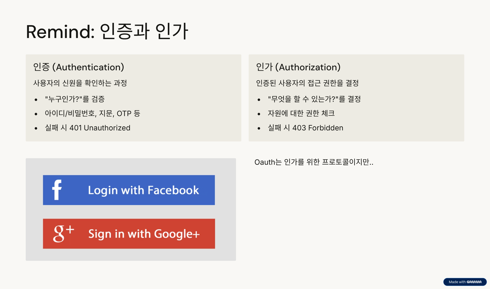
> OAuth 자체는 인가(Authorization)를 위한 프로토콜입니다. 그런데 소셜로그인을 사용해보신 분들은 아시겠지만 인증(로그인)을 포함하고 있습니다. 그래서 사실상 인가뿐만 아니라 인증에도 사용됩니다.

---

## Remind: 토큰 기반 인증
지난 시간에 토큰 기반 인증에 대해서도 다뤘었습니다.  
토큰의 장점 중 **다양한 플랫폼 간 공유 가능하다**가 있습니다.  
OAuth에서도 이 점이 매우 중요합니다. 사용자가 여러 서비스에서 동일한 인증을 사용할 수 있게 해주기 때문입니다.

### 토큰 기반 인증 요약
- 사용자는 로그인 후 **Access Token**을 발급받음  
- 이후 요청 시 아이디/비밀번호 대신 토큰 사용  
- 서버는 토큰을 검증해 사용자 인증

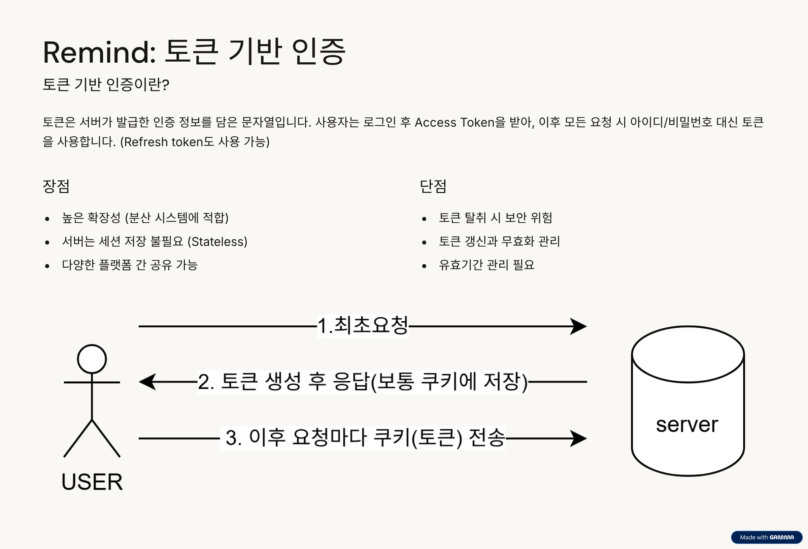
---

## OAuth의 등장 배경

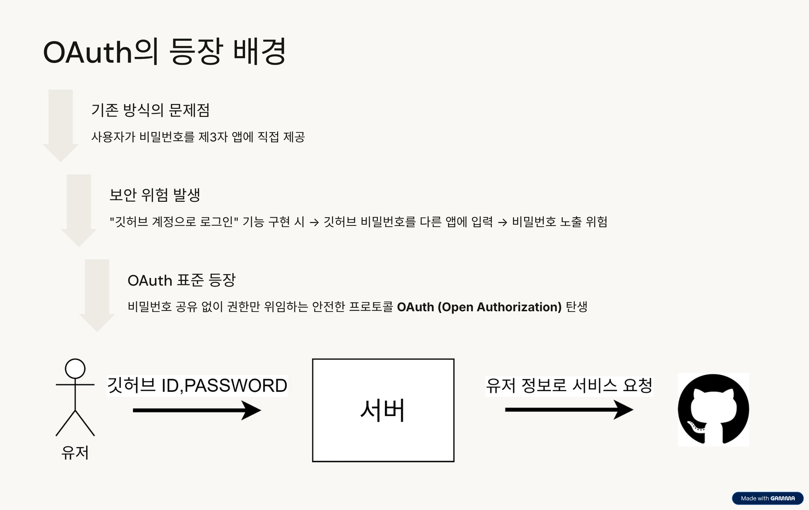
이제 OAuth가 왜 등장했는지 배경을 보겠습니다.  
### 기존 방식의 문제점
위 그림은 저희 서버가 GitHub API를 사용해
사용자의 깃허브 계정 정보를 받아오는 상황을 예로 든 것입니다.

그런데 이런 방식에는 문제가 있습니다.
유저는 제3자 앱인 저희 서버를 완전히 신뢰할 수 없습니다.
만약 유저가 자신의 깃허브 아이디와 비밀번호를 직접 저희 서버에 제공한다면,
저희 **서버는 유저의 깃허브 계정에 무제한 접근**할 수 있게 됩니다.

게다가 서버가 **해킹**이라도 당한다면,
유저의 계정 정보가 그대로 노출될 위험이 있습니다.

이러한 문제를 해결하기 위해 등장한 것이 바로 OAuth입니다.
OAuth는 비밀번호를 직접 주지 않아도, 필요한 권한만 안전하게 위임할 수 있는 방식을 제공합니다.

---

## OAuth란

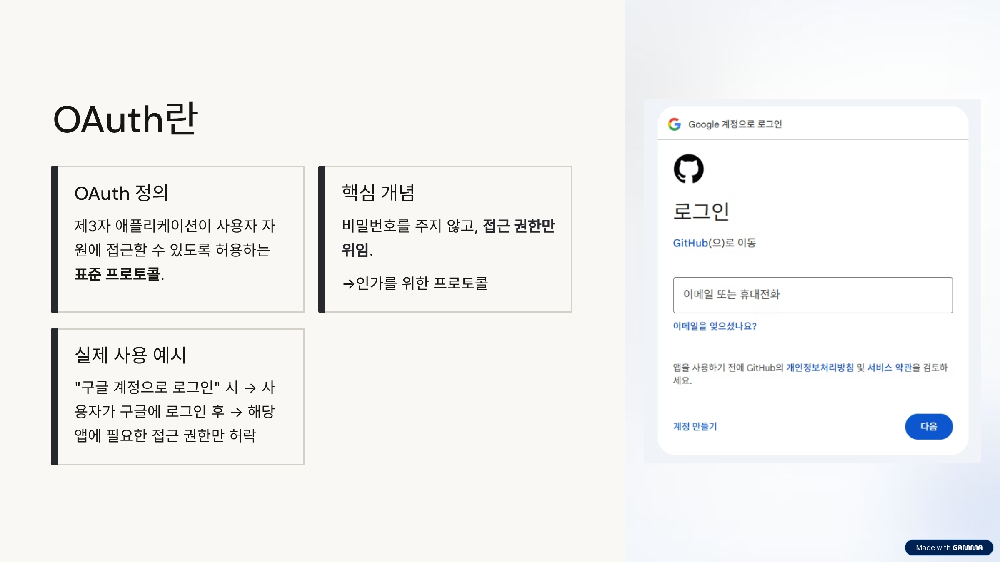

### OAuth 정의
> 제3자 애플리케이션이 사용자 자원에 접근할 수 있도록 허용하는 프로토콜입니다

- 비밀번호를 줄 필요 없이, **접근 권한만 위임**합니다
- '권한'이라는 단어에서 알 수 있듯이, 인가를 위한 프로토콜입니다.

#### 예시
- “구글 계정으로 로그인”  
- "네이버 계정으로 로그인"
- "vsCode에서 GitHub 리포지토리 접근 권한 허용"  

여러분도 이미 한 번쯤 사용해 보셨을 겁니다.  
로그인은 구글이나 네이버 같은 인증 서버에서 처리되고, 그 이후에는 제3자 애플리케이션이 여러분의 데이터를 사용하거나 서비스를 제공하게 됩니다.

---

## OAuth 구성요소
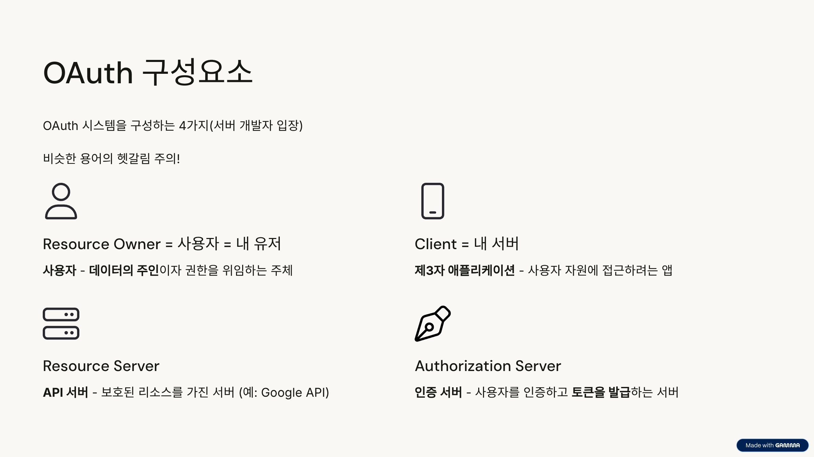
Oauth의 동작을 이해하기 위해서는 4가지 주요 주체를 알아야 합니다.

### OAuth 시스템을 구성하는 4가지 주요 주체

| 구성요소 | 설명 |
|-----------|------|
| **Resource Owner** | 사용자, 데이터의 주인 |
| **Client** | 제3자 애플리케이션 (사용자 자원 접근 요청) |
| **Resource Server** | 보호된 리소스를 가진 API 서버 (예: Google API) |
| **Authorization Server** | 인증 서버, 사용자를 인증하고 토큰 발급 |

위 용어는 OAuth 2.0 공식 문서에서 정의한 것입니다.
다만 저희같은 백엔드 개발자 입장에서는 설명을 읽다보면 상당히 혼란스러울 수 있습니다.
- Client는 사용자로 착각하기 쉽지만, 여기서는 저희 서버를 의미합니다. 
- 실제 사용자는 Resource Owner라고 합니다.
- 또한 서버도 저희 서버가 아니라, Resource Server와 Authorization Server를 의미합니다.  

이해하기 어렵다면 다음과 같이 생각해도 됩니다.
| 구성요소 | 설명 |
|-----------|------|
| **Resource Owner** | 사용자 |
| **Client** | 내 서비스 |
| **Server** | 구글(권한을 위임받을 외부 서비스 이름) |

참고로 이전 버전인 OAuth 1.0에서는 Resource Server와 Authorization Server를 구분하지 않고 하나의 서버로 다뤘습니다.

---

## OAuth 구조 개요

### 전체 흐름
1. **사용자 요청 (Resource Owner)**  
   → 서비스 접근 및 인증 요청  
2. **검증 및 토큰 발급 (Authorization Server)**  
   → 로그인 및 동의 후 Access Token 발급  
3. **자원 접근 (Resource Server)**  
   → 클라이언트가 Access Token으로 API 호출  

> “인증 → 토큰 발급 → 자원 접근”의 3단계 구조로 작동한다.

---

## OAuth 사전작업

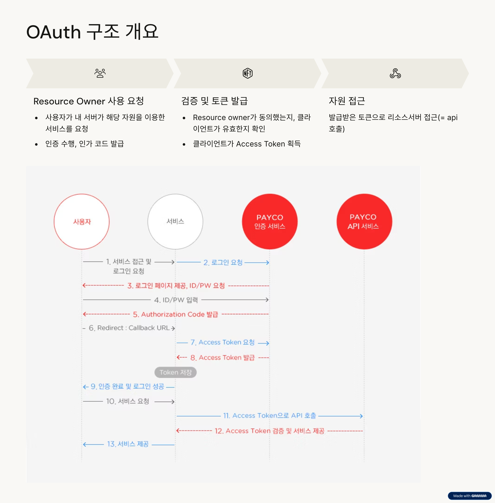

### 사전 등록 단계
- Authorization Server에 **URL 및 callback 주소 등록**
- 등록 후 **client_id**, **client_secret** 발급

---

## OAuth 사전작업 (2)

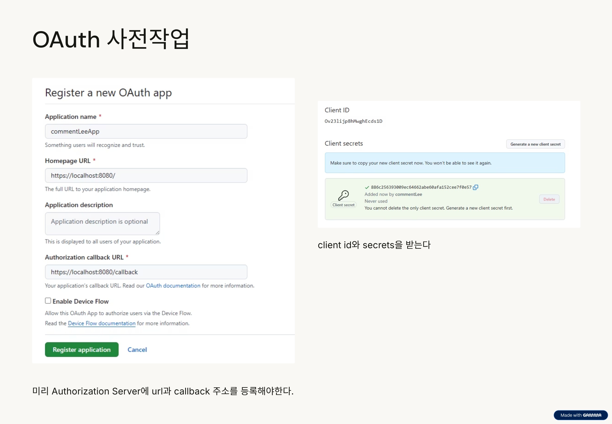

### 예시 URL
https://github.com/login/oauth/authorize?  
client_id=Ov23Ijjp8hMwghEcds1D  
&redirect_uri=https://localhost:8080/callback

- `client_id` : 애플리케이션 식별자  
- `redirect_uri` : 인증 후 돌아올 콜백 주소  

---

## OAuth 흐름 (1)

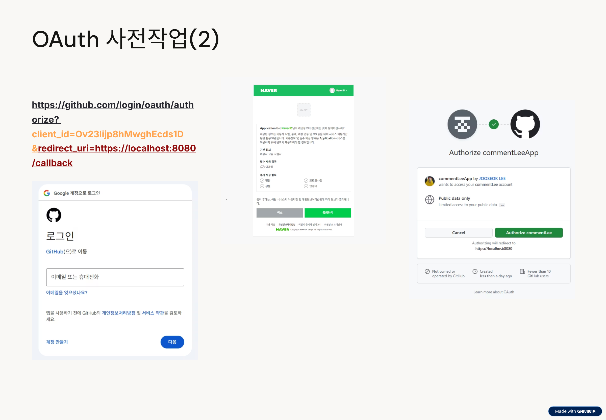

### 단계 요약
1. 사용자가 클라이언트 앱에서 로그인 요청  
2. 인증 서버로 리다이렉트  
3. 로그인 및 권한 동의 화면 표시  
4. Authorization Code 발급  
5. 클라이언트가 Code를 이용해 Access Token 요청  
6. 발급받은 토큰으로 API 호출  

---

## client ID와 redirect URL 검증

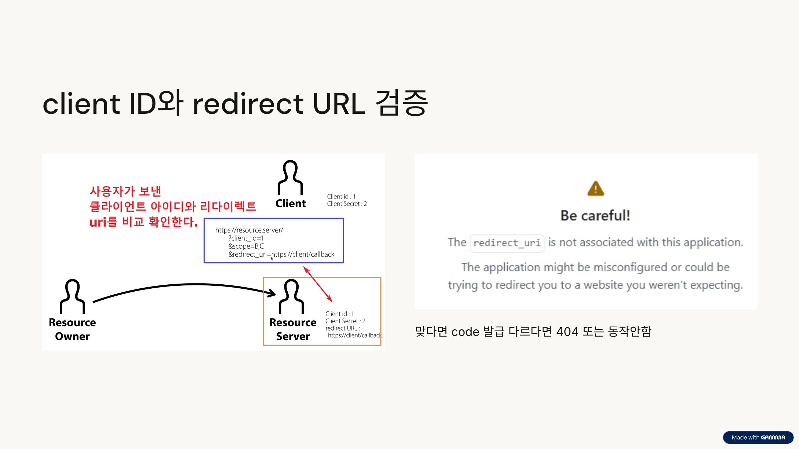

- 사용자가 보낸 클라이언트 아이디와 리다이렉트 URI를 비교 확인한다.
- 일치하면 코드 발급, 다르면 404 또는 동작 안함.

---

## 여기까지 진행했을 때 Resource Server가 알고 있는 것

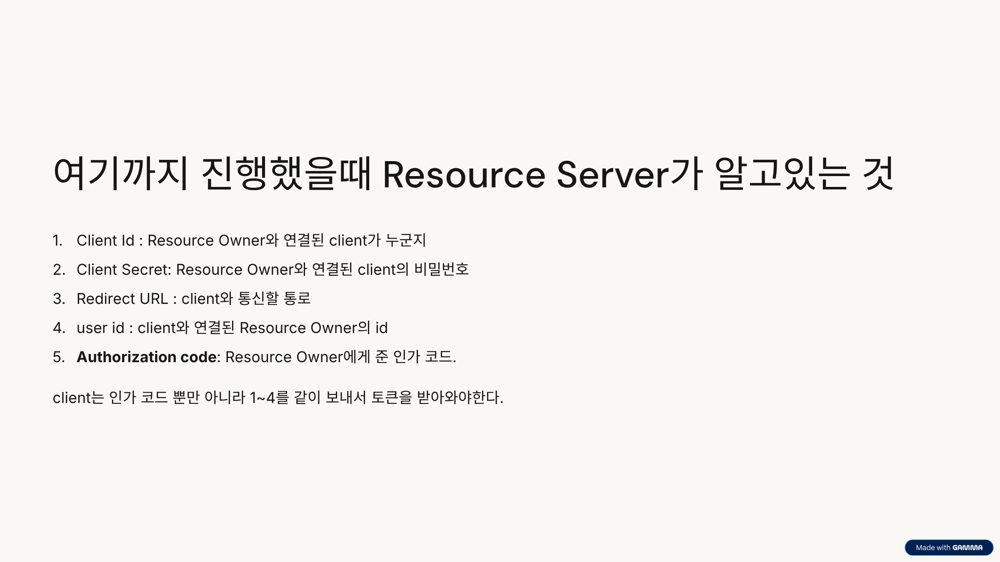

1. **Client Id**: 연결된 클라이언트가 누구인지  
2. **Client Secret**: 연결된 클라이언트의 비밀번호  
3. **Redirect URL**: 통신할 통로  
4. **User Id**: 연결된 사용자 정보  
5. **Authorization Code**: 사용자에게 부여된 인가 코드  

> 클라이언트는 코드뿐 아니라 1~4 정보를 함께 보내 토큰을 받아야 함.

---

## OAuth 흐름 (2)

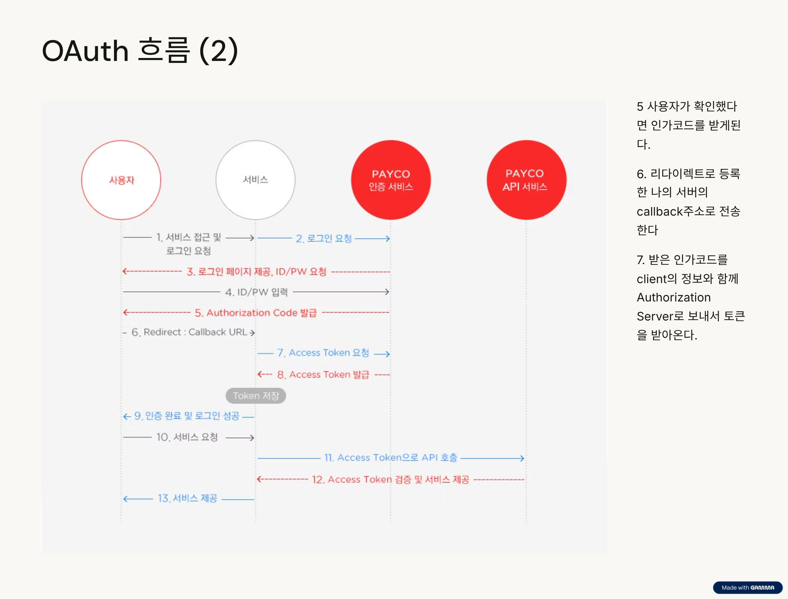

### 이어지는 과정
5. 사용자가 로그인 확인 시 인가 코드 발급  
6. 리다이렉트로 등록한 콜백 주소로 코드 전송  
7. 클라이언트가 인가 코드 + 정보로 Authorization Server에 토큰 요청  

---

## 끝: 발급받은 Access Token으로 리소스 접근 가능

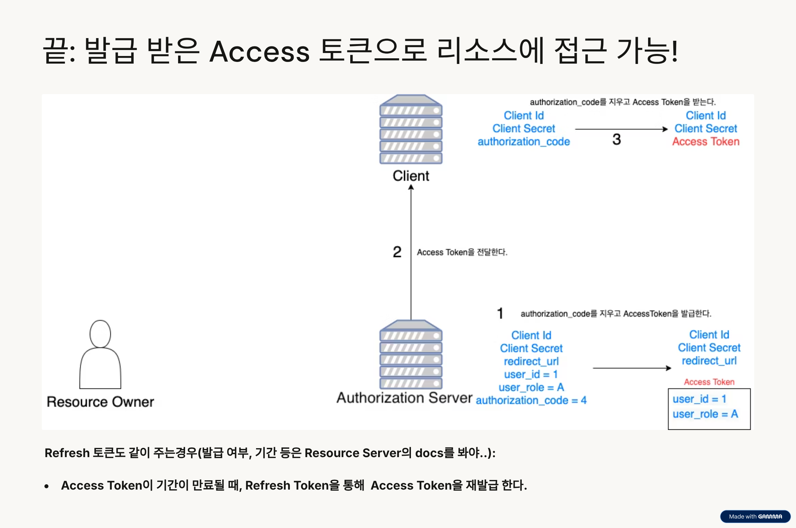

- 발급받은 Access Token을 통해 API 서버(리소스 서버)에 접근 가능  
- Access Token 만료 시 **Refresh Token**으로 재발급 요청  

> Refresh Token은 선택적으로 제공되며, Access Token 탈취에 대비해 보안성을 높인다.

---

## OAuth 2.0의 특징

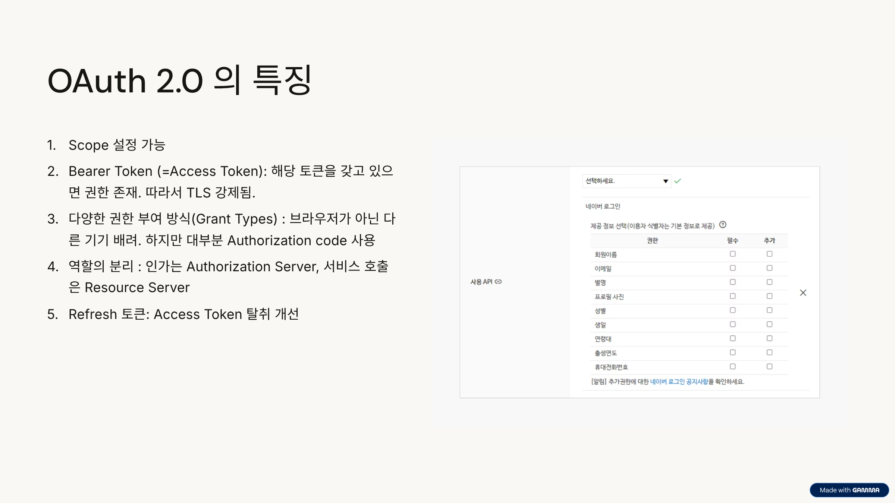

1. **Scope 설정 가능** — 접근 범위 제한 가능  
2. **Bearer Token (=Access Token)** — 토큰 소유만으로 권한 인증 (TLS 필수)  
3. **다양한 Grant Type 지원** — Authorization Code, Implicit, Password, Client Credentials 등  
4. **역할 분리** — Authorization Server / Resource Server  
5. **Refresh Token 지원** — Access Token 탈취 및 만료 문제 개선  

---

## 발표자용 요약

| 구분 | 핵심 메시지 |
|------|--------------|
| 인증 vs 인가 | 401 vs 403의 개념 차이 |
| 토큰 기반 인증 | 세션 없는 인증 방식, 보안 관리 중요 |
| OAuth 등장 배경 | 비밀번호 없이 권한만 위임하는 표준 등장 |
| OAuth 핵심 | 인가를 위한 프로토콜, 제3자 접근 제어 |
| 구성요소 | 사용자, 앱, 인증서버, 리소스서버 |
| 흐름 | 인증 → 코드 → 토큰 → 자원 접근 |
| 실제 예시 | Google, Naver, GitHub 로그인 권한 위임 |

---

> Made by 주석 (컴퓨터공학 전공 발표)
