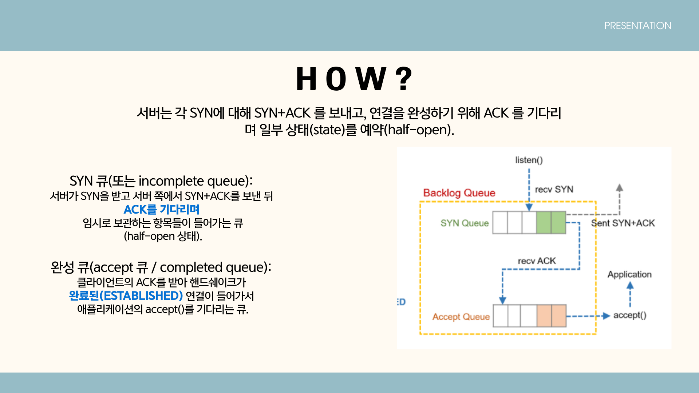

# SYN Flooding Attack Presentation

## 📘 개요
이 문서는 네트워크 보안 분야에서 **SYN Flooding Attack**을 중심으로 다룬 프레젠테이션 자료의 요약입니다.  
TCP의 **3-Way Handshake 과정의 취약점**을 악용해 서버의 연결 대기 큐를 가득 채움으로써 정상적인 접속을 방해하는 대표적인 **DoS 공격 방식**을 설명합니다.

---

## 📖 주요 내용

### 1. Flooding(플러딩) 개념
- 플러딩은 **단기간에 대량의 요청이나 트래픽을 전송**하여 서버·네트워크·서비스의 자원을 소모시키는 행위.
- DoS(Denial of Service)의 대표적인 형태로, **의도적 공격** 혹은 **시스템 오류로 인한 과부하**로 발생할 수 있음.

---

### 2. SYN Flooding의 원리
- **TCP 3-Way Handshake**의 첫 단계(SYN 요청)를 이용한 공격.
- 공격자는 **ACK를 보내지 않고** SYN만 반복적으로 전송해 서버의 **Half-open Queue**를 채움.
- 서버는 제한된 큐 공간이 꽉 차면 정상 요청을 처리하지 못해 **서비스 거부 상태**에 빠짐.

#### 공격 방식
- 단일 IP 기반 공격
- 분산형(DDoS) 공격
- **IP 스푸핑**을 통한 출발지 주소 위조

### 플러딩 종류들
### A. 네트워크 / 전송 계층 플러딩

1. **SYN Flood (TCP SYN Flood)**  

   - **설명:** TCP 3-way-handshake의 첫 단계인 `SYN`만 대량 전송하여 서버의 half-open(미완성) 연결을 쌓아 `SYN 큐`를 포화시킴. 서버는 `SYN+ACK`를 보내고 `ACK`를 기다리며 자원(메모리, 소켓)을 점유당함.  
   
   - **영향:** 정상 클라이언트의 연결 허용 수 감소, 서비스 접속 실패.  
   - **특징:** 비교적 적은 트래픽으로 큰 영향을 줄 수 있음.

2. **UDP Flood**  
   - **설명:** 임의의 UDP 패킷을 대량 전송. 대상이 응답을 보내면(예: ICMP 응답) 대역폭과 처리 자원이 소모됨.  
   - **영향:** 대역폭 포화, 네트워크 레벨 장애.

3. **ICMP (Ping) Flood**  
   - **설명:** ICMP Echo Request(ping)를 대량 전송해 대상이 응답하거나 네트워크 장비가 처리 부하를 겪게 함.  
   - **영향:** 대역폭 소모, CPU 사용 증가.

4. **ACK / RST Flood**  
   - **설명:** 이미 수립된 연결에 대해 비정상적인 ACK나 RST를 대량 전송해 상태 테이블을 교란하거나 세션을 끊음.  
   - **영향:** 연결 불안정, 세션 중단.
---

### B. 증폭(Amplification) / 반사(Reflection) 기반 플러딩
 (에코 응답을 이용한 브로드캐스팅 테러와 유사하다고 이해하면 쉽다)
- **원리:** 작은 요청으로 다수의 응답을 유발하는 공용 서비스를 악용. 공격자는 출발지 IP를 피해자 IP로 위조(spoof)하고 반사 서버(예: DNS, NTP, SSDP)에 요청을 보냄. 반사 서버들이 피해자에게 큰 응답을 보내 공격이 증폭됨.

1. **DNS Amplification**  
   - **특징:** 작은 DNS 쿼리로 큰 응답을 유도(특히 `ANY` 쿼리/증폭 이용). 높은 증폭률 가능.

2. **NTP Amplification**  
   - **특징:** 예전 `monlist` 같은 명령으로 많은 응답을 유발. 과거에 많이 악용됨.

3. **SSDP / Chargen / Memcached 증폭**  
   - **특징:** UDP 기반의 공용 서비스들을 악용해 반사·증폭 공격 발생.

- **영향:** 매우 큰 대역폭을 단기간에 피해자에게 집중시켜 네트워크 자체를 사용할 수 없게 만듦.

### 3. 서버의 상태와 큐 구조

- **SYN 큐 (incomplete queue)**: SYN을 받은 후 ACK를 기다리는 연결 대기 상태 저장.
- **ACCEPT 큐 (completed queue)**: 3-Way Handshake가 완료된 연결 저장.
- SYN 큐가 가득 차면 새로운 연결 요청이 **지연되거나 거부(drop)**됨.

---

### 4. 탐지 및 대응 방안

#### 이상 징후
- SYN 트래픽 급증
- SYN : SYN-ACK 비율 불균형
- Half-open 상태(SYN_RECV) 수 증가
- 클라이언트 타임아웃 또는 사용자 불만 다수 발생

#### 기술적 대응
1. **SYN cookies**  
   → 클라이언트의 ACK를 받은 뒤에만 연결 상태를 재구성하여 자원 낭비 방지  
2. **Backlog Queue 확장**  
   → SYN 큐 크기 조정으로 연결 대기 공간 확보  
3. **Rate limiting / ACL / conntrack 튜닝**  
   → 비정상적인 트래픽 제한  
4. **방화벽 및 DDoS 장비**  
   → 동일 IP의 과도한 SYN 요청 탐지 및 차단  
5. **클라우드 기반 보호 서비스**  
   → AWS Shield, Cloudflare, CDN/Anycast 등  

