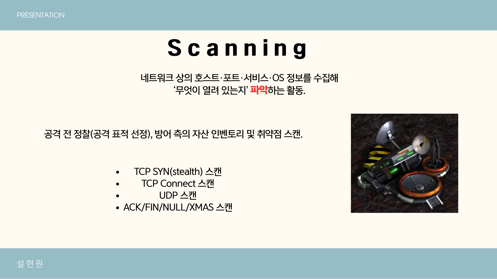
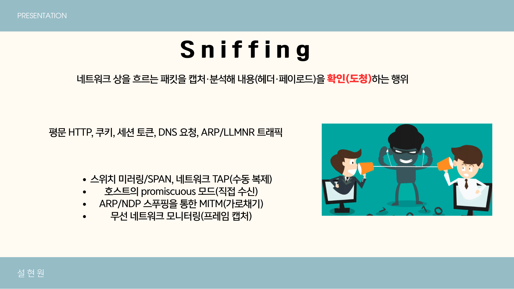
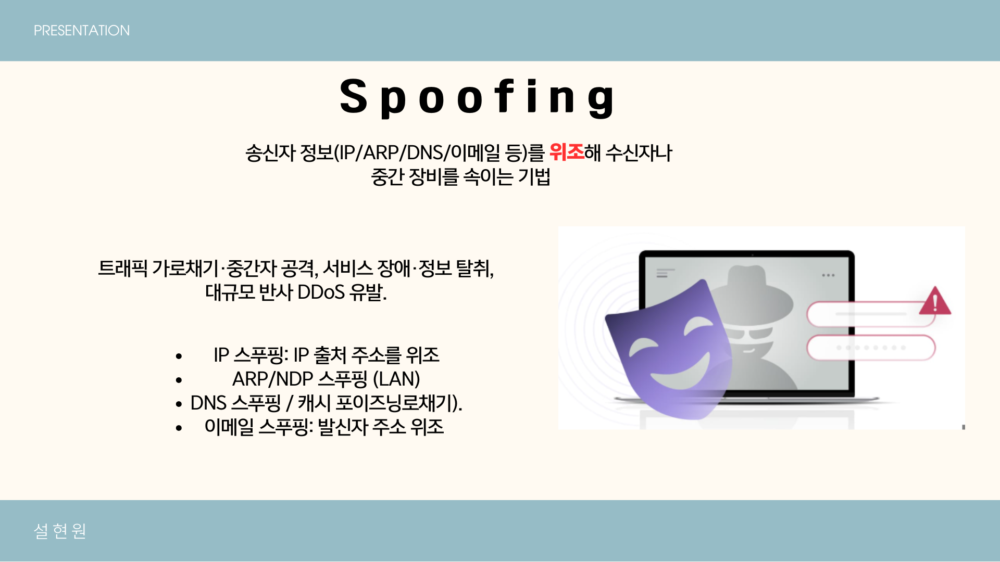
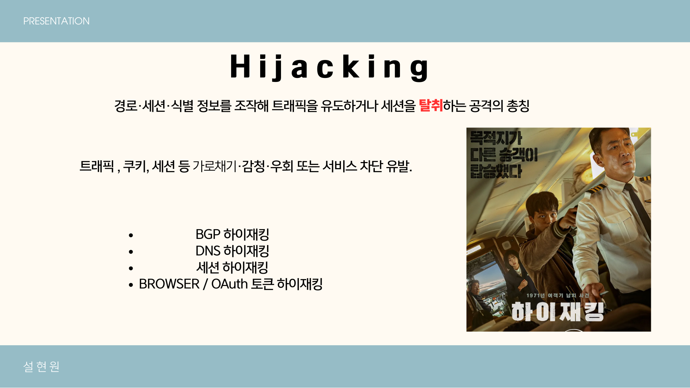
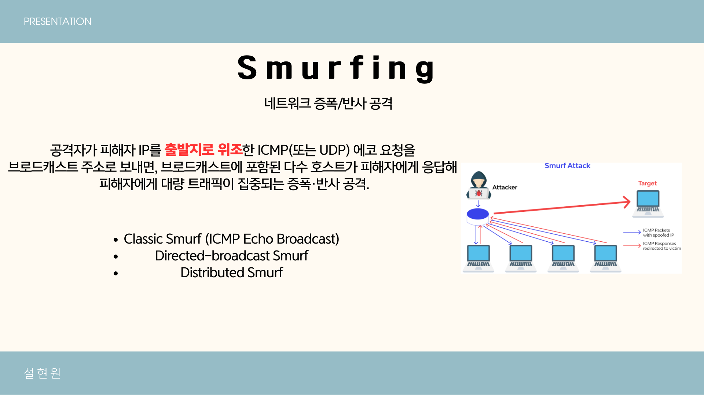

# 🛰️ 네트워크 계층 공격

| 공격 유형 | 설명 | 주요 특징 |
|---|---|---|
| **Scanning** | 공격 전 단계에서 서비스 포트·OS·취약점을 탐색 | SYN / Connect / UDP / FIN / XMAS 등 다양한 스캔 방식 |
| **Sniffing** | 네트워크 패킷을 감청·수집·분석 | 평문 데이터(HTTP, DNS, 쿠키 등) 노출, TAP·미러링 이용 |
| **Spoofing** | 송신자 정보(IP/ARP/DNS 등)를 위조 | 출처 위조로 추적 회피, 반사형 공격 유발 |
| **Hijacking** | 세션·트래픽·경로를 탈취 또는 우회 | BGP / DNS / OAuth 토큰 등 하이재킹 유형 다양 |
| **Smurfing** | 브로드캐스트 응답을 이용한 증폭형 DDoS | 출발지 IP 위조 + 브로드캐스트 응답 집중 |
| **Amplification / Reflection** | 작은 요청으로 큰 응답을 유도하여 반사 공격 수행 | DNS, NTP, SSDP, Memcached 등 고증폭 서비스 악용 |
| **Man-in-the-Middle (MITM)** | 통신 중간에서 패킷 가로채기·변조 | ARP 스푸핑, 악성 AP, TLS 중간자 공격 등 |
| **Replay Attack** | 정상 통신을 재전송하여 인증·거래 재현 | 타임스탬프/nonce 미적용 시 취약, 금융·세션 공격 활용 |
| **DNS Cache Poisoning** | DNS 응답 변조로 악성 IP로 유도 | 트래픽 가로채기, 피싱, 서비스 위조 가능 |
| **ARP / NDP Spoofing** | LAN 내 주소 응답 위조로 트래픽 탈취 | 로컬 네트워크에서 MITM 구현 가능 |
| **BGP Hijacking** | 인터넷 라우팅 경로 조작 | ISP/국가 단위로 트래픽 유도·감청 가능 |

---

# 💻 애플리케이션 및 시스템 계층 공격

| 공격 유형 | 설명 | 주요 특징 |
|---|---|---|
| **SQL Injection / Command Injection** | 입력값 조작으로 DB·OS 명령 실행 | 입력 검증 부재 시 시스템 장악 가능 |
| **Cross-Site Scripting (XSS)** | 웹 페이지에 악성 스크립트 삽입 | 세션 탈취·피싱·브라우저 공격 |
| **Cross-Site Request Forgery (CSRF)** | 인증된 사용자를 속여 요청 실행 | CSRF 토큰·SameSite 쿠키로 방어 |
| **Brute Force / Credential Stuffing** | 계정 대입 또는 유출 정보 재사용 | MFA·로그인 시도 제한·IP 차단 필요 |
| **Ransomware** | 시스템·데이터 암호화 후 금전 요구 | 정기 백업·권한 최소화·EDR로 방어 |
| **Slow HTTP (Slowloris)** | 연결 유지로 서버 스레드 고갈 | 낮은 트래픽으로도 DoS 유발 가능 |
| **HTTP Flood** | 합법적인 HTTP 요청을 대량 전송 | 정상 트래픽처럼 위장되어 탐지 어려움 |
| **Protocol Abuse** | 합법 프로토콜 기능을 악용 | SMTP 리레이, SNMP 오용 등 |

---

# ☁️ 인프라·공급망·인적 공격

| 공격 유형 | 설명 | 주요 특징 |
|---|---|---|
| **Phishing / Spear Phishing** | 이메일·메시지로 사용자를 기만 | 링크 클릭 유도·자격 증명 탈취 |
| **Business Email Compromise (BEC)** | 임원 사칭으로 금전·정보 탈취 | 송금 절차·이중 승인으로 방어 |
| **Supply Chain Attack** | 서드파티·라이브러리 통한 침투 | SBOM 관리·서명 검증 필요 |
| **Insider Threat** | 내부 권한자의 고의·실수로 인한 유출 | 접근 통제·행위 로그·보안 교육 |
| **Zero-day Exploit** | 미공개 취약점 악용 | 패치 전 방어 어려움, 행동 기반 탐지 필요 |
| **IoT Device Attack** | IoT 장치의 약한 보안 악용 | 펌웨어 업데이트·네트워크 분리 필수 |
| **Firmware / Bootkit Attack** | 펌웨어·부트 과정 침투 | Secure Boot·서명 검증 필요 |
| **Watering Hole / Drive-by Download** | 신뢰 사이트 감염 → 방문자 공격 | 콘텐츠 무결성 검증, 광고 차단 필요 |
| **Fileless / Living off the Land** | OS 도구 악용, 흔적 최소화 | 프로세스 행위 기반 탐지 필요 |

---

# 🧠 종합 관점 요약

**다층 방어 (Defense in Depth)**  
- 네트워크 · 시스템 · 애플리케이션 · 사용자 · 정책 등 복합적 보안 계층 구축 필요

**탐지 지표 (Indicators)**  
- 비정상 트래픽 급증, SYN_RECV 증가, CPU 사용률 급등, DNS 재시도 증가, 세션 수 폭증 등

**대응 전략(요약)**

- **네트워크 레벨**
  - Rate limiting (요청 빈도 제한)
  - SYN cookies (SYN Flood 완화)
  - CDN / Anycast (분산 및 흡수)
  - 네트워크 분리 / ACL 적용

- **애플리케이션 레벨**
  - WAF (웹 애플리케이션 방화벽)
  - 입력 검증(입력값 화이트리스트)
  - 적절한 세션 관리 (Secure / HttpOnly / SameSite 쿠키)
  - 취약점 스캐닝 및 정기 패치

- **사용자·운영 레벨**
  - 보안 인식 교육, 피싱 훈련
  - 다단계 인증(MFA)
  - 로그·이상행위 모니터링 및 대응 절차 수립

- **공급망·인프라**
  - SBOM(Software Bill of Materials) 관리
  - 서드파티 서명 검증 및 최소 권한 정책
  - 정기 백업 및 복구 시나리오 검증

---

