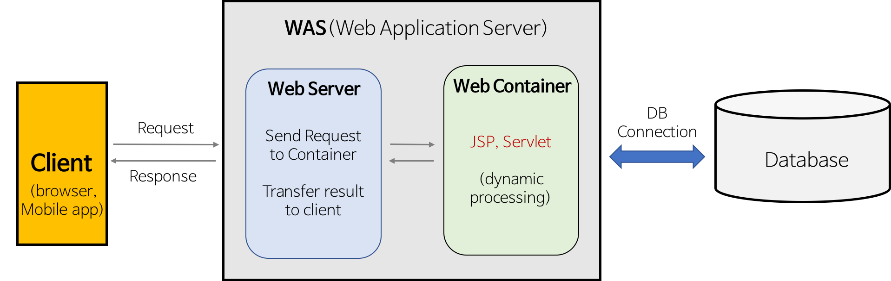

# WebServer

## 💡 핵심 요약
- **한 줄 정의** : WebServer는 클라이언트의 HTTP 요청을 처리하고 정적 콘텐츠를 제공하는 서버입니다.
- **핵심 키워드** : `#WebServer`, `#정적 콘텐츠`
- **왜 중요한가?** : 웹 서비스의 기본 인프라로, 빠르고 효율적으로 정적 파일을 제공하며, 동적 요청을 WAS로 분배하는 역할을 합니다.

# **1. 개념**

클라이언트(브라우저)로부터 HTTP/HTTPS 요청을 받아 정적 콘텐츠(HTML, CSS, 이미지 등)를 제공하거나, 동적 요청을 WAS로 전달하는 소프트웨어 또는 하드웨어입니다. 

예: Apache, Nginx

---

# **2. 왜 필요한가? / 등장 배경**

- **등장 배경**:
    - 빠르고 효율적으로 정적 콘텐츠를 제공하고, HTTP 프로토콜을 처리하기 위해 등장했습니다.
    - 클라이언트와 서버 간의 기본적인 통신을 담당하며, 동적 콘텐츠 처리는 WAS에 위임합니다.
    - 대규모 트래픽 환경에서 로드 밸런싱, 캐싱, SSL 오프로딩 등 다양한 인프라 기능을 제공합니다.

---

# **3. 동작 원리 및 주요 특징**

- **WebServer 동작 원리**:
    1. 클라이언트의 HTTP 요청(예: GET /index.html)을 수신.
    2. 요청이 정적 콘텐츠라면 디스크에서 파일을 읽어 응답.
    3. 동적 콘텐츠 요청이라면 WAS로 요청을 전달(예: Reverse Proxy).
    4. 주요 기능: HTTP 프로토콜 처리, 정적 파일 제공, 로드 밸런싱, 캐싱.
- **특징 1: 역할 분담**
    - WebServer는 정적 콘텐츠와 클라이언트 통신에 최적화.
    - WAS는 비즈니스 로직과 동적 콘텐츠 처리에 특화.
- **특징 2: 확장성**
    - WebServer는 경량화된 구조로 다수의 요청을 처리.
    - WAS는 무거운 작업을 처리하며, 부하 분산을 위해 WebServer와 함께 사용.

---

# **4. 장점과 단점**

## **👍 장점**

- **WebServer**:
    - **고속 처리**: 정적 콘텐츠를 빠르게 제공하며, 캐싱과 로드 밸런싱으로 성능 최적화.
    - **경량화**: 자원 소모가 적어 다수의 동시 접속 처리 가능.
    - **보안**: HTTPS, 방화벽 설정 등 보안 기능 제공.
    - **유연성**: 다양한 WAS, 애플리케이션 서버와 연동 가능

## **👎 단점**

- **WebServer**:
    - **제한된 기능**: 동적 콘텐츠 처리 불가, 복잡한 로직 처리는 WAS에 의존.
    - **설정 복잡성**: 고급 설정(예: Reverse Proxy) 시 전문 지식 필요.

---

# **5. 언제 사용해야 할까?**

- **✅ 사용하면 좋은 경우**:
    - **WebServer**:
        - 정적 콘텐츠(HTML, CSS, JS, 이미지) 중심의 웹사이트(예: 블로그, 회사 소개 페이지).
        - 높은 트래픽을 처리해야 하는 환경에서 로드 밸런싱 및 캐싱 필요 시.
        - WAS 앞단에 배치하여 보안 및 요청 분배 역할 수행.
- **❌ 사용을 고려해야 할 경우**:
    - **WebServer**:
        - 동적 콘텐츠 처리가 필요한 경우 단독 사용은 부적합.
        - 소규모 사이트에서 WAS가 WebServer 역할도 수행할 수 있을 때 불필요.

---

# **🔗 연관 개념**

- [[HTTP 프로토콜]]
- [[Reverse Proxy]]
- [[로드 밸런싱 (Load Balancing)]]
- [[서버 사이드 렌더링 (SSR)]]
- [[CGI와 FastCGI]]
