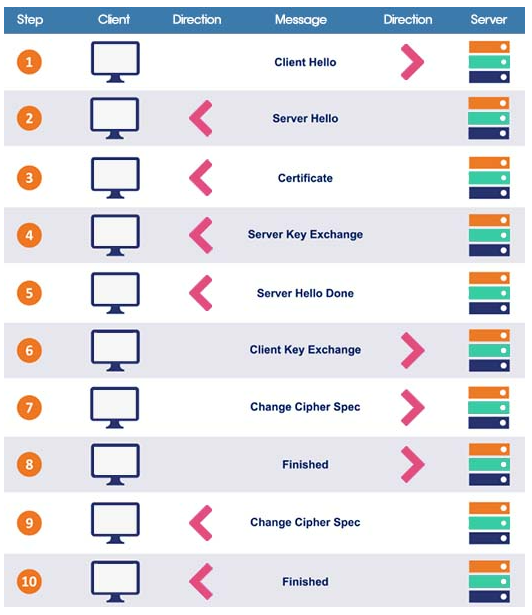
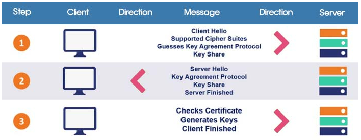
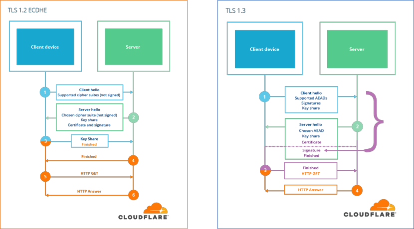
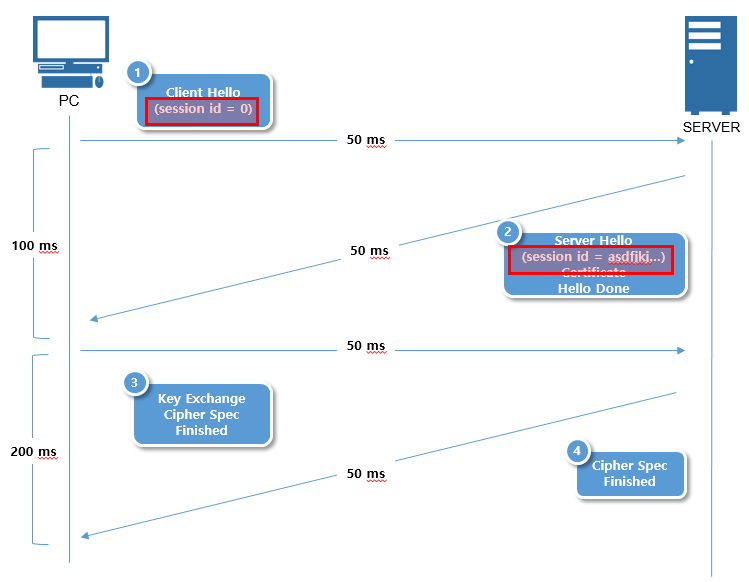
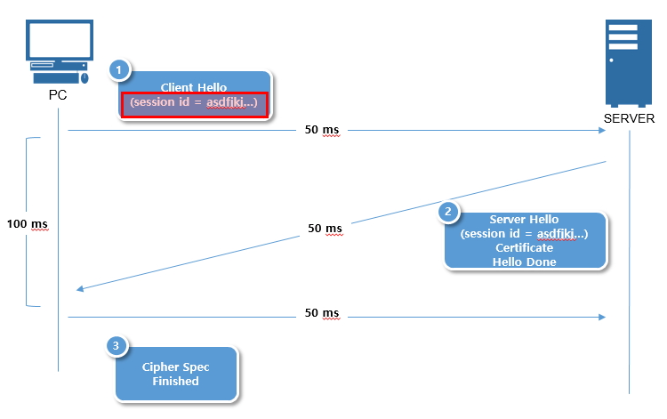
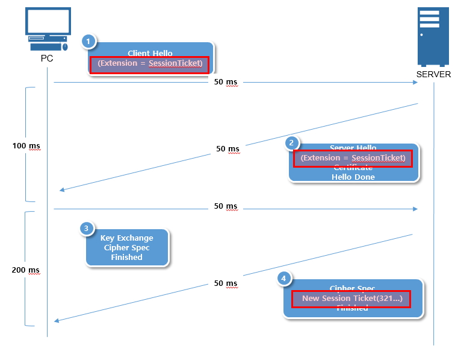
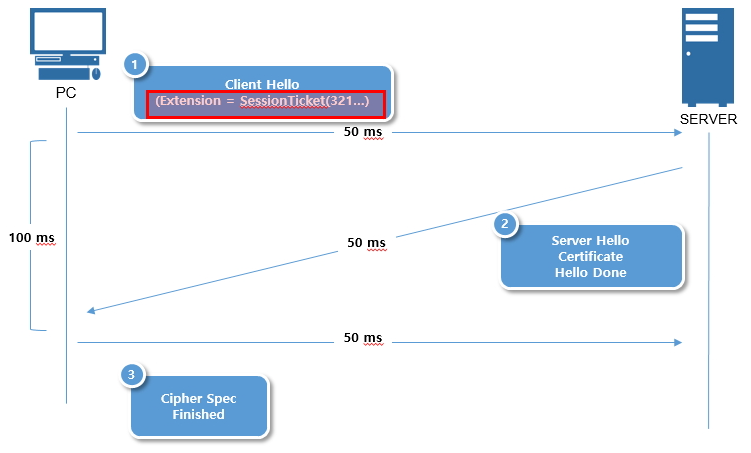
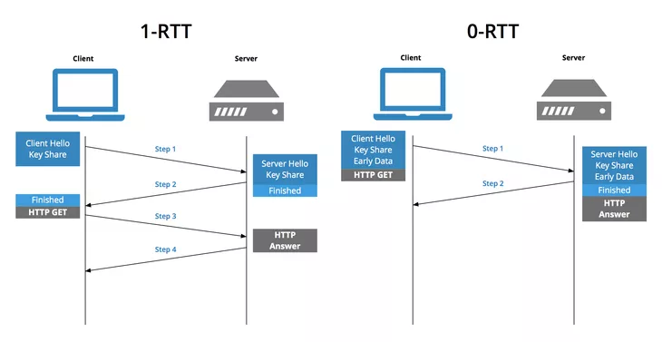

# TLS 1.3 Handshake

<br>

## 목차
- [TLS 1.3 Handshake](#tls-13-handshake)
  - [목차](#목차)
  - [TLS 1.3 Handshake 동작 방식](#tls-13-handshake-동작-방식)
    - [이전 TLS 1.2 Handshake 동작 방식](#이전-tls-12-handshake-동작-방식)
    - [TLS 1.3 Handshake 동작 방식](#tls-13-handshake-동작-방식-1)
  - [TLS 1.2 Handshake와 차이점](#tls-12-handshake와-차이점)
    - [Handshake 왕복 횟수 : 2-RTT → 1-RTT](#handshake-왕복-횟수--2-rtt--1-rtt)
    - [Handshake 메시지](#handshake-메시지)
    - [지원 암호화 방식 및 암호화 알고리즘](#지원-암호화-방식-및-암호화-알고리즘)
    - [Handshake 암호화 시점](#handshake-암호화-시점)
    - [세션 재사용](#세션-재사용)
    - [PFS(순방향 보안)](#pfs순방향-보안)
  - [ClientHello에서 클라이언트의 추측 관련](#clienthello에서-클라이언트의-추측-관련)
    - [ClientHello에서 보내는 정보](#clienthello에서-보내는-정보)
    - [낙관적인 시도가 가능한 이유](#낙관적인-시도가-가능한-이유)
    - [추측이 틀린 경우](#추측이-틀린-경우)

<br>

## TLS 1.3 Handshake 동작 방식

### 이전 TLS 1.2 Handshake 동작 방식



<br>

```
클라이언트                              서버
    |                                    |
    |-- (1) Client Hello --------------->|
    |                                    |
    |<-- (2) Server Hello ---------------|
    |<-- (3) Certificate ----------------|
    |<-- (4) Server Key Exchange --------|
    |<-- (5) Server Hello Done ----------|
    |                                    |
    |-- (6) Client Key Exchange -------->|
    |-- (7) Change Cipher Spec --------->|
    |-- (8) Finished ------------------->|
    |                                    |
    |<-- (9) Change Cipher Spec ---------|
    |<-- (10) Finished ------------------|
    |                                    |
    |====== 암호화된 데이터 통신 시작 =====|
```

<br>

TLS 1.2 Handshake는 2-RTT (round trip time)이 필요

RTT 1: Client Hello → Server Hello + Certificate +Server Key Exchange + Server Hello Done (1~5)

RTT 2: Client Key Exchange + Finished → Server Finished (6~10)

<br>

TLS 1.2는 "협상 따로, 키 교환 따로" 방식으로, 총 두 번의 왕복이 필요

- **RTT 1: 암호화 규칙 협상**
    1. `ClientHello`: 클라이언트가 지원 가능한 암호화 방식 목록을 서버에 보냄
    2. `ServerHello`: 서버가 그중 하나를 선택하고 자신의 인증서를 보냄
- **RTT 2: 비밀키 재료 교환 및 확인**
    1.  `ClientKeyExchange`: 클라이언트가 비밀키 재료를 서버의 공개키로 암호화하여 보냄
    2. `Finished`: 양측이 비밀키 생성을 완료하고, 핸드셰이크가 끝났음을 서로 확인

<br>

### TLS 1.3 Handshake 동작 방식



<br>

```
클라이언트                              서버
    |                                   |
    |-- Client Hello ------------------>|
    |   + Key Share                     |
    |   + Supported Groups              |
    |                                   |
    |<-- Server Hello ------------------|
    |<-- {Encrypted Extensions} --------|
    |<-- {Certificate} -----------------|
    |<-- {Certificate Verify} ----------|
    |<-- {Finished} --------------------|
    |                                   |
    |-- {Finished} -------------------->|
    |                                   |
    |===== 암호화된 데이터 통신 시작 =====|

{} = 암호화된 메시지
```

<br>

TLS 1.3 Handshake는 1 RTT 필요

RTT 1: Client Hello + Key Share → Server Hello + Certificate + … + Finished

<br>

TLS 1.3은 클라이언트가 서버의 능력을 미리 예측 

첫 번째 메시지에 필요한 정보를 모두 담아 보내는 방식

1. **`ClientHello` (클라이언트의 추측과 제안)**
    - 클라이언트는 `ServerHello`를 받기도 전에, 서버가 특정 키 교환 방식 사용할 것이라 **추측**.
    - 지원하는 암호화 방식 목록 (Supported Groups)과 함께, **추측한 키 교환 방식에 필요한 공개키 값 (Key Share) 미리 만들어 함께 보냄.**
2. **`ServerHello` (서버의 확정과 비밀키 생성 완료)**
    - 서버는 클라이언트의 추측이 맞으면, 제안받은 키 교환 방식과 암호화 규칙을 선택.
    - 자신의 인증서와 키 교환에 필요한 값(Key Share)을 보내줌.
    - **이 메시지를 받는 즉시, 서버와 클라이언트는 모두 비밀 세션 키를 생성 가능.**
    - 이후의 모든 메시지는 세션 키로 암호화 됨.

<br>

## TLS 1.2 Handshake와 차이점

### Handshake 왕복 횟수 : 2-RTT → 1-RTT

TLS 1.3의 가장 큰 성능 개선점

네트워크 왕복 횟수를 절반으로 줄여 초기 연결 지연 시간을 획기적으로 단축

모바일 환경이나 지연이 큰 네트워크에서 체감 속도 향상

<br>

TLS 1.2는 "협상 따로, 키 교환 따로" 방식으로 2 RTT 필요

- **RTT 1: 암호화 규칙 협상**
- **RTT 2: 비밀키 재료 교환 및 확인**

<br>

TLS 1.3은  **"추측을 통한 동시 제안"** 방식으로 불필요한 통신 과정을 제거하여 속도를 크게 향상

클라이언트가 서버가 선호할 암호화 방식 미리 **추측**하고 필요한 정보(Key Share) 첫 메시지에 모두 담아 보냄.

서버는 이 메시지를 받자마자 비밀키를 생성하고 응답할 수 있어, 왕복 횟수가 절반으로 줄어듬.


<br>

### Handshake 메시지

TLS 1.2의 Handshake는 **많은 메시지 교환**으로 구성되어 있었음.

그 결과 복잡하고 처리 속도도 느림.

TLS 1.3은 Handshake 메시지 구조를 대폭 간소화.

<br>

`ServerKeyExchange`, `ClientKeyExchange`, `ChangeCipherSpec` 같은 메시지들이 사라짐.

핵심 정보들이 `Hello` 메시지와 새로운 `EncryptedExtensions` 메시지에 통합되어 더 간결해짐.

<br>

주목할 점은 **`ChangeCipherSpec`**이 완전히 제거되고, 많은 메시지가 통합되었다는 것. 

또한 ServerHello 이후부터 모든 메시지는 암호화됨.

<br>

**TLS 1.2 메시지 흐름 (단순화)**

```
ClientHello
 → ServerHello
 → Certificate
 → ServerKeyExchange
 → ServerHelloDone
 ← ClientKeyExchange
 ← Finished
 → Finished
```

<br>

**TLS 1.3 메시지 흐름**

```
ClientHello (+ KeyShare)
 → ServerHello (+ KeyShare)
 → EncryptedExtensions
 → Certificate
 → CertificateVerify
 → Finished
 ← Finished
```

<br>

### 지원 암호화 방식 및 암호화 알고리즘

TLS 1.3은 과거에 발견된 여러 보안 취약점의 근원을 제거하여 구조적으로 더 안전해짐 

- **TLS 1.2:**
    - 지원하는 알고리즘: 많음
    - 현재는 안전하지 않다고 알려진 오래된 암호화 알고리즘들을 지원
        - RSA 키 교환
        - RC4 (보안 취약)
        - DES (보안 취약)
        - MD5 (보안 취약)
        - SHA-1 (보안 취약)

<br>

- **TLS 1.3:**
    - 지원하는 알고리즘: 엄격함
    - 보안에 취약한 알고리즘 모두 제거
    - 오직 AEAD 방식의 최신 암호화만 사용하도록 강제
    - 암호화와 인증을 하나의 과정으로 통합해 성능과 보안을 동시에 향상
        - AES-GCM
        - ChaCha20-Poly1305
        - SHA-256
        - SHA-384

<br>

| 구분                | TLS 1.2                | TLS 1.3                        |
| ------------------- | ---------------------- | ------------------------------ |
| **키 교환**         | RSA, DH, ECDHE         | **ECDHE만 사용**               |
| **암호화 알고리즘** | AES, 3DES, RC4 등 다양 | **AES-GCM, ChaCha20-Poly1305** |
| **해시 알고리즘**   | MD5, SHA-1, SHA-256 등 | **SHA-256 이상만 허용**        |

<br>

### Handshake 암호화 시점

보안 강화를 위해 핸드셰이크 암호화 시점이 크게 앞당겨짐

- **TLS 1.2**:
    - `ServerHello` 이후에도 서버의 인증서를 포함한 여러 메시지가 암호화되지 않은 평문으로 전송.
    - ChangeCipherSpec 메시지 이후부터 암호화 시작.
    - 인증서, 키 교환 정보 등이 노출 가능.
    - MITM의 공격자는 어떤 사이트에 접속하는지, 어떤 인증서를 사용하는지 등을 엿보기 가능.
    - Finished 이후에 암호화를 시작함.
- **TLS 1.3**:
    - `ClientHello`와 `ServerHello`의 일부를 제외한 **거의 모든 Handshake 메시지를 암호화.**
    - ServerHello 이후 모든 메시지 암호화.
    - 중간자가 획득할 수 있는 정보 최소화.
    - 서버 인증서조차 암호화되어 전송되므로, 사용자의 프라이버시가 훨씬 강화됨.



<br>

### 세션 재사용

한 번 접속했던 사이트에 다시 연결할 때의 속도가 비약적으로 빨라짐.

- **TLS 1.2**:
    - `Session ID`나 `Session Ticket`을 이용해 이전 세션 재사용.
    - 위 방식은 세션 재사용해도 재접속 시 핸드셰이크를 단축 (1-RTT 소요).

<br>

Sessio ID 사용

처음 연결 시 



<br>

재접속 시



<br>

Session Ticket 사용

처음 연결 시



<br>

재접속 시 



<br>

- **TLS 1.3**:
    - **PSK (Pre-Shared Key)** 와 **Session Ticket**을 사용.
        - **PSK(Pre-Shared Key)** 라는 새로운 방식을 도입.
        - 추가 인증 없이 바로 세션 복원 가능.
        - 이를 통해 재접속 시 **0-RTT (Zero Round-Trip Time)** 가능해짐.
    - 클라이언트는 재접속 시, 첫 `ClientHello` 메시지에 암호화된 HTTP 요청까지 함께 보낼 수 있음.
        - 암호화된 HTTP 요청 바로 보내고 Handshake로 인한 지연 시간 없으니 0-RTT.
    - 다만 replay attack 위험이 있어 신중한 사용이 필요.
        - replay attack :
            - 공격자가 0-RTT 데이터(`ClientHello` + `Early Data`) 패킷을 중간에 가로챔
            - 가로챈 패킷을 그대로 복사하여 서버에 여러 번 재전송



<br>

### PFS(순방향 보안)

**PFS(Perfect Forward Secrecy)** 

서버의 개인키, 세션 키 유출되더라도 과거의 암호화된 통신 내용은 해독할 수 없도록 보호하는 보안 기능

<br>

- **TLS 1.2**:
    - PFS는 **선택 사항.**
    - 일부 키 교환 방식에서만 PFS 지원 (ECDHE, DHE).
    - RSA 키 교환을 사용할 경우 PFS가 보장되지 않음.
    - 서버의 개인키가 유출되면 과거 세션 복호화 가능.
    - 관리자가 선택적으로 설정.
- **TLS 1.3**:
    - PFS가 **필수 사항**.
    - 모든 키 교환 방식이 통신마다 새로운 임시 키를 사용하는 방식(Ephemeral)으로 강제됨.
    - 모든 세션이 기본적으로 PFS를 보장.

<br>

PFS가 보장되면 장기간 사용하는 개인키가 유출되어도 과거 통신 내용의 안전성이 유지됨.

이는 장기적인 보안에 매우 중요한 특성.

<br>

정적 RSA 키 교환 방식을 제거함

ECDHE 키 교환 방식으로 강제함

<br>

## ClientHello에서 클라이언트의 추측 관련

무작정 찍는 '추측'이라기보다는, "가장 가능성이 높은 최선의 수를 먼저 두는 낙관적인 시도"에 가까움

<br>

### ClientHello에서 보내는 정보

클라이언트는 `ClientHello` 메시지를 보낼 때 다음과 같은 두 가지 정보를 함께 보냄

- **`supported_groups` 확장**:
    - "저는 이런 키 교환 방식들(예: 타원곡선 A, B, C)을 지원합니다."
    - 자신이 사용할 수 있는 키 교환 알고리즘의 전체 목록을 알려줌.
- **`key_share` 확장**:
    - "그리고 **혹시 당신도 제 첫 번째 추천(타원곡선 A)을 쓸 것 같다면, 이 방식으로 바로 키 교환을 시작할 수 있도록 제 공개키 값을 미리 만들어 보냅니다.**"

<br>

클라이언트는 자신이 가장 선호하는 키 교환 방식에 대해 미리 임시 개인키/공개키 쌍을 생성

그 공개키 값을 `key_share`에 담아 첫 `ClientHello`에 실어 보내는 것

<br>

**쉬운 비유**: 카페에 가서 주문하는 것

- **TLS 1.2 방식**:
    - "어떤 원두 있어요?" 라고 물어봄
    - 직원이 "A, B, C 원두가 있어요" 라고 답함 (RTT 1)
    - 그제서야 "그럼 A 원두로 주세요" 라고 말하는 것. (RTT 2)
- **TLS 1.3 방식**:
    - "**아마 A 원두가 있겠죠? A 원두로 주세요.** 만약 없으면 다른 거 여쭤볼게요." (RTT 1)
    - 일단 가장 인기있는 메뉴를 먼저 주문하는 것.

<br>

### 낙관적인 시도가 가능한 이유

이러한 '낙관적인 시도'가 가능한 이유는 TLS 1.3이 프로토콜 자체를 **대폭 단순화하고 현대화**했기 때문

<br>

1: 낡고 취약한 옵션의 제거

TLS 1.2까지는 수많은 종류의 키 교환 방식(정적 RSA, 다양한 DH 그룹 등)을 지원. 

이 중에는 현재는 보안에 취약하거나 비효율적인 것들이 많았다. 

클라이언트와 서버가 어떤 방식을 선호할지 예측하기가 어려웠다.

<br>

하지만 **TLS 1.3은 이 낡은 옵션들을 모두 제거.**

**완벽한 전달 보안(PFS)을 제공하는 최신 타원곡선 디피-헬만(ECDHE) 방식 몇 가지만을 표준으로 채택**.

<br>

2:  최선의 선택지가 정해진 시장

이제 클라이언트와 서버가 선택할 수 있는 '좋은' 키 교환 방식은 몇 개로 좁혀짐. 

클라이언트(최신 브라우저)는 "요즘 잘나가는 서버라면 당연히 가장 안전하고 빠른 방식을 지원하겠지?"라고 생각하는 것이 매우 합리적. 

따라서 이 방식에 대한 `key_share` 미리 만들어 보내면, 대부분의 최신 서버는 이 제안을 바로 수락할 수 있음.

<br>

### 추측이 틀린 경우

추측이 틀리면 어떻게 되는가? (Fallback Mechanism)

물론 클라이언트의 추측이 항상 맞는 것은 X. 

서버가 다른 키 교환 방식을 더 선호하거나, 클라이언트가 제안한 방식을 지원하지 않을 수도 있음. 

TLS 1.3은 이 경우를 위한 대비책 존재.

<br>

- **성공 시 (추측이 맞았을 때 - Best Case)**
    - 서버는 클라이언트가 보낸 `key_share`를 보고 "아주 좋아!"라고 생각.
    - 즉시 자신의 키 값을 계산하여 `ServerHello`에 담아 응답.
    - **단 한 번의 왕복(1-RTT)만으로 핸드셰이크가 완료됨.** (대부분의 경우)

<br>

- **실패 시 (추측이 틀렸을 때 - Worst Case)**
    - 서버는 클라이언트가 보낸 `key_share`를 사용할 수 없다고 판단.
    - `ServerHello` 대신 **`HelloRetryRequest`** 라는 특별한 메시지를 클라이언트에게 보냄.
        - 이 메시지에는 "네가 보낸 건 못 쓰겠고, 내가 지원하는 목록 중에서 **이걸로 다시 보내줘**" 라는 내용이 담겨 있음.
    - 클라이언트는 이 요청에 맞춰 새로운 `key_share`를 담은 두 번째 `ClientHello`를 보냄.
        - 이 경우에는 한 번의 왕복이 추가되어 TLS 1.2와 비슷한 2-RTT가 소요됨.
        - 하지만 이는 매우 드문 경우입니다.