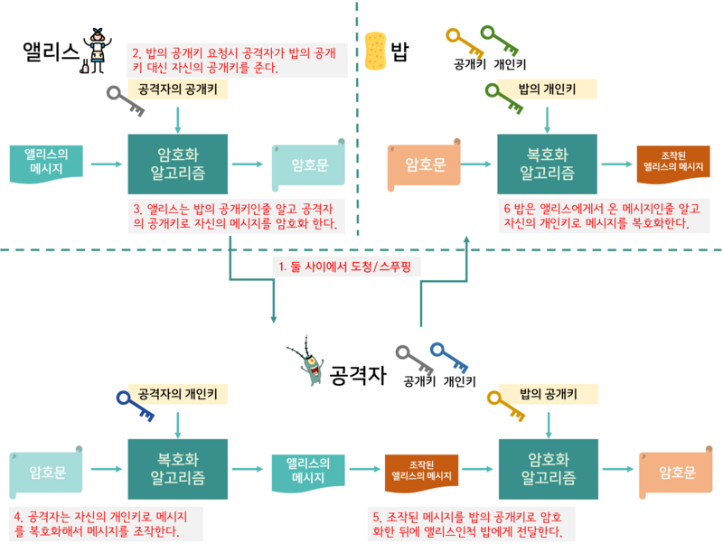
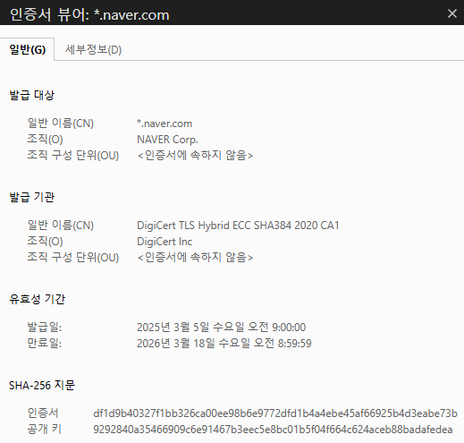
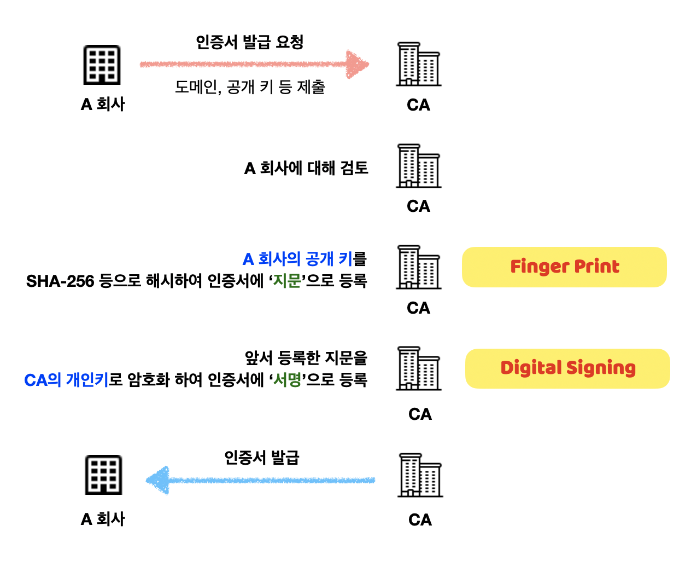
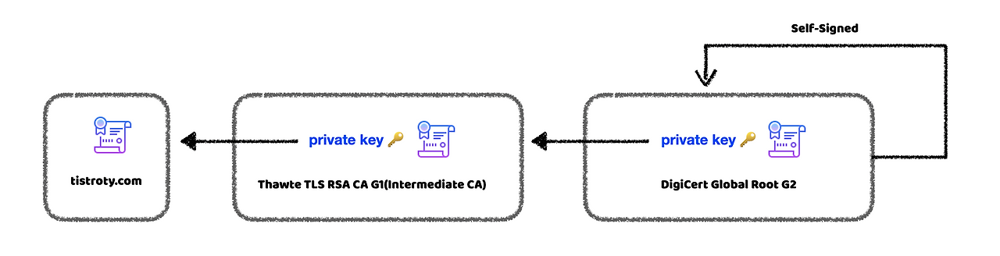
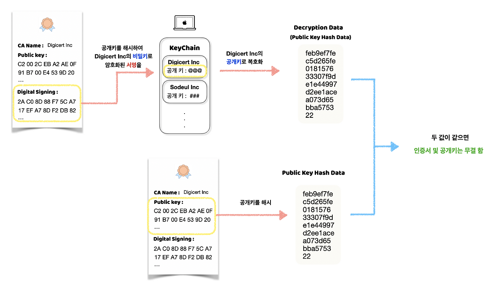

# TLS 인증서

<br>

## 목차
- [TLS 인증서](#tls-인증서)
  - [목차](#목차)
  - [인증서란](#인증서란)
    - [필요성 및 역할](#필요성-및-역할)
    - [담겨있는 정보](#담겨있는-정보)
  - [인증 기관 (CA)](#인증-기관-ca)
    - [역할](#역할)
    - [CA의 종류](#ca의-종류)
    - [CA를 신뢰하는 이유](#ca를-신뢰하는-이유)
    - [대표적인 CA 예시](#대표적인-ca-예시)
  - [인증서 발급 및 서명 절차](#인증서-발급-및-서명-절차)
  - [인증서 체인](#인증서-체인)
    - [인증서 체인 계층 구조](#인증서-체인-계층-구조)
    - [종류](#종류)
    - [보안](#보안)
    - [신뢰 사슬](#신뢰-사슬)
    - [**체인 검증 원리**](#체인-검증-원리)
  - [인증서 검증 과정](#인증서-검증-과정)

<br>

## 인증서란

TLS 인증서는 아주 간단하게 말해 웹사이트의 '디지털 신분증'.

우리가 오프라인에서 주민등록증으로 신원을 증명.

온라인에서는 웹사이트가 이 인증서를 통해 "내가 진짜 OOO 사이트가 맞다"는 것을 증명.

<br>

TLS 인증서는 웹 서버의 신원을 증명하고 공개키를 안전하게 배포하기 위한 디지털 문서.

<br>

### 필요성 및 역할

TLS 인증서는 중간자 공격(Man-in-the-Middle Attack)과 피싱(Phishing)을 방지하기 위해 필요함

중간에 해커가 요청을 가로채 해커의 공개키를 보낼 수 있음

따라서 통신 상대의 신원을 확인할 방법이 없다면, 암호화는 아무 의미 없음

클라이언트가 받은 공개키가 정말 요청 보내려는 서버의 것이 맞다는 것을 제 3자가 보증해줄 장치가 필요함



<br>

### 담겨있는 정보

인증서는 웹사이트의 신분증인 만큼, 여러 중요한 정보를 담고 있음.

즉, 인증서에는 “이 공개키는 example.com의 것이며, CA가 이를 보증한다”는 정보가 담겨 있음.

- **소유자 정보 (Subject)**: 인증서가 발급된 대상의 도메인 주소 (예: `www.google.com`)
- **공개키 (Public Key)**: 해당 웹사이트의 공개키. TLS 핸드셰이크 시 키 교환에 사용.
- **발급자 (Issuer)**: 이 인증서를 발급한 신뢰할 수 있는 기관(CA)의 이름.
- **유효 기간 (Validity Period)**: 인증서가 유효한 시작 날짜와 만료 날짜.
- **디지털 서명 (Digital Signature)**: 이 인증서가 위조되지 않았음을 증명하는 발급자(CA)의 암호화된 서명.
- **일련 번호 (Serial Number)**: CA가 부여한 인증서 고유 번호
- **서명 알고리즘 (Signature Algorithm)**: 인증서 서명에 사용된 알고리즘 (예: SHA256-RSA)



<br>

## 인증 기관 (CA)

인증서는 아무나 발급할 수 없다.

만약 누구나 자신의 신분증을 만들 수 있다면, 그 신분증은 아무런 효력이 없다.

<br>

인증 기관(CA, Certificate Authority)은 인증서를 발급, 관리, 보장해주는 신뢰할 수 있는 제3의 기관.

“이 서버는 신뢰할 수 있다”고 서명해주는 공신력 있는 제3의 기관.

인증서가 신뢰할 수 있으려면 누군가는 그 인증서를 검증해야 하는데 이 역할을 하는 것이 인증 기관.

<br>

CA는 자체적으로 공개키와 비밀키를 가지고 있음.

CA의 비밀키는 절대 누설 되어선 안됨.

<br>

### 역할

- 도메인 소유자 검증
    - 인증서 발급 신청자의 신원 철저히 검증
    - 서버의 도메인 소유자임을 확인
    - 검증 방법은 CA마다 다르지만 엄격한 기준을 적용
        - 이메일 확인
        - DNS 레코드 확인
        - 웹사이트 파일 업로드
        - …
- 인증서 발급
    - 검증이 완료되면 CA는 인증서에 CA의 비공개키로 서명 후 인증서 발급
    - 클라이언트는 이 서명으로 인증서의 진위 확인
- 신뢰 체계 구축
    - 신뢰할 수 있는 기관이 그 웹사이트를 검증했음을 보장
    - 브라우저와 운영체제에 루트 인증서가 사전 설치되어 있다
    - 이를 통해 전 세계 사용자들이 CA를 신뢰할 수 있다

<br>

### CA의 종류

- **루트 CA (Root CA)**
    - 모든 신뢰의 시작점입니다.
    - 브라우저와 운영체제에 사전 설치되어 있습니다.
    - 예: DigiCert, Comodo, GeoTrust
- **중간 CA (Intermediate CA)**
    - 루트 CA에 의해 검증받은 CA입니다.
    - 실제 서버 인증서를 발급하는 것은 주로 중간 CA입니다.
    - 보안상의 이유로, 루트 CA는 직접 인증서를 발급하지 않습니다.
- **선택적 CA**
    - 무료로 인증서를 발급하는 CA도 있습니다.
    - 예: Let's Encrypt
    - 이들도 중간 CA로서 신뢰할 수 있는 인증서를 발급합니다.


<br>

### CA를 신뢰하는 이유

CA를 신뢰하는 과정은 다음과 같다.

1. 당신의 브라우저에 루트 CA 인증서가 사전 설치되어 있음.
2. 웹사이트 방문 시, 서버가 자신의 인증서를 보냄.
3. 브라우저가 "이 인증서는 누가 서명했나?" 물어봄.
4. 중간 CA가 서명했다면, 그 중간 CA의 인증서도 함께 받음.
5. 브라우저가 다시 물어봄: "중간 CA의 인증서는 누가 서명했나?"
6. 루트 CA가 서명했다면, 신뢰할 수 있음.
    1. 루트 CA는 이미 당신의 브라우저에 신뢰할 수 있는 것으로 등록되어 있기 때문.

<br>

### 대표적인 CA 예시

- DigiCert
- GlobalSign
- Let’s Encrypt (무료)

 Let's Encrypt는 무료로 인증서를 발급하여 HTTPS 보급에 크게 기여했다.

<br>

## 인증서 발급 및 서명 절차

웹사이트 운영자가 CA로부터 인증서를 발급받는 과정은 다음과 같습니다.

1. **키 쌍 생성**: 
    1. 운영자는 먼저 자신의 서버에서 사용할 **개인키**와 **공개키** 쌍을 생성.
2. **CSR (Certificate Signing Request) 생성**: 
    1. 운영자는 자신의 정보와 **공개키**를 담아 **인증서 서명 요청서(CSR)** 파일을 만듬.
    2. 정보 : 도메인 주소, 조직명 등
3. **CSR 제출**: 
    1. 생성한 CSR을 CA에 제출하며 인증서 발급을 신청합니다.
4. **신원 확인**: 
    1. CA가 신청자의 신원과 도메인 소유권을 여러 방법으로 확인. 
    2. 여러 검증 방법:
        1. DV (Domain Validation): 이메일이나 DNS로 확인
        2. OV (Organization Validation): 조직의 실제 존재를 확인
        3. EV (Extended Validation): 법인 등록부까지 확인
    3. 검증 수준이 높을수록 더 신뢰할 수 있는 인증서가 됨.
5. **인증서 서명 및 발급**: 
    1. 신원 확인이 완료되면, CA는 제출된 정보를 바탕으로 인증서를 생성. 
        1. 서버의 공개키를 해시 함
        2. 이렇게 해시한 값을 지문이라고 함
    2. 그리고 가장 중요한 단계로, **CA 자신의 개인키**를 이용해 인증서에 **디지털 서명함**.
        1. 지문을 CA의 개인키로 암호화 함
        2. 인증서의 발급자 서명으로 등록
    3. 완성된 인증서를 신청자에게 전달.
6. **서버에 인증서 설정:**
    1. 발급받은 인증서를 웹 서버에 설치
    2. 서버의 개인키와 함께 HTTPS 통신을 위한 설정을 완료



<br>

## 인증서 체인

TLS 인증서는 단독으로 신뢰되지 않음.

항상 **계층 구조(Chain of Trust)** 를 형성해 여러 개가 함께 작동.

<br>

**상위 인증 기관이 하위 인증서가 포함하고 있는 공개키 (인증서)를 상위 기관의 비밀키로 암호화** 함

그래서 상호 보증하게 되는 것을  **인증서 체인(Certificate Chain)** 이라고 함 

<br>

### 인증서 체인 계층 구조

```
[Root CA]
   ↓ (서명)
[Intermediate CA]
   ↓ (서명)
[Server Certificate]
```



<br>

### 종류

- **Root CA** :
    - 브라우저와 운영체제에 미리 내장되어 있음
    - 브라우저가 기본적으로 신뢰하는 최상위 기관
    - 자신의 인증서를 자신이 직접 서명
- **Intermediate CA** :
    - Root CA 대신 실제 발급을 담당하는 중간 기관
    - Root CA가 서명함
    - 직접 서버 인증서를 발급
- **Server Certificate** :
    - 우리가 사용하는 HTTPS 서버 인증서
    - 실제 웹사이트를 위한 인증서
    - Intermediate CA가 서명함

<br>

### 보안

모든 인증서가 최고 신뢰 기관인 Root CA에 의해 직접 발급되지는 않음.

Root CA는 보안을 위해 매우 엄격하게 관리됨.

물리적 보안실에 들어가야만 Root CA의 비공개키를 접근할 수 있음.

Root CA의 비공개키를 더 안전하게 보호하기 위해 Root CA가 직접 서명 X.

 보통 중간 다리 역할을 하는 Intermediate CA에 인증서 발급 권한을 위임.

<br>

### 신뢰 사슬

신뢰는 사슬처럼 연결됩니다.

**Root CA → Intermediate CA → 실제 웹사이트 인증서**

- **Root CA**가 Intermediate CA의 인증서를 서명하여 보증.
- Intermediate CA는 실제 웹사이트의 인증서를 서명하여 보증.

<br>

브라우저는 루트 CA를 이미 신뢰함.

브라우저는 이 사슬(Chain)을 거꾸로 따라감. 

최종적으로 자신이 신뢰하는 Root CA까지 연결되는지 확인. 

<br>

만약 Intermediate CA가 해킹되면?

Root CA를 다시 사용해서 그 Intermediate CA의 인증서를 무효화할 수 있음.

Root CA까지 보안이 유지되면, 전체 신뢰 체계가 살아남을 수 있음.

<br>

### **체인 검증 원리**

각 인증서는 상위 인증서의 공개키로 서명을 검증할 수 있다. 

이 과정을 루트까지 반복하여 신뢰를 확인한다.

<br>

브라우저가 서버 인증서를 받으면:

1. 서버 인증서의 서명을 Intermediate CA 공개키로 검증
2. Intermediate CA 인증서의 서명을 Root CA 공개키로 검증
3. Root CA 인증서는 브라우저가 신뢰하는 목록에 있음을 확인
    1. 모두 일치하면, 신뢰할 수 있는 인증서

<br>

## 인증서 검증 과정

브라우저가 HTTPS에 접속하면, 서버는 자신의 인증서를 보냄.

그 다음 브라우저는 다음 단계를 거쳐 검증.

<br>

1. 체인 검증
    - 서버에서 전송된 인증서 체인을 확인
    - 각 인증서가 상위 CA에 의해 올바르게 서명되었는지 검증
    - 각 단계에서 서명이 유효한지 확인
    - 최종적으로 신뢰하는 Root CA에 도달하는지 확인
    - 중간에 하나라도 검증에 실패하면, 전체 인증서가 거부
2. 서명 검증
    - 인증서를 발급한 상위 CA의 공개키를 사용해 인증서의 디지털 서명을 확인
        - 상위 CA의 공개키로 서버 인증서의 서명을 복호화
        - 디지털 서명을 CA 기관의 공개키로 복호화 하여 나온 해시 값과, 서버의 공개키를 해시한 값 비교
        - 두 값이 일치한다면 인증서가 위조되지 않았음을 인증하는 것
    - 서명이 유효하지 않으면 연결을 거부
    - 인증서가 변조되지 않았는지 확인
3. 도메인 이름 확인
    - 인증서에 적힌 도메인 주소와 내가 접속한 사이트의 주소가 일치하는지 확인.
    - `www.mybank.com`의 인증서를 `www.hacker.com`에서 사용할 수 없음.
4. 유효 기간 확인
    - 인증서가 만료되지 않았는지 확인.
    - 만료된 인증서는 거부됨.
5. 인증서 폐기 여부 확인
    - 인증서가 유효 기간 만료 전에 어떤 이유로든 폐기되지는 않았는지 CA에 확인
    - 확인 방식
        - CRL(Certificate Revocation List) : 폐기된 인증서 목록
        - OCSP(Online Certificate Status Protocol) : 인증서 실시간 상태 확인
    - 보안 사고 등으로 인증서가 폐기될 수 있음
    - 폐기된 인증서는 개인키 유출 등의 보안 위험이 있음

