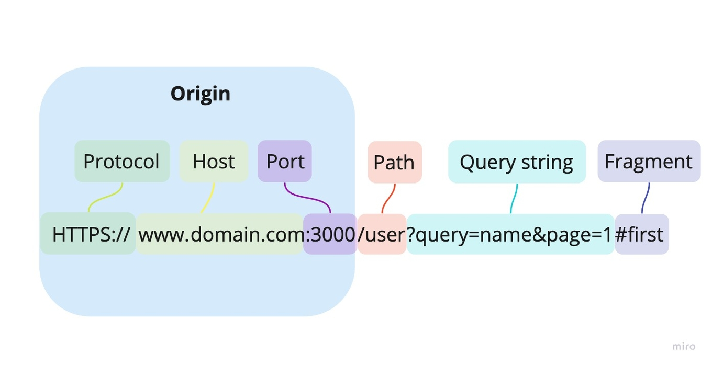
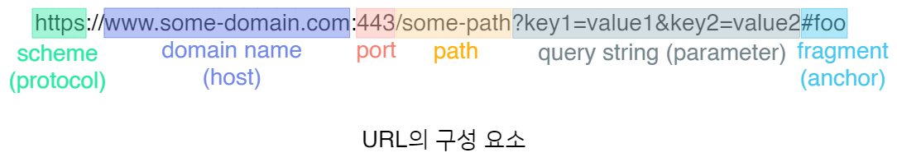

# Origin

 

## 목차
- [Origin](#origin)
  - [목차](#목차)
  - [**Origin**](#origin-1)
    - [Origin 구성 요소](#origin-구성-요소)
    - [URL](#url)
  - [Origin 판단](#origin-판단)
    - [**동일 Origin 알아보기**](#동일-origin-알아보기)
    - [**동일 origin X 예시**](#동일-origin-x-예시)

 

## **Origin**

SOP와 CORS에 대하여 이야기 하기 전에, 두 개념과 관련된 Origin = 출처에 대해 알아야 한다.

 

Origin (출처)은 리소스가 어디에서 왔는지를 식별하는 기준

웹 브라우저의 중요한 보안 정책인 동일 출처 정책(Same-Origin Policy, SOP)의 핵심 개념

 

### Origin 구성 요소

Origin는 프로토콜(Protocol or Scheme), 호스트(Host), 포트(Port)로 구성되어 있고 `모두 같아야 동일한 Origin`라고 말한다.

 

Origin은 URL의 다음 세 가지 요소의 조합으로 결정

1. **프로토콜 (Scheme):** 
    1. `http://`, `https://` 등
2. **호스트 (Host):** 
    1. `www.example.com`, `api.example.com`, `localhost` 등 
    2. 도메인 이름 또는 IP 주소
3. **포트 (Port):** 
    1. `:80`, `:443`, `:8080` 등 
    2. 명시되지 않으면 프로토콜의 기본 포트
    3. 예: `http`는 80, `https`는 443 사용

 

이 세 가지가 **모두** 같아야 '동일한 Origin'으로 간주

 

 

### URL

어떤 URL이 같은 Origin인지를 판단하려면?

→ URL의 구성 요소 중 프로토콜, 호스트, 포트가 모두 같은지 확인하면 된다.

 

URL의 구성 요소는 아래 그림과 같다

 

1. 스킴 (Scheme)

- **예시:**
    - `https://`
- **역할:**
    - 리소스에 접근하기 위해 사용할 프로토콜을 명시

 

2. 호스트 (Host)

- **예시:**
    - `www.example.com`
- **역할:**
    - 리소스가 위치한 **서버의 주소**
    - 도메인 이름이나 IP 주소 사용

 

3. 포트 (Port)

- **예시:**
    - `:8080`
- **역할:**
    - 서버 내에서 실행되는 여러 프로그램 중 **특정 프로그램을 구분하는 번호**

 

4. 경로 (Path)

- **예시:**
    - `/users/search`
- **역할:**
    - 호스트(서버) 내에서 리소스의 **구체적인 위치**를 나타내는 경로
- **특징:**
    - `'/'` 문자를 사용해 계층 구조로 표현됨

 

5. 쿼리 스트링 (Query String) / 파라미터

- **예시:**
    - `?name=test&page=1`
- **역할:**
    - 서버에 추가적인 데이터(파라미터)를 전달할 때 사용
- **특징:**
    - 경로(Path) 뒤에 `?` 문자로 시작
    - `key=value` 형태의 쌍으로 구성
    - 여러 개의 파라미터는 `&` 문자로 구분

 

6. 프래그먼트 (Fragment) / 앵커

- **예시:**
    - `#profile`
- **역할:**
    - 웹페이지 **내부의 특정 위치**를 가리키는 "책갈피" 역할
- **매우 중요한 특징:**
    - 프래그먼트( `#`와 그 뒤의 내용)는 **서버로 전송되지 않음**
    - 오직 클라이언트(브라우저)에서만 사용됨

 

## Origin 판단

### **동일 Origin 알아보기**

- `https://www.starbucks.co.kr`
- `http://www.starbucks.co.kr/`
    
    > 같은 리소스 가리키고 있지만 프로토콜이 다르므로 동일 origin X.
    > 

 

- `https://www.apple.com/kr/`
- `https://www.apple.com/kr/iphone/`
    
    > 다른 URL이지만, 경로만 다르고 프로토콜, 도메인, 포트가 모두 같으므로 동일 origin.
    > 

 

- `https://www.youtube.com/`
- `https://www.youtube.com/:443`
    
    > https의 기본 포트가 443이므로 동일 origin.
    > 

 

### **동일 origin X 예시**

- ❌ `프로토콜`이 다른 경우:
    - **http**://example.com
    - **https**://example.com

 

- ❌ `도메인`이 다른 경우:
    - https://**www.example.com**
    - https://**hello.example.com**

 

- ❌ `포트`가 다른 경우:
    - https://example.com:**8080**
    - https://example.com