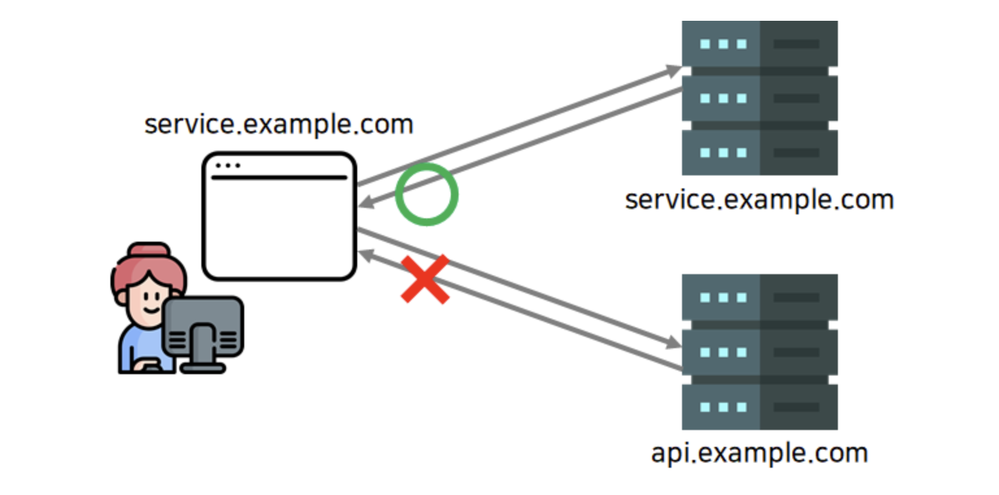
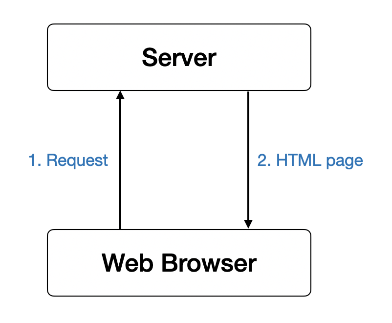
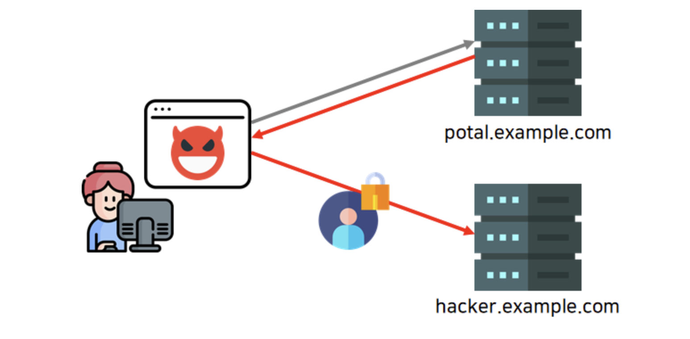

# SOP

 

## 목차
- [SOP](#sop)
  - [목차](#목차)
  - [**SOP**](#sop-1)
    - [개념](#개념)
  - [**SOP 생긴 이유**](#sop-생긴-이유)
  - [SOP가 없다면?](#sop가-없다면)

 

## **SOP**

### 개념

SOP는 `동일 출처 정책`으로 2011년 RFC 6454 문서에서 처음 등장한 보안 정책이다.

이 정책은 사용자를 CSRF등의 공격으로부터 보호하기 위해 1차적인 방어선으로 시행되었다.

 

origin이 서로 다른 `애플리케이션끼리 통신하는데 아무런 제약 없다면?` 

→ 악의적인 사용자가 공격을 통해 다른 사용자의 민감한 정보를 손쉽게 탈취할 수 있다.

 

그래서 어떤 origin에서 불러온 문서(document)나 스크립트(script)가 `다른 origin에서 가져온 리소스와 상호작용하는 것을 제한`하는 중요한 보안 방식이다.

쉽게 말해, 기본적으로 origin이 다를 경우 서로 간의 문서나 스크립트에 접근을 할 수가 없고 극히 제한적인 객체에만 접근이 가능하다.

 

`동일 출처(Same Origin)에서만 접근이 가능한 정책이다.`

웹 어플리케이션에서의 중요한 보안 모델이다.

자바스크립트 엔진 표준 스펙의 보안 규칙이다. 

 

## **SOP 생긴 이유**

도메인이 다르면 요청을 주고 받을 수 없게 하려는게 웹 브라우저의 기본 정책이였고 이것이 위의 SOP다.

과거 이전에 웹사이트의 구조는 아래와 같다.

예전 웹은 프론트엔드 레이어와 백엔드 레이어를 별도로 구성하지 않는 경우가 많았다. 

 

과거 웹의 흐름을 보면

- 유저가 웹 브라우저 주소창에 주소값을 입력을 하면 해당하는 서버로 요청이 보내진다.
- 그러면 서버에서는 응답을 할 때 HTML 페이지를 반환한다.
- 서버가 직접 요청 처리의 결과를 HTML 문서로 만들어 클라이언트에게 보낸다.

 

즉, `모든 처리가 같은 도메인 내에서 일어난다.`

하나의 서버에서 비즈니스 로직과 HTML 페이지 빌드를 같이 하는게 일반적이었다.

 

그래서 이전에는 `다른 origin으로 요청을 보내는 것을 악의적인 행위로 간주하는 것이 자연스러웠다.`

따라서 origin이 다른 곳으로 요청하는 것 자체를 브라우저 차원에서 막았던 것이다.

그래서 SOP가 생겼던 것이다.

 

## SOP가 없다면?

SOP가 없는 상황에서 악의적인 코드가 포함되어 있는 페이지에 접속하는 상황을 가정해보자. 

1. 사용자가 악성페이지에 접속하여 악의적인 코드가 실행됨
2. 사용자가 모르는 사이에 다른 포털사이트에 임의의 요청을 보내짐
3. 그 응답 값을 해커의 서버로 재차 보내 사용자의 소중한 개인정보가 탈취됨 

 

더 나아가 아래와 같은 일도 가능

1. 코드를 이용하여 사용자가 접속중인 내부망의 아이피와 포트를 스캐닝
2. 해커가 사용자 브라우저를 프록시처럼 사용
