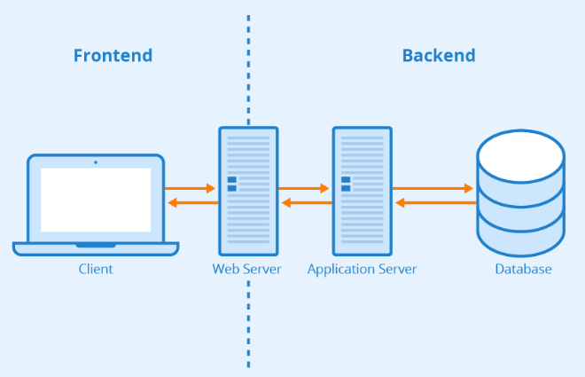
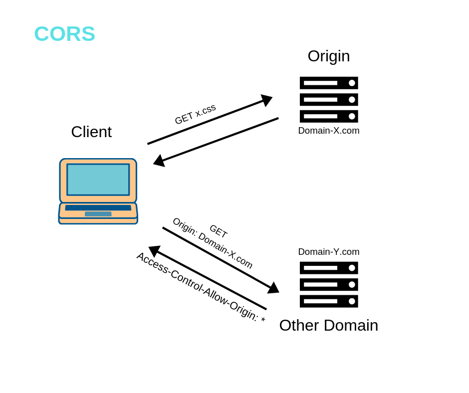
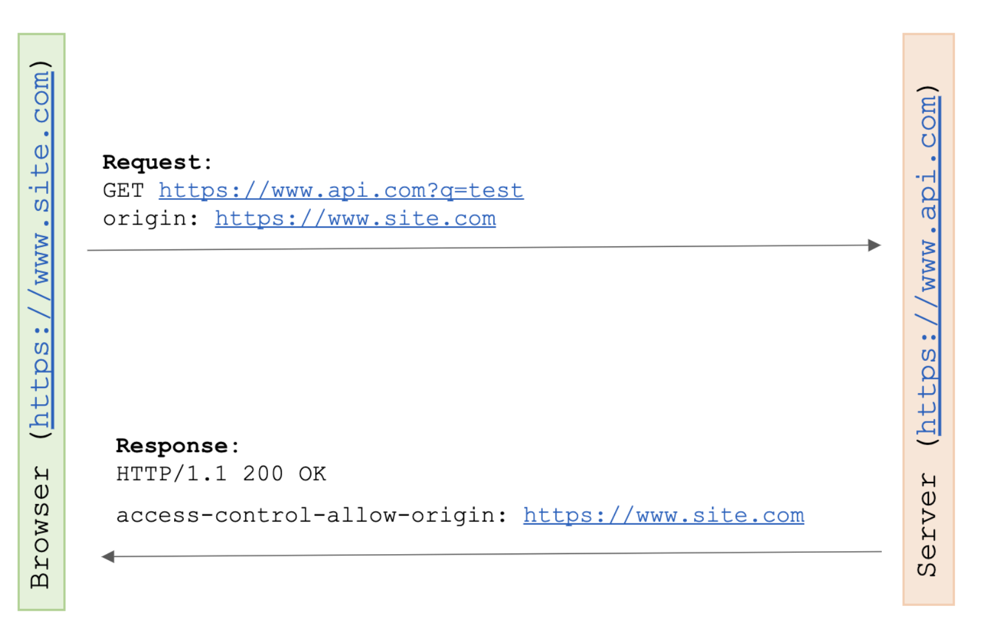
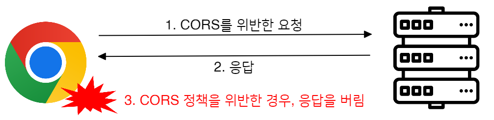
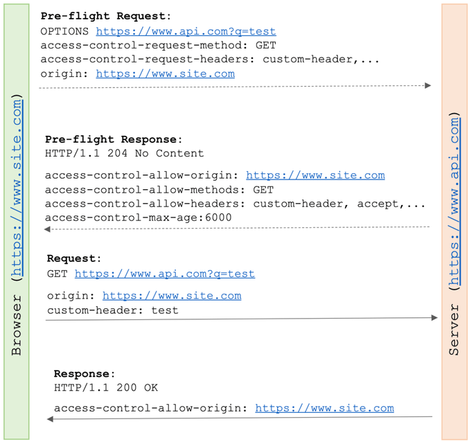

# CORS

<br>

## 목차
- [CORS](#cors)
  - [목차](#목차)
  - [**CORS 등장 배경**](#cors-등장-배경)
  - [**CORS**](#cors-1)
  - [**CORS 요청**](#cors-요청)
    - [**1️⃣ 간단한 요청(Simple Request)**](#1️⃣-간단한-요청simple-request)
    - [**2️⃣ 프리플라이트 요청(Preflighted request)**](#2️⃣-프리플라이트-요청preflighted-request)
    - [**3️⃣ 인증된 요청(Credentialed Request)**](#3️⃣-인증된-요청credentialed-request)
  - [**SOP와 CORS는 모두 브라우저의 정책**](#sop와-cors는-모두-브라우저의-정책)

<br>

## **CORS 등장 배경**

현재는 프론트엔드 레이어와 API 서버 레이어를 따로 구성하는 경우가 많다.

웹 프론트엔드 사이트 따로, 서버 사이트 따로 둔다는 의미이다.

이런 경우에 보통 웹 프론트엔드에서 다른 도메인에 위치한 API 서버로 요청을 넣어야 하는 상황이 생긴다.



<br>

하지만 과거에는 이런 기능이 당연하게 제공하지 않았다.

시간이 지남에 따라 웹사이트에서 할 수 있는 일이 많아졌다. 

`자연스럽게 다른 origin으로 요청하고 응답 받는 수요가 증가`했다.

<br>

이런 상황들이 많아져, 기존 웹브라우저 보안 정책인 SOP에 대해 불편한 점들이 조금씩 생기기 시작했다.

다른 출처의 자원을 사용할 수 없는 SOP 정책은 악의적인 사이트가 다른 사이트의 정보를 읽을 수 없게 된다는 장점이 있지만, `유효한 요청 또한 막아버린다`는 단점도 있다.

<br>

그래서 결국엔 웹 브라우저에서 공식적인 루트를 열어준 것이 바로 `CORS`다.

W3C(월드 와이드 웹을 위한 표준을 개발하고 장려하는 조직)는 조금 더 안전한 웹 통신을 할 수 있도록 CORS라는 정책을 내 놓았다.

<br>

출처가 다른 리소스를 사용할 수 있도록 하는 `몇 가지 예외 조항`이 있는데, 그중 하나가 바로 `CORS 정책을 지킨 리소스 요청`. 

다시 말해서 CORS 정책을 지킨다면 SOP에서 기본적으로 제한하고 있는 행위들의 적용을 받지 않게 된다는 의미다.

<br>

## **CORS**

CORS는 `교차 출처 리소스 공유`다.

한 origin에서 실행중인 웹 어플리케이션이 다른 origin(cross-origin)의 선택한 자원에 접근할 수 있는 권한을 부여하도록 브라우저에 알려주는 정책이다.

쉽게 말해, `서로 다른 도메인간에 자원을 공유하는 것`을 의미한다.

<br>

서버가 HTTP 응답 헤더라는 "허가증"을 실어 **브라우저**에게 보냄

"이 출처(프론트엔드)는 안전하니 SOP 정책을 잠시 풀어주고 데이터를 읽어갈 수 있게 허락해 줘"라고 알려주는 규칙(정책)

<br>

CORS 정책은 요청/응답 할 때 포함되어야 하는 특정 HTTP 헤더를 정의한다.

**다른 origin의 리소스를 불러오려면 그 origin에서 올바른 CORS 헤더를 포함한 응답을 반환해야 한다.**

**허용된 origin을 서버가 명시해놓으면, origin이 다르더라도 요청과 응답을 주고 받을 수 있도록 한 것이다.**

<br>

일반적으로 이 CORS 세팅을 직접 할 일은 거의 없고, 웹 프론트엔드에서 요청 넣을 때 CORS 옵션만 넣어주면 요청 헤더까지 알아서 다 넣어준다.

웹 서버에서도 마찬가지로, 간단한 옵션을 통해서 CORS를 켜고 끌 수 있게 구성을 해두었다.

<br>

프론트의 경우에는 Request Header에 CORS 관련 옵션을 넣어주면 된다. 

서버의 경우에는 Response Header에 프론트의 요청을 허용한다는 내용을 넣어주면 된다.



<br>

## **CORS 요청**

CORS가 동작하는 시나리오는 크게 `세 가지`로 나뉜다.

이들을 각각 보자.

<br>

### **1️⃣ 간단한 요청(Simple Request)**



- Simple Request는 서버에게 바로 요청을 보내는 방법이다.
    - `일단 요청 보내고` 응답 받은 뒤 해당 요청이 CORS를 만족하는지 체크하는 것이다.

<br>

- 브라우저는 다른 origin으로 요청을 보낼 때 자동으로 HTTP 헤더에 origin 헤더를 추가하여 보낸다.

<br>

- 서버는 요청된 데이터로 응답한다.
- 그리고 응답에 요청에서 받은 origin 헤더 값으로 설정된 **access-control-allow-origin** 헤더 포함한다.
    - **access-control-allow-origin** 헤더
        - 서버가 허용할 요청을 표시하는 데 사용할 수 있는 기본 CORS 헤더 중 하나이다.
        - 이 `헤더에는 허가된 origin 정보가 담겨있다.`
        - 모든 곳에서 CORS를 허용하기 위해서는 모두를 의미하는 *를 입력하면 된다.

<br>

- 브라우저는 access-control-allow-origin 헤더를 확인해서 CORS 동작을 수행할지 판단한다.
    - 안전한 경우
        - 아래 1번 값이 2번 값에 포함된 경우  해당 `요청을 안전하다고 간주`하고 응답을 가져온다.
            1. 브라우저는 요청의 origin 헤더에 담긴 origin 정보 
            2. 응답의 **access-control-allow-origin** 헤더 정보
    - 안전하지 않은 경우
        - 아래의 경우 브라우저는 `응답을 임의로 파기하고 응답이 스크립트로 다시 전달되는 것을 방지`한다.
            - 서버가 access-control-allow-origin `헤더로 응답하지 않은 경우`
            - access-control-allow-origin `헤더 값이 요청 원본과 일치하지 않는 도메인`인 경우



<br>

**✅ Simple Request를 보내기위한 조건**

아래 조건을 모두 만족하여야 simple request다.

1. 요청 메서드가 **GET, HEAD, POST** 중 하나여야한다.
2. 아래와 같은 **User-Agent** 헤더 또는 **CORS Safelisted** 헤더만 전송하고 이것들을 제외한 헤더를 사용하면 안된다.
    1. Accept, Accept-Language, Content-Language, Content-Type 
    2. DPR, Downlink, Save-Data, Viewport-Width, Width
3. Content-Type 헤더는 다음 중 하나를 사용해야 한다.
    1. **application/x-www-form-urlencoded, multipart/form-data, text/plain** 
4. ReadableStream 개체를 사용하지 않는다.
5. XMLHttpRequest.upload에 연결된 이벤트 리스너가 없다

> 하지만, 일반적으로 Content-Type이 application/json인 경우가 굉장히 많다.
> 
> 
> 또한, 사용자 인증을 위해서 Cookie 혹은 Autorization와 같은 추가 헤더를 사용하기 때문에 단순 요청의 조건을 맞추기는 쉽지 않다.
> 

<br>

### **2️⃣ 프리플라이트 요청(Preflighted request)**

브라우저는 모든 요청에 대해 Preflight를 보내진 않는다. 

`GET` 같은 단순한 조회 요청(= 위의 **Simple Request**라 부름)은 그냥 보낸다.

<br>

하지만 복잡한 요청 (= Non-Simple Request)에 대해서만 Preflight Request라는 사전 허락 절차 밟는다. 

복잡한 요청에는 아래와 같은 경우가 있다. 

- 서버의 데이터에 영향을 줄 수 있는 경우 (예: `PUT`, `DELETE`)
- 특별한 헤더를 포함하는 경우



<br>

**preflight request**

- 실제 요청을 보내기 전에 브라우저는 `이러한 유형의 요청을 허용하는지` 서버에 확인하는 요청이다.
- 본 요청에 앞서, OPTIONS HTTP 메서드로 요청이 보내진다.
- 해당 메서드를 통해 실제 요청을 전송할지 판단한다.
- 실행 전 요청은 다음 헤더를 포함한다.
    
    ```
    origin : 서버에 요청이 오는 출처를 알려준다.
    
    access-control-request-method : 요청이 구현하는 HTTP 메서드를 서버에 알려준다.
    
    access-control-request-headers : 요청이 포함된 헤더를 서버에 알려준다.
    ```

<br>    

실제 요청 이전에 ***'이런 메소드와 헤더로 요청을 보낼 예정인데, 너희 서버 CORS 정책에서 허용하는 요청이니?'*** 라고 브라우저가 서버에게 미리 물어보는 절차다.

<br>

**preflight response**

- 이에 대한 응답으로 서버는 응답에 아래의 헤더들을 포함해 `이 origin에서 어떤 종류의 요청을 수락할지 여부를 결정`할 수 있다.
- Allow 항목들은 클라이언트가 보낸 헤더의 request에 대응되는 것으로, 서버가 허용하는 메서드와 헤더를 응답하는데 사용된다.
- Request랑 Allow가 일치하면 CORS 요청이 이루어진다.
    
    ```
    access-control-allow-origin : 서버가 허용할 origin
    
    access-control-allow-methods : 서버에서 허용할 쉼표로 구분된 메서드 목록
    
    access-control-allow-headers : 서버에서 허용하는 쉼표로 구분된 헤더 목록
    
    access-control-max-age : 실행 전 요청에 대한 응답 캐시하는 시간(초) 브라우저에 알려준다.
    ```
    
<br>

Preflight 요청 때문에 실제 요청은 한번이지만 두번의 요청을 보내야하는 일이 발생한다.

Preflight 캐시 기간을 보내는 이유는 Preflight로 발생하는 이런 오버헤드를 줄이기 위함이다.

<br>

`preflight 요청의 성공, 실패 여부와 CORS 위반 여부는 상관이 없다.`

CORS 정책 위반 여부를 판단하는 것은 preflight 응답 받은 이후다.

브라우저는 위 Simple Request와 동일하게 Access-Control-Allow-Origin 헤더를 확인해서 CORS 정책 위반 여부를 판단한다.

<br>

**❓ 왜 Preflight 요청을 해야할까?**

위에서 이야기한 것 처럼 CORS는 **서버가 아닌 브라우저 구현 스펙에 포함된 정책**이다.

따라서 서버는 CORS 위반 여부와 상관없이 일단 요청이 들어오면 처리를 하고 응답을 보낸다.

<br>

그 응답을 받은 브라우저가 응답 헤더를 확인하고 응답의 파기 여부를 결정하게 된다.

`GET`과 `HEAD`와 같은 요청은 단순 조회를 하기 때문에 상관없지만, `POST`, `PUT`, `DELETE`와 같은 메서드는 서버에 **부작용 (Side Effect) 을 야기할 수 있다.**

<br>

이는 응답이 유효하지 않아 파기한 브라우저의 의사와 상관없이 발생한다.

Preflight는 실제 요청이 CORS를 위반하지 않았는지를 미리 확인하고, 부작용으로부터 서버를 보호하기 위해 전송한다.

<br>

또 Preflight 요청을 통해 서버는 요청이 실행되기 전에 검사하고 허용 여부를 표시할 기회를 얻을 수 있기 때문이다.

그리고 서버가 다른 출처에서 허용하지 않는 특정 요청을 차단함으로써 서버를 보호하는데 도움을 준다.

<br>

### **3️⃣ 인증된 요청(Credentialed Request)**

credentialed request는 `인증 정보를 포함해서 요청을 보내는 경우`다.

쿠키, 토큰과 같이 사용자 식별 정보, 인증 정보가 담긴 요청에 대해서는 조금 더 엄격하게 처리한다.

`credential은 이런 쿠키와 같은 인증 정보다.`

인증 관련 헤더를 포함할 때 사용하는 요청이다.

<br>

클라이언트는 요청을 보낼 때 credentials 옵션을 별도로 설정해줘야 한다.

credentials 옵션에는 3개의 값이 존재하는데 아래와 같다.

- `same-origin`: 기본값으로, 같은 출처 간 요청에만 인증 정보를 포함한다.
- `include`: 다른 출처에 요청하는 경우에도 항상 인증 정보를 포함하도록 한다.
- `omit`: 인증 정보를 절대 포함하지 않도록 한다.

<br>

서버는 응답할 때 `Access-Control-Allow-Credentials` 라는 헤더를 `true`로 설정해줘야한다.

이때, `Access-Control-Allow-Origin`은 와일드카드 = `‘*’가 될 수 없으며`, 명확한 origin 명시해줘야한다.

<br>

## **SOP와 CORS는 모두 브라우저의 정책**

다른 출처의 리소스를 사용하는 것을 제한하는 것은 서버가 아니라 브라우저라는 점에 주목해야 한다. 

서버는 정상적으로 요청을 받아 응답하지만, 이후 응답을 받은 브라우저에서 이를 분석하여 CORS 정책을 위반한 경우라면 이를 차단하는 것이다. 

이와 같은 이유로, 브라우저에선 CORS 정책으로 인해 차단되는 요청도 Postman과 같이 브라우저가 아닌 환경(혹은 서버 끼리 통신)에선 통신이 원활하게 이뤄질 수 있다.