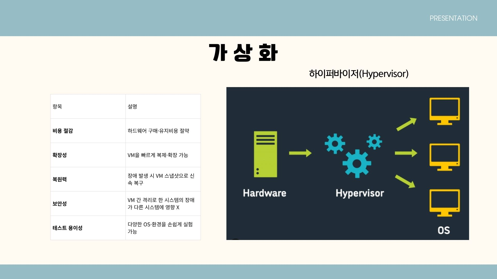
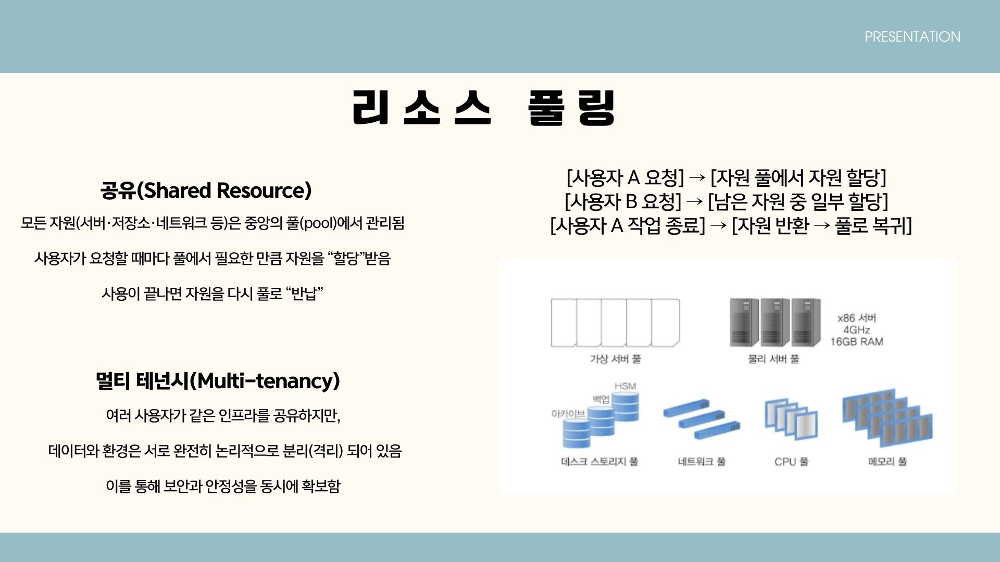
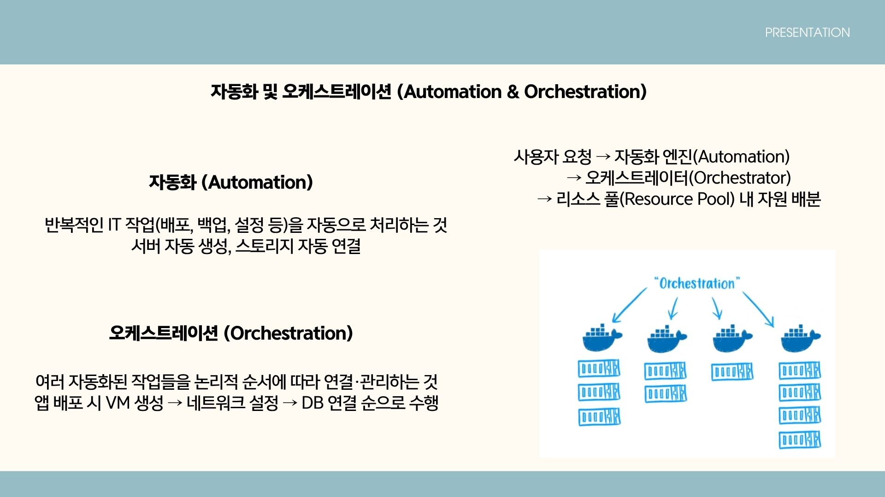
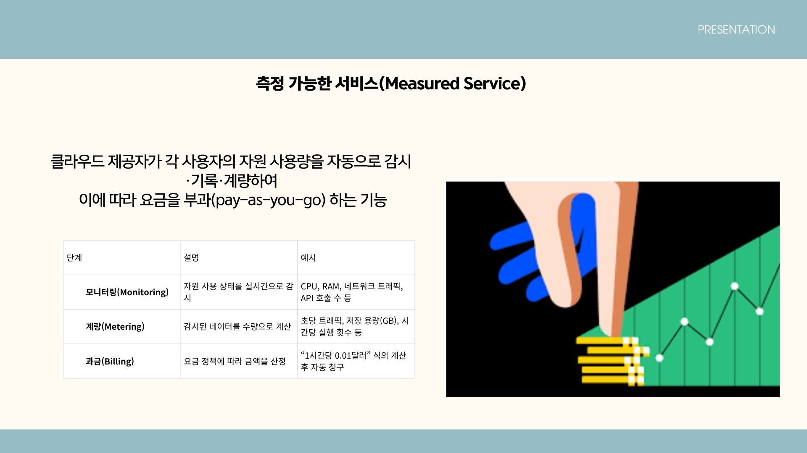
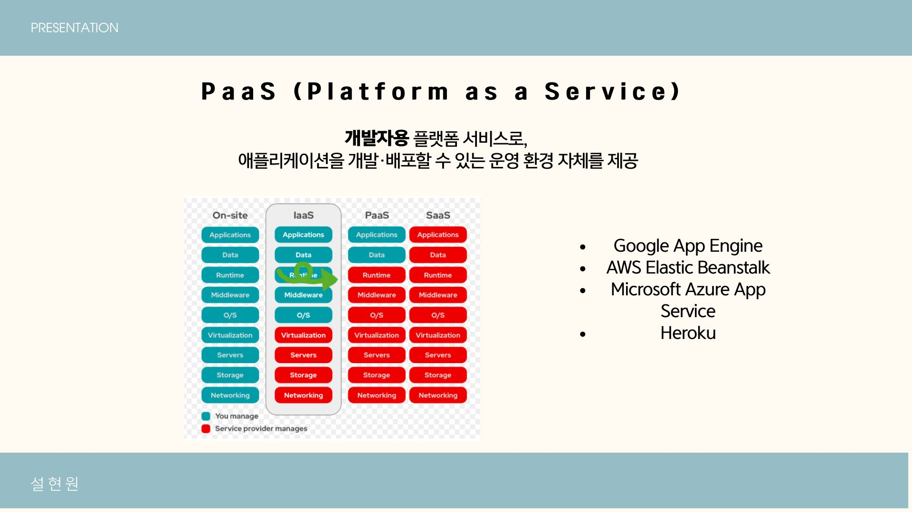
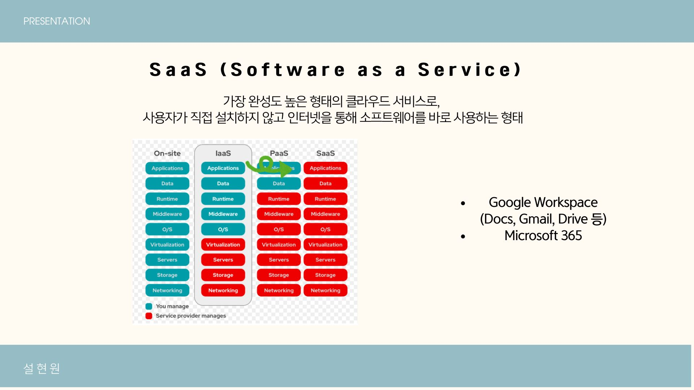
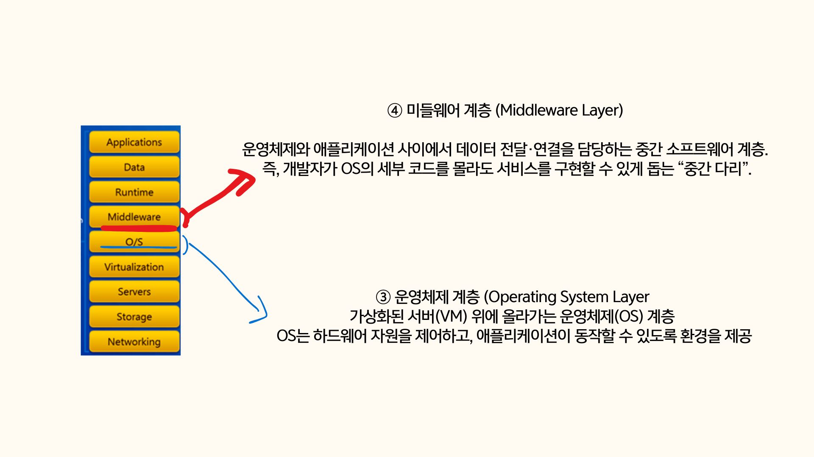
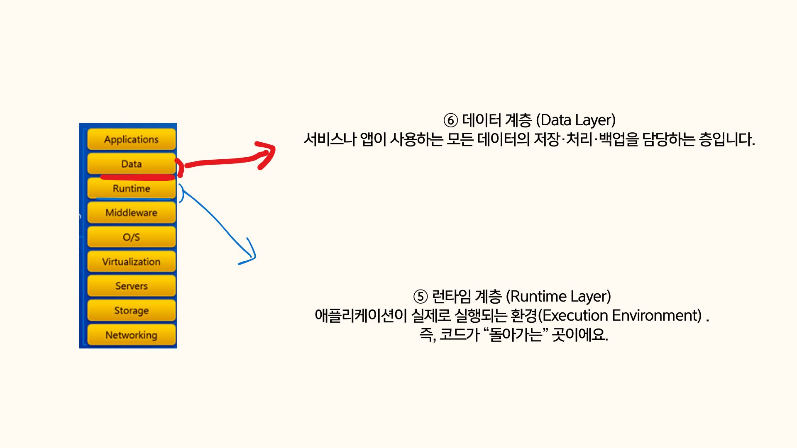
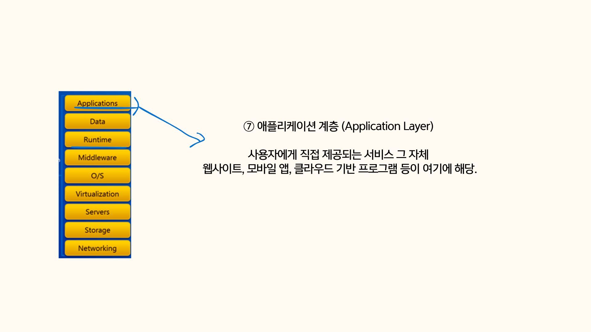

# ☁️ 클라우드 컴퓨팅(Cloud Computing)

## 🪄 1. 클라우드 컴퓨팅이란?

**클라우드 컴퓨팅(Cloud Computing)** 은  
인터넷을 통해 서버, 저장소, 네트워크, 데이터베이스, 소프트웨어 등  
IT 자원을 **필요한 만큼 빌려 쓰는 기술 및 서비스 체계**입니다.

> "내 컴퓨터가 아닌, 인터넷 속의 거대한 컴퓨터를 사용하는 시대."

과거에는 물리 서버를 직접 구입·설치해야 했지만,  
이제는 몇 번의 클릭으로 데이터센터급 자원을  
몇 초 만에 빌려 쓸 수 있습니다.

---

## ☁️ 2. 클라우드의 등장 배경

| 시대 | 방식 | 특징 |
|------|------|------|
| **전통적 컴퓨팅 (On-Premise)** | 직접 서버 구매 및 유지 | 비용 높고, 확장 어려움 |
| **가상화 시대** | 물리 서버를 여러 VM으로 분리 | 자원 활용률 향상 |
| **클라우드 시대** | 인터넷 기반 자원 임대 | 확장성, 유연성, 경제성 확보 |

**등장 배경 요약**
- 물리 서버의 **낭비되는 자원 활용률 문제**
- **빠른 서비스 배포**와 **글로벌 확장** 요구
- **비용 절감 + 유연성 + 자동화**라는 3가지 핵심 가치

---

## ⚙️ 3. 클라우드의 5대 핵심 원리

| 원리 | 설명 | 예시 |
|------|------|------|
| **가상화 (Virtualization)** | 물리적 자원을 여러 가상 자원으로 분할해 효율적으로 활용 | 하나의 서버 → 여러 VM 운영 |
| **리소스 풀링 (Resource Pooling)** | 여러 사용자가 자원을 공유하되 논리적으로 분리 | 데이터센터의 공용 자원 풀 |
| **자동화 및 오케스트레이션** | 인프라 생성·배포·확장을 자동화 | Kubernetes, Terraform |
| **탄력적 확장성 (Elasticity)** | 수요에 따라 자원을 자동 조절 | Auto Scaling |
| **측정 가능한 서비스 (Measured Service)** | 사용량 기반의 정밀한 과금 | Pay-as-you-go 모델 |

---

## 🧩 4. 가상화 (Virtualization)

클라우드의 출발점은 **가상화 기술**입니다.  
가상화는 하나의 물리 서버를 **논리적으로 여러 대의 가상 서버(VM)** 로 나누는 기술이에요.

### ▶ 하이퍼바이저(Hypervisor)

**하이퍼바이저**는 물리 하드웨어를 관리하고  
여러 가상 머신이 자원을 나눠 쓸 수 있도록 하는 핵심 소프트웨어입니다.

| 구분 | 설명 | 대표 기술 |
|------|------|------------|
| **Type 1 (베어메탈형)** | 하드웨어 위에 직접 설치되어 VM 제어 | VMware ESXi, KVM, Hyper-V |
| **Type 2 (호스트형)** | 기존 OS 위에 설치되어 VM 실행 | VirtualBox, Parallels |

**장점**
- 자원 효율성 향상 (서버 활용률 증가)
- 장애 격리 및 보안 강화
- 새로운 환경(테스트/개발) 즉시 생성 가능

---

## 🧠 5. 리소스 풀링 (Resource Pooling)

클라우드 제공자는 모든 서버, 저장소, 네트워크를 하나의 **자원 풀(Pool)** 로 통합하여 관리합니다.

> 사용자는 자신만의 서버를 쓰는 것처럼 느끼지만,  
> 실제로는 거대한 풀에서 일부 자원만 ‘임시로’ 사용하는 것.

### ▶ 핵심 개념
- **공유 자원 (Shared Resource)**: 필요 시 자원을 자동 할당/회수
- **멀티테넌시 (Multi-tenancy)**: 여러 고객이 하나의 인프라를 논리적으로 분리해 사용

| 구성 요소 | 역할 |
|------------|------|
| **오케스트레이터** | 자원 자동 배분 (예: Kubernetes, OpenStack Nova) |
| **로드밸런서** | 트래픽을 여러 서버에 분산 |
| **가상 네트워킹(SDN)** | 각 사용자의 네트워크를 격리 |
| **리소스 스케줄러** | 정책에 따라 자원 자동 할당 |

---

## 🤖 6. 자동화와 오케스트레이션

자동화는 “손 안 대고 일 시키는 것”  
오케스트레이션은 “그 일들을 조율해 하나의 목표를 완성시키는 것”

### 📡 예시 시나리오
1. 오케스트레이터가 ‘웹 서버 3대 추가 요청’을 감지  
2. 자동화 엔진이 VM 생성  
3. 네트워크 설정 및 로드밸런싱 자동 적용  
4. 모니터링 시스템에 등록 완료  

→ **몇 초 만에 자동 확장 완료**

### 대표 기술 스택
- **자동화 도구**: Ansible, Terraform, Chef  
- **오케스트레이션**: Kubernetes, Docker Swarm  
- **모니터링**: Prometheus, Grafana

---

## ⚡ 7. 유연한 확장성 (Elasticity)

> “필요할 때만 늘리고, 필요 없으면 줄이는”  
> **스마트한 자원 운영 원리**

| 구분 | 온프레미스 | 클라우드 |
|------|-------------|-----------|
| 자원 확보 | 미리 서버 구매 | 즉시 확장 가능 |
| 비용 | 항상 최대 용량 유지 → 낭비 | 사용량만큼 과금 |
| 반응 속도 | 느린 수동 확장 | 자동 감지 후 즉시 확장 |
| 확장 방식 | 물리 장비 추가 | Auto Scaling 정책 기반 |

### 예시 흐름
1️⃣ CPU 사용률 80% 초과 감지  
2️⃣ Auto Scaling 정책에 따라 서버 2대 추가  
3️⃣ 로드밸런서가 트래픽 분산  
4️⃣ 부하 감소 시 서버 자동 종료  

**Scale-up**: 서버 성능을 늘리는 방식  
**Scale-out**: 서버 대수를 늘리는 방식 → 클라우드에서 더 선호됨

---

## 💰 8. 측정 가능한 서비스 (Measured Service)

클라우드는 모든 사용량을 자동 측정하고 비용으로 환산합니다.  
이는 클라우드의 **투명성·효율성·책임성**을 보장합니다.

| 서비스 | 과금 기준 | 예시 |
|----------|-------------|------|
| **AWS EC2** | 인스턴스 시간 | 초 단위 과금 |
| **GCP Storage** | 저장 용량 | GB 단위 과금 |
| **Azure Functions** | 실행 횟수 | 100만 회 기준 |
| **OpenAI API** | 토큰 수 | 입력·출력 토큰 단위 |
| **Netflix CloudWatch** | 로그 수집량 | GB 단위 요금 |

---

## 🏗️ 9. 클라우드 계층 구조

| 계층 | 구성 요소 | 예시 |
|------|------------|------|
| **물리 인프라** | 서버, 스토리지, 네트워크, 전력 | Dell, Cisco |
| **가상화 계층** | 하이퍼바이저, VM | VMware, KVM |
| **운영체제** | OS 환경 | Linux, Windows Server |
| **미들웨어** | DB, WAS, MQ | MySQL, Tomcat, Kafka |
| **런타임** | 언어·프레임워크 환경 | JVM, Node.js, Docker |
| **데이터 계층** | DB·스토리지·캐시 | S3, DynamoDB, Redis |
| **애플리케이션** | 실제 서비스 | Gmail, Zoom, Slack |

---

## 🧱 10. 클라우드 서비스 모델 비교

| 구분 | **IaaS** | **PaaS** | **SaaS** |
|------|-----------|-----------|-----------|
| 정의 | 인프라를 빌려씀 | 플랫폼을 빌려씀 | 소프트웨어를 빌려씀 |
| 사용 예 | AWS EC2, Google Compute | Heroku, AWS Beanstalk | Gmail, Notion, Zoom |
| 사용자 대상 | 시스템 관리자 | 개발자 | 일반 사용자 |
| 관리 책임 | OS·보안·패치 직접 | 앱 개발만 담당 | 없음 |
| 장점 | 유연성·자유도 | 생산성 향상 | 유지보수 불필요 |
| 단점 | 관리 복잡 | 플랫폼 종속 | 커스터마이징 제한 |

### 🧩 IaaS 예시

- AWS EC2 / Google Compute Engine / Azure VM  
- 직접 OS 설치, 방화벽 설정, 보안 관리 수행

### 💡 PaaS 예시

- Google App Engine / AWS Elastic Beanstalk / Heroku  
- 코드만 올리면 자동 빌드·배포

### 💼 SaaS 예시

- Slack / Zoom / Gmail / Google Drive  
- 로그인만으로 사용, 업데이트 자동화

---

## 🔐 11. 클라우드 보안 (Cloud Security)

클라우드 보안은 “책임 공유 모델(Shared Responsibility Model)”에 따라 나뉩니다.

| 구분 | 사용자 책임 | 제공자 책임 |
|------|---------------|---------------|
| **IaaS** | OS·데이터·계정 관리 | 인프라, 하드웨어 |
| **PaaS** | 애플리케이션 코드 | 런타임·네트워크 |
| **SaaS** | 접근 제어·비밀번호 | 전체 시스템 |

**보안 주요 기술**
- 데이터 암호화 (AES, RSA)
- 접근 제어 (IAM)
- 로그 모니터링 (CloudTrail)
- 침입 탐지 (IDS/IPS)
- 인증/인가 (OAuth, SAML)

---

## 🌎 12. 클라우드의 유형

| 유형 | 설명 | 예시 |
|------|------|------|
| **퍼블릭 클라우드** | 누구나 인터넷으로 접근 | AWS, Azure, GCP |
| **프라이빗 클라우드** | 특정 기업 전용 환경 | OpenStack, VMware vCloud |
| **하이브리드 클라우드** | 온프레미스 + 퍼블릭 혼합 | Azure Arc, AWS Outposts |
| **멀티 클라우드** | 여러 클라우드 병행 운영 | GCP + AWS + Azure |

---

## 🧭 13. 대표 클라우드 서비스 사례

- **Netflix**: AWS 기반 글로벌 스트리밍, 자동 확장 구조  
- **Spotify**: Google Cloud로 이전, AI 추천 시스템 강화  
- **카카오**: 프라이빗 클라우드 + 퍼블릭 클라우드 병행  
- **정부 G-클라우드**: 공공기관용 보안 클라우드 플랫폼  

---

## 🚀 14. 클라우드의 장점과 한계

| 장점 | 설명 |
|------|------|
| 비용 효율성 | 초기 투자비용 없음 (OPEX 중심) |
| 유연성 | 트래픽 변화에 따른 자원 자동 조정 |
| 글로벌 확장 | 전 세계 리전에 즉시 배포 가능 |
| 안정성 | 고가용성(HA) 및 장애 자동 복구 |
| 지속적 업데이트 | 최신 기술 자동 반영 |

| 한계 | 설명 |
|------|------|
| 보안 리스크 | 외부 제공자 의존 |
| 종속성 | 특정 벤더(Vendor Lock-in) |
| 법적 규제 | 데이터 국외 저장 이슈 |
| 성능 편차 | 네트워크 지연 발생 가능 |

---

## 🔮 15. 최신 트렌드

| 트렌드 | 설명 |
|--------|------|
| **컨테이너(Container)** | Docker, Podman 등 경량화된 가상화 방식 |
| **서버리스(Serverless)** | 서버 관리 없이 함수 단위로 실행 (AWS Lambda) |
| **엣지 컴퓨팅(Edge)** | 데이터가 생성된 근처에서 처리 |
| **멀티 클라우드 전략** | AWS+Azure+GCP 병행으로 리스크 분산 |
| **클라우드 네이티브** | 클라우드 환경에 최적화된 애플리케이션 설계 패턴 |

---

## 🧾 16. 결론

클라우드 컴퓨팅은 단순한 인프라 임대가 아니라,  
**IT 자원의 민주화**이자 **디지털 전환(DX)의 핵심 엔진**입니다.

> “필요한 만큼, 필요한 순간에, 필요한 곳에서 컴퓨팅을 공급한다.”

---

## 📚 17. 참고 키워드

- **Hypervisor / VM / Container / Kubernetes**
- **Multi-tenancy / SDN / Load Balancing**
- **Auto Scaling / Serverless / Cloud Security**
- **IaaS / PaaS / SaaS / Hybrid Cloud**
- **Terraform / Ansible / OpenStack / AWS Lambda**

