# HTTP 버전

## 월드 와이드 웹의 발명

- 1989년 CERN에서 일하고 있던 Tim Berners-Lee는 인터넷을 통한 하이퍼텍스트 시스템을 제안함
- 1990년 구현 도중 Mesh에서 월드 와이드 웹으로 이름을 변경함
- TCP, IP 프로토콜 기반으로 만들어짐
- HTTP, HTML, 브라우저(월드 와이드 웹), 웹 서버(httpd)로 구성됨

## HTTP/0.9

- 1991년에 등장한 HTTP 초기버전으로 버전 번호가 없었으나 나중에 HTTP/0.9라고 불리게 됨

### 특징

- **단순한 요청과 응답(One-Line Protocol)**

  - 요청은 단일 라인으로 구성됨 (`GET /path`)
  - 리소스에 대한 경로로 가능한 메서드는 `GET`이 유일함
  - 서버에 연결된 후 전체 URL이 아닌 원하는 리소스의 경로만 요청하여 하나의 서버가 하나의 웹 사이트만 운영할 수 있음
  - 응답은 HTML 파일 내용 자체로만 구성됨

- **HTTP 헤더 부재**

  - 요청과 응답에 메타데이터가 없음
  - HTTP 헤더가 없어 `Content-Type`, 캐싱, 쿠키 등을 지정할 수 없어 HTML 파일만 전송가능하므로 CSS, 이미지 등 다른 유형의 문서는 전송될 수 없음

- **상태 코드 부재**
  - 상태코드가 없어 서버의 응답이 성공했는지 실패했는지 바로 판단할 수 없음
  - 만약 문제가 생겼다면 HTML 파일 내부에 문제에 대한 설명이 추가됨

### 한계

- 다양한 파일을 전송할 수 없어 멀티미디어 웹 페이지를 구성하는데 한계가 있음
- 연결은 매 요청마다 연결을 맺고 종료되어 리소스를 요청해야 할 때마다 연결-해제 과정을 반복해야 하기에 성능이 낮음
- 헤더가 없어 쿠키를 이용한 세션 관리, 캐싱을 통한 성능 최적화 등의 기능을 구현할 수 없음
- 상태 코드가 없어 클라이언트가 자동으로 오류를 인지하고 대처하기 어려움

### 예시

```
[요청]

GET /mapage.html
```

```
[응답]

<html>
  A very simple HTML page
</html>
```

## HTTP/1.0

- HTTP/0.9의 단순함을 벗어나 현대적인 웹 통신의 기틀을 마련한 1996년에 발표된 프로토콜

### 특징

- **버전 번호 명시**

  - 각 요청의 시작 줄에 버전 정보가 포함되어 전송됨
  - `GET /index.html HTTP/1.0`

- **HTTP 헤더 도입**

  - 요청과 응답에 메타데이터를 담는 헤더가 추가됨
  - `Content-Type` : HTML뿐만 아니라 이미지, CSS 등 다른 미디어 타입을 명시하여 전송할 수 있음
  - `User-Agent` : 클라이언트의 정보를 서버에게 알려줌
  - `Server` : 서버의 정보를 클라이이언트에게 알려줌
  - HTTP 헤더 개념이 도입되어 메타데이터 전송이 가능해짐 (요청 헤더, 응답 헤더)

- **상태 코드 도입**

  - 브라우저가 요청에 대한 성공과 실패를 알 수 있고 그 결과에 대한 동작을 할 수 있게 됨
  - `200 OK`, `404 Not Found`, `301 Moved Permanently`

- **메서드 추가**
  - `GET` 메서드 이외에도 `POST`, `HEAD` 메소드도 사용할 수 있게 됨

### 한계

- **Short-lived-Connections**

  - 하나의 요청마다 새로운 TCP 연결을 맺고 응답 후 바로 끊는 방식
  - 하나의 웹 페이지는 여러개의 이미지와 파일로 구성되기에 각 파일을 받을 때 마다 TCP 연결을 새로 맺고 끊는 과정이 반복됨
  - 매번 새로운 연결을 해야 하기에 비효율적이며 오버헤드가 발생하여 성능이 저하됨

  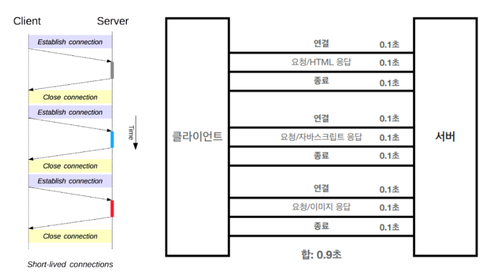

### 예시

```
[요청]

GET /mypage.html HTTP/1.0
User-Agent: NCSA_Mosaic/2.0 (Windows 3.1)

200 OK
Date: Tue, 15 Nov 1994 08:12:31 GMT
Server: CERN/3.0 libwww/2.17
Content-Type: text/html

<HTML>
A page with an image
  
</HTML>
```

```
[응답]

GET /myimage.gif HTTP/1.0
User-Agent: NCSA_Mosaic/2.0 (Windows 3.1)

200 OK
Date: Tue, 15 Nov 1994 08:12:32 GMT
Server: CERN/3.0 libwww/2.17
Content-Type: text/gif
(image content)
```

## HTTP/1.1

- HTTP/1.0의 성능 문제를 해결하기 위해 1997년 초에 발표된 프로토콜

### 특징

- **지속 연결(Persistent Connection)**
  - 한번 맺은 TCP 연결을 명시적으로 닫기 전까지 계속 재사용함
  - TCP 연결을 새로 맺는 데 드는 시간과 서버의 부하가 감소하여 성능이 향상됨
- **파이프라이닝(Pipelining)**

  - 지속 연결을 전제로 클라이언트가 이전 요청에 대한 응답을 기다리지 않고 연속해서 여러 요청을 보낼 수 있게 함
  - 여러 요청을 연속적으로 보내 그 순서에 맞춰 응답을 받는 방식으로 지연 시간을 줄일 수 있음

  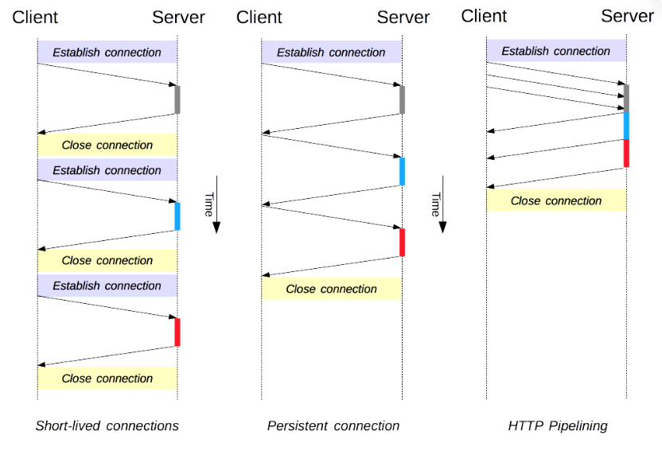

- **Host 헤더 의무화**

  - `Host` 헤더를 사용하면 동일 IP 주소에 다른 도메인을 호스트하는 기능이 가능해짐
  - 하나의 서버에서 여러 도메인 이름의 웹 사이트를 운영하는 가상 호스팅 서비스가 가능해짐
  - 클라이언트는 요청시 웹사이트의 주소를 반드시 명시해야 서버는 어떤 사이트인지 구분할 수 있음

- **캐시 관리**

  - `Cache-Control` 헤더를 도입하여 유연한 캐시 정책 설정이 가능해짐

- **메서드 추가**
  - `PUT`, `PATCH`, `DELETE`, `OPTION` 등 메서드도 사용할 수 있게 됨

### 한계

- **HOL (Head-of-Line) Blocking**

  - 요청과 응답이 순차적으로 처리되어야 하기 때문에 하나의 무거운 요청이 다른 모든 요청을 지연시키는 병목 현상이 발생함
  - 이 문제가 발생하여 대부분의 브라우저에서 비활성화됨

  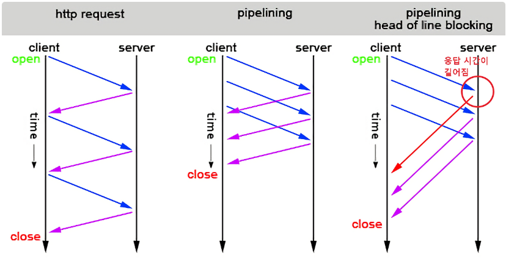

- **무거운 헤더 구조와 중복**

  - 매 요청마다 거의 동일한 내용의 헤더(쿠키, User-Agent 등)가 압축 없이 그대로 전송됨
  - 전송하려는 값보다 헤더 값이 더 큰 경우도 존재함

  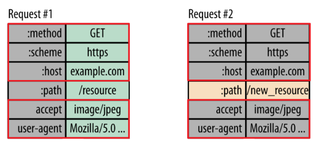

### 예시

```
[단일 연결을 통한 요청의 전체 흐름의 예시]
GET /en-US/docs/Glossary/Simple_header HTTP/1.1
Host: developer.mozilla.org
User-Agent: Mozilla/5.0 (Macintosh; Intel Mac OS X 10.9; rv:50.0) Gecko/20100101 Firefox/50.0
Accept: text/html,application/xhtml+xml,application/xml;q=0.9,*/*;q=0.8
Accept-Language: en-US,en;q=0.5
Accept-Encoding: gzip, deflate, br
Referer: https://developer.mozilla.org/en-US/docs/Glossary/Simple_header

200 OK
Connection: Keep-Alive
Content-Encoding: gzip
Content-Type: text/html; charset=utf-8
Date: Wed, 20 Jul 2016 10:55:30 GMT
Etag: "547fa7e369ef56031dd3bff2ace9fc0832eb251a"
Keep-Alive: timeout=5, max=1000
Last-Modified: Tue, 19 Jul 2016 00:59:33 GMT
Server: Apache
Transfer-Encoding: chunked
Vary: Cookie, Accept-Encoding

(content)

GET /static/img/header-background.png HTTP/1.1
Host: developer.mozilla.org
User-Agent: Mozilla/5.0 (Macintosh; Intel Mac OS X 10.9; rv:50.0) Gecko/20100101 Firefox/50.0
Accept: */*
Accept-Language: en-US,en;q=0.5
Accept-Encoding: gzip, deflate, br
Referer: https://developer.mozilla.org/en-US/docs/Glossary/Simple_header

200 OK
Age: 9578461
Cache-Control: public, max-age=315360000
Connection: keep-alive
Content-Length: 3077
Content-Type: image/png
Date: Thu, 31 Mar 2016 13:34:46 GMT
Last-Modified: Wed, 21 Oct 2015 18:27:50 GMT
Server: Apache

(image content of 3077 bytes)
```

## HTTP/2

- 2015년에 등장한 프로토콜로 HTTP/1.1이 15년 이상 사용되며 드러난 성능적 한계를 극복하기 위해 설계됨
- 구글이 개발한 SPDY 프로토콜을 기반으로 만들어짐

### 스트림

- Frame : Header 또는 Data가 들어있는 HTTP/2에서의 통신의 최소 단위
- Message : 다수의 Frame으로 이루어진 배열 라인으로 요청 혹은 응답의 단위
- Stream : 연결된 Connection 내에서 양방향으로 Message를 주고 받는 하나의 흐름
- `Connection > Stream > Message > Frame`
  <hr>
  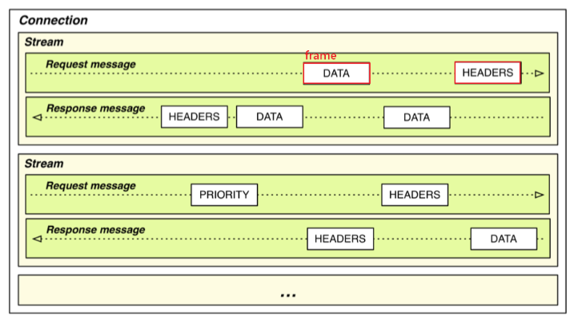

### 특징

- **바이너리 프레이밍**

  - 텍스트 프로토콜이 아닌 이진 프로토콜로 읽을 수도 없고 수동으로 만들수도 없음
  - 모든 메시지를 바이너리 형식의 작은 프레임으로 쪼개서 전송함
  - 헤더와 바디를 개행 문자가 아닌 Layer로 구분함
  - 데이터 파싱 및 전송 속도가 빠르고 오류 발생 가능성이 낮음

  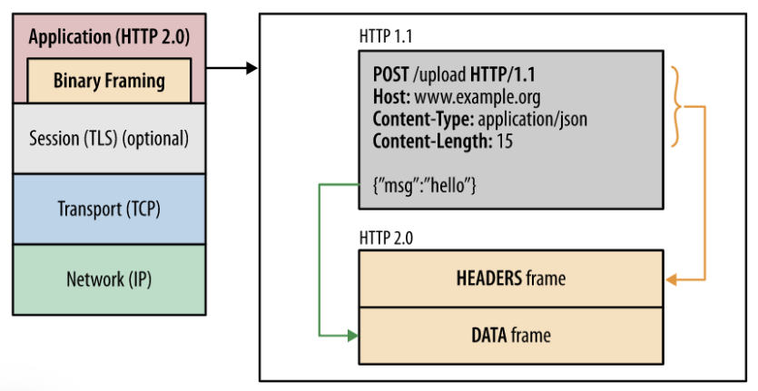

- **멀티플렉싱(Multiplexing)**

  - 하나의 연결 안에서 독립적인 스트림을 만들어 요청과 응답을 주고 받음
  - 특정 응답이 지연되더라도 다른 스트림은 영향을 받지 않아 네트워크의 효율적인 사용이 가능함

  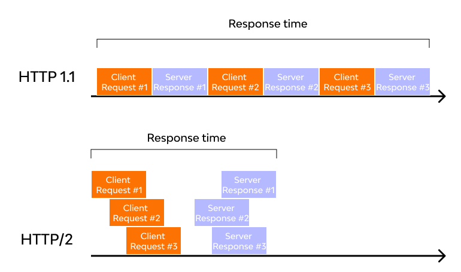

- **서버 푸시(Server Push)**

  - 클라이언트가 요청하지 않은 리소스를 미리 알아서 보냄
  - 브라우저가 `index.html`을 요청하면 서버는 `style.css`와 `script.js`를 브라우저가 요청하기 전에 미리 보냄
  - 클라이언트가 HTML을 해석하고 다시 리소스를 요청하는 과정을 생략하여 성능이 향상됨

  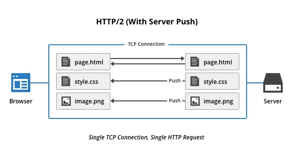

- **헤더 압축(HPACK)**

  - 클라이언트와 서버가 이전에 주고받은 헤더의 내용을 공유된 테이블에 저장하고, 이 후 요청부터는 중복되는 값을 제외하고 변경된 값이나 테이블의 인덱스만 전송하는 방식
  - 공통적으로 자주 사용되는 61개의 헤더 필드를 정적 테이블에 미리 정의함 [정적 테이블 할당 내역](./static-table.md)
  - 한 번 보낸 헤더는 동적 테이블에 저장되고 다음부터는 인덱스 번호로 대체하여 전송함
  - 테이블에 없는 새로운 헤더 값이나 문자열은 허프만 코딩을 이용해 추가로 압축함
  - 자주 등장하는 문자에는 짧은 비트 코드를, 드물게 등장하는 문자에는 긴 비트 코드를 할당하는 방식

  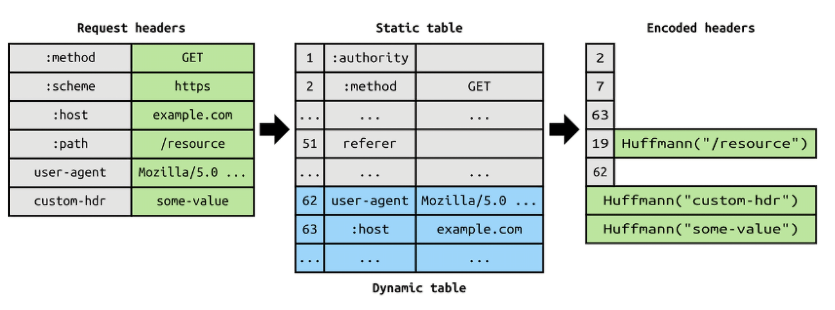

### 한계

- **TCP-level HOL Blocking**

  - 멀티플렉싱으로 여러 스트림을 동시 처리해도, 모든 스트림은 하나의 TCP 연결 위에서 동작함
  - 패킷의 도착 순서를 보장하기 위해 중간에 TCP 패킷 하나가 유실되면 재전송되어 도착할 때까지 모든 스트림이 멈춤

  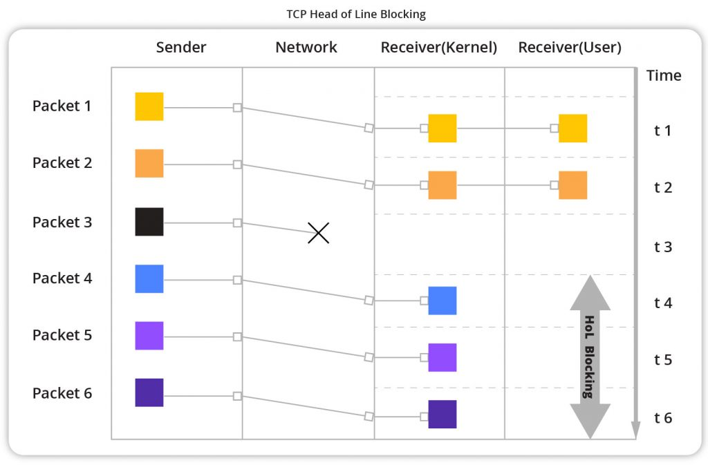

- **Round Trip Time**

  - TCP로 통신하기 때문에 핸드쉐이크로 인한 지연 시간 발생
  - 핸드쉐이크 횟수를 최소화했지만, 최초 연결시의 지연은 여전히 존재함

## HTTP/3

- HOL Blocking 문제를 극복하기 위해 UDP 기반의 QUIC 프로토콜 사용함

### QUIC 프로토콜

- Quick UDP Internet Connections
- UDP 기반의 전송 계층 프로토콜
- HTTP/2가 해결하지 못한 TCP의 HOL Blocking 문제를 해결하기 위해 등장
- 신뢰성 보장, 흐름 제어, 혼잡 제어, 스트림 내 순서 보장의 기능을 가지고 있어 UDP 위에 존재하지만 TCP에 가까운 역할을 수행함

### UDP 사용 이유

- UDP는 신뢰성이 없는 것이 아닌 신뢰성이 낮은 프로토콜
- 패킷의 목적지만 정해져 있다면 중간 경로는 신경 쓰지 않아 핸드쉐이크 과정이 필요 없음
- 신뢰성을 얻기 위한 과정을 거치지 않기에 TCP에 비해 속도가 빠름
- 개발자의 구현에 따라서 TCP와 비슷한 수준의 기능(패킷 순서 확인, 손실된 패킷 재전송)을 가질 수도 있음
- 커널 단위를 변경하지 않고(OS 업데이트) 애플리케이션 레벨(브라우저 업데이트)에서 가능해 TCP보다 빠르게 개선하고 배포 가능함
- 만약 새로운 프로토콜을 만든다면 TCP와 UDP 밖에 모르는 기존 장비들이 트래픽을 차단해버릴 가능성이 큼

### 특징

**더 빠른 연결 설정**

- 암호화와 전송 핸드쉐이크 과정을 하나로 통합하여 연결 설정에 필요한 RTT를 줄임
- QUIC에 TLS 인증서를 내포하고 있어, 최초의 연결 설정에서 필요한 인증 정보와 데이터를 함께 전송함
- 이전한 방문한 사이트의 경우 0-RTT 기능으로 거의 즉시 연결이 가능함

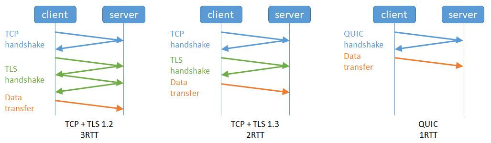
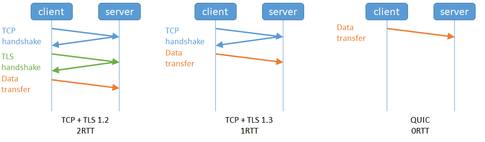

**독립적인 스트림 사용**

- 한 스트림에서 패킷이 유실되더라도 다른 스트림에는 영향을 주지 않음
- 스트림 2에서 UDP 패킷이 유실되더라도 스트림 2의 처리에만 영향을 미치고 스트림 1과 3의 데이터 전송은 차단되지 않음

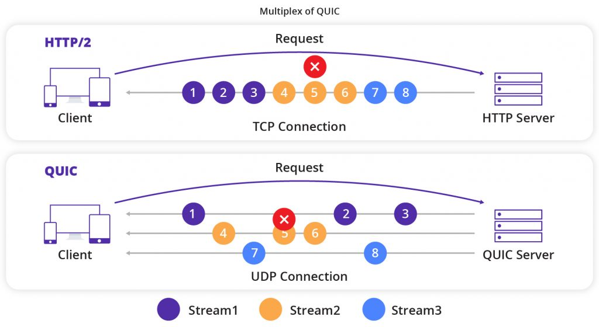

**향상된 보안 기능**

- TLS 1.3 암호화를 통하여 별도의 설정 없이도 항상 암호화된 연결을 보장함
- Man-in-the-Middle과 같은 보안 위협으로부터 사용자를 안전하게 보호할 수 있음
- TCP와 달리 헤더 영역도 같이 암호화됨

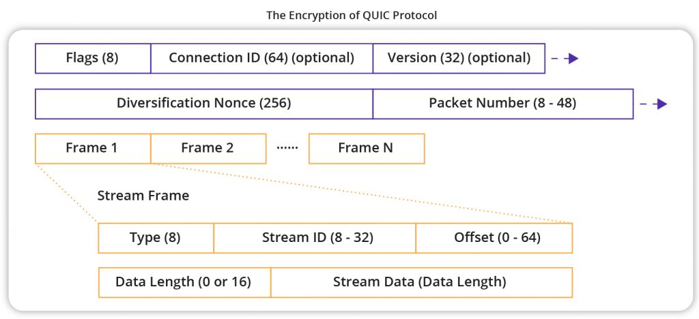

**네트워크 전환 시에도 끊김 없는 연결**

- TCP 연결 방식은 네트워크 전환시 IP 주소가 바뀌면서 연결이 끊어지는 방식임
- 연결이 끊어지게 되면 TCP 핸드쉐이크, TLS 핸드쉐이크를 다시 해야 됨
- QUIC는 Connection ID를 사용하여 IP 주소와 포트 변경 시에도 연결을 계속 유지할 수 있음
- Connection ID는 랜덤한 값으로 클라이언트 IP와는 전혀 무관한 데이터
- 클라이언트와 서버는 Connection ID를 통해 서로를 식별하여 동일한 연결임을 인지하고 데이터를 계속 주고받을 수 있음

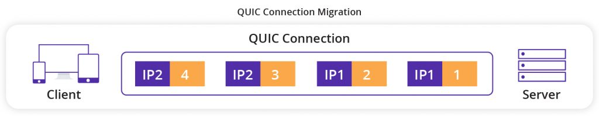

### 한계

**기존 네트워크 장비와의 호환성**

- 장비들이 중요한 데이터는 TCP로, 그 외의 데이터는 UDP로 온다는 가정하에 설정된 경우가 많음
- UDP를 악용한 DDos 공격을 막기 위해 UDP 트래픽을 차단하거나 속도를 제한하는 경우가 있음
- HTTP/3 연결을 시도하다가 실패하면 이전 버전으로 전환하여 다시 연결을 시도함

**높은 CPU 사용량**

- TCP는 커널에서 직접 처리되는 반면, QUIC는 사용자 공간에서 처리됨
- 모든 연결에 암호화를 수행하기에 TCP보다 더 많은 CPU 자원이 필요함

## 출처

- https://developer.mozilla.org/ko/docs/Web/HTTP/Guides/Evolution_of_HTTP
- https://inpa.tistory.com/entry/WEB-%F0%9F%8C%90-HTTP-09-HTTP-30-%EA%B9%8C%EC%A7%80-%EC%95%8C%EC%95%84%EB%B3%B4%EB%8A%94-%ED%86%B5%EC%8B%A0-%EA%B8%B0%EC%88%A0#holb_head_of_line_blocking
- https://www.cdnetworks.com/ko/blog/what-is-quic/
