# IP

- 인터넷에 연결된 모든 장치에 할당된 고유 식별 번호

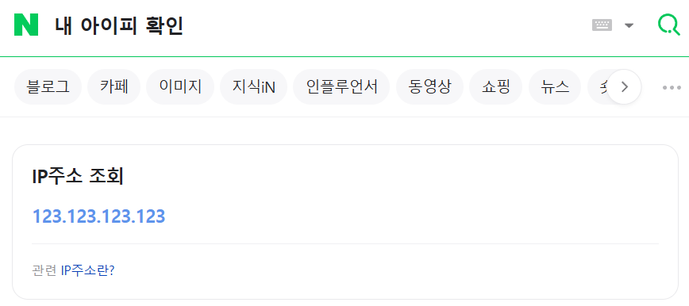

## IPv4

- Internet Protocol version 4
- 오랫동안 인터넷의 근간이 되어 수십 년 동안 안정적인 연결 제공
- 현재까지 인터넷에서 가장 많이 사용 되는 주소 체계
- 주소 공간 한계로 인해 2011년부터 할당 불가

### 주소 체계

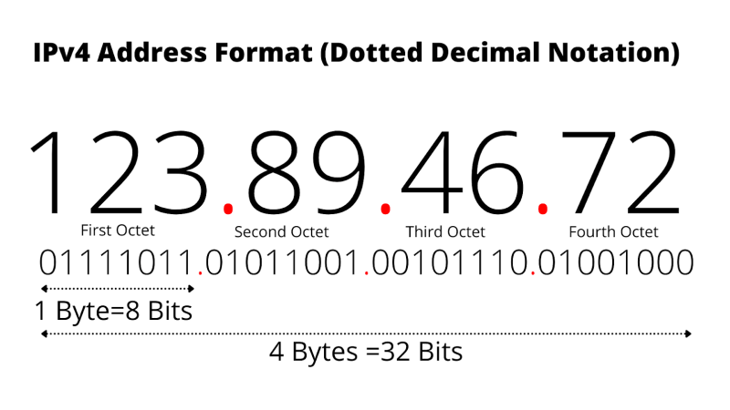

- 점으로 구분된 10진수 표기법
- `192.168.0.1`
- 4개의 숫자가 0에서 255까지 이어짐
- 32비트(4바이트)의 길이
- 전체 주소 수는 2^32 (약 43억 개)

## 주소 구성

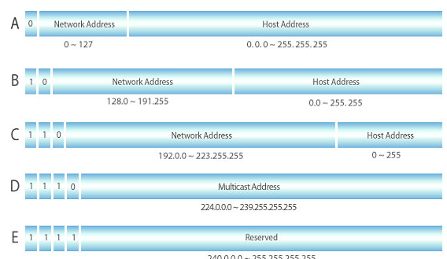

- 네트워크 주소 : 네트워크 전체를 식별하는 부분
- 호스트 주소 : 해당 네트워크 안에서 특정 장치를 식별하는 부분
- A, B, C 클래스 : 일반 사용자에게 부여하는 네트워크 구성용 주소
  - A 클래스 : 1 ~ 126 범위의 IP 주소를 가짐 (0, 127은 예약됨)
  - B 클래스 : 128 ~ 191 범위의 IP 주소를 가짐
  - C 클래스 : 192 ~ 223 범위의 IP 주소를 가짐
- D 클래스 : 멀티 캐스트용 주소
- E 클래스 : 향후 사용을 위해 예약된 주소

### 전송 유형

- 유니캐스트
  - 가장 기본적인 통신 방식
  - 한 송신자에서 한 수신자로 데이터를 전송함
  - `192.168.1.10`에서 `192.168.1.20`으로 패킷을 전송
  - 예시 : 웹 서핑, 파일 전송
- 브로드캐스트
  - 네트워크의 모든 장치에 패킷을 전송하는 방식
  - 브로드캐스트 주소 `255.255.255.255`는 로컬 네트워크 내의 모든 장치로 데이터를 보냄
  - 예시 : ARP, DHCP
- 멀티캐스트
  - 특정 그룹의 다수 수신자에게 패킷을 전송하는 방식
  - 멀티캐스트 주소 `224.0.0.0 ~ 239.255.255.255` 범위를 사용하여 여러 수신자가 이 주소에 가입할 수 있음
  - 예시 : 동영상 스트리밍, 화상 회의

### 헤더

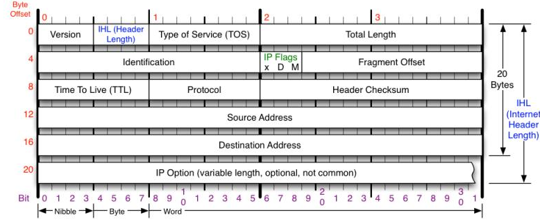

- 버전 (Version) [4Bit]
  - IP 프로토콜의 버전
  - IPv4의 경우 값은 항상 4를 나타냄 (0100)
- 헤더 길이 (IHL: Header Length) [4Bit]
  - IPv4 헤더 전체의 길이를 32비트 (4바이트) 단위로 표시함
  - 최솟값은 5이며, 이는 옵션 필드가 없는 기본 헤드 길이인 20바이트를 의미함
  - 최댓값은 15이며, 이는 헤더의 최대 크기가 60바이트를 의미함 (옵션 필드 포함)
- 서비스 유형 (TOS: Type of Service) [8Bit]
  - 패킷의 우선순위나 요구되는 서비스 품질(QoS)을 나타냄
  - 앞의 3비트로 우선순위를 결정하고 뒤의 5비트로 서비스 유형을 나타냄
  - 우선순위는 음성 > 영상 > Text 순서
- 전체 길이 (Total Length) [16Bit]
  - 헤더와 데이터를 포함한 IP 패킷의 전체 길이를 바이트 단위로 나타냄
  - 16비트로 표현되므로, 패킷의 최대 크기는 65,535 바이트
  - 하지만, 1500 바이트보다 큰 경우는 거의 없음
- 식별자 (Identification) [16Bit]
  - IP 패킷이 네트워크의 물리적 한계(MTU)보다 클 경우 여러 개의 Fragment로 나뉘어 전송
  - 나뉘어진 Fragment가 원래 어떤 하나의 패킷에 속했는지를 식별하는 고유 번호
  - 전송된 패킷이 다른 전송된 패킷과 같은 식별자를 가진다면 같은 패킷에서 조각난 것을 알 수 있음
- 플래그 (Flag) [3Bit]
  - 패킷의 단편화와 관련된 제어 정보를 담고 있음
  - 첫 번째 비트는 항상 0으로 설정
  - 두 번째 비트(DF: Don't Fragment)는 1로 설정되면 라우터는 이 패킷을 분할하지 말아야 함
  - 세 번째 비트(MF: More Fragment)는 현재 조각이 마지막이 아닐 경우 1로 설정됨
- 단편 오프셋 (Fragment Offset) [13Bit]
  - 분할된 각 조각이 원래 어떤 데이터에서 어느 위치에 있었는지 나타냄
  - 수신 측에서는 이 오프셋 값을 참조하여 흩어져 도착한 조각들을 올바른 순서로 재조립함
  - 8바이트 단위로 표시됨 (1600바이트를 표현하고 싶다면 1600/8 = 200을 입력)
- 생존 시간 (TTL: Time to Live) [8Bit]
  - 패킷이 네트워크 내에서 무한정 떠도는 것을 방지하기 위한 값
  - 라우터를 하나 거칠 때마다 TTL이 1씩 감소하며, 0이 되면 해당 패킷은 폐기되고 송신자에게 오류메시지가 전송됨
- 프로토콜 (Protocol) [8Bit]
  - 패킷의 데이터 부분에 담겨 있는 상위 계층 프로토콜이 무엇인지 나타냄
  - 수신 측에서는 데이터를 어떤 프로토콜 처리기에게 전달할지 결정함
- 헤더 체크섬 (Header Checksum) [16Bit]
  - 전송 중 헤더에 오류가 발생했는지를 검사하기 위한 값
  - 라우터는 패킷을 수신할 때마다 값을 다시 계산하여 헤더의 무결성을 확인함
  - TTL 값이 계속 변하는 만큼 이 값도 매번 다시 계산해야 함
  - 계산 결과가 똑같이 나타난다면 IP 헤더의 모든 비트는 정확하게 전송됨
  - 계산 결과가 다르게 나타난다면 전송 중의 IP 패킷의 일부가 손상되거나 조작되었다는 것을 의미함
  - 2바이트씩 IP 헤더를 모두 잘라 더한 후에 발생한 올림 영역까지 더해준 후, 1의 보수를 취하면 IP헤더의 체크섬 값을 구할 수 있음
- 출발지 IP 주소 (Source IP Address) [32Bit]
  - 패킷을 보낸 송신자의 32비트 IPv4 주소
- 목적지 IP 주소 (Destination IP Address) [32Bit]
  - 패킷을 수신할 최종 목적지의 32비트 IPv4 주소
- 옵션 (Option)
  - 사용될 옵션에 따라 길이가 가변적임
  - 보안, 경로 추적, 시간 기록 등 추가적인 기능이 필요할 때 사용됨
  - 최소 1바이트 단위로 구성됨
- 패딩 (Padding)
  - 옵션이 사용되었을 때 전체 헤더의 길이를 4바이트로 맞추기 위해 추가되는 의미 없는 데이터
  - 헤더를 처리하는 시스템의 효율성을 높이기 위해 사용

### 주소 설정

- 정적 할당
  - IP 주소 : 다른 기기와 절대로 겹치지 않는 주소를 직접 입력해야 함
  - 서브넷 마스크 : `255.255.255.0`과 같은 값을 정확하게 입력해야 함
  - 기본 게이트웨이 : 공유기의 IP 주소를 직접 입력해야 함
  - DNS 서버 주소 : 통신사에서 제공하는 DNS 서버 주소나 구글 DNS 같은 공용 DNS 주소를 직접 입력해야 함
- 동적 할당
  - DHCP : 네트워크에 접속하는 컴퓨터나 스마트폰 같은 장치에게 IP 주소를 포함한 필수 네트워크 정보들을 자동으로 할당해주고 관리하는 역할
  - 별도의 IP 설정 작업이 필요 없음
  - 사용하지 않는 IP 정보는 회수되고 사용하는 경우에만 재할당됨
  - 사용자가 직접 입력하면서 발생할 수 있는 설정 정보 오류나 중복 IP 할당 문제 예방 가능함

### 주소가 부족해진 이유

- IPv4가 약 42억 개의 주소만 할당할 수 있음
- 초기 인터넷 설계 시 예상보다 훨씬 많은 인터넷 사용자, 개인용 컴퓨터, 스마트 기기, IoT 장치 등이 등장하면서 빠르게 소진됨
- IPv4 초기에는 클래스 단위로 주소를 할당했는데, 이는 주소가 낭비될 수 있는 방식임

### NAT

- Network Address Translation
- 하나의 공식적인 공인 IP 주소를 사용해서 여러 대의 컴퓨터가 인터넷에 접속할 수 있도록 해주는 기술
- IPv4의 주소 고갈 문제를 해결하기 위해 임시적으로 등장한 기술
- IP 주소와 함께 포트 번호를 사용하여 여러 기기를 구분하고 데이터를 전달함
- 문제점
  - IP 헤더를 변환하고 NAT 테이블을 관리하는 과정에서 공유기에 부하 발생, 네트워크 추적 복잡함
  - 외부에서 내부의 특정 기기로 먼저 접속을 시작하기가 어려움

### CIDR

- Classless Inter-Domain-Routing
- IP 주소 할당 및 라우팅의 효율성을 높이기 위해 도입된 기술
- IP 주소 뒤에 `/숫자`를 붙여 네트워크 주소의 크기를 나타냄
- 전통적인 A, B, C 클래스 구분을 없애고 IP 주소의 네트워크 부분과 호스트 부분의 경계를 유연하게 설정할 수 있음
- 네트워크 클래스 구분 없이 IP 주소 대역을 더 세밀하게 나누거나, 여러 작은 네트워크를 하나의 큰 네트워크처럼 묶어 관리할 수 있음

## IPv6

- Internet Protocol version 6
- IPv4의 주소 고갈 문제를 해결하기 위해 등장
- ipv6 사용률
  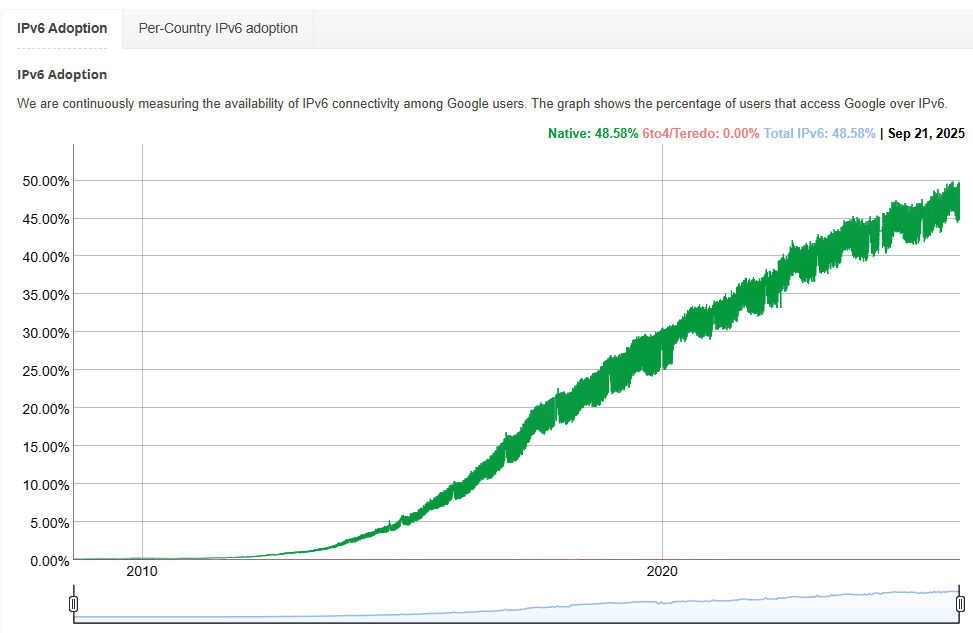

### 주소 체계

- 콜론으로 구분된 16진수 표기법
- `2001:0db8:85a3:0000:0000:8a2e:0370:7334`
- 128비트(16바이트)의 길이
- 전체 주소 수는 2^128 (약 3.4 \* 10^38개)

### 주소 구조

- 앞쪽 64비트 (NET_ID)

  - 글로벌 유니캐스트 주소
    - IPv6의 공인 주소로, 전 세계 어디서든 라우팅이 가능한 주소
    - 범위 : `2000::/3` (`2000` ~ `3fff`)
  - 지역
    - IANA가 IPv6 주소 블록을 전 세계 RIR에 나눠줌
    - 주요 RIR
      - ARIN(북미)
      - RIPE NCC(유럽, 중동, 중앙아시아)
      - APNIC(아시아-태평양)
      - LACNIC(중남미, 카리브해)
      - AFRINIC(아프리카)
  - LIR / ISP
    - LIR : 대규모 기관이나 통신사가 속함
    - ISP : 우리가 인터넷에 가입하는 통신사
    - RIR이 주소를 ISP에게 할당하면, ISP는 고객에게 재분배함
  - 고객
    - ISP가 실제 고객에게 할당하는 부분
      - 기업이 고정 IPv6 블록을 받아서 사무실 네트워크에 이용
      - 개인 가정에 ISP가 `/56` 또는 `/64` 단위로 할당
    - IPv6는 주소가 충분하기 때문에, 고객에게 넉넉하게 블록 단위로 할당됨
  - 서브넷 마스크
    - 고객 내부 네트워크를 더 잘게 나누는 역할
    - 보통 ISP는 고객에게 `/56`을 주고 고객은 이를 여러 개의 `/64` 네트워크로 나눠 씀

- 뒤쪽 64비트 (EUI-64 기반 인터페이스 ID)

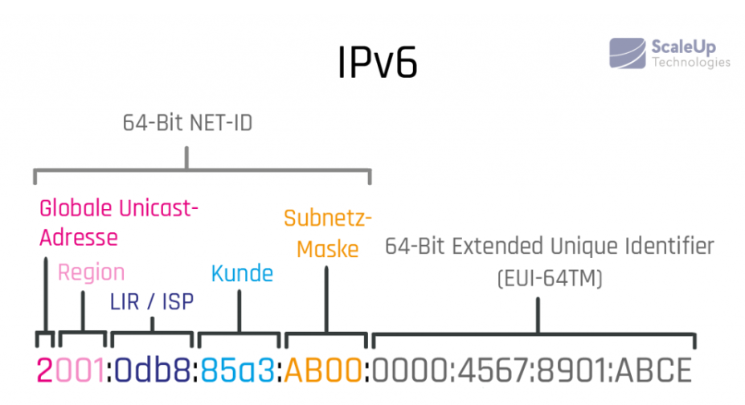

### 주소 생략

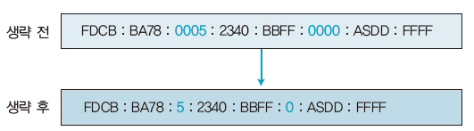

- 콜론 두 개 사이에 있는 섹션 4개에서 앞쪽의 0은 생략 가능

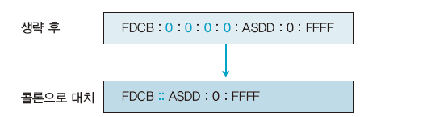

- 8개의 영역 중에서 `0000`이 연속으로 나타나는 경우에는 해당 영역 생략 가능
- 주소당 한 번만 허용됨

### 전송 유형

- 유니캐스트
  - 가장 기본적인 통신 방식
  - 한 송신자에서 한 수신자`(1:1)`로 데이터를 전송함
  - IPv6에서 글로벌 유니캐스트 주소라는 개념이 추가됨
  - `2001:0db8::1`에서 `2001:0db8::2`으로 패킷을 전송
  - 예시 : 웹 서핑, 파일 전송
- ~~브로드캐스트~~
  - IPv6에서는 사용되지 않음
  - IPv4에서의 브로드캐스트 역할은 멀티캐스트와 애니캐스트가 대체함
  - 브로드캐스트의 비효율성을 개선하기 위해 더 구체적인 그룹 통신을 지원하는 멀티캐스트를 채택함
- 멀티캐스트
  - 특정 그룹의 다수 수신자`(1:N)`에게 패킷을 전송하는 방식
  - 멀티캐스트 주소 `FF00::/8` 범위를 사용하여 여러 수신자가 이 주소에 가입할 수 있음
  - 특정한 그룹 내에서만 트래픽을 전달할 수 있어 네트워크 자원을 효율적으로 사용할 수 있음
  - IPv6에서는 멀티캐스트가 브로드캐스트를 완전히 대체함
- 애니캐스트
  - BGP와 같은 라우팅 프로토콜을 통해 더 효율적인 경로 설정을 함
  - 가까운 노드로 트래픽을 전달하는 데 더욱 최적화 되어 있어, 대규모 네트워크에서 효율성이 높음

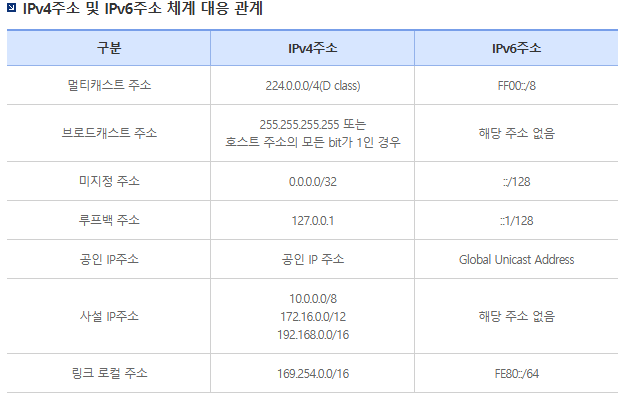

### 헤더

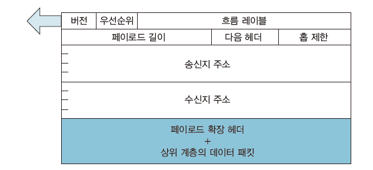

- 버전 (Version) [4Bit]
  - IP 프로토콜의 버전
  - IPv6의 경우 값은 항상 6를 나타냄 (0110)
- 트래픽 클래스 (Traffic Class) [8Bit]
  - IPv4의 서비스 유형 필드와 비슷한 역할
  - 패킷의 우선순위 지정
  - 실시간 스트리밍이나 VoIP와 같이 지연에 민감한 데이터가 우선적으로 처리됨
- 흐름 레이블 (Flow Label) [20Bit]
  - IPv6에 새롭게 추가된 필드
  - 특정 통신에 속하는 패킷들의 연속적인 흐름을 식별하기 위해 사용
  - 라우터는 이 레이블을 보고 관련된 패킷을 동일한 경로로 일관되게 처리하여 비디오나 오디오 같은 실시간 데이터의 품질을 보장할 수 있음
- 페이로드 길이 (Payload Length) [16Bit]
  - 고정 헤더를 제외한 나머지 부분의 전체 길이를 바이트 단위로 나타냄
  - 최대 65,535 바이트까지 나타낼 수 있으며, 이 보다 큰 페이로드를 전송한다면 이 값을 0으로 설정하고 홉별 옵션(Hop-by-Hop) 확장 헤더를 사용함
- 다음 헤더 (Next Header) [8Bit]
  - IPv4의 프로토콜 필드와 비슷한 역할
  - 고정 헤더 바로 다음에 어떤종류의 헤더가 오는지를 알려줌
  - 만약 확장 헤더가 있다면, 그 확장 헤더의 종류를 나타냄
  - 확장 헤더가 없다면, 상위 전송 계층 프로토콜의 종류를 나타냄

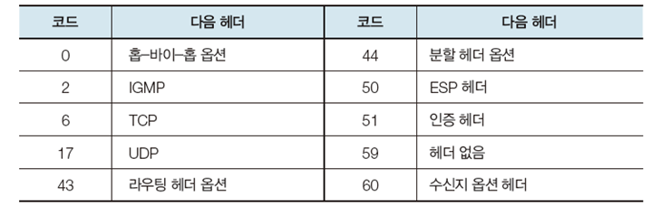

- 홉 제한 (Hop Limit) [8Bit]
  - IPv4의 TTL 필드와 동일한 역할
  - 패킷이 라우터 하나 거칠 때마다 값이 1씩 감소하며, 0이 되면 패킷은 네트워크에서 무한히 순환하는 것을 방지하기 위해 폐기됨
- 출발지 IP 주소 (Source IP Address) [128Bit]
  - 패킷을 보낸 송신자의 128비트 IPv6 주소
- 목적지 IP 주소 (Destination IP Address) [128Bit]
  - 패킷을 수신할 최종 목적지의 128비트 IPv6 주소

#### 확장 헤더

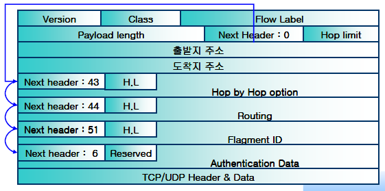

- 홉별 옵션 (Hop-by-Hop Options): 패킷이 거쳐가는 모든 라우터가 확인해야 하는 옵션
- 라우팅 (Routing): 패킷이 특정 경로를 따라가도록 지정
- 단편화 (Fragment): 패킷을 분할하고 재조립하기 위한 정보
- 인증 (Authentication) 및 보안 페이로드 (Encapsulating Security Payload): IPsec을 위한 인증 및 암호화 정보
- 목적지 옵션 (Destination Options): 최종 목적지 노드만 확인하는 옵션

### IPsec 내장

- IP Security
- IP 계층에서 보안 기능을 제공하는 프로토콜 모음 (암호화, 인증, 무결성)
- IPv4에는 선택 기능이었지만, IPv6에서는 기본 포함하도록 정의됨

#### IPsec 구조

- IP 패킷 안에 보안 관련 헤더를 추가하여 동작하는 방식
- AH (Authentication Header)

  - 인증과 무결성 보장되지만 암호화 되지는 않음
  - IP 헤더와 페이로드 사이에 추가됨
  - `[IP 헤더] [AH 헤더] [데이터]`

- ESP (Encapsulating Security Payload)
  - 데이터 암호화, 무결성 보장, 선택적 인증
  - 가장 많이 사용되는 방식임
  - IP 헤더와 데이터 사이에 삽입되며, 페이로드를 암호화 함
  - `[IP 헤더] [ESP 헤더] [암호화된 데이터 + 인증값]`

#### IPsec 동작 모드

- 전송 모드
  - 원래의 IP 헤더는 그대로 두고, 데이터 부분만 보호
  - 종단간 통신에 적합한 방식
- 터널 모드
  - 원래 패킷 전체를 캡슐화하고, 새로운 IP 헤더를 붙임
  - VPN 같은 네트워크 보안 연결에서 사용함

### 주소 설정

- SLAAC (Stateless Address Auto Configuration)

  - 중앙 관리 서버 없이 IPv6 기기가 스스로 자신의 IP 주소를 생성하고 설정하는 기술

  1. 라우터 요청 (RS: Router Solicitaion)
     - 기기가 네트워크에 연결되면, 네트워크 정보를 요청함
  2. 라우터 광고 (RA: Router Advertisement)
     - 라우터는 기기에게 네트워크 주소를 알려줌
  3. IP 주소 생성
     - 기기는 네트워크 주소를 주소의 앞부분으로 사용함
     - 네트워크 카드에 부여된 48비트 MAC 주소를 기반으로 주소의 뒷부분(인터페이스 주소)을 생성
  4. 중복 주소 검사 (DAD: Duplicate Address Detection)
     - 다른 기기가 사용하고 있는지 기기가 만든 주소 확인
     - 아무런 응답이 없으면 주소가 중복되지 않았으므로 주소를 사용해도 됨

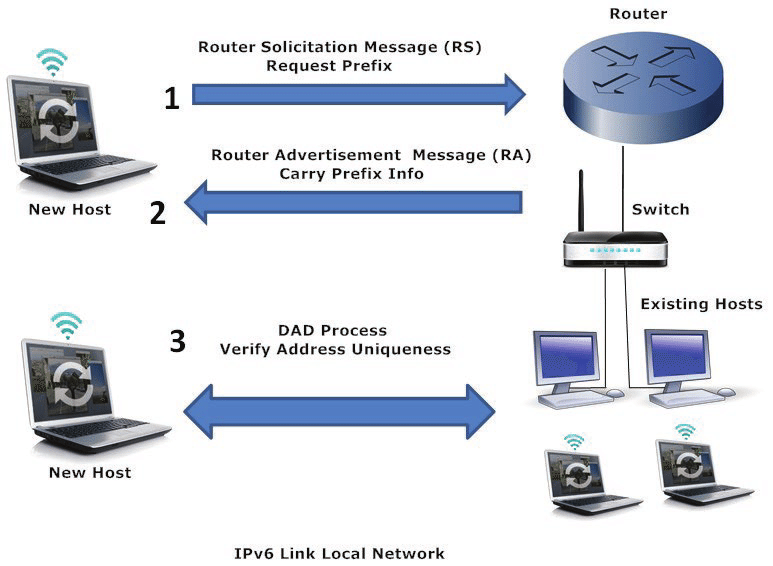

- DHCPv6

  - 중앙 서버에서 IP 주소 할당 및 관리

  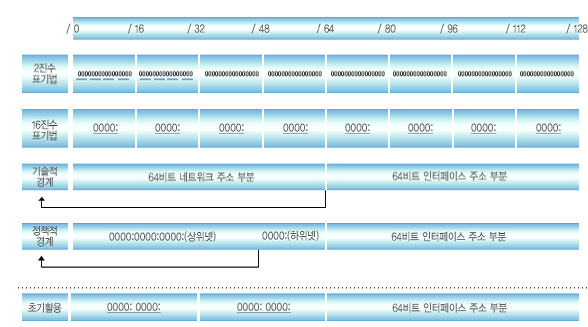

### 전환의 어려움

- 주소 체계가 완전히 다르기 때문에 듀얼 스택, 터널링, 변환과 같은 복잡한 전환 기술이 필요함
- 부족한 주소 문제를 해결하기 위해 NAT를 사용해 왔음. 덕분에 수많은 사설 네트워크가 잘 동작하고 있어서 굳이 바뀔 필요를 느끼지 못함
- ISP, 기업, 공공기관이 수십 년동안 IPv4 기반 인프라에 투자해 온 만큼, 네트워크 장비를 모두 교체하려면 큰 비용이 필요함
- 듀얼 스택 환경은 주소 관리, 보안 정책, 라우팅을 두 배로 관리해야 되기에 복잡함

## 주소 변환

### 듀얼 스택

- Dual Stack
- 하나의 장비나 시스템에서 IPv4와 IPv6 두 가지 IP 버전을 동시에 지원하는 방식
- 하나의 네트워크 인터페이스 카드에서 IPv4와 IPv6 주소를 동시에 할당받아 사용할 수 있음

#### 작동 방식

1. 주소 할당

- IPv4와 IPv6 주소를 동시에 할당 받음

2. 네트워크 스택

- 장비 내부의 네트워크 스택은 IPv4와 IPv6 프로토콜을 모두 처리할 수 있는 로직과 라이브러리를 포함함
- 들어오는 패킷의 버전을 확인하고 적절한 프로토콜 로직으로 패킷을 처리함

3. 패킷 전송

- 데이터 전송 이전에 전송하고자 하는 목적지의 IP 주소 타입을 확인함
- 주소 타입에 따라 적절한 IP 프로토콜 스택을 활용하여 패킷을 생성하고 전송함

4. DNS 조회

- 주소가 2개 이기에 DNS 서버를 거칠 경우에도 동작이 2개의 버전에서 일어남
- 일반적으로는 A 레코드(Address record, IPv4)와 AAAA 레코드(Quad-A Record, IPv6)를 모두 반환 받음

5. 통신의 방향성

- IPv4와 IPv6의 패킷은 서로 직접 통신할 수 없음
- Dual Stack이라 하더라도 IPv4 패킷은 IPv6 네트워크를 거칠 수 없고, IPv6의 경우에도 IPv4 네트워크를 거칠 수 없음

6. 풀백 매커니즘

- 만약 IPv6 통신이 실패한다면, Dual Stack 환경에서는 자동으로 IPv4를 활용하여 통신을 재시도할 수 있음

#### 장점

- 별도의 변환이나 포장 과정이 없어 통신이 빠르고 안정적임
- 양쪽 프로토콜을 모두 완벽하게 지원함

#### 단점

- 모든 장비가 여전히 IPv4의 주소를 필요로 하기에 주소 고갈 문제를 해결해 주지는 못함
- 두 개의 프로토콜에 대한, 주소, 라우팅, 보안 정책을 모두 설정하고 관리해야 하기에 복잡함

### 터널링

- Tunneling
- 별도의 하드웨어 없이 IPv6 패킷을 IPv4로 감싸 새로운 패킷 형태로 전송함으로써 IPv4 네트워크를 통과하는 방식

#### 작동 방식

1. IPv6 패킷 준비

- 6to4를 사용하는 IPv6의 패킷의 경우, 주소의 첫 16비트가 `2002`라는 접두어로 고정됨
- 이 후 원본 IP 주소가 32비트 형태로 추가됨
- 그 다음 16비트는 SLA로 채워짐
- 마지막 64비트는 인터페이스 식별자로 사용됨 (일반적으로 MAC 주소를 기반으로 생성됨)

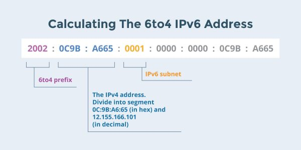

2. IPv4 헤더 생성

- 송신 측 주소는 6to4 기능을 수행하는 송신 측 장비의 IPv4 주소로 설정됨
- 목적지 주소는 6to4 릴레이 주소 또는 IPv4 형태의 목적지 주소로 구성됨
- 만약 IPv6 네트워크 환경을 사용한다면, 해당 환경의 라우터들은 IPv4로 위장한 6to4를 처리할 수 없기 때문에 6to4를 지원하는 별도의 중개자가 추가적으로 필요한데, 이를 6to4 릴레이라고 함

3. 캡슐화

- 준비된 Ipv6 패킷을 위에서 생성한 IPv4 헤더의 데이터 부분에 넣음
- IPv6 패킷 전체가 IPv4 패킷의 페이로드가 됨

- 헤더
  - Version: 캡슐화가 수행되며, IPv4의 헤더에 4가 기록됨. 페이로드 내부의 IPv6 패킷은 6이 기록됨
  - Source, Destination Address: 6to4 방식에 따라 앞서 설명한 터널링을 위한 IPv4 주소가 설정됨
  - Payload Length: IPv4의 Total Length 필드로 변환되기 위해서는 IPv4의 헤더와 캡슐화된 IPv6 패킷의 전체 길이가 더해짐
  - Next Header: Protocol 필드의 값이 상위 계층의 프로토콜(TCP/UDP)을 표현하지 않고 IPv6를 표현하는 41이라는 값이 들어감
  - Hop Limit: TTL 필드에 그대로 복사됨

4. 패킷 전송

- 일반적인 방법으로 IPv4 네트워크를 통해 전송됨
- 도착 이후 6to4 패킷의 비캡슐화 필요

#### 장점

- 중간 인터넷망이 IPv6을 지원하지 않아도 IPv6 통신이 가능함
- 멀리 떨어진 IPv6 섬들을 연결하는 역할을 함

#### 단점

- 캡슐화 과정에서 추가적인 헤더가 붙어 크기가 커지고, 이로 인해 지연이 발생하거나 패킷이 잘리는 문제가 발생할 수 있음
- 터널 설정 및 관리가 복잡함

### 주소 변환

- Translation

#### NAT64

- IPv6-only 클라이언트가 IPv4 서비스에 액세스할 수 있게 하는 변환 매커니즘
- 세션을 통해 상태를 유지하며(Stateful), 저장된 연결 상태 정보를 통해 IPv4와 IPv6 주소를 서로 매핑시킴
- 실제 네트워크 환경에서 단독으로 사용되기보다는 DNS64와 함께 사용되어, IPv6 클라이언트가 IPv4 웹사이트에 접근할 수 있도록 도와줌
- IPv4-only 주소를 IPv6 형태로 변환하는데는 활용되지 않기 때문에, 이는 별도로 464XLAT라는 기술을 활용해야 함

#### DNS64

- IPv6-only 클라이언트가 IPv4-only 목적지의 DNS 질의를 수행할 때 IPv4의 응답을 받아 IPv6 주소로 변환해 반환하는 기술
- 실제 웹서비스 환경에서는 클라이언트는 대체로 DNS 질의를 통해 목적지의 IP 주소를 확인함
- IPv6-only 클라이언트가 DNS 질의를 실행하는 경우 만약 DNS에 저장된 응답이 A 레코드 (IPv4)라면, DNS64는 이를 AAAA 레코드 (IPv6) 형태로 변환하여 클라이언트에게 반환됨
- 반환된 AAAA 레코드는 패킷의 목적지 주소에 담김
- 이를 그대로 보내는 경우 IPv6 인프라가 아니라면 목적지를 찾을 수 없음
- AAAA 레코드는 NAT64를 거쳐 원래의 A 레코드로 다시 변환되며 그 후 변환된 A 레코드를 기반으로 IPv4 패킷을 원래의 IPv4 목적지로 전송함

#### SIIT (Stateless IP/ICMP Transition)

- 상태가 없는 변환을 제공함
- 별도의 세션을 활용하지 않기 때문에 각 패킷은 개별적임
- A 레코드를 AAAA 레코드로 변화시키거나 그 반대의 경우도 가능함
- 별도의 세션 관리가 없다는 점은 곧 장점이자 단점으로 작용됨

## 출처

- https://networklessons.com/cisco/ccna-routing-switching-icnd1-100-105/ipv4-packet-header
- https://m.blog.naver.com/wnrjsxo/221191938036
- https://lcoding.tistory.com/151
- https://mydailylogs.tistory.com/127
