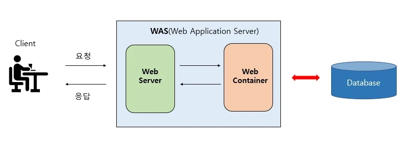
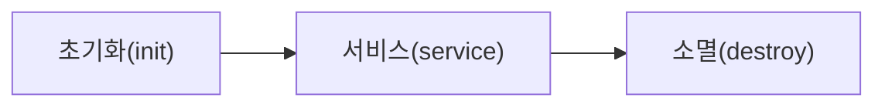
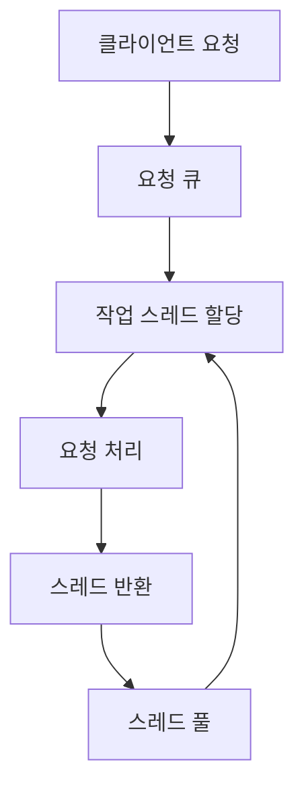

# Web Application Server (WAS)

## 💡 핵심 요약
> - **한 줄 정의** : WAS(Web Application Server)는 동적 콘텐츠를 생성하고 비즈니스 로직을 처리하는 미들웨어 서버로, 웹 애플리케이션의 실행 환경을 제공합니다.
> - **핵심 키워드** : `#HTTP` `#WAS` `#동적 콘텐츠` `#비즈니스 로직`
> - **왜 중요한가?** :현대 웹 서비스의 핵심 인프라로, 동적 웹 애플리케이션의 실행 환경을 제공하고 성능, 안정성, 보안을 담당합니다.

# **1. 개념**

WAS는 웹 애플리케이션 서버(Web Application Server)의 약자로, 웹 브라우저(클라이언트)의 요청을 받아 **동적 콘텐츠** (데이터베이스 조회, 비즈니스 로직 처리 등)를 생성합니다. 

웹 애플리케이션의 실행(비즈니스 로직) 환경을 제공하는 **미들웨어 서버**입니다. 

## 아키텍처상의 위치

WAS는 클라이언트와 데이터베이스 사이에서 중간 계층(미들웨어)으로 작동하며, 일반적으로 다음과 같은 3-tier 아키텍처의 중간층을 담당합니다

1. **프레젠테이션 계층(Presentation Layer)**: 웹 브라우저, 모바일 앱 등 사용자 인터페이스
2. **애플리케이션 계층(Application Layer)**: WAS가 위치하는 계층으로 비즈니스 로직 처리
3. **데이터 계층(Data Layer)**: 데이터베이스 시스템

### 용어 정리

- **웹 컨테이너(Web Container)**: Java 기반 WAS에서 서블릿과 JSP를 실행하는 환경
- **서블릿 컨테이너(Servlet Container)**: Java 서블릿 API를 구현하는 웹 서버의 일부로, 서블릿의 생명주기를 관리
- **애플리케이션 컨테이너(Application Container)**: 웹 애플리케이션의 실행 환경을 제공하는 소프트웨어 프레임워크
- **컨텍스트(Context)**: WAS 내에서 각 웹 애플리케이션의 실행 환경과 설정을 분리하는 단위

### 주요 WAS 예시

- **Java 기반**: Apache Tomcat, JBoss/WildFly, IBM WebSphere, Oracle WebLogic, Jetty, GlassFish
- **.NET 기반**: IIS(Internet Information Services)와 .NET Framework
- **Python 기반**: uWSGI, Gunicorn
- **Node.js 기반**: Express.js, Fastify(Node.js 자체가 WAS 역할 수행)

---

# **2. 왜 필요한가? / 등장 배경**

- **문제점**:
    1. **동적 콘텐츠 처리**: 사용자별 맞춤형 콘텐츠, 실시간 데이터 처리 등 정적 파일로 제공할 수 없는 동적 응답 생성
    2. **자원 효율성**: 요청마다 프로세스를 생성하는 CGI 방식보다 스레드 풀링을 통한 효율적인 자원 관리
    3. **비즈니스 로직 분리**: 프레젠테이션 로직과 비즈니스 로직의 관심사 분리(Separation of Concerns)
    4. **확장성**: 증가하는 웹 트래픽과 복잡한 비즈니스 요구사항을 효율적으로 처리할 수 있는 아키텍처 필요
- **등장 배경** :
    - 동적 콘텐츠 생성, 데이터베이스 연동, 세션 관리, 비즈니스 로직 실행 등 복잡한 작업을 처리하기 위해 개발.
    - CGI(Common Gateway Interface)와 같은 초기 기술의 한계를 극복.

---

# **3. 주요 특징**

### **1. HTTP 요청 처리**

- **직접 처리**: 대부분의 현대적 WAS는 자체적으로 HTTP 요청을 직접 처리할 수 있습니다. 다만 프로덕션 환경에서는 성능, 보안, 관리 목적으로 웹 서버를 앞단에 배치하는 것이 일반적입니다.
- **웹 서버 연계**: 대규모 환경에서는 Apache, Nginx 같은 웹 서버와 연계해 동작하며, 정적 콘텐츠는 웹 서버가, 동적 콘텐츠는 WAS가 처리합니다.
- **프로토콜 지원**: HTTP/1.1, HTTP/2, WebSocket 등 다양한 통신 프로토콜 지원

### **2. 서블릿 컨테이너 기능 (Java 기반 WAS)**

- **서블릿 생명주기 관리**: init() -> service() ->destroy() 메소드를 통한 서블릿 객체의 생성, 실행, 소멸 관리
- **서블릿 인스턴스 풀링**: 서블릿 인스턴스를 재사용하여 메모리 사용량 최적화
- **멀티스레딩 지원**: 하나의 서블릿 인스턴스로 동시에 여러 요청 처리

### **3. 서버 사이드 프로그래밍 지원**

- **JSP/JSTL**: Java 기반 템플릿 엔진으로 동적 HTML 생성 (Java)
- **Expression Language(EL)**: JSP 내에서 데이터 접근과 출력을 위한 표현 언어
- **Thymeleaf, FreeMarker**: 최신 Java 템플릿 엔진
- **ASP.NET**: .NET 기반 웹 애플리케이션 개발 (.NET)
- **Django Templates, Jinja2**: Python 기반 웹 프레임워크의 템플릿 엔진 (Python)

### **4. 보안 기능**

- **인증(Authentication)**: 사용자 신원 확인 메커니즘 제공
- **인가(Authorization)**: 역할 기반 접근 제어(RBAC) 등 권한 관리
- **세션 관리**: 상태 유지를 위한 세션 생성 및 관리
- **HTTPS 지원**: SSL/TLS 기반 암호화 통신
- **보안 필터링**: SQL 인젝션, XSS 등 웹 취약점 방어 기능

### **5. 트랜잭션 관리**

- **JTA(Java Transaction API)**: 분산 트랜잭션 처리
- **선언적 트랜잭션**: 애노테이션 기반 트랜잭션 경계 설정
- **2단계 커밋(2PC)**: 여러 리소스에 걸친 트랜잭션의 원자성 보장

### **6. 리소스 관리**

- **JDBC 커넥션 풀링**: 데이터베이스 연결 관리 및 재사용
- **스레드 풀**: 동시 요청 처리를 위한 작업 스레드 관리
- **메모리 관리**: 힙 메모리 사용량 모니터링 및 GC(Garbage Collection) 튜닝

### **7. 모니터링 및 관리 기능**

- **JMX(Java Management Extensions)**: Java 기반 애플리케이션 모니터링
- **상태 모니터링**: 시스템 자원, 요청 처리 통계 수집
- **로깅**: 애플리케이션 동작 상태 및 오류 기록
- **클러스터링**: 고가용성 및 부하 분산을 위한 다중 서버 구성
- 동적 페이지 생성
    
    JSP, Servlet, Spring 같은 서버 사이드 코드를 실행해 **동적 콘텐츠(페이지) 생성**
    

```planetext
[클라이언트] --HTTP 요청--> [WebServer: Apache/Nginx]
                      |
              정적 콘텐츠 요청 -> 파일 시스템에서 응답
              동적 콘텐츠 요청 -> [WAS: Tomcat] --DB 연동--> [Database]
                      |
                 HTTP 응답 <-- 동적 콘텐츠 생성
```

# 4. 동작 원리

## **Java 기반 WAS의 서블릿 처리 프로세스**

### **1. 서블릿 컨테이너 초기화**

- **웹 애플리케이션 로딩**: `web.xml` 또는 애노테이션 기반 설정 파일 파싱
- **서블릿 클래스 로딩**: 클래스로더를 통해 서블릿 클래스 메모리에 로딩
- **서블릿 인스턴스화**: `load-on-startup` 값에 따라 서버 시작 시 또는 첫 요청 시 인스턴스 생성
- **init() 메소드 호출**: 서블릿 초기화 작업 수행

### **2. HTTP 요청 처리 흐름**

1. **요청 수신**: 클라이언트로부터 HTTP 요청 도착
2. **요청 파싱**: HTTP 헤더, 바디, 쿠키 등 분석
3. **스레드 할당**: 스레드 풀에서 작업 스레드 할당
4. **필터 체인 실행**: 설정된 필터들을 순차적으로 실행
    - 인증, 로깅, 인코딩 변환 등 전처리 작업
5. **URL 매핑**: 요청 URL에 해당하는 서블릿 또는 컨트롤러 검색
6. **서블릿 실행**:
    - `HttpServletRequest`와 `HttpServletResponse` 객체 생성
    - 서블릿의 `service()` 메소드 호출 → HTTP 메소드에 따라 `doGet()`, `doPost()` 등 호출
7. **비즈니스 로직 수행**:
    - 서비스 레이어 호출
    - 데이터베이스 연동 및 트랜잭션 처리
8. **뷰 렌더링**: JSP, Thymeleaf 등의 템플릿 엔진으로 HTML 생성
9. **응답 생성**: HTTP 상태 코드, 헤더, 바디 설정
10. **응답 전송**: 클라이언트에 HTTP 응답 전송
11. **스레드 반환**: 작업 스레드를 스레드 풀로 반환

### **3. 서블릿 인스턴스 생명주기**



- **초기화 단계(init)**: 서블릿 인스턴스 생성 시 한 번 호출, 초기 설정 수행
- **서비스 단계(service)**: 클라이언트 요청마다 반복 호출, 실제 비즈니스 로직 처리
- **소멸 단계(destroy)**: 웹 애플리케이션 종료 또는 서블릿 업데이트 시 호출, 자원 정리

## **WAS 서버 아키텍처**

### **멀티프로세스 vs 멀티스레드 모델**

- **멀티프로세스 모델**: 요청마다 별도 프로세스 할당 (예: 전통적 CGI)
    - 장점: 프로세스 간 독립성 보장, 한 프로세스 실패해도 다른 프로세스 영향 없음
    - 단점: 프로세스 생성/전환 오버헤드, 메모리 사용량 증가
- **멀티스레드 모델**: 하나의 프로세스 내 다중 스레드로 요청 처리 (대부분의 현대적 WAS)
    - 장점: 자원 공유 효율성, 적은 메모리 사용, 빠른 컨텍스트 스위칭
    - 단점: 스레드 안전성 이슈, 한 스레드 문제 시 전체 영향 가능성
- **비동기-이벤트 기반 모델**: Node.js 같은 최신 플랫폼에서 사용
    - 장점: 높은 동시성, 적은 리소스 사용
    - 단점: CPU 집약적 작업에 불리, 콜백 지옥 가능성

### **스레드 풀 아키텍처**




`[클라이언트 요청] → [요청 큐] → [작업 스레드 할당] → [요청 처리] → [스레드 반환]
                               ↑                         ↓
                        [스레드 풀(미리 생성된 스레드들)]`

- **주요 설정 파라미터**:
    - `minSpareThreads`: 최소 유지 스레드 수
    - `maxThreads`: 최대 스레드 수
    - `acceptCount`: 작업 큐 크기 (모든 스레드가 사용 중일 때 대기 가능한 요청 수)
    - `maxConnections`: 최대 동시 연결 수

---

# **5. 장점과 단점**

## **👍 장점 (Advantages)**

- **동적 콘텐츠 생성**: 데이터베이스 연동과 비즈니스 로직으로 사용자 맞춤형 콘텐츠 제공
- **자원 효율성**: 스레드 풀링을 통한 효율적인 자원 관리로 많은 동시 요청 처리 가능
- **코드 재사용**: 컴포넌트 기반 개발로 비즈니스 로직 재사용성 향상
- **트랜잭션 관리**: 선언적 트랜잭션 등 고급 트랜잭션 기능 제공
- **스케일링 용이성**: 클러스터링, 로드 밸런싱을 통한 수평적 확장 지원
- **보안 기능**: 인증, 인가, 세션 관리 등 엔터프라이즈급 보안 기능 제공
- **표준화된 API**: 자바 기반 WAS의 경우 JEE/Jakarta EE 표준 준수로 호환성 확보

## **👎 단점 (Disadvantages)**

- **자원 소모**: 동적 콘텐츠 처리로 CPU, 메모리 사용량이 큼
- **복잡성**: 환경 구성과 튜닝이 복잡하고 학습 곡선이 가파름
- **무거운 아키텍처**: 전통적인 엔터프라이즈 WAS는 불필요한 기능이 포함되어 무거움
- **성능 오버헤드**: 정적 콘텐츠 제공 시 전용 웹 서버보다 효율성 떨어짐
- **상태 관리 이슈**: 세션 기반 상태 관리는 수평 확장 시 추가 설정 필요
- **기술 종속성**: 특정 WAS 기술에 종속될 가능성 (벤더 락인)
- **운영 비용**: 상용 WAS 제품(WebLogic, WebSphere 등)은 라이센스 비용 발생

---

# **6. 언제 사용해야 할까? (Use Cases)**

## **WAS가 적합한 경우**

- **복잡한 비즈니스 로직이 필요한 웹 애플리케이션**:
    - 전자상거래 플랫폼 (주문 처리, 결제 시스템)
    - 금융 서비스 애플리케이션 (뱅킹, 투자 시스템)
    - 기업용 솔루션 (ERP, CRM, SCM 등)
    - 소셜 네트워크 서비스 (사용자 상호작용, 콘텐츠 맞춤화)
- **데이터베이스 연동이 필수적인 서비스**:
    - 회원 관리 시스템
    - 콘텐츠 관리 시스템(CMS)
    - 검색 엔진 기반 서비스
    - 데이터 분석 대시보드
- **보안이 중요한 애플리케이션**:
    - 인증/인가가 필요한 서비스
    - 개인정보 처리 시스템
    - 기밀 데이터 관리 시스템
- **확장성이 필요한 서비스**:
    - 급증하는 트래픽 처리가 필요한 시스템
    - 글로벌 서비스로 확장 예정인 애플리케이션

## **❌ WAS 단독 사용을 재고해야 할 경우**

- **단순 정적 콘텐츠 제공이 주 목적인 경우**:
    - 블로그, 정적 웹사이트
    - 문서 호스팅 서비스
    - 미디어 파일(이미지, 비디오) 서빙
- **초저지연 응답이 필요한 서비스**:
    - 실시간 트레이딩 플랫폼
    - 실시간 게임 서버
    - 시간에 민감한 IoT 애플리케이션
- **자원이 제한된 환경**:
    - 임베디드 시스템
    - 저사양 서버 환경

## **🔀 최적의 구성: 웹 서버와 WAS의 조합**

많은 엔터프라이즈 환경에서는 웹 서버(Apache, Nginx)와 WAS를 함께 사용하는 구성이 일반적입니다:
```
[클라이언트] → [웹 서버(Apache/Nginx)] → [WAS(Tomcat/JBoss)] → [데이터베이스]
                      ↓
             [정적 파일 직접 제공]
```
- **웹 서버 담당**: 정적 파일(HTML, CSS, JS, 이미지) 처리, SSL 종단, 부하 분산, 캐싱
- **WAS 담당**: 동적 콘텐츠 생성, 비즈니스 로직 처리, 데이터베이스 연동

---

# **7. 주요 WAS 제품 비교**

## **오픈소스 WAS**

| **제품명** | **특징** | **적합한 사용 사례** |
| --- | --- | --- |
| **Apache Tomcat** | - 경량 서블릿 컨테이너<br>- JSP/서블릿 지원<br>- Spring Boot의 임베디드 서버로 사용<br>- 간단한 구성 | - 중소규모 웹 애플리케이션<br>- 마이크로서비스<br>- Spring 기반 서비스 |
| **JBoss/WildFly** | - 풀 스택 JEE 서버<br>- 클러스터링 기능<br>- 관리 도구 제공<br>- 모듈식 아키텍처 | - 엔터프라이즈급 애플리케이션<br>- 고가용성이 필요한 서비스<br>- 복잡한 비즈니스 로직 |
| **Jetty** | - 초경량 웹 서버/서블릿 컨테이너<br>- 임베디드 사용에 적합<br>- 높은 확장성<br>- 낮은 메모리 사용량 | - 임베디드 시스템<br>- 마이크로서비스<br>- Eclipse IDE 등 임베디드 컴포넌트 |
| **GlassFish** | - Jakarta EE 레퍼런스 구현<br>- 개발 친화적<br>- 풍부한 관리 UI | - Jakarta EE 개발/테스트<br>- 중소규모 프로젝트 |

## **상용 WAS**

| **제품명** | **특징** | **적합한 사용 사례** |
| --- | --- | --- |
| **IBM WebSphere** | - 엔터프라이즈급 JEE 서버<br>- 높은 안정성과 확장성<br>- IBM 제품군과 통합<br>- 포괄적인 관리 기능 | - 대규모 엔터프라이즈 시스템<br>- 미션 크리티컬 애플리케이션<br>- 금융, 의료 등 규제 산업 |
| **Oracle WebLogic** | - 엔터프라이즈급 JEE 서버<br>- 오라클 DB와 최적화된 통합<br>- 고급 클러스터링<br>- 광범위한 보안 기능 | - 대형 엔터프라이즈 애플리케이션<br>- 오라클 기술 스택 사용자<br>- 고성능이 필요한 시스템 |
| **IBM Liberty** | - 경량 WebSphere<br>- 마이크로서비스에 최적화<br>- 신속한 시작 시간<br>- 클라우드 네이티브 | - 클라우드 환경<br>- 마이크로서비스 아키텍처<br>- DevOps 환경 |

## **기타 언어별 대표적인 애플리케이션 서버**

- **.NET**: IIS + ASP.NET
- **Python**: uWSGI, Gunicorn + Django/Flask
- **Node.js**: Express.js, NestJS
- **Ruby**: Puma, Unicorn + Rails
- **PHP**: PHP-FPM + Nginx/Apache

---

# **8. 현대적인 WAS 트렌드**

## **클라우드 네이티브 환경의 WAS**

- **컨테이너화**: Docker 기반 WAS 배포
- **오케스트레이션**: Kubernetes를 통한 WAS 관리
- **서버리스**: AWS Lambda, Azure Functions 등의 서버리스 환경
- **경량 WAS**: Spring Boot, Quarkus, Micronaut 같은 경량 프레임워크

## **마이크로서비스 아키텍처와 WAS**

- **API 게이트웨이**: 요청 라우팅, 인증, 속도 제한 등 담당
- **서비스 메시**: Istio, Linkerd 등을 통한 서비스 간 통신 관리
- **분산 트랜잭션**: Saga 패턴 등을 활용한 트랜잭션 처리
- **독립적 배포**: CI/CD 파이프라인을 통한 마이크로서비스별 독립 배포

## **WAS 성능 최적화 기법**

- **JVM 튜닝**: 힙 크기, GC 알고리즘 최적화
- **스레드 풀 튜닝**: 동시 요청 처리량 최적화
- **커넥션 풀 관리**: DB 연결 효율화
- **캐싱 전략**: 인메모리 캐시(Redis, EhCache) 활용
- **비동기 처리**: CompletableFuture, WebFlux 등을 활용한 비동기 요청 처리
- **쿼리 최적화**: N+1 문제 해결, 인덱싱 전략
- **로드 밸런싱**: 다중 WAS 인스턴스 간 부하 분산

---

# **🔗 연관 개념**

- `[[웹 서버(Web Server)]]`
- `[[서블릿(Servlet)과 JSP]]`
- `[[Spring Framework]]`
- `[[마이크로서비스 아키텍처(MSA)]]`
- `[[Docker와 컨테이너화]]`
- `[[로드 밸런싱(Load Balancing)]]`
- `[[세션 관리와 클러스터링]]`
- `[[JVM 튜닝과 성능 최적화]]`
- `[[API 게이트웨이]]`

---
