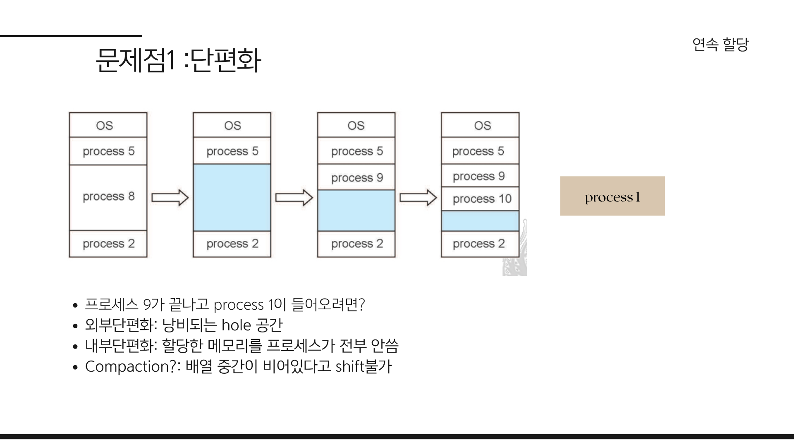
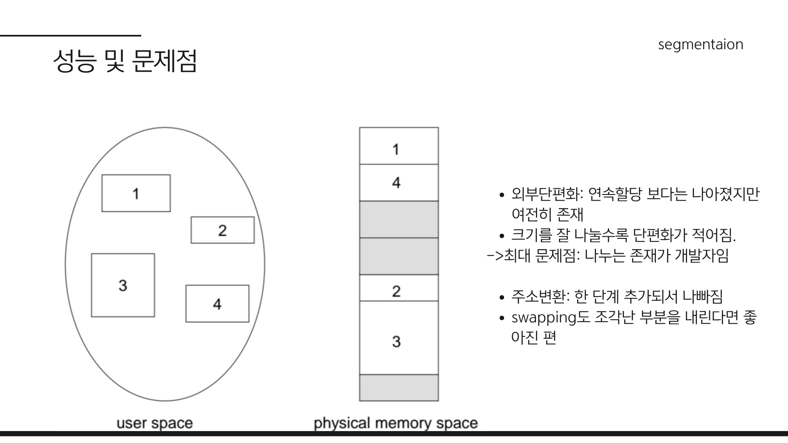

# 가상 메모리와 페이징

**가상 메모리(Virtual Memory)** 란 운영 체제가 제공하는 메모리 관리 기법으로, 물리적 메모리(RAM)의 한계를 극복하고 더 큰 메모리 공간을 프로그램에 제공합니다. 프로그램이 사용하는 메모리 주소(논리 주소)와 실제 물리적 메모리 주소를 분리하여 관리하는 방식입니다. 현대 운영 체제에서는 주로 **페이징(Paging)** 기법을 통해 가상 메모리를 구현합니다.

**면접에선 페이징만 따로 질문할 가능성이 높지만..**

페이징 기법 자체도 중요하지만, 왜 페이징이 필요한지 이해하려면 기존의 메모리 관리 기법의 문제점을 먼저 파악해야 합니다. 따라서 이 문서에서는:
- 페이징 이전 메모리 관리 기법의 문제점
- 페이징 기법이 이러한 문제점을 어떻게 해결하는지

를 차근차근 알아보겠습니다.

## MMU와 주소 변환

### CPU의 메모리 접근 과정

먼저 CPU가 메모리에 어떻게 접근하는지 살펴봅시다.

프로그램에서 `int a = 10;` 과 같은 코드를 작성하면, CPU는 변수 a를 저장하기 위해 메모리에 접근합니다. 예를 들어, 변수를 메모리의 100번지에 저장한다고 가정해봅시다. 이 때,

**프로그램이 하나뿐인 경우:**
- CPU는 100번지에 접근하여 값을 직접 저장할 수 있습니다.

**여러 프로그램이 동시에 실행되는 경우:**
- 메모리의 시작 지점에 적재된 프로그램은 100번지에 정상적으로 접근할 수 있습니다.
- 하지만 다른 프로그램입장에서는, 100번지는 이미 다른 프로그램이 사용 중인 영역이고 접근해서는 안됩니다.
- 이 경우 CPU가 100번지에 접근하여 값을 저장하려고 하면, **다른 프로그램의 데이터를 덮어쓰는 심각한 문제**가 발생합니다.

### 논리 주소와 물리 주소

이 문제를 해결하기 위해 운영 체제는 각 프로그램에 **독립적인 메모리 공간**을 제공해야 합니다. 이를 위해 두 가지 주소 체계를 도입했습니다:

- **논리 주소(Logical Address):** 프로그램이 사용하는 주소 공간
- **물리 주소(Physical Address):** 실제 메모리(RAM)의 주소 공간

이전 예시에서 프로그램이 100번지에 접근하려고 할 때, 이 100번지는 **논리 주소**입니다. 운영 체제는 이 논리 주소를 **물리 주소**로 변환하여 실제 메모리에 접근하도록 합니다.   
만약 14000번지에 프로그램이 적재되어 있다면, 논리 주소 100번지는 물리 주소 14100번지로 변환됩니다.
이런 방식으로 각 프로그램은 자신만의 독립적인 논리 주소 공간을 가지게 되어, 서로 간섭하지 않고 안전하게 메모리를 사용할 수 있습니다.

위 과정을 CPU가 메모리에 접근할 때마다 변환한다면 부하가 클 것입니다. CPU대신 이를 수행해주는 하드웨어가 바로 **메모리 관리 유닛(MMU: Memory Management Unit)** 입니다.  
**MMU** 는 다음과 같은 역할을 수행합니다:

1. CPU가 생성한 **논리 주소**를 받음
2. 논리 주소를 **물리 주소로 변환**
3. 변환된 물리 주소로 실제 메모리에 접근

이전 예시는 단순히 메모리에 base주소를 더하는 방식이었지만, 실제 MMU는 더 복잡한 변환 방식을 사용합니다.   
우선은 논리주소를 물리주소로 변환한다는 개념만 이해합시다.

## 메모리 관리 기법
이제 본격적으로 메모리 관리 기법에 대해 알아봅시다.
각 기법의 utilization(메모리 사용률)과 performance(성능)에 집중하며 살펴보겠습니다.
### 연속 할당(Contiguous Allocation)
연속 할당(Contiguous Allocation)은 메모리 관리의 가장 기본적인 기법 중 하나로, 각 프로세스가 메모리 내에서 연속된 블록을 할당받는 방식을 의미합니다.

배열을 생각하면 쉽습니다.
그림처럼 프로세스가 종료되면 그 공간이 비게 되는데, 이후 새로운 프로세스가 들어오면 다시 빈 공간에 할당합니다.
#### 단편화(Fragmentation)

그림에서 process 5, 9, 10까지 잘 적재되었지만, process 1은 적재되지 못했습니다.  
만약 9번 프로세스가 종료된고 남은 메모리의 총합이 1번 프로세스보다 크다 하더라도 1번 프로세스는 적재될 수 없습니다.  
프로세스 1이 필요로 하는 메모리 크기를 충족하는 *연속된* 빈 공간이 없기 때문입니다.  

이렇게 메모리가 조각조각 나뉘어진 상태를 **단편화(Fragmentation)** 라고 합니다.
단편화는 크게 두 가지로 나뉩니다:
- **내부 단편화(Internal Fragmentation):** 할당된 메모리 블록 내에서 사용되지 않는 공간이 발생하는 현상
- **외부 단편화(External Fragmentation):** 메모리 전체에서 사용되지 않는 작은 조각들이 흩어져 있어, 새로운 프로세스가 적재될 수 없는 현상

위 예시는 **외부 단편화** 때문에 발생한 문제입니다.

#### 스와핑(Swapping)
또 다른 문제도 있습니다.

어떻게든 프로세스1번을 적재하려면 다른 프로세스를 메모리에서 내보내야 합니다.  
그리고 스토리지에 저장해둔 후, 스토리지에서 다시 1번 프로세스를 메모리에 적재해야 합니다.
이 과정을 **스와핑(Swapping)** 이라고 합니다.

**스토리지에 접근**하는 것은 메모리에 접근하는 것보다 **매우 느립니다**.  
프로세스가 많아지고 컨텍스트 스위칭이 자주 일어나면, 스와핑으로 인한 성능 저하가 심각해질 수 있습니다.

이제 메모리를 좀 더 효율적으로 관리할 수 있는 기법이 필요합니다.

> ### 잠깐! 그냥 메모리를 더 사는게 낫지 않나요?  
> 잠시 메모리의 중요성에 대해 이야기해봅시다.  
> 컴퓨터의 초창기에 메모리가 매우 비쌌던 시절에는 메모리를 더 사는게 비용적으로 부담스러웠습니다.  
> 이 시절 메모리 가격은 컴퓨터를 구매할 때 매우 큰 비중을 차지했으며, 지금의 그래픽카드 가격마냥 매우 비쌌습니다.
> 요즘은 메모리가 매우 저렴해졌고, GB단위의 메모리가 기본이 되었습니다. 그래서 딱히 메모리를 효율적으로 관리할 필요가 있나라는 의문도 들 수 있습니다.   
> 하지만 메모리는 여전히 중요한 자원이기에, 효율적인 메모리 관리 기법은 여전히 중요합니다.  
> 제가 이 글을 쓰기 위해 참고한 전공 강의에서는 교수님이 메모리의 중요성에 대해 좀 길게 설명하였지만 지금은 아래 한 장의 이미지면 충분할 것 같네요.  
>   

### 세그멘테이션
세그멘테이션(Segmentation)은 메모리 관리 기법 중 하나로, 프로세스의 메모리 공간을 논리적인 단위인 세그먼트(segment)로 나누어 관리하는 방식을 의미합니다.
우리의 프로세스는 코드, 데이터, 힙, 스택으로 구성되는데, 세그먼트도 코드, 데이터, 스택 등과 같이 프로세스의 **논리적 구성**을 반영합니다.

- 그림처럼 논리적인 단위로 메모리를 나누어 세그멘테이션으로 관리하기 때문에, 프로세스의 요구에 따라 유연하게 메모리를 할당할 수 있습니다.  
- 그리고 한 프로그램의 세그멘테이션들이 물리 메모리에 흩어져 있습니다. 
#### 주소 변환과 세그먼트 테이블

연속 할당 방식에서는 단순히 `Base 주소 + Offset`으로 물리 주소를 찾았지만, 세그먼트가 흩어져 있는 환경에서는 참조 방식이 달라집니다.

- 주소 참조 방식: `세그먼트 번호(Segment Number) + 오프셋(Offset)`

- 세그먼트 테이블 (Segment Table): 흩어진 세그먼트가 물리 메모리 어디에 있는지 추적하기 위한 매핑 테이블입니다.

CPU가 논리 주소를 요청하면 **MMU**는 **세그먼트 테이블**을 참조하여 해당 세그먼트의 시작 주소(Base)를 알아내고, 여기에 오프셋을 더해 실제 물리 주소로 변환합니다.

#### 세그멘테이션 폴트 (Segmentation Fault)
만약 요청한 주소의 오프셋(Offset)이 세그먼트의 크기(Limit)를 초과하면 어떻게 될까요?  
이 경우, 시스템은 유효하지 않은 메모리 접근으로 간주하여 세그멘테이션 폴트(Segmentation Fault) 인터럽트를 발생시킵니다.  
>참고:메모리를 잘못 참조하여 마주치는 오류 메시지 "Segmentation Fault"는 여기서 유래했습니다.

### 세그멘테이션의 성능 및 문제점
이제 성능과 속도를 살펴봅시다.

#### 속도: 오버헤드 발생
연속 할당 방식에 비해 속도는 다소 느려지는 경향이 있습니다.
- 추가적인 메모리 접근:

  - 이전(연속 할당): Base 주소 + Offset 연산만으로 즉시 물리 주소에 접근했습니다.

  - 세그멘테이션: 세그먼트 번호를 통해 세그먼트 테이블을 먼저 조회해야 하고, 그 후 실제 물리 주소에 접근해야 합니다. 즉, 메모리를 한 번 더 거쳐야 하는 오버헤드가 발생합니다.
#### 성능(메모리 측면): 외부단편화 여전히 존재
메모리 활용도는 연속 할당 방식보다 개선되었습니다.
- 프로세스 전체를 연속된 공간에 넣을 필요 없이 빈 공간을 찾아 나누어 저장할 수 있으므로 유연성이 높아졌습니다.
- 이로인해 외부 단편화가 줄어들었지만, 여전히 외부 단편화 문제는 존재하며 해결되지 않았습니다.

### 페이징
